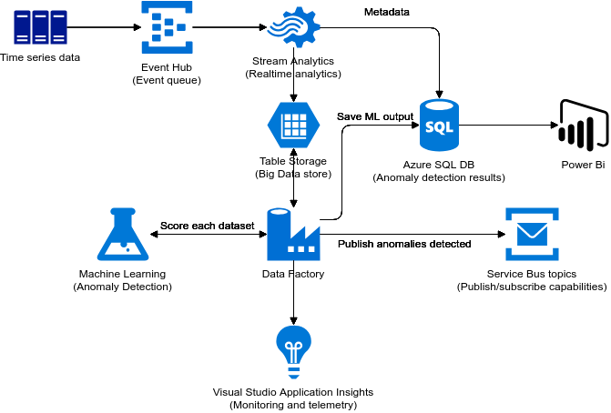

import { Callout } from "../../src/components/atoms.js"

Lorem ipsum dolor sit amet, consectetur adipiscing elit. Curabitur ultrices at quam sit amet luctus. Donec convallis lectus lectus, et tincidunt mauris egestas ac. Pellentesque quis dapibus tortor.

## Awesome tutorials

1. [Gatsby Kitchen sink for Markdown](https://using-remark.gatsbyjs.org/hello-world-kitchen-sink/) - contains some great tutorials we present below.

This is a hyperlink: [Hyperlink Text](https://fakelink.com).

Bold text: **CSS variables** and also italic text: _prefers-color-scheme media query_.

Strikethrough: ~~strikethrough~~

<Callout>

💡 Heads up - this is a highlighted item!

🧾 We can add [links](https://tailwindcss.com/docs/installation) as well

🚀 Another one!

</Callout>

## This is a header

### This is a sub-header

And an ordered list:

1. First ordered list item
2. Another item
3. We can `highlight` text and **bold** it too!

<Callout>

❗ This is important!

</Callout>

Inline-style logo:


## Some code

```python
from pyspark.sql import SparkSession

spark = SparkSession \
  .builder \
  .appName("...") \
  .master("...") \
  .config("spark.sql.extensions", "io.delta.sql.DeltaSparkSessionExtension") \
  .config("spark.sql.catalog.spark_catalog", "org.apache.spark.sql.delta.catalog.DeltaCatalog") \
  .getOrCreate()
```

```scala
import org.apache.spark.sql.SparkSession

val spark = SparkSession
  .builder()
  .appName("...")
  .master("...")
  .config("spark.sql.extensions", "io.delta.sql.DeltaSparkSessionExtension")
  .config("spark.sql.catalog.spark_catalog", "org.apache.spark.sql.delta.catalog.DeltaCatalog")
  .getOrCreate()
```

```javascript
var s = "JavaScript syntax highlighting"
alert(s)
```

```python
s = "Python syntax highlighting"
print s
```

```sql
SELECT * FROM sometable
```

```csharp
static async Task Main()
{
    var builder = new HostBuilder();
#if DEBUG
    builder.UseEnvironment("development");
#endif
    builder.ConfigureWebJobs(b =>
    {
        b.AddAzureStorageCoreServices();
        b.AddAzureStorage();

    });
    builder.ConfigureLogging((context, b) =>
    {
        b.AddConsole();
    });
    var host = builder.Build();
    using (host)
    {
        await host.RunAsync();
    }
}
```

```css
/* index.css */

:root {
  @apply .light;
}

.dark {
  --color-bg-primary: #2d3748;
  --color-bg-secondary: #283141;
  --color-text-primary: #f7fafc;
  --color-text-secondary: #e2e8f0;
  --color-text-accent: #81e6d9;
}

.light {
  --color-bg-primary: #ffffff;
  --color-bg-secondary: #edf2f7;
  --color-text-primary: #2d3748;
  --color-text-secondary: #4a5568;
  --color-text-accent: #2b6cb0;
}

@import "tailwindcss/base";
@import "tailwindcss/components";
@import "tailwindcss/utilities";
```

```jsx
// tailwind.config.js

module.exports = {
  theme: {
    extend: {
      backgroundColor: {
        primary: "var(--color-bg-primary)",
        secondary: "var(--color-bg-secondary)",
      },
      textColor: {
        accent: "var(--color-text-accent)",
        primary: "var(--color-text-primary)",
        secondary: "var(--color-text-secondary)",
      },
    },
  },
}
```

<Callout>☝ Remember to X, Y, Z!</Callout>

## Making a table

Colons can be used to align columns.

| C1         | C2          | C3         |
| ---------- | ----------- | ---------- |
| `Column 1` | `Column 2`  | `Column 3` |
| _Still_    | ~~renders~~ | **nicely** |
| 1          | 2           | 3          |

Three or more...

---

Hyphens

---

Asterisks

---

Underscores

All generate lines.

## YouTube Videos

We can embed a youtube video using [this](https://www.gatsbyjs.com/plugins/gatsby-remark-embed-youtube/) plugin.

`youtube:https://www.youtube.com/embed/KXkBZCe699A`

Note that we haven't enabled embeddeing from other platforms just yet, but can be easily done with [this](https://www.gatsbyjs.com/plugins/gatsby-remark-embed-video/) it seems.

## Images

Images too - we keep them in the `images/filename.png` folder:


The reason this picture is small is because the resolution is only `521 x 328`.

Here's a bigger one that fills the width:


Noting that the white looks like crap - it seems transparent is the way to go (better color scheme of course):



## GIFs

We gotta store our GIFs under `static/gifs/filename.gif` for local:


But we can always link from online too:

