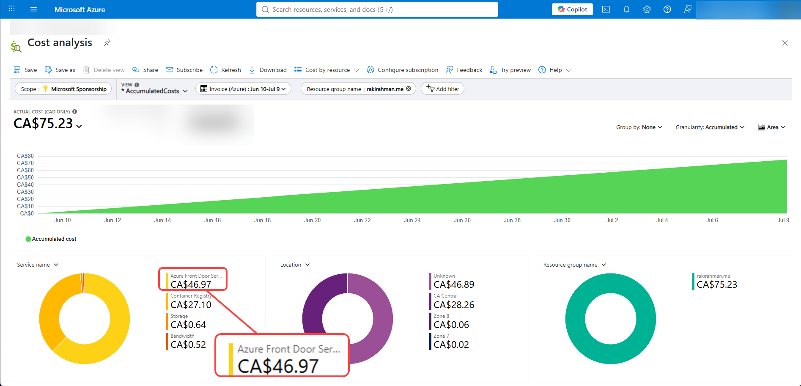
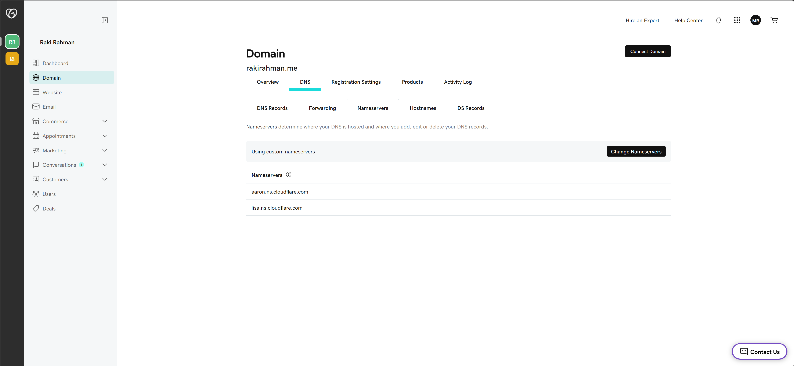
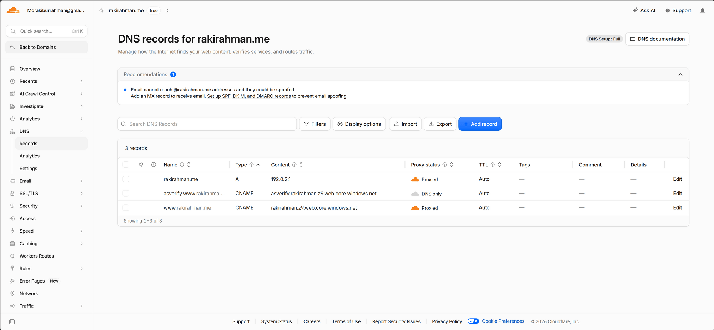
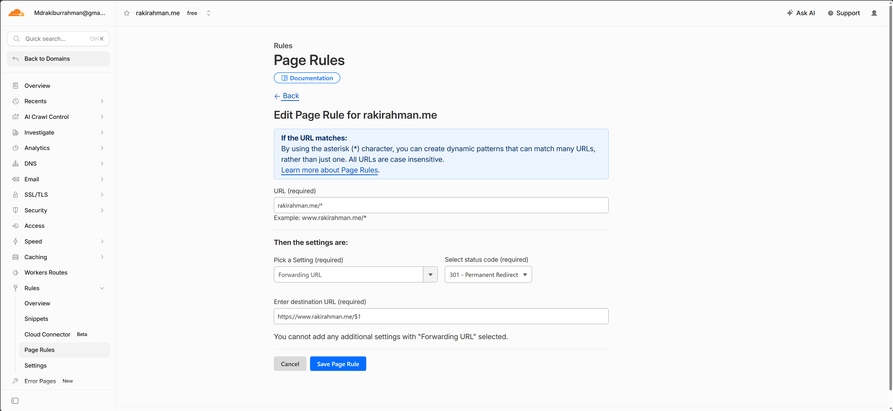
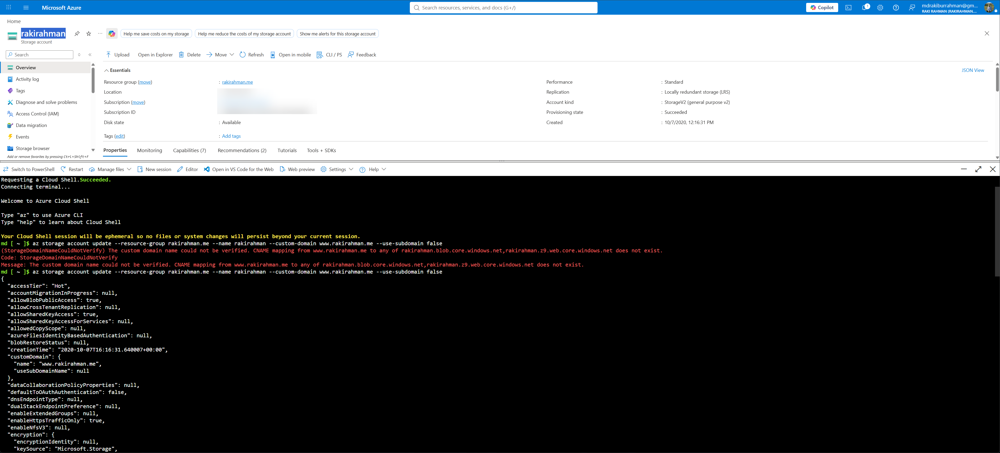
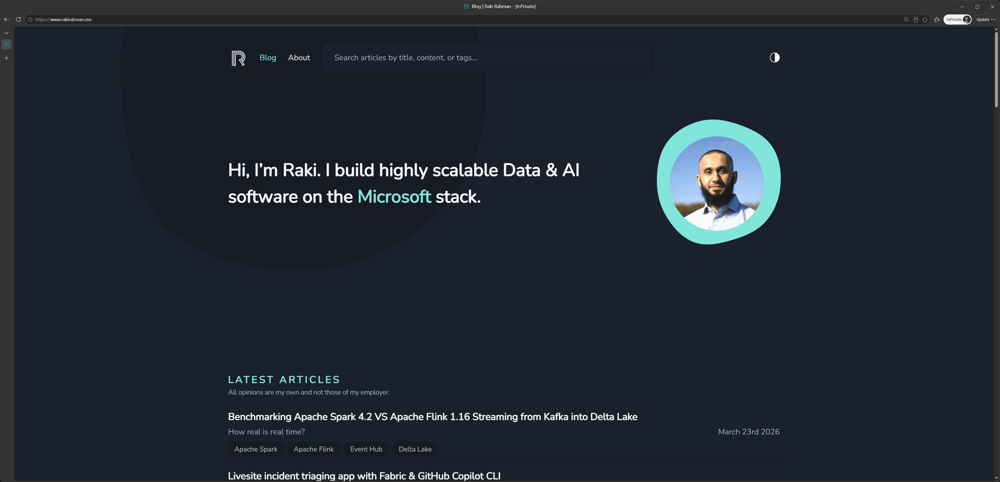
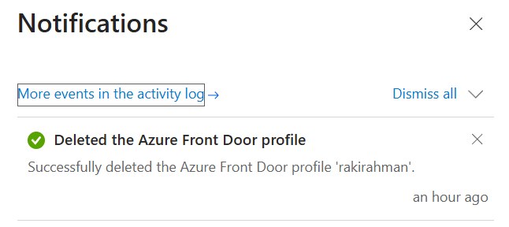

import { Callout } from "../../src/components/atoms.js"
import { ExtLink, InlinePageLink } from "../../src/components/atoms.js"

In 2023, I wrote about how I host this site [here](https://www.rakirahman.me/blog-architecture/).

Something happened with Azure Front Door along the way where paying $50/month for a custom SSL is no longer justified:



<Callout>

This blog is for myself as a reference on how I will host static sites on Azure going forward.

</Callout>

Everything I learnt came from this awesome - albeit a little too long - [YouTube tutorial](https://www.youtube.com/watch?v=mGI0uHvUMws).

## Sign up for Cloudflare free tier

Basically just google it and use your email account etc, no credit card required.

## Migrate GoDaddy to use Cloudflare nameservers

Go to your [GoDaddy account](https://dcc.godaddy.com/control/portfolio/rakirahman.me/settings), and click `Change Nameservers` to:

* `aaron.ns.cloudflare.com`
* `lisa.ns.cloudflare.com`

This tells GoDaddy that although you bought the domain through them Cloudflare manages DNS.

It takes about 15 minutes for Cloudflare to migrate the DNS records from GoDaddy to Cloudflare.



## Setup DNS records in Cloudflare

Go [here](https://dash.cloudflare.com/78c8776edccaf3ee897579fa7476c679/rakirahman.me/dns/records)

Delete all the migrated records, and set these up:

| C1                           | C2     | C3       | C4                                          | C5                                           |
| ---------------------------- | ------ | -------- | ------------------------------------------- | -------------------------------------------- |
| `Name`                       | `Type` | `Proxy`  | `Content`                                   | `Comment`                                    |
| `rakirahman.me`              | `A`    | Proxied  | 192.0.2.1                                   | Some magic Cloudflare internal IP, don't ask |
| `asverify.www.rakirahman.me` | CNAME  | DNS Only | asverify.rakirahman.z9.web.core.windows.net | Tell Azure Blob Storage to verify domain     |
| `www.rakirahman.me`          | CNAME  | Proxied  | rakirahman.z9.web.core.windows.net          | Tell Cloudflare where your site is hosted    |



## Setup Routing Page Rules in Cloudflare

Go [here](https://dash.cloudflare.com/78c8776edccaf3ee897579fa7476c679/rakirahman.me/rules/page-rules) and create a new page rule:

* URL: `rakirahman.me/*`
* Settings: Forwarding URL, Status Code: 301 - Permanent Redirect
* Destination URL: `https://www.rakirahman.me/$1`



## Tell Azure Blob to use this

Following [this](https://learn.microsoft.com/en-us/azure/storage/blobs/storage-custom-domain-name?tabs=azure-portal) fairly-verbose-but-accurate doc.

Open up Cloud Shell in Linux and fire:

```bash
az account set -s d4aa0040-6651-443d-a078-728ce72a87ab
az storage account update --resource-group rakirahman.me --name rakirahman --custom-domain www.rakirahman.me --use-subdomain false

# For a few minutes, it'll throw, but it'll eventually propagate

# (StorageDomainNameCouldNotVerify) The custom domain name could not be verified. CNAME mapping from www.rakirahman.me to any of rakirahman.blob.core.windows.net,rakirahman.z9.web.core.windows.net does not exist.
# Code: StorageDomainNameCouldNotVerify
# Message: The custom domain name could not be verified. CNAME mapping from www.rakirahman.me to any of rakirahman.blob.core.windows.net,rakirahman.z9.web.core.windows.net does not exist.
```

<Callout>

1. If the second `az` command keeps throwing, in the CNAME in Cloudflare, toggle `Proxied` to `DNS only`, do the validation, and then switch it back.

</Callout>




Enjoy free SSL termination:



Without exorbitant prices:

