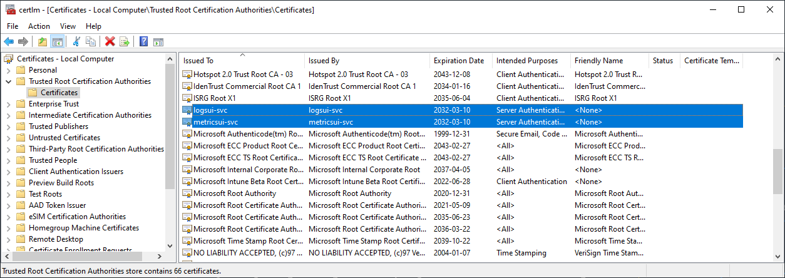
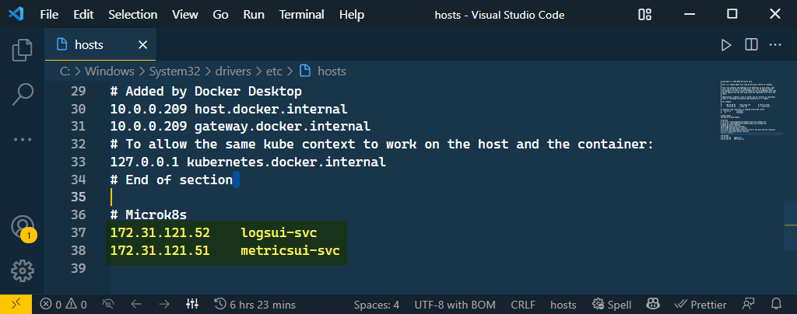

import { Callout } from "../../src/components/atoms.js"
import { ExtLink, InlinePageLink } from "../../src/components/atoms.js"

When the Controller Pod is deployed, it is on the lookout for 2 specifically named K8s secrets - `metricsui-certificate-secret` & `logsui-certificate-secret` - to support BYO-certs for the monitoring stack. Basically the Controller reads the base64-encoded `.pem` files from the Secrets and injects them into the Monitoring Stack using it’s File Delivery system.

At the time of writing, `arcdata` CLI only handles scenario for BYO-certs in [monitoring (Grafana, Kibana)](https://docs.microsoft.com/en-us/azure/azure-arc/data/monitor-certificates) in **Indirect** mode. Basically, what happens is because in **Indirect** mode `az` cli uses Kubernetes API (and not ARM API), the cli logic first creates the cert with a Kubernetes client, and then deploys the CRD for the Controller directly, without ever going to ARM. 

In the future perhaps the `az` cli logic can be more sophisticated to first create the K8s secret, then call ARM for direct mode deploy. But in the meantime, this article combines `kubectl` and `az` cli to achieve the same end goal.

The problem we want to resolve is this:


If we don’t have our own CA signed certs, the [`microsoft/azure-arc`](https://github.com/microsoft/azure_arc/tree/main/arc_data_services/deploy/scripts/monitoring) repo provides template files and a handy shell script to generate self-signed certs via [`openssl`](https://www.openssl.org/docs/manmaster/man1/). We run the shell script locally:

```bash
# ./create-monitoring-tls-files.sh arc certs <k8s-namespace> <folder-name-to-store-certs>
./create-monitoring-tls-files.sh arc certs
```

We see 6 files:

```
├── certs
│   ├── logsui-cert.pem
│   ├── logsui-key.pem
│   ├── logsui-ssl.conf
│   ├── metricsui-cert.pem
│   ├── metricsui-key.pem
│   └── metricsui-ssl.conf
```

We turn the 4 `.pem` files above into the secrets the Controller will be looking for:

```bash
# Create namespace
kubectl create ns arc

# Read file and base64 encode without newline, store in variable
logs_base64Certificate=$(cat /certs/logsui-cert.pem | base64 -w 0)
logs_base64PrivateKey=$(cat /certs/logsui-key.pem | base64 -w 0)
metrics_base64Certificate=$(cat /certs/metricsui-cert.pem | base64 -w 0)
metrics_base64PrivateKey=$(cat /certs/metricsui-key.pem | base64 -w 0)

# Create logs UI Secret: logsui-certificate-secret
cat <<EOF | kubectl apply -f -
apiVersion: v1
kind: Secret
metadata:
  name: logsui-certificate-secret
  namespace: arc
type: Opaque
data:
  certificate.pem: $logs_base64Certificate
  privatekey.pem: $logs_base64PrivateKey
EOF

# Create Metrics UI Secret: metricsui-certificate-secret
cat <<EOF | kubectl apply -f -
apiVersion: v1
kind: Secret
metadata:
  name: metricsui-certificate-secret
  namespace: arc
type: Opaque
data:
  certificate.pem: $metrics_base64Certificate
  privatekey.pem: $metrics_base64PrivateKey
EOF
```

At this point, we can create the Controller however we want (direct, indirect) - because at the end of the day both methods comes down to applying the `datacontroller` CRD; e.g. in Direct Mode:

```bash
az arcdata dc create --path './custom' \
                     --custom-location 'arc-cl' \
                     --name $arcDcName \
                     --subscription $subscriptionId \
                     --resource-group $resourceGroup \
                     --location $azureLocation \
                     --connectivity-mode direct

# Wait until Controller is ready
kubectl get datacontroller -n arc
# NAME     STATE
# arc-dc   Ready
```

<Callout>

There is nothing special in the Custom JSON, we only replaced the `StorageClass` to fit our particular Cluster.

</Callout>

Get the Monitoring endpoints:

```bash
status=$(kubectl get monitors monitorstack -n arc -o json | jq -r ".status")
logsUI_ip=$(jq -r ".logSearchDashboard" <<< $status)
metricsUI_ip=$(jq -r ".metricsDashboard" <<< $status)

echo $"logsUI: ${logsUI_ip}"
# logsUI: https://172.31.121.52:5601/
echo $"metricsUI: ${metricsUI_ip}"
# metricsUI: https://172.31.121.51:3000/
```

We add the 2 `cert.pem` files to our Client Machine, in this case Windows _**Trusted Root Certification Authorities**_:

```powershell
# Import certs
Import-Certificate -FilePath certs\logsui-cert.pem -CertStoreLocation Cert:\LocalMachine\Root
Import-Certificate -FilePath certs\metricsui-cert.pem -CertStoreLocation Cert:\LocalMachine\Root
```




Add entry to host file to simulate DNS:

```powershell
# Add entry to host file to simulate DNS
$HostFile = 'C:\Windows\System32\drivers\etc\hosts'
$logsUI = '172.31.121.52'
$metricsUI = '172.31.121.51'

Add-content -path $HostFile -value "$logsUI `t logsui-svc"
Add-content -path $HostFile -value "$metricsUI `t metricsui-svc"
```



Browse to URL, no more SSL problems:

- **Grafana**: https://metricsui-svc:3000
- **Kibana**: https://logsui-svc:5601

