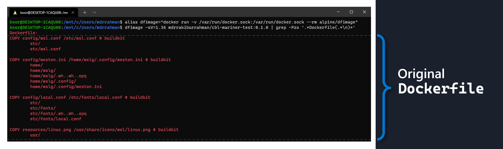
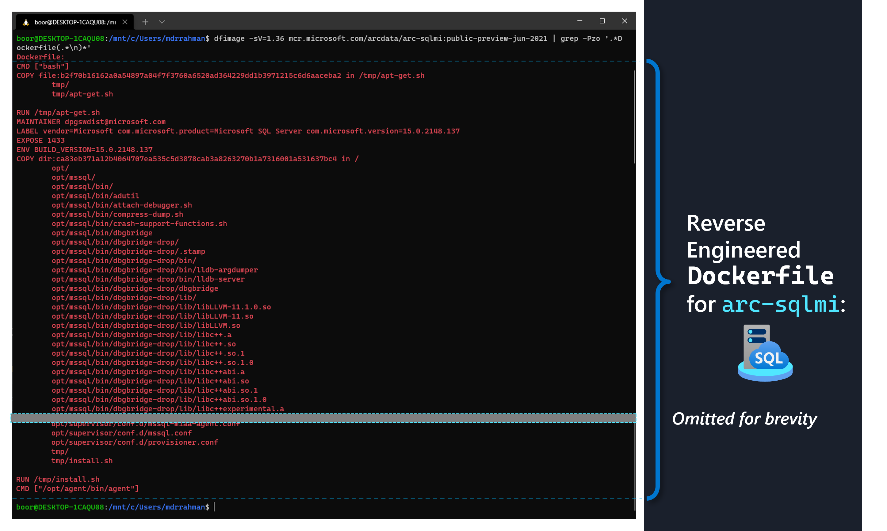
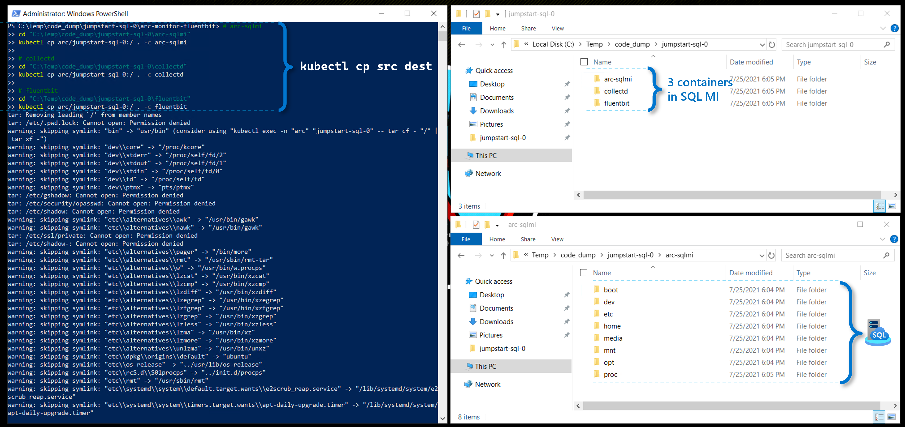
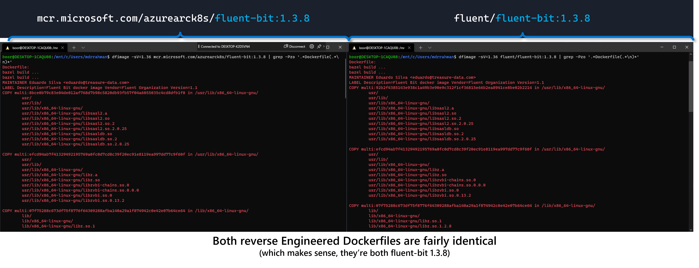
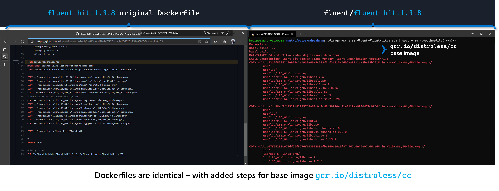

import { Callout } from "../../src/components/atoms.js"
import { ExtLink, InlinePageLink } from "../../src/components/atoms.js"

Enterprise Organizations looking to onboard Azure Arc-Enabled Data Services onto their Kubernetes Clusters may have several reasons for wishing to deep-dive and gain access to the Dockerfiles that were used to build the Containers. While vendor tools such as [Aquasec](https://github.com/aquasecurity) serves to scan the containers once the environment is productionalized, the [Dockerfile](https://docs.docker.com/engine/reference/builder/) can provide a great bird's eye view into the inner workings of the Containers without much up front effort.

This article showcases a technique to generate Dockerfiles for a Container, _**without access**_ to the source code that was originally used to perform [`docker build`](https://docs.docker.com/engine/reference/commandline/build/). This technique  takes advantage of extracting information out of the [`Docker.sock`](https://docs.docker.com/engine/reference/commandline/dockerd/#examples) UNIX socket, using Community built tools.

## Pods and Containers for Arc-Enabled Data Services

Arc-Enabled Data Services deploys a list of purpose-driven Kubernetes Pods onto a Kubernetes Cluster - purposes such as serving the [Operator Pattern](https://www.openshift.com/learn/topics/operators) for the [Custom Resources](https://kubernetes.io/docs/concepts/extend-kubernetes/api-extension/custom-resources/) that make up the Arc-enabled Data Services (i.e. [SQL MI](https://github.com/microsoft/azure_arc/blob/main/arc_data_services/deploy/yaml/sqlmi.yaml), [PostgreSQL](https://github.com/microsoft/azure_arc/blob/main/arc_data_services/deploy/yaml/postgresql.yaml) and other adjacent [CRDs](https://github.com/microsoft/azure_arc/blob/main/arc_data_services/deploy/yaml/custom-resource-definitions.yaml)). 

For example, if we were to go through any [Arc Jumpstart Scenarios](https://azurearcjumpstart.io/azure_arc_jumpstart/azure_arc_data/microk8s/azure/arm_template/postgresql_hyperscale/) to deploy a fresh Kubernetes Cluster on a Cloud vendor of choice, [onboard it with Azure Arc](https://docs.microsoft.com/en-us/azure/azure-arc/kubernetes/quickstart-connect-cluster?tabs=azure-cli), then deploy an [Arc Data Controller](https://github.com/microsoft/azure_arc/blob/eeaface1482cec17889925fc0d6d03346271a7b9/azure_arc_data_jumpstart/microk8s/azure/arm_template/artifacts/DataServicesLogonScript.ps1#L165), [SQL MI](https://github.com/microsoft/azure_arc/blob/main/azure_arc_data_jumpstart/microk8s/azure/arm_template/artifacts/DeploySQLMI.ps1) and [PostgreSQL](https://github.com/microsoft/azure_arc/blob/main/azure_arc_data_jumpstart/microk8s/azure/arm_template/artifacts/DeployPostgreSQL.ps1) Pods, here is a visual representation of the list of Data Services Pods deployed on our Kubernetes Cluster end-to-end:


The in-order sequence of Pods (in this case deployed to the `arc` namespace above) can be pulled out via:

```text
kubectl get pods -n arc --sort-by=.metadata.creationTimestamp

NAME                 READY   STATUS    RESTARTS   AGE
bootstrapper-b96sb   1/1     Running   0          20m
control-vx6q8        2/2     Running   0          17m
controldb-0          2/2     Running   0          16m
metricsdc-5ntxl      1/1     Running   0          15m
metricsdc-cfd92      1/1     Running   0          15m
metricsui-dn7rt      1/1     Running   0          15m
logsdb-0             2/2     Running   0          15m
metricsdb-0          1/1     Running   0          15m
logsui-whlbf         2/2     Running   0          13m
jumpstart-sql-0      3/3     Running   0          13m
jumpstartpsc0-0      3/3     Running   0          8m36s
jumpstartpsw0-0      3/3     Running   0          8m36s
```
At a high-level:
1.  `bootstrapper-abcde` is the first Pod that gets spun up (among other things, it introduces the Data Service speciific CRDs into our K8s cluster)
2. `control-abcde` and `controldb-0` - which makes up the "Data Controller" that serves the Operator Pattern for Arc Custom Resources (e.g. SQL MI, PostgreSQL)
3. `metrics...` and `logs..` - UI (Kibana, Grafana) and DB (Elastic, Influx) serving the Monitoring Stack (which is a standalone [CRD](https://github.com/microsoft/azure_arc/blob/eeaface1482cec17889925fc0d6d03346271a7b9/arc_data_services/deploy/yaml/custom-resource-definitions.yaml#L164))
4. `jumpstart-sql-0` is a SQL Managed Instance
5. `jumpstartpsc0-0 ` and `jumpstartpsw0-0` is a PostgreSQL [Citus Coordinator and Worker](http://docs.citusdata.com/en/v10.0/get_started/concepts.html#coordinator-and-workers) Pod respectively

We can ask Kubernetes to give us the list of Container Images that make up each of these Pods via:

```text
kubectl get pods -n arc -o=jsonpath="{range .items[*]}{'\n'}{.metadata.name}{':\t'}{range .spec.containers[*]}{.image}{', '}{end}{end}"

NAME                    IMAGE
bootstrapper-tk9hs:     mcr.microsoft.com/arcdata/arc-bootstrapper:public-preview-jun-2021,
control-sj59j:          mcr.microsoft.com/arcdata/arc-monitor-fluentbit:public-preview-jun-2021, mcr.microsoft.com/arcdata/arc-controller:public-preview-jun-2021,
controldb-0:            mcr.microsoft.com/arcdata/arc-monitor-fluentbit:public-preview-jun-2021, mcr.microsoft.com/arcdata/arc-server-controller:public-preview-jun-2021,
jumpstart-sql-0:        mcr.microsoft.com/arcdata/arc-sqlmi:public-preview-jun-2021, mcr.microsoft.com/arcdata/arc-monitor-collectd:public-preview-jun-2021, mcr.microsoft.com/arcdata/arc-monitor-fluentbit:public-preview-jun-2021,
jumpstartpsc0-0:        mcr.microsoft.com/arcdata/arc-postgres-12:public-preview-jun-2021, mcr.microsoft.com/arcdata/arc-monitor-telegraf:public-preview-jun-2021, mcr.microsoft.com/arcdata/arc-monitor-fluentbit:public-preview-jun-2021,
jumpstartpsw0-0:        mcr.microsoft.com/arcdata/arc-postgres-12:public-preview-jun-2021, mcr.microsoft.com/arcdata/arc-monitor-telegraf:public-preview-jun-2021, mcr.microsoft.com/arcdata/arc-monitor-fluentbit:public-preview-jun-2021,
logsdb-0:               mcr.microsoft.com/arcdata/arc-monitor-elasticsearch:public-preview-jun-2021, mcr.microsoft.com/arcdata/arc-service-proxy:public-preview-jun-2021,
logsui-2ncr2:           mcr.microsoft.com/arcdata/arc-monitor-kibana:public-preview-jun-2021, mcr.microsoft.com/arcdata/arc-service-proxy:public-preview-jun-2021,
metricsdb-0:            mcr.microsoft.com/arcdata/arc-monitor-influxdb:public-preview-jun-2021,
metricsdc-8kdh6:        mcr.microsoft.com/arcdata/arc-monitor-telegraf:public-preview-jun-2021,
metricsdc-n2vfd:        mcr.microsoft.com/arcdata/arc-monitor-telegraf:public-preview-jun-2021,
metricsui-h9p7k:        mcr.microsoft.com/arcdata/arc-monitor-grafana:public-preview-jun-2021, mcr.microsoft.com/azuremonitor/containerinsights/ciprod:ciprod03262021
```
We note that all of these images are getting sourced from [Microsoft Container Registry (MCR)](https://github.com/microsoft/containerregistry) - but Customers have the flexibility to push these images into their private registry first using the techniques illustrated [in this script](https://github.com/microsoft/azure_arc/blob/main/arc_data_services/deploy/scripts/pull-and-push-arc-data-services-images-to-private-registry.py). From there, Customers can choose to scan these images using Container Scanners etc, before onboarding onto their Kubernetes Clusters.

<Callout>

💡 Note that the export above is not an exhaustive list, but rather a snapshot in time as of July 2021. Newer Pods and Containers should get introduced as the ecosystem and functionalities evolve.

</Callout>

## POC: Reverse Engineering a simple Container
Microsoft recently introduced the new Operating System [CBL-Mariner](https://en.wikipedia.org/wiki/CBL-Mariner) (**C**ommon **B**ase **L**inux) - which is used across Azure Stack HCI, AKS, IoT Edge and WSL. Source code is [available in Github here](https://github.com/microsoft/CBL-Mariner) - meaning anyone can transparently build an application on top of the Mariner OS - as I'll be demonstrating. 

Here we have a simple Dockerfile that uses the Mariner OS (from this [quick repo](https://github.com/mdrakiburrahman/CBL-mariner-test)):

```bash
FROM cblmariner.azurecr.io/base/core:1.0 AS runtime

# Copy sample config files.
COPY config/wsl.conf /etc/wsl.conf
COPY config/weston.ini /home/wslg/.config/weston.ini
COPY config/local.conf /etc/fonts/local.conf

# Copy sample icon file.
COPY resources/linux.png /usr/share/icons/wsl/linux.png
```

We can do a `docker build > tag > push` to push the Container image up to a registry, which I've done to Docker Hub [here](https://hub.docker.com/repository/docker/mdrrakiburrahman/cbl-mariner-test).

Now, to reverse engineer this image's Dockerfile **without access** to the repo (which may be within a secured repository - as is the case with Arc Data Services - which is part of Azure), we can leverage [Whaler](https://github.com/P3GLEG/Whaler) - one of a handful of tools available in the Community to reverse engineer docker images. Whaler is conveniently made available inside the container image [`alpine/dfimage`](https://hub.docker.com/r/alpine/dfimage) on Dockerhub. 

We can invoke Whaler against any Container using 2 lines of code:
```bash
# Defines an alias command that we're going to reuse
alias dfimage="docker run -v /var/run/docker.sock:/var/run/docker.sock --rm alpine/dfimage"

# Call against container of choice and pull out the Dockerfile
dfimage -sV=1.36 mdrrakiburrahman/cbl-mariner-test:0.1.0 | grep -Pzo '.*Dockerfile(.*\n)*'
```

So if we were to run this command on any local machine that has Docker CLI available against the earlier Mariner image pushed to Docherhub, this is what we would see:



As we can see, it's identical to the Dockerfile used to initially generate the image. We can use this technique to reverse engineer _any other_ Container Image we like as well - such as the SQL MI pod that gets deployed for Azure Arc.


## Reverse Engineering SQL MI Container

<Callout>

⚠ **Warning:** the reverse engineering techniques presented here is not to be considered as official guidance or recommendation from Microsoft. It is presented for educational purposes only, and comes “as-is” and confers no rights, warranties, guarantees, support etc.

These are techniques I found from self-exploration, and can be performed by anyone with admin access to any Kubernetes Cluster running Arc.

</Callout>

### Dockerfile

As we noted in our table earlier, the SQL MI "Pod" is actually made up of 3 containers: `arc-sqlmi`, `collectd` and `fluentbit`. We are interested in `arc-sqlmi` - which contains the binaries that make up the core SQL Server Engine. We can leverage our command from earlier to pull out the Dockerfile as follows:

```bash
dfimage -sV=1.36 mcr.microsoft.com/arcdata/arc-sqlmi:public-preview-jun-2021 | grep -Pzo '.*Dockerfile(.*\n)*'
```
The command above returns something like this:

```text
Dockerfile:
CMD ["bash"]
COPY file:b2f70b16162a0a54897a04f7f3760a6520ad364229dd1b3971215c6d6aaceba2 in /tmp/apt-get.sh
        tmp/
        tmp/apt-get.sh

RUN /tmp/apt-get.sh
MAINTAINER dpgswdist@microsoft.com
LABEL vendor=Microsoft com.microsoft.product=Microsoft SQL Server com.microsoft.version=15.0.2148.137
EXPOSE 1433
ENV BUILD_VERSION=15.0.2148.137
COPY dir:ca83eb371a12b4064707ea535c5d3878cab3a8263270b1a7316001a531637bc4 in /
        opt/
        opt/mssql/
        opt/mssql/bin/
        opt/mssql/bin/adutil
        opt/mssql/bin/attach-debugger.sh
        opt/mssql/bin/compress-dump.sh
        opt/mssql/bin/crash-support-functions.sh
        .
        .
        (Ommitted for brevity)
        .
        .
        opt/supervisor/conf.d/provisioner.conf
        tmp/
        tmp/install.sh

RUN /tmp/install.sh
CMD ["/opt/agent/bin/agent"]

```


### Container binaries

If we like, we can even go a step further from the Dockerfile, and use `kubectl cp` to recursively pull out the actual files/binaries that make up the Pod - a subset of which were copied into the Container as part of the Dockerfile build above:

```Powershell
# arc-sqlmi
cd "C:\Temp\code_dump\jumpstart-sql-0\arc-sqlmi"
kubectl cp arc/jumpstart-sql-0:/ . -c arc-sqlmi

# collectd
cd "C:\Temp\code_dump\jumpstart-sql-0\collectd"
kubectl cp arc/jumpstart-sql-0:/ . -c collectd

# fluentbit
cd "C:\Temp\code_dump\jumpstart-sql-0\fluentbit"
kubectl cp arc/jumpstart-sql-0:/ . -c fluentbit
```

And we see the files from all 3 Containers get copied to our Local Windows Drive:


## Comparing Arc Fluentbit image with generic
To close off, let's validate this reverse engineering method against the Dockerfile for another container such as [Fluentbit](https://fluentbit.io/) which uses a [distroless base image from gcr with GCC available](https://github.com/GoogleContainerTools/distroless/tree/main/cc), and compare the MCR image against the [Dockerhub version](https://hub.docker.com/r/fluent/fluent-bit/tags?page=1&ordering=last_updated):

```bash
# Fluentbit from Arc via MCR
dfimage -sV=1.36 mcr.microsoft.com/azurearck8s/fluent-bit:1.3.8 | grep -Pzo '.*Dockerfile(.*\n)*'

# Fluentbit from Dockerhub
dfimage -sV=1.36 fluent/fluent-bit:1.3.8 | grep -Pzo '.*Dockerfile(.*\n)*'
```


And since we have access to the [fluent-bit 1.3.8 Dockerfile](https://github.com/fluent/fluent-bit/blob/ce615ded47beb47126acbc3e25d8201951c8f1c7/Dockerfile#L55) from the public repo, we can see that it's identical to our Reverse Engineered file:




## Summary

I've found the Dockerfile reverse engineering technique using Whaler to be fairly robust.

Regarding binary extraction, YMMV with running `kubectl cp` against restricted files running inside the Pod, as I ran into [Permission Denied](https://stackoverflow.com/questions/57734514/kubectl-cp-to-a-pod-is-failing-because-of-permission-denied) messages, and faced issues with `kubectl cp` [failing on symlinks](https://github.com/kubernetes/kubernetes/issues/78211).

Happy sleuthing 🕵️‍♀️!