import { Callout } from "../../src/components/atoms.js"
import { ExtLink, InlinePageLink } from "../../src/components/atoms.js"

Kerberos is hard! A single missing DNS entry means you shall not pass:


These past few months, I've had the awesome opportunity to work with the engineering team building the [`ActiveDirectoryConnector` CRD](https://github.com/microsoft/azure_arc/blob/43d971cca0a00756a4973be17c56236396d5e705/arc_data_services/deploy/yaml/custom-resource-definitions.yaml#L433). The [December 2021 Release for Arc SQL MI](https://docs.microsoft.com/en-us/azure/azure-arc/data/release-notes#sql-managed-instance) introduced Active Directory authentication in Preview. From reading up on the fascinating world of SQL Server on Linux, I understand the Arc implementation is basically the most sophisiticated implementation yet - it takes what's available for [SQL on Linux Containers](https://docs.microsoft.com/en-us/sql/linux/sql-server-linux-containers-ad-auth-adutil-tutorial?view=sql-server-ver15#create-the-config-files-to-be-used-by-the-sql-server-container) up a few notches - everything from the Keytab creation onwards (mounting `krb5.conf` into the container etc) is now all automated thanks to the Data Controller (and in the future, keytab management will also be automated if we give the Controller elevated privelegs thanks to [`adutil`](https://docs.microsoft.com/en-us/sql/linux/sql-server-linux-ad-auth-adutil-introduction?view=sql-server-ver15&tabs=ubuntu)). There's also a new [DNS Proxy Service](https://docs.microsoft.com/en-us/azure/azure-arc/data/active-directory-introduction#active-directory-connector-and-sql-managed-instance) which runs [CoreDNS](https://github.com/coredns/coredns).

<Callout>

What I realized when setting up a demo AD environment to "see it all working" while following the [official tutorial](https://docs.microsoft.com/en-us/azure/azure-arc/data/deploy-active-directory-sql-managed-instance#prerequisites) - was that Domain Controller and DNS setup etc is always a "pre-requisite" - and [most of the tutorials on the web](https://vikaskumawat.dev/create-a-domain-controller-in-azure/) are GUI based and incomplete - which makes it hard for someone trying to learn how to get it all working.

</Callout>

In this post, I wanted share a scripted environment setup that makes it easy to setup an Active Directory + DNS environment working with Arc SQL MI from scratch.

The only pre-requisite is an Azure Subscription (or a [credit card](https://azure.microsoft.com/en-ca/free/)).

## Lessons Learned

- We don’t need to create a keytab from domain joined machine. In fact, as I found out the linux machine creating the Keytab via [`ktutil`](https://web.mit.edu/kerberos/krb5-1.12/doc/admin/admin_commands/ktutil.html) doesn't even have to have network connectivity to the Domain Controller (it can be some random linux machine). I haven't found this clearly documented anywhere yet but is very helpful to know since [domain joining linux machines is a bit of a pain](https://docs.microsoft.com/en-us/sql/linux/sql-server-linux-active-directory-join-domain?view=sql-server-ver15).
- We must create a [Reverse Lookup Zone and Pointer Record](https://activedirectorypro.com/configure-dns-reverse-lookup-zones-ptr-records/) to the Domain Controller in our DNS Zone, otherwise SQL MI isn't able to create the Windows Users and Logins [later on in the process](#create-windows-logins). Debugging this was not straightforward so I've scripted this out.
- We can [`patch`](https://kubernetes.io/docs/tasks/manage-kubernetes-objects/update-api-object-kubectl-patch/) the K8s LB at any time in the process if we want to change the ports - the only thing that matters is the SPN entry matches the ports.
- Restarting the SQL MI Pod has it reauthenticate with the Keytab. So say if you deactivate the underlying AD account, the moment you restart the Pod is when this change will be reflected. I imagine this is how Keytab rotations will work in the future as well (change password > replace Keytab `secret` > kill pod > new pod uses new keytab).

## Environment Setup

<Callout>

💡 An improved, Terraform deployed version of this environment setup that includes On-Prem SQL Servers is available here: [mdrakiburrahman/sqlmiaa-migrations](https://github.com/mdrakiburrahman/sql-miaa-migrations)

</Callout>

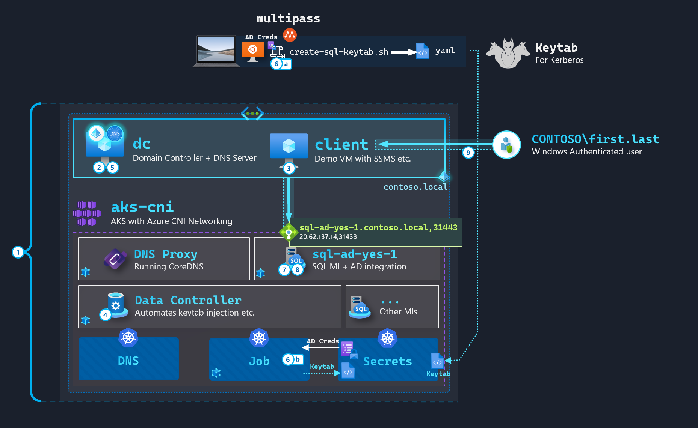

The following steps are required to setup a fully-functional AD environment for SQL MI from scratch in an Azure Subscription:

1. Infrastructure deployment: VNET/Subnet, 2 Windows VMs (Domain Controller, Client VM with SSMS), AKS with CNI (VNET integration), Bastion (optional, for RDP)
2. Domain Setup: DC promotion, Domain joining Client VM
3. Client VM prep: SSMS, pre-reqs such as `azcli`, `kubectl` etc)
4. Data Controller deployment (creates the `ActiveDirectoryConnector` CRD in the latest version of the Controller Image `mcr.microsoft.com/arcdata/arc-controller:v1.2.0_2021-12-15`)
5. Active Directory pre-reqs: SQL MI user account, SPNs, Reverse Lookup Zone creation and PTR record
6. Keytab creation -
  a. On Linux machine via multipass; or,
  b. Using Kubernetes [Jobs](https://kubernetes.io/docs/concepts/workloads/controllers/job/)
7. Deploy SQL MI via YAMLs
8. Create Windows Logins
9. Windows Auth from Domain Joined machine

### Infrastructure deployment

The following Azure CLI script deploys the necessary infrastructure:
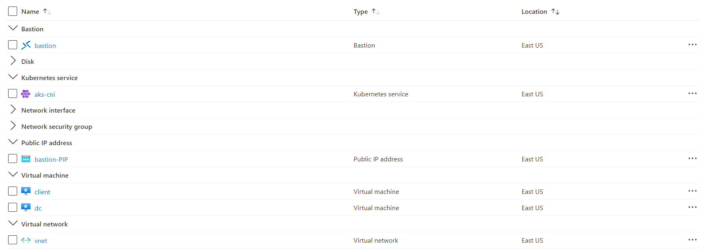

```Powershell
###########
# Variables
###########
$rg = "<your-rg-name>"
$subname = "<your-subscription-name>"
$rdp_username = "admin"
$rdp_password = "P@s5w0rd123!!"

# Switch context to Sub with Owner access (need for AKS CNI)
# https://docs.microsoft.com/en-us/azure/aks/configure-azure-cni#prerequisites
az account set --subscription $subname

# Create RG
az group create --name $rg --location EastUS

###############
# VNET + Subnet
###############
# Create new VNET in the new RG with AKS subnet
az network vnet create -g $rg -n vnet `
	--address-prefix 192.168.0.0/16 `
    --subnet-name AKSSubnet `
	--subnet-prefix 192.168.48.0/21

# Create Subnet for Domain Controller and Client VM
az network vnet subnet create -g $rg `
	--vnet-name vnet `
    -n domain `
    --address-prefixes 192.168.0.0/21

# Create Subnet for Bastion (optional - for RDP purposes)
az network vnet subnet create -g $rg `
    --vnet-name vnet `
    -n "AzureBastionSubnet" `
    --address-prefixes 192.168.144.64/27

###################
# Domain Controller
###################
az vm create -n dc -g $rg `
   --image Win2019Datacenter `
   --vnet-name vnet `
   --subnet domain `
   --public-ip-address '""' `
   --size Standard_D4s_v3 `
   --admin-username $rdp_username `
   --admin-password $rdp_password

# Change DNS resolution to use dc's NIC for domaining join client
$dns_ip = az vm show -g $rg -n dc --query privateIps -d --out tsv

az network vnet update -g $rg `
    -n vnet `
   --dns-servers $dns_ip

###########
# Client VM
###########
az vm create -n client -g $rg `
   --image Win2019Datacenter `
   --vnet-name vnet `
   --subnet domain `
   --public-ip-address '""' `
   --size Standard_D4s_v3 `
   --admin-username $rdp_username `
   --admin-password $rdp_password

#####
# AKS
#####
# Get Subnet ID for the first subnet - AKS
$subnetID = az network vnet subnet list `
    --resource-group $rg `
    --vnet-name vnet `
    --query "[0].id" --output tsv

# Create CNI AKS Cluster
az aks create `
    --resource-group $rg `
    --name aks-cni `
	--kubernetes-version 1.19.11 `
    --network-plugin azure `
    --vnet-subnet-id $subnetID `
    --docker-bridge-address 172.17.0.1/16 `
    --service-cidr 192.168.64.0/19 `
    --dns-service-ip 192.168.64.10 `
	--nodepool-name agentpool `
	--node-vm-size Standard_DS3_v2 `
	--node-count 3 `
	--enable-cluster-autoscaler `
    --min-count 1 `
    --max-count 3 `
    --generate-ssh-keys `
    --yes

#########
# Bastion
#########
# Public IP for bastion
az network public-ip create -g $rg `
    --name "bastion-PIP" `
    --sku Standard `
    --location EastUS

# Enable Bastion on this VNET - takes 5 minutes
az network bastion create `
    --name "bastion" `
    --public-ip-address "bastion-PIP" `
    -g $rg --vnet-name vnet `
    --location EastUS
```

### Domain Setup

We RDP into the Domain Controller (`dc`) and run the following from Powershell to setup the Domain and promote `dc` to Primary:

```powershell
# Configure the Domain Controller
$domainName = 'contoso.local'
$domainAdminPassword = "P@s5w0rd123!!"
$secureDomainAdminPassword = $domainAdminPassword | ConvertTo-SecureString -AsPlainText -Force

Install-WindowsFeature -Name AD-Domain-Services -IncludeManagementTools

# Create Active Directory Forest
Install-ADDSForest `
    -DomainName "$domainName" `
    -CreateDnsDelegation:$false `
    -DatabasePath "C:\Windows\NTDS" `
    -DomainMode "7" `
    -DomainNetbiosName $domainName.Split('.')[0].ToUpper() `
    -ForestMode "7" `
    -InstallDns:$true `
    -LogPath "C:\Windows\NTDS" `
    -NoRebootOnCompletion:$True `
    -SysvolPath "C:\Windows\SYSVOL" `
    -Force:$true `
    -SafeModeAdministratorPassword $secureDomainAdminPassword
```

The script run looks like this:
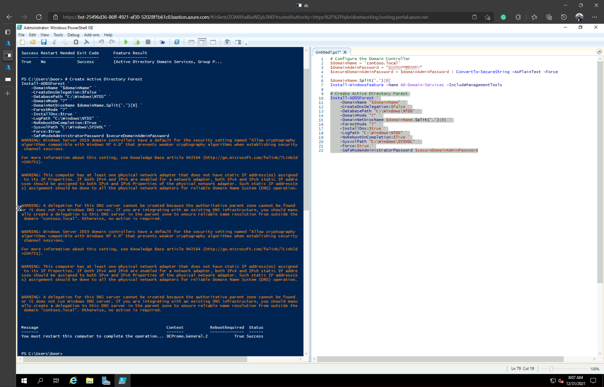

We reboot the VM - and can then sign in with Domain Admin creds:
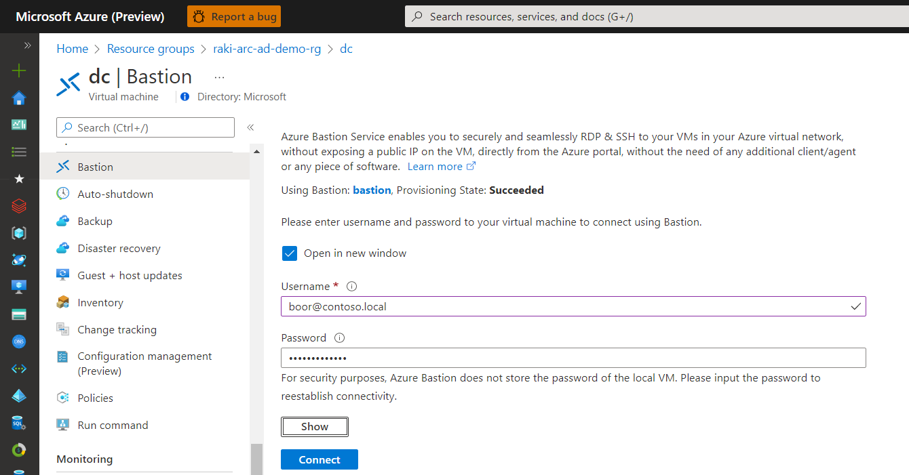

`dc` is now our Primary Domain Controller for domain `contoso.local` with DNS:
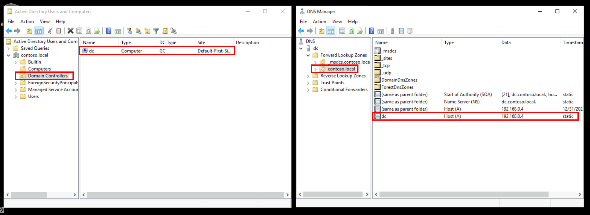

### Client VM prep

Inside the `client` VM - we run the following to domain join the machine and force a reboot:

```powershell
$user = "CONTOSO\boor"
$domainAdminPassword = "P@s5w0rd123!!"
$pass = $domainAdminPassword | ConvertTo-SecureString -AsPlainText -Force
$Credential = New-Object -TypeName System.Management.Automation.PSCredential -ArgumentList $user, $pass
add-computer –domainname contoso.local -Credential $Credential -restart –force
```

`client` is now Domain joined Controller with DNS entry aded:
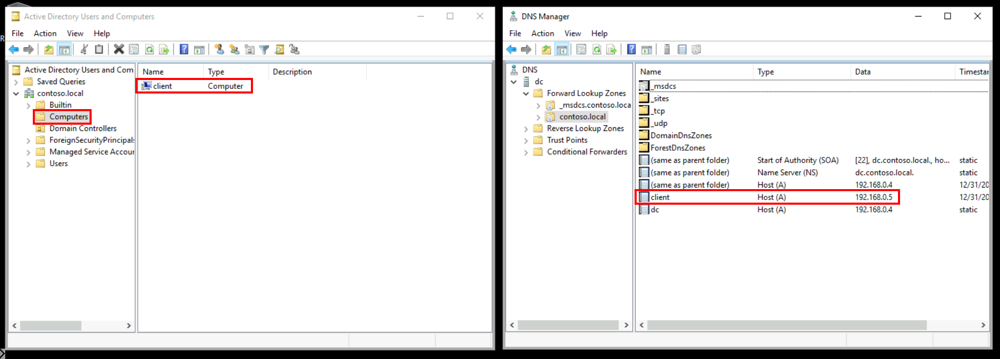

Next, we use [`chocolatey`](https://chocolatey.org/) to install all the CLI pre-reqs for Arc Deployment:

```powershell
# Install chocolatey
iex ((New-Object System.Net.WebClient).DownloadString('https://chocolatey.org/install.ps1'))

# Install apps
$chocolateyAppList = 'azure-cli,kubernetes-cli,vscode,kubernetes-helm,grep,ssms'

$appsToInstall = $chocolateyAppList -split "," | foreach { "$($_.Trim())" }

foreach ($app in $appsToInstall)
{
    Write-Host "Installing $app"
    & choco install $app /y -Force| Write-Output
}

# Kubectl alias
New-Item -path alias:kubectl -value 'C:\ProgramData\chocolatey\lib\kubernetes-cli\tools\kubernetes\client\bin\kubectl.exe'
```

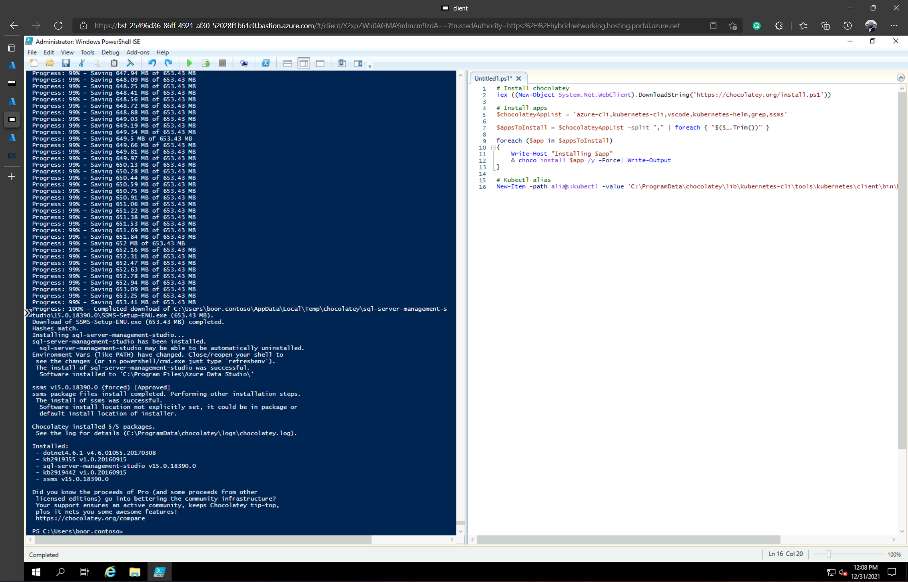

### Data Controller deployment

We can perform the rest of the work from VS Code inside `client` - starting with deploying the Data Controller in [Indirect Mode](https://docs.microsoft.com/en-us/azure/azure-arc/data/create-data-controller-indirect-cli?tabs=windows) (Direct mode works similarly):

```powershell
mkdir "C:\azure-arc"
cd "C:\azure-arc"

# Deployment variables
$adminUsername = "admin"
$spnClientId = "<your-client-id>"
$spnClientSecret = "<your-client-secret>"
$spnTenantId = "<your-tenant-id>"
$subscriptionId = "<your-subscription-id>"
$resourceGroup = "<your-rg-name>"
$azdataUsername = "admin"
$azdataPassword = "P@s5w0rd123!!"
$arcDcName = "jumpstart-dc"
$azureLocation = "eastus"
$clusterName ="aks-cni"

[System.Environment]::SetEnvironmentVariable('adminUsername', $adminUsername)
[System.Environment]::SetEnvironmentVariable('spnClientID', $spnClientId)
[System.Environment]::SetEnvironmentVariable('spnClientSecret', $spnClientSecret)
[System.Environment]::SetEnvironmentVariable('spnTenantId', $spnTenantId)
[System.Environment]::SetEnvironmentVariable('subscriptionId', $subscriptionId)
[System.Environment]::SetEnvironmentVariable('resourceGroup', $resourceGroup)
[System.Environment]::SetEnvironmentVariable('AZDATA_USERNAME', $azdataUsername)
[System.Environment]::SetEnvironmentVariable('AZDATA_PASSWORD', $azdataPassword)
[System.Environment]::SetEnvironmentVariable('arcDcName', $arcDcName)
[System.Environment]::SetEnvironmentVariable('azureLocation', $azureLocation)
[System.Environment]::SetEnvironmentVariable('clusterName', $clusterName)
[System.Environment]::SetEnvironmentVariable('AZDATA_LOGSUI_USERNAME', $env:azdataUsername)
[System.Environment]::SetEnvironmentVariable('AZDATA_LOGSUI_USERNAME', $env:azdataPassword)
[System.Environment]::SetEnvironmentVariable('AZDATA_LOGSUI_PASSWORD', $env:azdataUsername)
[System.Environment]::SetEnvironmentVariable('AZDATA_METRICSUI_PASSWORD', $env:azdataPassword)

# Login as service principal
az login --service-principal --username $env:spnClientId --password $env:spnClientSecret --tenant $env:spnTenantId
az account set --subscription $env:subscriptionId

# Adding Azure Arc CLI extensions
az config set extension.use_dynamic_install=yes_without_prompt

# Getting AKS cluster credentials kubeconfig file
az aks get-credentials --resource-group $env:resourceGroup `
                       --name $env:clusterName --admin

kubectl get nodes

# Monitor pods in arc namespace
kubectl get pods -n arc -w

#########################################
# Create data controller in indirect mode
#########################################
# Create with the AKS profile
az arcdata dc create --profile-name azure-arc-aks-premium-storage `
                     --k8s-namespace arc `
                     --name $env:arcDcName `
                     --subscription $env:subscriptionId `
                     --resource-group $env:resourceGroup `
                     --location $env:azureLocation `
                     --connectivity-mode indirect `
                     --use-k8s

# Monitor Data Controller
kubectl get datacontroller -n arc -w

# Spot for ActiveDirectoryConnector CRD
kubectl get adc -n arc
```

We see:
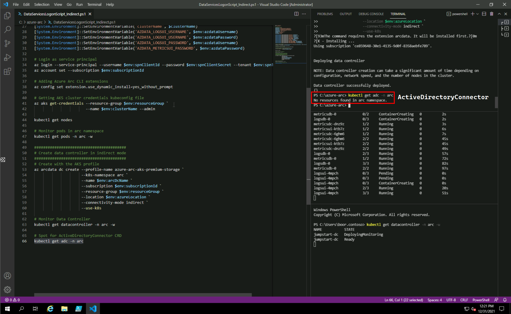

### Active Directory pre-reqs

The following script is run on `dc` to perform the [Active Directory pre-reqs documented here](https://docs.microsoft.com/en-us/azure/azure-arc/data/deploy-active-directory-sql-managed-instance#steps-before-the-deployment-of-sql-managed-instance) for SQL MI:

```powershell
Import-Module ActiveDirectory
#######################################
# 1. Create an AD Account for our sqlmi
#######################################
# Create OU - not an Arc requirement but nice to show since everyone uses it
# Arc SQL MI Users can be in any OU
New-ADOrganizationalUnit -Name "ArcSQLMI" -Path "DC=CONTOSO,DC=LOCAL"

$pass = "P@s5w0rd123!!" | ConvertTo-SecureString -AsPlainText -Force
New-ADUser -Name "sql-ad-yes-1-account" `
           -UserPrincipalName "sql-ad-yes-1-account@contoso.local" `
           -Path "OU=ArcSQLMI,DC=CONTOSO,DC=LOCAL" `
           -AccountPassword $pass `
           -Enabled $true `
           -ChangePasswordAtLogon $false `
           -PasswordNeverExpires $true

# "-PasswordNeverExpires "Since we don't want to deal with Keytab rotations for this demo, in PROD we don't need this

################
# 2. Create SPNs
################
setspn -S MSSQLSvc/sql-ad-yes-1.contoso.local sql-ad-yes-1-account
setspn -S MSSQLSvc/sql-ad-yes-1.contoso.local:31433 sql-ad-yes-1-account

# Verify SPNs got created
$search = New-Object DirectoryServices.DirectorySearcher([ADSI]"")
$search.filter = "(servicePrincipalName=*)"

## You can use this to filter for OU's:
## $results = $search.Findall() | ?{ $_.path -like '*OU=whatever,DC=whatever,DC=whatever*' }
$results = $search.Findall()

foreach( $result in $results ) {
	$userEntry = $result.GetDirectoryEntry()
	Write-host "Object Name	=	"	$userEntry.name -backgroundcolor "yellow" -foregroundcolor "black"
	Write-host "DN	=	"	$userEntry.distinguishedName
	Write-host "Object Cat.	=	" $userEntry.objectCategory
	Write-host "servicePrincipalNames"

	$i=1
	foreach( $SPN in $userEntry.servicePrincipalName ) {
		Write-host "SPN ${i} =$SPN"
		$i+=1
	}
	Write-host ""
}

##################################
# 3. Reverse Lookup Zone - Pointer
##################################
# Add a reverse lookup zone
Add-DnsServerPrimaryZone -NetworkId "192.168.0.0/21" -ReplicationScope Domain

# Get reverse zone name
$Zones = @(Get-DnsServerZone)
ForEach ($Zone in $Zones) {
    if (-not $($Zone.IsAutoCreated) -and ($Zone.IsReverseLookupZone)) {
       $Reverse = $Zone.ZoneName
    }
}

# Add a PTR record to the Reverse Lookup Zone for the Domain Controller. This is needed for when the SQL MI Pod looks up the DC in reverse.
Add-DNSServerResourceRecordPTR -ZoneName $Reverse -Name 4 -PTRDomainName dc.contoso.local # 4 is because of the IP address of the DC
```

We see SPNs get created against the new User Account:
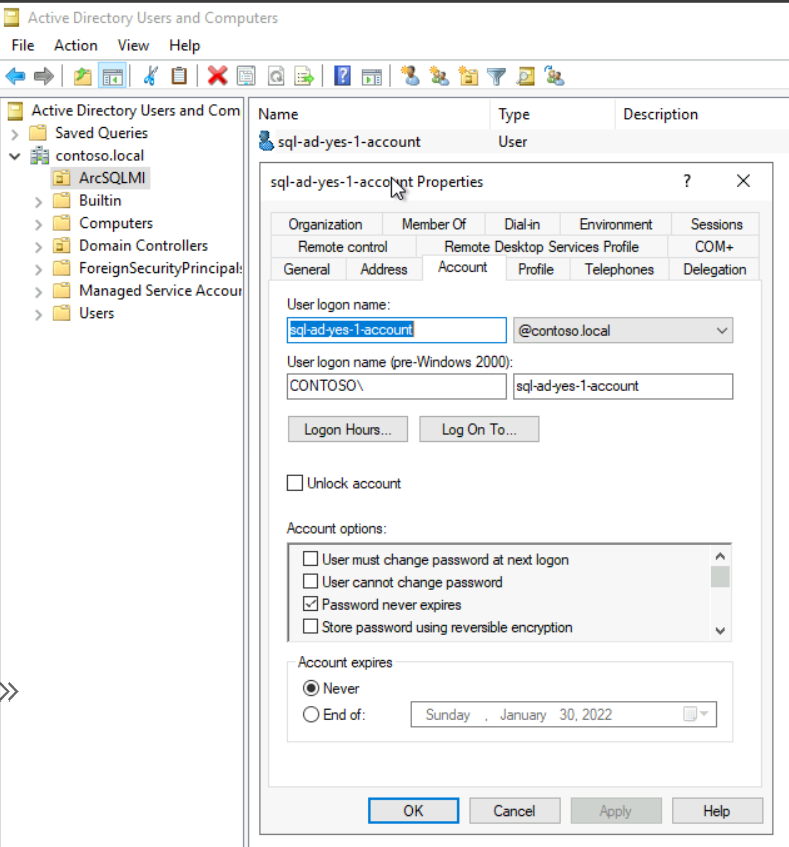
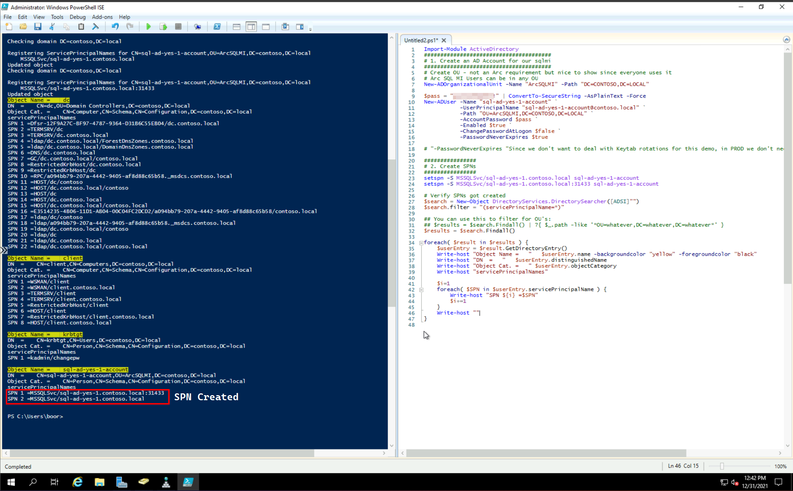

And the Reverse Lookup Zone and Pointer record for the Domain Controller's Private IP:
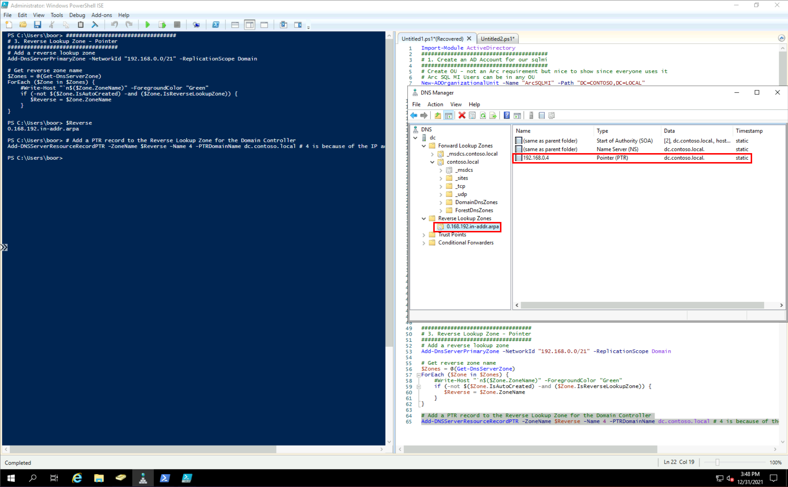

### Keytab creation

At this point - we have 2 infrastructure options to leverage in creating a keytab - the second one is more robust/scalable/kube-native.

#### Option 1 - Ubuntu 20.04 VM via multipass

There's a handy bash script [`create-sql-keytab.sh`](https://github.com/microsoft/azure_arc/blob/main/arc_data_services/deploy/scripts/create-sql-keytab.sh) published in the `microsoft/azure_arc` repo that creates the keytab using `ktutil` or `adutil` (your choice).

The following script installs the necessay pre-reqs on a new Ubuntu 20.04 VM (this VM is _not part of our domain_, it can't even talk to `dc` - and that's ok) and generates the Keytab and K8s `secret`:

```bash
##################################
# Install krb5-user without prompt
##################################
sudo su
apt-get update # Update for latest package
DEBIAN_FRONTEND=noninteractive apt-get -yq install krb5-user # Unattended krb5-user install
mv /etc/krb5.conf /etc/krb5.conf.example # Backup useless file
echo -e "[libdefaults]\ndefault_realm = CONTOSO.LOCAL\ndns_lookup_realm = true\ndns_lookup_kdc = true" > /etc/krb5.conf # Pass in realm information for ktutil

# Arc keytab creation script
mkdir azure-arc
cd azure-arc
# Download script from github
wget https://raw.githubusercontent.com/microsoft/azure_arc/main/arc_data_services/deploy/scripts/create-sql-keytab.sh
chmod u+x create-sql-keytab.sh # Change permissions to execute

################################
# Run script for keytab creation
################################
# AD_PASSWORD is the password for the SQL MI User we created in AD earlier
AD_PASSWORD=P@s5w0rd123!! ./create-sql-keytab.sh \
   --realm CONTOSO.LOCAL \
   --account sql-ad-yes-1-account \
   --port 31433 \
   --dns-name sql-ad-yes-1.contoso.local \
   --keytab-file sql-ad-yes-1.keytab \
   --secret-name sql-ad-yes-1-keytab-secret \
   --secret-namespace arc
```

<Callout>

💡 Note that `AD_PASSWORD` is the password of our newly created SQL MI account (and not the password of the Domain Admin). I've used `P@s5w0rd123!!` as the password for both accounts in this demo.

</Callout>

We see:
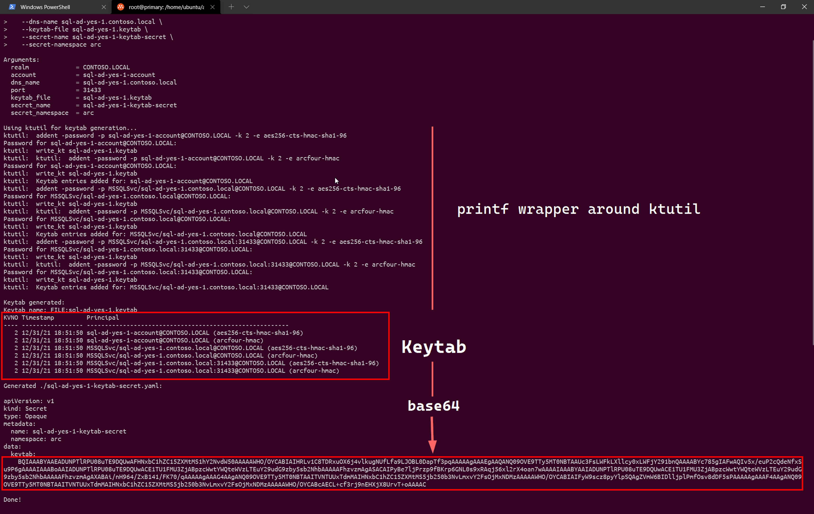

This creates a K8s secret YAML file containing the Keytab in Base64 - `sql-ad-yes-1-keytab-secret.yaml`: [docs](https://docs.microsoft.com/en-us/azure/azure-arc/data/deploy-active-directory-sql-managed-instance#deploy-kubernetes-secret-for-the-keytab):

```yaml
apiVersion: v1
kind: Secret
type: Opaque
metadata:
  name: sql-ad-yes-1-keytab-secret
  namespace: arc
data:
  keytab: BQIAAABYAAEADUNPTlRPU08uTE9DQUwAFHNxbC1hZC15ZXMtMS1hY2NvdW50AAAAAWHO/OYCABIAIHRLv1C8TDRxuOX6j4vlkugNUfLfa9LJOBL0DapTf3pqAAAAAgAAAEgAAQANQ09OVE9TTy5MT0NBTAAUc3FsLWFkLXllcy0xLWFjY291bnQAAAABYc785gIAFwAQIv5x/euP2cQdeNfxSu9P6gAAAAIAAABoAAIADUNPTlRPU08uTE9DQUwACE1TU1FMU3ZjABpzcWwtYWQteWVzLTEuY29udG9zby5sb2NhbAAAAAFhzvzmAgASACAIPyBe7ljPrzp9fBKrp6GNL0s9xRAqj56xl2rX4oan7wAA...
```

Which we can apply via `kubectl apply -f sql-ad-yes-1-keytab-secret.yaml`.

#### Option 2 - Kubernetes Job

<Callout>

📢 Shoutout to [Derek Robson](https://www.linkedin.com/in/derek-robson-25512519/) for creating this setup - check out his repo with detailed setup steps [here](https://github.com/djr747/kube-keytab-secret-generator).

</Callout>

We can use the following `service-account.yaml` file to create a [`ServiceAccount`](https://kubernetes.io/docs/tasks/configure-pod-container/configure-service-account/) that has required permissions to create the Keytab Secret:

```yaml
apiVersion: v1
kind: ServiceAccount
metadata:
  name: keytab-job
  namespace: arc
---
kind: ClusterRole
apiVersion: rbac.authorization.k8s.io/v1
metadata:
  name: keytab-job
  namespace: arc
rules:
  - apiGroups: [""]
    resources: ["secrets"]
    verbs: ["list", "create", "update"]
---
apiVersion: rbac.authorization.k8s.io/v1
kind: RoleBinding
metadata:
  name: keytab-job
  namespace: arc
subjects:
  - kind: ServiceAccount
    name: keytab-job
roleRef:
  kind: ClusterRole
  name: keytab-job
  apiGroup: rbac.authorization.k8s.io
```

From there - we have the following Kubernetes [`Job`](https://kubernetes.io/docs/concepts/workloads/controllers/job/) defined in `deploy-job.yaml` - which spins up [this container image](https://github.com/djr747/kube-keytab-secret-generator/blob/main/dockerfile) containing `ktutil` with a [`bash` wrapper](https://github.com/djr747/kube-keytab-secret-generator/blob/main/scripts/generate-keytab-secret.sh) to create the Keytab Secret:
```yaml
apiVersion: batch/v1
kind: Job
metadata:
  name: kube-keytab-secret-generator
  namespace: arc
spec:
  template:
    metadata:
      labels:
        name: kube-keytab-secret-generator
        app: kube-keytab-secret-generator
    spec:
      restartPolicy: Never
      containers:
      - name: kube-keytab-secret-generator
        image: djrsystems/kube-keytab-secret-generator:latest
        env:
        - name: SECRET_NAMESPACE
          valueFrom:
            fieldRef:
              fieldPath: metadata.namespace
        - name: PASSWORD
          valueFrom:
            secretKeyRef:
              name: keytab-password
              key: password
        - name: ACCOUNT
          value: "sql-ad-yes-1-account"
        - name: ENCRYPTION_METHODS
          value: "aes256-cts-hmac-sha1-96,arcfour-hmac"
        - name: REALM
          value: "CONTOSO.LOCAL"
        - name: SECRET_NAME
          value: "sql-ad-yes-1-keytab-secret"
        - name: SPNS
          value: "MSSQLSvc/sql-ad-yes-1.contoso.local,MSSQLSvc/sql-ad-yes-1.contoso.local:31433"
      serviceAccountName: keytab-job
      automountServiceAccountToken: true
```

We create a K8s Secret containing the Active Directory password for our AD user `sql-ad-yes-1-account` - and deploy the YAMLs end-to-end:
``` bash
##################################
# Keytab generation Job deployment
##################################
# Create secret with AD Password
kubectl create secret generic keytab-password --from-literal=password=P@s5w0rd123!! -n arc

# Kubernetes Service Account for Job to create secrets
kubectl apply -f service-account.yaml

# Kubernetes Job Deployment
kubectl apply -f deploy-job.yaml

# View keytab secret
kubectl get secret sql-ad-yes-1-keytab-secret -n arc -o yaml
```
We see am ephemeral pod get spun up for the `Job` running under the context of the `ServiceAccount`:
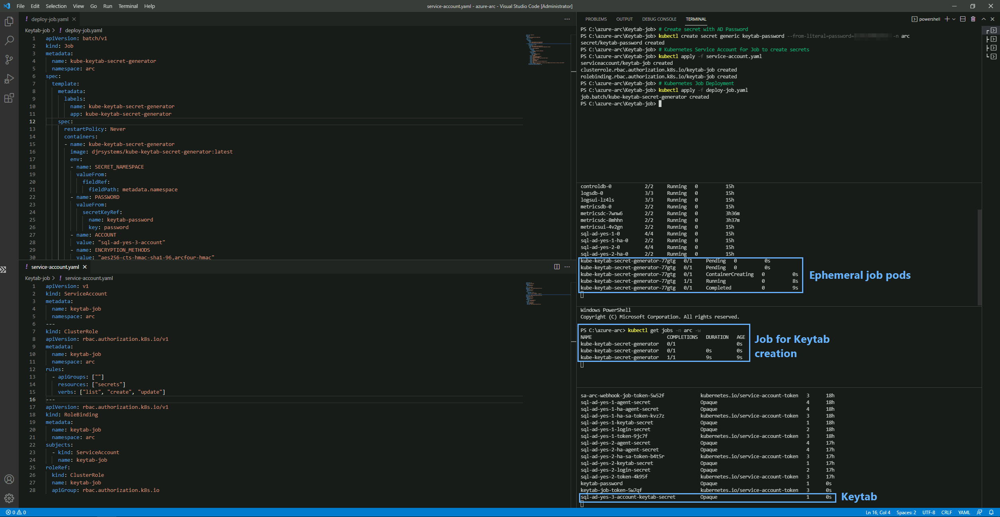

And the `Secret` get created:
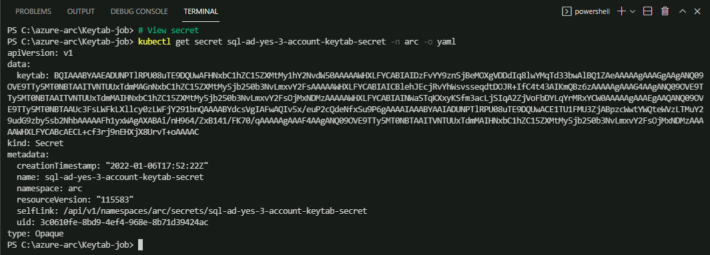


### SQL MI deployment via YAMLs

Finally, here are the 2 YAML files we need to deploy to get things working:

1 - `ActiveDirectoryConnector.yaml`: [docs](https://docs.microsoft.com/en-us/azure/azure-arc/data/deploy-active-directory-connector#deploy-active-directory-ad-connector)

```yaml
apiVersion: arcdata.microsoft.com/v1beta1
kind: ActiveDirectoryConnector
metadata:
  name: adarc
  namespace: arc
spec:
  activeDirectory:
    realm: CONTOSO.LOCAL # Name of the Active Directory domain in uppercase. This is the AD domain that this instance of AD Connector will be associated with.
    netbiosDomainName: CONTOSO # This is often used to qualify accounts in the AD domain. e.g. if the accounts in the domain are referred to as CONTOSO\admin, then CONTOSO is the NETBIOS domain name.
    domainControllers:
      primaryDomainController:
        hostname: dc.contoso.local # Our domain controller
  dns:
    preferK8sDnsForPtrLookups: false
    nameserverIPAddresses:
      - 192.168.0.4 # IP Address of DNS nameserver, which is just domain controller in this demo env
```

2 - `sql-ad-yes-1.yaml`: [docs](https://docs.microsoft.com/en-us/azure/azure-arc/data/deploy-active-directory-sql-managed-instance#prepare-sql-managed-instance-spec)

```yaml
apiVersion: v1
data:
  password: <sqlauth-base64-encoded-password>
  username: <sqlauth-base64-encoded-user>
kind: Secret
metadata:
  name: sql-ad-yes-1-login-secret
  namespace: arc
type: Opaque
---
apiVersion: sql.arcdata.microsoft.com/v2
kind: SqlManagedInstance
metadata:
  name: sql-ad-yes-1
  namespace: arc
spec:
  backup:
    retentionPeriodInDays: 7
  dev: true
  tier: GeneralPurpose
  forceHA: "true"
  licenseType: LicenseIncluded
  replicas: 1
  scheduling:
    default:
      resources:
        limits:
          cpu: "2"
          memory: 4Gi
        requests:
          cpu: "2"
          memory: 4Gi
  security:
    adminLoginSecret: sql-ad-yes-1-login-secret
    activeDirectory:
      connector:
        name: adarc
        namespace: arc
      accountName: sql-ad-yes-1-account
      keytabSecret: sql-ad-yes-1-keytab-secret
  services:
    primary:
      type: LoadBalancer
      dnsName: sql-ad-yes-1.contoso.local
      port: 31433
  storage:
    backups:
      volumes:
        - className: managed-premium
          size: 5Gi
    data:
      volumes:
        - className: managed-premium
          size: 5Gi
    datalogs:
      volumes:
        - className: managed-premium
          size: 5Gi
    logs:
      volumes:
        - className: managed-premium
          size: 5Gi
```

We deploy the 2 YAMLs in sequence:

```powershell
######################################
# Active Directory + SQL MI deployment
######################################
cd "C:\azure-arc"

# Deploy Active Directory Connector
kubectl apply -f ActiveDirectoryConnector.yaml

# Deploy MI
kubectl apply -f sql-ad-yes-1.yaml

# Update Service Port from 1433 to 31433
# This should be automatic in the near future
$payload = '{\"spec\":{\"ports\":[{\"name\":\"port-mssql-tds\",\"port\":31433,\"targetPort\":1433}]}}'
kubectl patch svc sql-ad-yes-1-external-svc -n arc --type merge --patch $payload
```

We see:

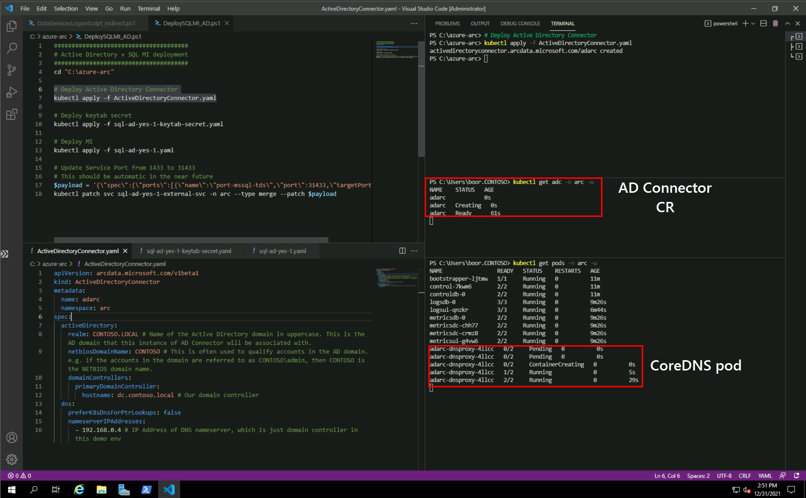

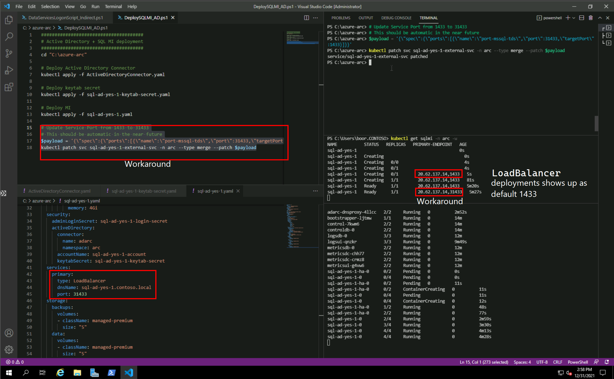

Finally, we take the `LoadBalancer` IP, and add a DNS record in `dc` so that our SSMS VM can hit it against the FQDN:

```powershell
Add-DnsServerResourceRecordA -Name sql-ad-yes-1 -ZoneName contoso.local -IPv4Address 20.62.137.14 # AKS LB
```

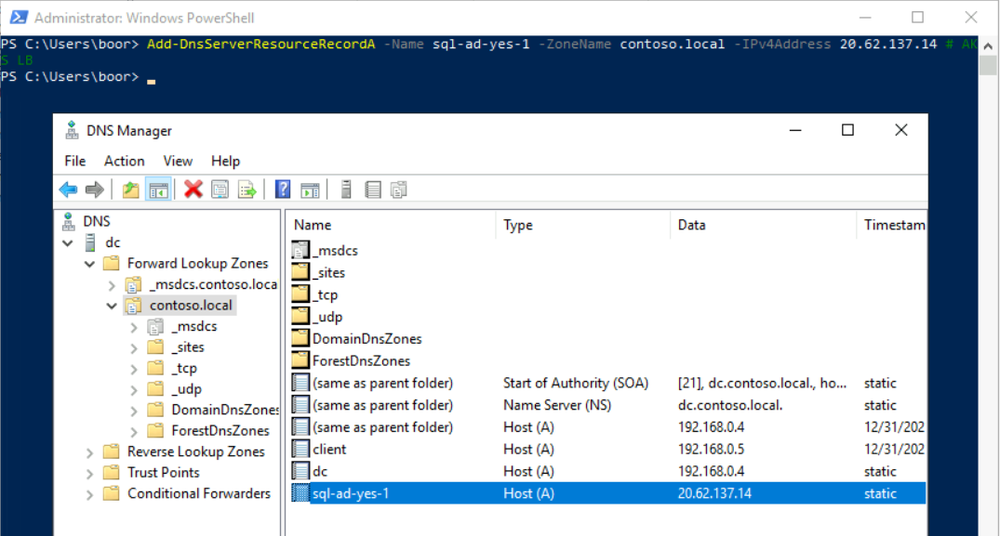

<Callout>

💡 **DNS Automation**

To avoid this final manual step and perform it synchronously - we need to have our K8s cluster syncing DNS entries with an _external_ DNS provider that our clients (e.g. Windows VMs running SSMS) can use. 

In AKS - we can use [ExternalDNS](https://github.com/kubernetes-sigs/external-dns/blob/master/docs/tutorials/azure.md). Basically, what this means is ExternalDNS will automatically sync the DNS record for the K8s service with a DNS zone in the external DNS provider - e.g. [Azure Private DNS](https://docs.microsoft.com/en-us/azure/dns/private-dns-overview).

If we have an On-Prem DNS provider - we can create a bespoke [Kubernetes Operator](https://kubernetes.io/docs/concepts/extend-kubernetes/operator/) relevant to our setup to automate this final step.

</Callout>

### Create Windows Logins

#### Option 1 - Add AD User
We login to the SQL MI as our sqlauth user to create the Windows Logins (this can be done via an Operator to automate, prior to disabling the sqlauth user):

```sql
USE [master]
GO
CREATE LOGIN [CONTOSO\boor] FROM WINDOWS WITH DEFAULT_DATABASE=[master]
GO
ALTER SERVER ROLE [sysadmin] ADD MEMBER [CONTOSO\boor]
GO
```

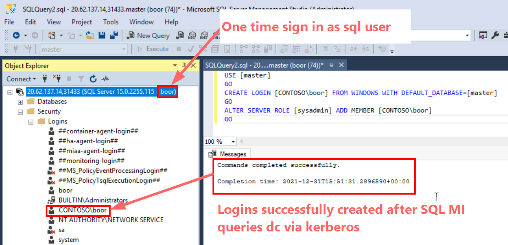

#### Option 2 - Add AD Group

Alternatively, we can add an entire AD Group to the SQL MI - where the Group's membership lifecycle is managed in AD, outside of SQL MI.

In the Domain Controller `dc` - we run:
``` powershell
# Create AD Group in existing OU
New-ADGroup -Name "SQLAdmins" -SamAccountName SQLAdmins -GroupCategory Security -GroupScope Universal -DisplayName "SQL Server Admins" -Path "OU=ArcSQLMI,DC=CONTOSO,DC=LOCAL" -Description "Members of this group are SQL Server Administrators"

# Add local user to group
Add-ADGroupMember -Identity SQLAdmins -Members boor
```
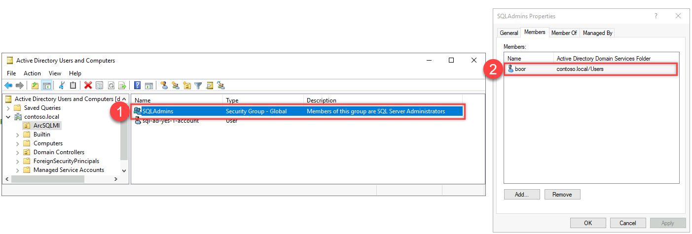

And we run the following in the SQL MI to grant access:
``` sql
USE [master]
GO
CREATE LOGIN [CONTOSO\SQLAdmins] FROM WINDOWS WITH DEFAULT_DATABASE=[master]
GO
ALTER SERVER ROLE [sysadmin] ADD MEMBER [CONTOSO\SQLAdmins]
GO
```

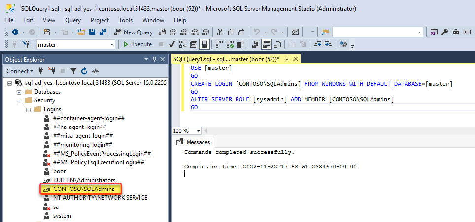

<Callout>

⚠ Make sure to sign out of Windows in `client` and sign back in before attempting authentication via SSMS - Windows needs to know that the local user we just created is part of the AD Group in order for SSMS to know about it - [see here](https://dba.stackexchange.com/questions/163742/cannot-login-to-sql-server-as-a-member-of-ad-group/279970#279970).

</Callout>


### Windows Auth from Domain Joined machine

Finally, from `client` - we can sign in as a Windows User from SSMS against the DNS endpoint `sql-ad-yes-1.contoso.local,31433`:


Furthermore, we can use this `ActiveDirectoryConnector` against multiple SQL MIs by repeating the steps above for another SQL MI:


Success 👏!


