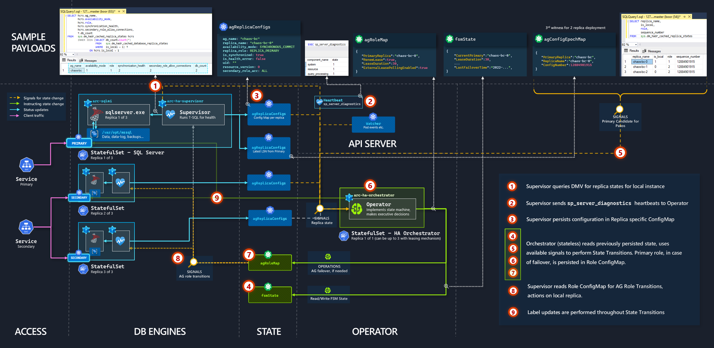
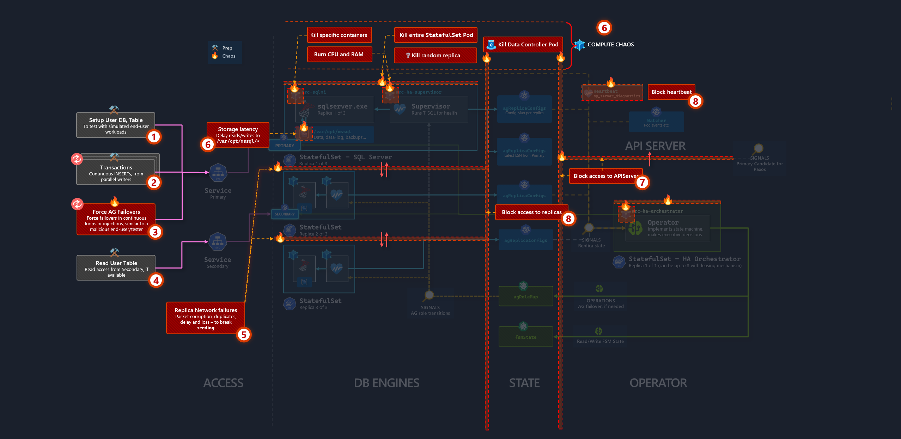
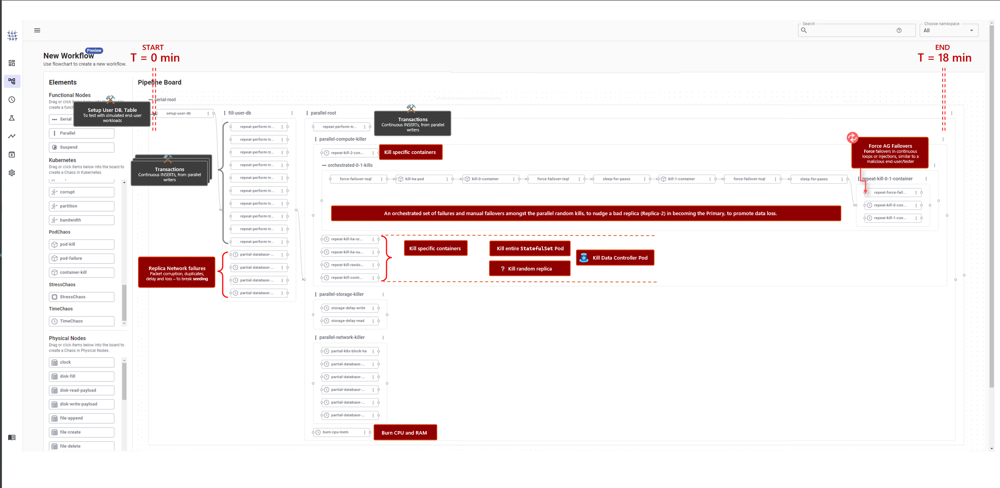
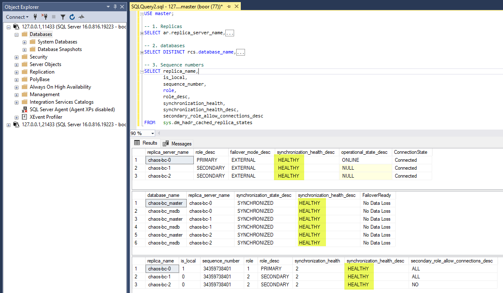
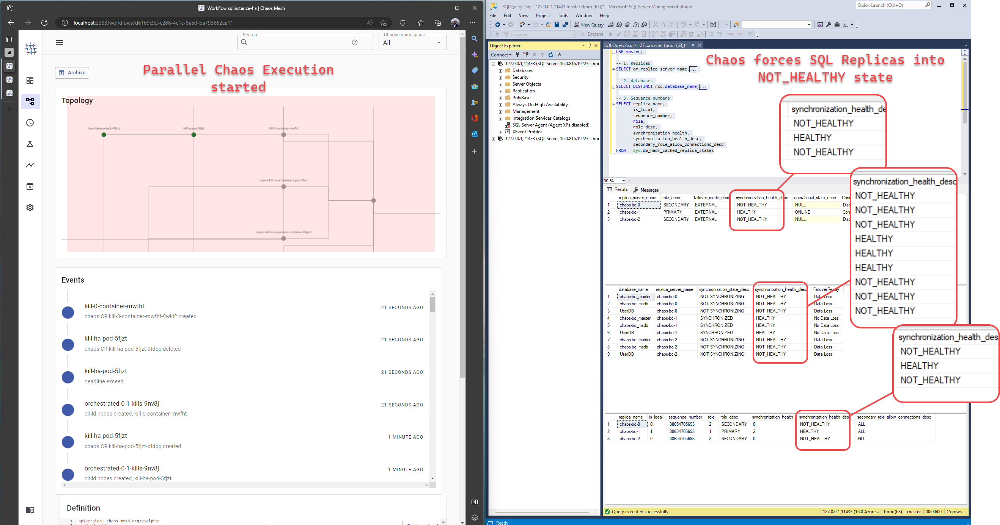
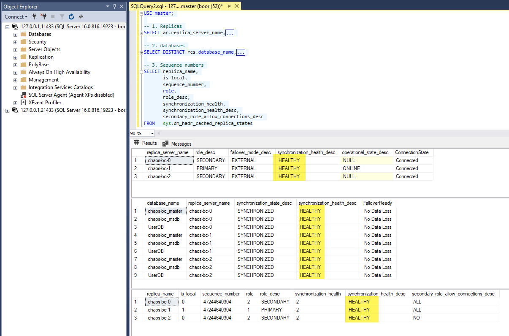

import { Callout } from "../../src/components/atoms.js"
import { ExtLink, InlinePageLink } from "../../src/components/atoms.js"

<Callout>

In this article, we challenge SQL Server Availability Group's resiliency by throwing the absolute worst types of Kubernetes infrastructure failures at a 3-replica Arc-SQL MI Business Critical instance.

Please, do not try any of this in Production.

Also, none of the content presented here is official guidance or recommendation from Microsoft. It's for educational (or maybe, entertainment 😄) purposes only.

</Callout>

Synchronous Transaction Replication and resilient replica recovery is something only a handful of Database Products have built up as a core-feature over the years, many top rankers in [this list](https://db-engines.com/en/ranking) do not have an answer to this difficult problem. Even the one's that do have a documented solution, it's pretty hard to compare and contrast how good the implementation _actually_ is from studying docs/watching a demo or conducting a POC, without either:

- Living with them in Production for a while and accumulating lessons learned (or scars, if you asked a DBA); or,
- Observing the system's behavior under _intense_ stress, the worst-imaginable failure conditions possible

Previously, I had only on set up [Availability Groups or "AGs"](https://learn.microsoft.com/en-us/sql/database-engine/availability-groups/windows/overview-of-always-on-availability-groups-sql-server?view=sql-server-ver16) on Windows Server Failover Clusters (AGs are basically SQL Server's answer to resiliency guarantees in case of engine-level failure). Besides running [some one-off T-SQL commands](https://learn.microsoft.com/en-us/sql/database-engine/availability-groups/windows/perform-a-planned-manual-failover-of-an-availability-group-sql-server?view=sql-server-ver16) to manually failover/failback, there was always a "fear of the unknown" in my mind, regarding what would _actually_ happen, in case the underlying system and it's dependents completely fell over sideways. I also wasn't familiar with how to systematicaly orchestrate drastic failures in Windows, besides restarting a couple VMs or restarting `sqlservr.exe` from [`services.msc`](https://www.minitool.com/news/how-to-open-windows-services.html) etc.

So recently, I was tasked with trying my absolute best _to break_ SQL Server Availability Group by any means possible. The definition of broken is:

<Callout>

"_Do whatever you want to the system (besides deleting `mdf/ldf` files etc., AKA no irrecoverable damage), for any duration of time, with the end goal of leaving the system in a state where it cannot self-heal, and requires manual intervention (e.g. intelligently crafted T-SQL commands that must be manually run by some human being)._

_If it requires manual intervention, the system is broken, and that's a major bug._"

</Callout>

This time, I had Kubernetes on my side, with the SQL engine running in disposable Linux containers ([Arc SQL MI Business-Critical Tier](https://learn.microsoft.com/en-us/azure/azure-arc/data/service-tiers#service-tier-comparison)), and the latest-and-greatest Chaos Engineering software from CNCF - called [Chaos Mesh](https://www.cncf.io/projects/chaosmesh/) - offering many novel [Custom Resource Defintions](https://github.com/chaos-mesh/chaos-mesh#chaos-operator) that can be used to declare layers upon layers of controlled, systematic degradations (rather than one-off imperative scripts with a single entry and exit point like, restarting a VM, then moving on to cause some other mischief in a linear fashion, etc.).

Having [pondered about questions like this](https://www.reddit.com/r/kubernetes/comments/tfga4y/eli5_why_is_it_not_advisable_to_run_databases_in/) about the scary unknowns of hosting data inside ephemeral containers (K8s Pods), I was feeling pretty good about my chances of discovering a failure-mode that triumphed `sqlservr.exe`(s).

## High Availability Architecture and possible faliure points

<Callout>

The key to try and make a system miserably fail is to first understand it's architecture and key lifelines. That way, the kinds of failures we can produce _really_ try to hurt the system by cutting off one or more of those lifelines.

</Callout>

### HA Kubernetes Operator and Pendulum Analogy

- Arc-SQL MI Business Critical tier, besides wrapping all SQL replicas behind an Availability Group Listener, comes with a dedicated [Kubernetes Operator](https://kubernetes.io/docs/concepts/extend-kubernetes/operator/) called the `arc-ha-orchestrator`.

  - An Operator is a dedicated piece of computer program responsible for monitoring the health state of some system it "operates", based on some system specific [Finite-state machine](https://en.wikipedia.org/wiki/Finite-state_machine) definition (basically, business logic).

    It then uses the observed signals to figure out the Current-State, and perform some small, pre-defined, intelligent actions to "nudge" (rather than force), the system towards a healthy (i.e. Desired) state. That system could be anything, SQL Server, a pendulum, a self-driving car etc.

    - Kubernetes Operators are a very elaborate application of [PID Controllers in Electronics](https://en.wikipedia.org/wiki/PID_controller#Fundamental_operation) that have been around since 1920s. Actually, all of Kubernetes is built on applying this idea as code.

  - The `arc-ha-orchestrator`'s sole responsibility is doing everything within it's power to monitor and maintain the health of the SQL Server Availability Group it manages. It is the operator's life's mission to ensure the AG never gets into an irrecoverable, i.e. corrupt state. If it senses this is about to happen, it will do whatever actions it has within it's arsenal, to ensure the State Machine never gets into a corrupt state that cannot be recovered from. The way this is implemented is by applying the [Paxos protocol](<https://en.wikipedia.org/wiki/Paxos_(computer_science)>).

This is the best visual analogy I can think of to visualize the `arc-ha-orchestrator`'s responsibility (that is, if SQL Server Availability Group was an inverted pendulum we were trying to keep perfectly balanced while fighting Physics):

`youtube:https://www.youtube.com/embed/meMWfva-Jio`

So comparing the responsibilities:

| C1                    | C2                                                                                                                                                                                                                                                                                                                                                                                                                                                                                                                                                                                                                                                                                                                                                                                                                                                                                                                  | C3                                                                                             |
| --------------------- | ------------------------------------------------------------------------------------------------------------------------------------------------------------------------------------------------------------------------------------------------------------------------------------------------------------------------------------------------------------------------------------------------------------------------------------------------------------------------------------------------------------------------------------------------------------------------------------------------------------------------------------------------------------------------------------------------------------------------------------------------------------------------------------------------------------------------------------------------------------------------------------------------------------------- | ---------------------------------------------------------------------------------------------- |
| `Operator`            | `Responsibility`                                                                                                                                                                                                                                                                                                                                                                                                                                                                                                                                                                                                                                                                                                                                                                                                                                                                                                    | `Enemy`                                                                                        |
| Inverted Pendulum     | Uses signals from it's various sensors to keep the inverted pendulum perfectly upright, despite abnormal turbulence from the ruler. If the pendulum is slapped _really, really hard_ and knocked over to the point where it keeps spinning - although the motor isn't powerful enough to counteract the torque from the slap, after the spinning eventually stops, the operator (motor), and the system it manages (pendulum), is resilient enough to bring the pendulum back up in a healthy, upright state (assuming no intentional, permanent physical damage to it's motors or hinges).                                                                                                                                                                                                                                                                                                                         | Physics, and the guy with the ruler knocking things around                                     |
| `arc-ha-orchestrator` | Uses DMV queries, AG [`sequence_number`](https://learn.microsoft.com/en-us/sql/linux/sql-server-linux-availability-group-ha?view=sql-server-ver16#understand-sql-server-resource-agent-for-pacemaker), Pod health and other metadata as heartbeat from each SQL replica, keeps the AG in a best-effort accessible, and most importantly, **recoverable, uncorrupted** state. If the SQL Server replicas are slapped _really, really hard_ (no more quorum, 2/3 replicas have their plugs pulled), the Operator has the power to deny connectivity to the AG listener, and once replicas `sqlservr.exe`s come up, brings the replicas back to it's `HEALTHY` state automatically after the turbulent effects settle down (assuming someone didn't go into the Container and deliberately delete files, or bypass the AG listener and connect to the single instances and start creating/deleting transactions etc.). | Infrastructure failures (also Physics) the guy with the Chaos Mesh CRDs knocking things around |

### HA Architecture

It's probably not an overstatement that SQL Server is probably the most extensively documented consumer product out there. So instead of discussing the well-known mechanics of Availability Groups, we focus on the key **integration points** that serves as the lifeline signals in Arc SQL MI High Availability, annotated below:



In short:

- Several well known DMVs and Stored Procs are used to determine the health state of the Availability Group and Replica
- As `arc-ha-orchestrator` is a completely stateless app (we will test the validity of this statement 😉) [`ConfigMaps`](https://kubernetes.io/docs/concepts/configuration/configmap/) are used for storing the various system states, including that of the Finite-state machine.
- [`Labels`](https://kubernetes.io/docs/concepts/overview/working-with-objects/labels/) are used to route traffic between the Kubernetes External [`Service`](https://kubernetes.io/docs/concepts/services-networking/service/) to the appropriate Availability Group Replica. In scenarios where replicas are resolving, labels are removed and then reapplied after the Paxos transition is successful.

### HA Architecture - failure overlay

One important point I learned about System Failure, is that when a key integration point is _100% inaccessible_ for prolonged durations, it's actually not that stressful/confusing for the system when trying to determine the path to go from Current (Unhealthy) -> Desired (Healthy) State. This is because, given the current signals, there _is no traversable paths_ to being healthy again unless that key integration point is back. Since the system cannot know when that will happen, it stays dormant.

For example, if we completely shut down the Operator's network acces to `ConfigMaps` (i.e. to [Kubernetes API Server](https://kubernetes.io/docs/concepts/overview/kubernetes-api/)), the internal exception handling mechanism dictates that it simply just sits there and refuses to perform State Transitions until it has the necessary Current State data it needs to transition (from the appropriate `ConfigMaps`). If it doesn't perform transitions, the system remains in the dormant, current state. This is good, because the system remains stable, albeit unhealthy - it's the equivalent to our Pendulum standing still at the bottom of the trajectory.

The same observation applies to `sqlservr.exe`. As tempting as it may be to completely simulate 100% corrupttion of `/var/opt/mssql/data`, or inject 20 seconds of latency per R/W operation, SQL simply crashes and refuses to start up in these hazardous conditions.

Therefore, if we want to try and influence the Operator or SQL Server to make faulty decisions, it's important to inject periodic, pointed, _partial_ failures - in some specific sequence, or in parallel.

<Callout>

👊 The equivalent of this in the Pendulum video is, the ruler is _nudging_ the pendulum, not punching it.

</Callout>

So looking at the architecture diagram, we can identify hypothetical failure points, to serve as the basis of our Chaos Test:



Knowing the fact that the Operator depends on `ConfigMaps` to store state, it would have been wicked fun to update the content of the `ConfigMap` with inaccurate payloads and see how the Operator reacts. But unfortunately, since that violates the rules of engagement (equivalent to breaking the pendulum motor), we make do with the next best strategy - referring to the diagram annotations:

1. Setup a User Database with a simple table, that gets onboarded into the Availability Group.
2. A mechanism to sporadically, and/or continuously, rapid insert transactions into the User Database (e.g. multiple write workloads, with infinite loops)
3. This one is a fun one. Since Arc SQL MI supports user initiated manual failovers - i.e.:

   ```SQL
   ALTER AVAILABILITY GROUP current SET (ROLE = SECONDARY)
   ```

   We should have some compute that can repeatedly demand failovers against the AG listener from replica to replica, all while writes are happening in 2.

4. Compared to everything else, this isn't really stressful, but some read workload from secondary.

5. SQL Replica to Replica network corruption, duplicates, increased latency and packet loss. The idea here is to throw off [replica seeding](https://learn.microsoft.com/en-us/sql/database-engine/availability-groups/windows/automatic-seeding-secondary-replicas?view=sql-server-ver16).

6. Inject R/W latency into Storage at `/var/opt/mssql/**`.
7. Partially block the Operator's access to APIServer, which impacts the watcher, and ability to read or update state `ConfigMap`s.
8. Partially block 2-way access from Replicas to Operator, which also impacts receiving heartbeats.

The idea is, if the system can survive this onslaught of partial failures that forces it into an unhealthy state and recover, it's probably pretty resilient.

## Chaos Experiment

### Introduction

Chaos Mesh is an Open-Source, [CNCF Chaos Engineering Platform](https://www.cncf.io/projects/chaosmesh/) built for Kubernetes. It was created by the founders of [TiDB](https://www.pingcap.com/), a distributed HTAP Database. This is why it's an amazing fit for SQL Server as well, both being Database Engines, share similar failure points Chaos Mesh is designed to attack.

In short, Chaos mesh is easily [installable via helm](https://chaos-mesh.org/docs/production-installation-using-helm/), and comes with a variety of [failure injection CRDs](https://github.com/chaos-mesh/chaos-mesh#chaos-operator) that line up with the failure annotated diagram above.

The component that makes Chaos Mesh extra-special is, it's possible to create elaborate, no-code experiments using a workflow-based UI, then export out the Custom Resources as a YAML manifest, which means the same experiment can be automated as part of any Continuous Integration pipeline. The concept is identical to [Argo Workflows](https://argoproj.github.io/argo-workflows/), and was actually [inspired by Argo](https://chaos-mesh.org/docs/create-chaos-mesh-workflow/).

<Callout>

💡 Fun fact - [Azure Chaos Studio](https://learn.microsoft.com/en-us/azure/chaos-studio/chaos-studio-tutorial-aks-portal) actually uses Chaos Mesh under-the-hood for Kubernetes testing.

</Callout>

### Generating the experiment

The failure modes above are constructed in the Chaos Mesh UI:



<Callout>

📦 A simple [YAML Jinja template](https://palletsprojects.com/p/jinja/) for generating the Chaos `Workflow` manifest from the above screenshot is available as a gist here: [`sqlinstance-ha.yaml.tmpl`](https://gist.github.com/mdrakiburrahman/50c0606491fdcde68ad90850c00007fa). This manifest can be imported into Chaos Mesh, to get an identical UI view back.

This workflow manifest basically combines a majority of the [official examples and patterns available here](https://github.com/chaos-mesh/chaos-mesh/tree/master/examples).

</Callout>

### Running the experiment

- Running the Chaos experiment is a two-step process.

**Step 1:** Create the SQL MI (~3 minutes):

```bash
az sql mi-arc create -n chaos-bc \
                    --cores-request 1 \
                    --cores-limit 1 \
                    --memory-request 2Gi \
                    --memory-limit 2Gi \
                    --tier BusinessCritical \
                    --replicas 3 \
                    --resource-group ...
```

**Step 2:** Apply chaos and wait til experiment ends (~18 minutes):

```bash
kubectl apply -f sqlinstance-ha.yaml
```

The manifest targets the SQL MI `chaos-bc` using label selectors that are part of the manifest.

<Callout>

Using the UI to create the creative failure experiment, then pulling out the YAML is key to creating low-effort, high-quality tests, because now, we can run this as many times as we want, and we have the experiment definition in source-control (i.e. we can add in more failures).

From here, it's easy to capture this manifest and integrate into any CI/CD pipeline to perform these tests on every commit, we basically `kubectl apply` the manifest, then poll for the `Workflow` to complete.

</Callout>

### Demo: Observing the experiment

The end-to-end Chaos experiment execution is demonstrated here:

`youtube:https://www.youtube.com/embed/wdj5NB_ligM`

<Callout>

📦 The script to apply and clean up the manifest used during the execution is in a [gist here](https://gist.github.com/mdrakiburrahman/73d231f9df3ac8bc7a28c4c7b9c2f239).

</Callout>

#### Summary

Pre-chaos, all 3 replicas are in a `HEALTHY` state as expected:

```sql
SELECT replica_name,
       is_local,
       sequence_number,
       role,
       role_desc,
       synchronization_health,
       synchronization_health_desc,
       secondary_role_allow_connections_desc
FROM   sys.dm_hadr_cached_replica_states
```



- Around `3:50`, Chaos forces 2/3 replicas in `NOT_HEALTHY` state:



Essentially, this means that the chaos experiment we've put together is effective at impacting the key system integration points.

- The workflow executes for 18 minutes, and is `Completed`.

- After connecting to SQL Server, we notice that despite all of the injected Chaos, the Operator has performed the correct sequence of replica failovers to have all replicas back in a `HEALTHY` state:



And the system is stable once again.

## Conclusion

SQL 1, Chaos 0.
