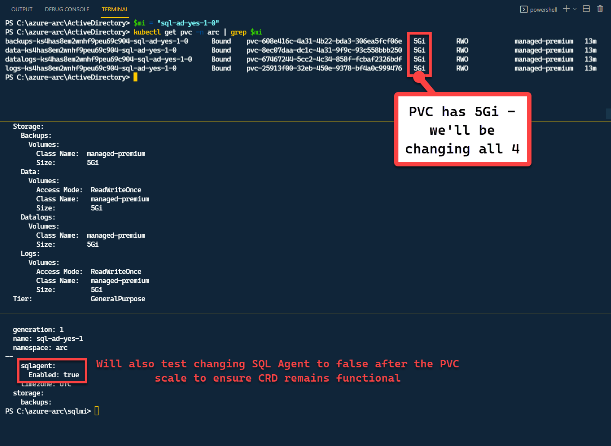
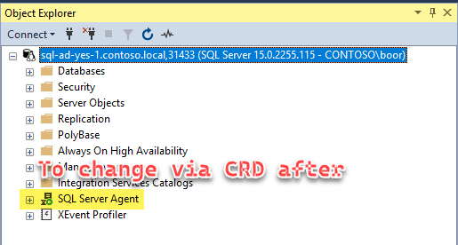
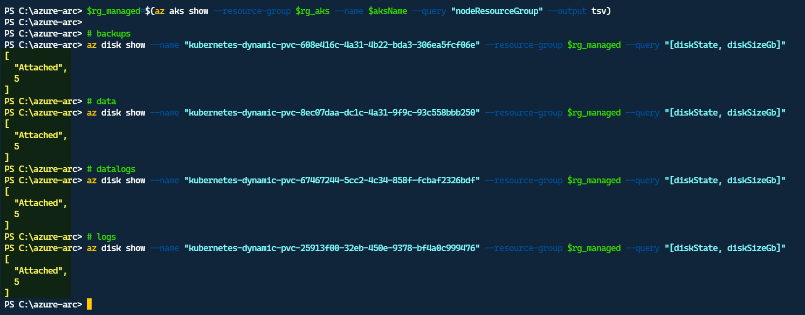
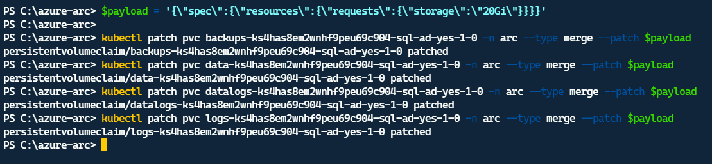
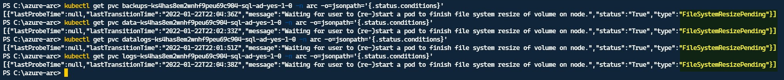
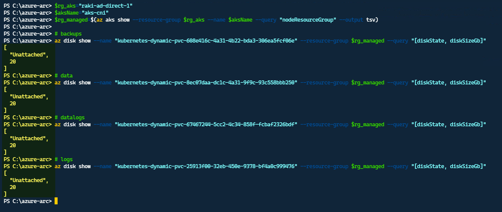
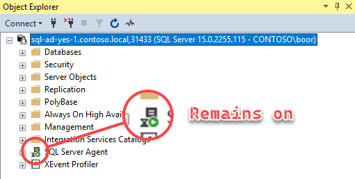
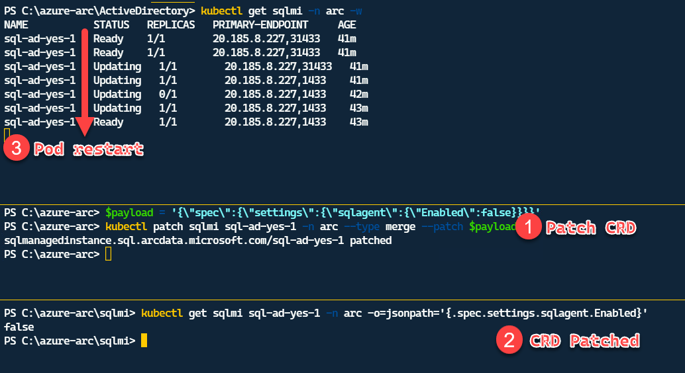

import { Callout } from "../../src/components/atoms.js"
import { ExtLink, InlinePageLink } from "../../src/components/atoms.js"

Kubernetes supports the ability to increase the size of a PVC [see here](https://kubernetes.io/blog/2018/07/12/resizing-persistent-volumes-using-kubernetes/) - this is great!
Kubernetes **_does not_** support the ability to increase the size of a PVC that's attached to a `StatefulSet` [see here](https://github.com/kubernetes/kubernetes/issues/68737) - not so great.

<Callout>

⚠ These techniques/tools are from **exploration only** - for official Microsoft content - please refer to the [Arc Documentation](https://docs.microsoft.com/en-us/azure/azure-arc/data/).

</Callout>

That means if your SQL MI - which is part of a `StatefulSet` - mounted volumes run out of size, or need more size - you need to follow these steps:
1. Scale `StatefulSet` to **1 → 0**
2. Change 4 PVCs from **5Gi → 20Gi**
3. PVC will enter `Resizing` and then show `FileSystemResizePending`
4. Scale `StatefulSet` to **0 → 1**
5. PVC resize completes

<Callout>

💡 This only works if your `StorageClass` supports `AllowVolumeExpansion` = `True` - most major ones do - [see here](https://kubernetes.io/docs/concepts/storage/storage-classes/#allow-volume-expansion)

</Callout>

We start with a **SQL MI GP** that has `5Gi` to begin:



We will also make a change to the CRD after the scaling (switch SQL Server Agent to **Off**) - to make sure Data Controller is continuing to work against the modified `StatefulSet`:



**Get the names of PVCs used by MI**

```powershell
$mi = "sql-ad-yes-1-0"
kubectl get pvc -n arc | grep $mi

NAME                                                 STATUS   VOLUME                                     CAPACITY   ACCESS MODES   STORAGECLASS      AGE
backups-ks4has8em2wnhf9peu69c904-sql-ad-yes-1-0      Bound    pvc-608e416c-4a31-4b22-bda3-306ea5fcf06e   5Gi        RWO            managed-premium   13m
data-ks4has8em2wnhf9peu69c904-sql-ad-yes-1-0         Bound    pvc-8ec07daa-dc1c-4a31-9f9c-93c558bbb250   5Gi        RWO            managed-premium   13m
datalogs-ks4has8em2wnhf9peu69c904-sql-ad-yes-1-0     Bound    pvc-67467244-5cc2-4c34-858f-fcbaf2326bdf   5Gi        RWO            managed-premium   13m
logs-ks4has8em2wnhf9peu69c904-sql-ad-yes-1-0         Bound    pvc-25913f00-32eb-450e-9378-bf4a0c999476   5Gi        RWO            managed-premium   13m
```

**Check Azure disks before scaling**

We can check that the underlying Azure Disks serving the Volume are in `Attached` state:

```powershell
$rg_aks="raki-ad-direct-1"
$aksName="aks-cni"
$rg_managed=$(az aks show --resource-group $rg_aks --name $aksName --query "nodeResourceGroup" --output tsv)

# backups
az disk show --name "kubernetes-dynamic-pvc-608e416c-4a31-4b22-bda3-306ea5fcf06e" --resource-group $rg_managed --query "[diskState, diskSizeGb]"
# data
az disk show --name "kubernetes-dynamic-pvc-8ec07daa-dc1c-4a31-9f9c-93c558bbb250" --resource-group $rg_managed --query "[diskState, diskSizeGb]"
# datalogs
az disk show --name "kubernetes-dynamic-pvc-67467244-5cc2-4c34-858f-fcbaf2326bdf" --resource-group $rg_managed --query "[diskState, diskSizeGb]"
# logs
az disk show --name "kubernetes-dynamic-pvc-25913f00-32eb-450e-9378-bf4a0c999476" --resource-group $rg_managed --query "[diskState, diskSizeGb]"
```



**Scale `StatefulSet` to 1 → 0**

```powershell
kubectl scale statefulsets sql-ad-yes-1 -n arc --replicas=0
```

**Change 4 PVCs from 5Gi → 20Gi**

```powershell
$payload = '{\"spec\":{\"resources\":{\"requests\":{\"storage\":\"20Gi\"}}}}'

kubectl patch pvc backups-ks4has8em2wnhf9peu69c904-sql-ad-yes-1-0 -n arc --type merge --patch $payload
kubectl patch pvc data-ks4has8em2wnhf9peu69c904-sql-ad-yes-1-0 -n arc --type merge --patch $payload
kubectl patch pvc datalogs-ks4has8em2wnhf9peu69c904-sql-ad-yes-1-0 -n arc --type merge --patch $payload
kubectl patch pvc logs-ks4has8em2wnhf9peu69c904-sql-ad-yes-1-0 -n arc --type merge --patch $payload
```



**PVC will enter `Resizing` and then show `FileSystemResizePending`**

```powershell
kubectl get pvc backups-ks4has8em2wnhf9peu69c904-sql-ad-yes-1-0 -n arc -o=jsonpath='{.status.conditions}'
kubectl get pvc data-ks4has8em2wnhf9peu69c904-sql-ad-yes-1-0 -n arc -o=jsonpath='{.status.conditions}'
kubectl get pvc datalogs-ks4has8em2wnhf9peu69c904-sql-ad-yes-1-0 -n arc -o=jsonpath='{.status.conditions}'
kubectl get pvc logs-ks4has8em2wnhf9peu69c904-sql-ad-yes-1-0 -n arc -o=jsonpath='{.status.conditions}'
```



**Observe Azure disks are unattached and scaled up now:**




**Scale `StatefulSet` Up**

```powershell
kubectl scale statefulsets sql-ad-yes-1 -n arc --replicas=1
```

**Verify connectivity**

Once the SQL MI pod comes back up - we’re able to connect once again - and note the SQL Agent remains on:



**Change SQL Agent to off via CRD**

```powershell
$payload = '{\"spec\":{\"settings\":{\"sqlagent\":{\"Enabled\":false}}}}'
kubectl patch sqlmi sql-ad-yes-1 -n arc --type merge --patch $payload

kubectl get sqlmi sql-ad-yes-1 -n arc -o=jsonpath='{.spec.settings.sqlagent.Enabled}'
```

This triggers a restart of the Pod by the Controller:



Which shows that the CRD continues to be functional.