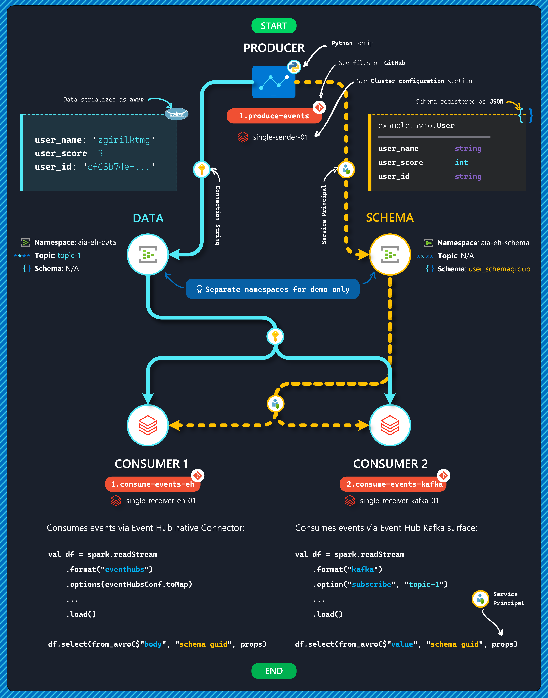
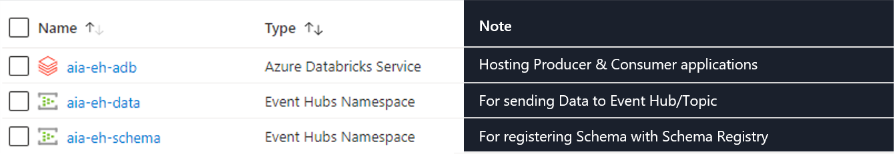
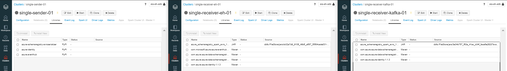
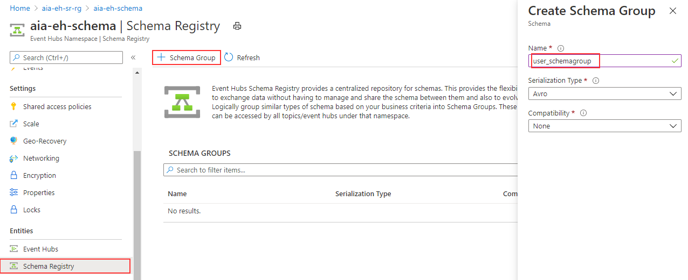
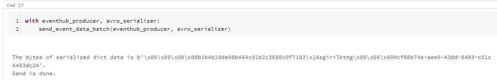
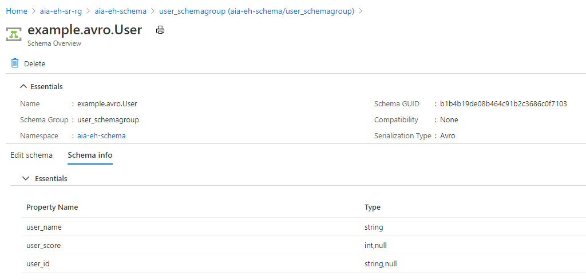
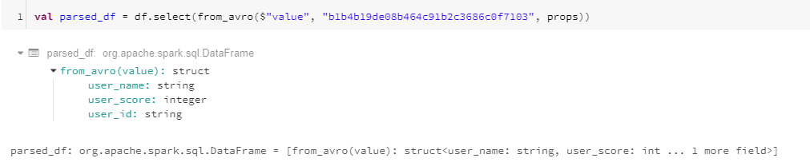

import { Callout } from "../../src/components/atoms.js"
import { ExtLink, InlinePageLink } from "../../src/components/atoms.js"

<Callout>

💡 In this article - we set up an end-to-end event _Producer_ and _Consumer_ pipeline to demonstrate Apache Spark integration with **[Azure Schema Registry](https://docs.microsoft.com/en-us/azure/event-hubs/create-schema-registry)**.

</Callout>

The basic premise behind the need for a **Schema Registry** in a data pipeline is:

> **To define the explicit “contract” - i.e. the Schema - between a Producer and Consumer in a manner that is decoupled from the Data, to enforce Schema Compatibility and enable Schema Evolution.**

**Azure Schema Registry** allows us to achieve this, by enabling _Producer_ and _Consumer_ Applications to exchange data (e.g. with Event Hub & Kafka) without explicitly defining the Schema as part of the Application logic. This not only allows for **_Schema Evolution_**, but also establishes a central governance framework for **_reusable schemas_** across applications.

In simple words, this means we can create Consumer Spark Applications that can deserialize Event Data (e.g. `avro`), without explicitly defining the schema inside the Spark Pipeline. We'll be demonstrating this by leveraging both the [Azure Event Hubs Connector for Apache Spark](https://github.com/Azure/azure-event-hubs-spark), as well as the [Kafka Surface for Event Hub](https://docs.microsoft.com/en-us/azure/event-hubs/apache-kafka-developer-guide).

To read more about Azure Schema Registry - click [here](https://docs.microsoft.com/en-us/azure/event-hubs/schema-registry-overview).

<Callout>

✅ Some key concepts we'll be exploring in this article:

- How to connect a Spark Application to Azure Schema Registry to pull schema definitions (currently supports `JSON` schema for `avro` serialization)
- How to use _seperete_ Event Hub [Namespaces](https://docs.microsoft.com/en-us/azure/event-hubs/event-hubs-features#namespace) for **Schema** and **Data**
  - **Note**: this could easily be in the same Namespace, we are decoupling to demonstrate scalability
- How to use Azure Schema Registry with both the **Event Hub Spark Connector** and **Kafka Surface**

</Callout>

## The Pipeline

The digram below summarizes the end-to-end data pipeline for this article:



<Callout>

📦 All sample notebooks, `jar` file and artifacts used in this article is available on [GitHub](https://github.com/mdrakiburrahman/azure-schemaregistry-spark-poc).

☁️ Also, HTML versions of the three notebooks referenced above are also available for live viewing:

- `1.produce-events`: [link](https://rakirahman.blob.core.windows.net/public/notebooks/azure-schemaregistry-spark-poc/1.produce-events.html)
- `1.consume-events-eh`: [link](https://rakirahman.blob.core.windows.net/public/notebooks/azure-schemaregistry-spark-poc/1.consume-events-eh.html)
- `2.consume-events-kafka`: [link](https://rakirahman.blob.core.windows.net/public/notebooks/azure-schemaregistry-spark-poc/2.consume-events-kafka.html)

</Callout>

The pipeline consists of:

1. **Producer**: Python script `1.produce-events` that generates random events against a schema dictated by the source application (e.g. business logic). It persists event data to the **"Data"** Event Hub (using the [EH Python Library](https://github.com/Azure/azure-sdk-for-python/tree/release/eventhub-v1/sdk/eventhub/azure-eventhubs)) and registers the schema to the **"Schema"** Event Hub (using the [SR Python Library](https://github.com/Azure/azure-sdk-for-python/tree/master/sdk/schemaregistry/azure-schemaregistry-avroserializer)).

   **Note**: This application is not leveraging any Spark components, we simply run this in Databricks for simplicity - this could just as well run as a console application anywhere else.

   At this point, both data and schema are available in Event Hub.

2. **Consumer 1**: Spark application `1.consume-events-eh` that connects to the **"Data"** Event Hub using the native Spark Connector from [Maven](https://mvnrepository.com/artifact/com.microsoft.azure/azure-eventhubs-spark), while connecting to the **"Schema"** Event Hub using the `jar` from below.

3. **Consumer 2**: Spark application `2.consume-events-kafka` that's similar to **Consumer 1**, except it connects to the **"Data"** Event Hub using the Kafka Surface instead - for demonstration purposes.

<Callout>

❗ In other words, Schema Registry is _agnostic_ to whether our Spark Consumers connect via the Native Event Hub connector `spark.readStream.format("eventhubs")` or Kafka connector `spark.readStream.format("kafka")`,
because the deserialization is occuring at the Spark layer with `from_avro($"...)` _after_ the DataFrame is established from either connectors.

</Callout>

## Compiling `jar` with Maven

At the time of writing, the `azure-schemaregistry-spark` library is a **work-in-progress beta**, the project code from [here](https://github.com/arerlend/azure-schemaregistry-spark) can be compiled into a `jar` using maven:

```bash
mvn clean compile assembly:single
```

Like so:


Pre-compiled jar `azure-schemaregistry-spark-avro-1.0.0-beta.5-jar-with-dependencies.jar` available in [GitHub](https://github.com/mdrakiburrahman/azure-schemaregistry-spark-poc) as well.

<Callout>

❗ Once the package is available in the official [repo](https://github.com/Azure/azure-schema-registry-for-kafka#implementations) or [maven](https://mvnrepository.com/artifact/com.azure), please use that instead. The implementation principles here should largely carry over.

</Callout>

## Pre-Requisites & Environment Setup

### App Registration/Service Principal

Create a Service Principal, and make note of:

- `clientId`
- `tenantId`
- `clientSecret`

To register a resource provider, view step-by-step guide [here](https://docs.microsoft.com/en-us/azure/active-directory/develop/howto-create-service-principal-portal#register-an-application-with-azure-ad-and-create-a-service-principal).

### Deploy Azure Resources

Here are the Azure services we need to deploy. Any configuration changes besides the default configurations are highlighted below as well.



All resources are deployed with default settings.

### Configure Azure Resources

#### Assign Service Principal permissions

Assign the Service Principal the `Schema Registry Contributor (Preview)` role on the Event Hub Namespace hosting the Schema Registry.

#### Cluster Setup on Databricks

We create 3 **single-node** Clusters under Databricks `7.4 (Apache Spark 3.0.1, Scala 2.12, Python 3)` runtime:

1. **single-sender-01**: for sending data to Event Hub with `1.produce-events.py`
2. **single-receiver-eh-01**: for consuming data from Event Hub native connector with `1.consume-events-eh.scala`
3. **single-receiver-kafka-01**: for consuming data from Event Hub Kafka Surface with `2.consume-events-kafka.scala`

The table below captures the libraries installed on each Cluster:

|                       C1 | C2                                                      | C3         |
| -----------------------: | ------------------------------------------------------- | ---------- |
|         **Cluster Name** | **Library**                                             | **Source** |
|         single-sender-01 | `azure-schemaregistry-avroserializer`                   | PyPi       |
|                          | `azure-identity`                                        | PyPi       |
|                          | `azure.eventhub`                                        | PyPi       |
|    single-receiver-eh-01 | `com.microsoft.azure:azure-eventhubs-spark_2.12:2.3.17` | Maven      |
|                          | `com.azure:azure-data-schemaregistry:1.0.0-beta.4`      | Maven      |
|                          | `com.azure:azure-data-schemaregistry-avro:1.0.0-beta.4` | Maven      |
|                          | `com.azure:azure-identity:1.1.3`                        | Maven      |
|                          | `azure_schemaregistry_spark_avro_1_0_0_beta_5....jar`   | Jar        |
| single-receiver-kafka-01 | `com.azure:azure-data-schemaregistry:1.0.0-beta.4`      | Maven      |
|                          | `com.azure:azure-data-schemaregistry-avro:1.0.0-beta.4` | Maven      |
|                          | `com.azure:azure-identity:1.1.3`                        | Maven      |
|                          | `azure_schemaregistry_spark_avro_1_0_0_beta_5....jar`   | Jar        |



#### Schema Group setup

We create a Schema Group `user_schemagroup`:



### Pipeline Walkthrough

#### Producer

Our Pipeline starts with the `1.produce-events` Python application that writes randomly generated, schema-enforced data to the Event Hub.

The following schema is registered with Schema Registry:

```json
{
  "namespace": "example.avro",
  "type": "record",
  "name": "User",
  "fields": [
    { "name": "user_name", "type": "string" },
    { "name": "user_score", "type": ["int", "null"] },
    { "name": "user_id", "type": ["string", "null"] }
  ]
}
```

The application commits the transaction data to Event Hub at the end:

```python
with eventhub_producer, avro_serializer:
    send_event_data_batch(eventhub_producer, avro_serializer)
```

And the following confirmation message is seen after each transaction is sent:


We also see the registered schema in Schema Registry:


#### Consumer(s)

Now on the Consumer side, we begin both pipelines by first defining the property object `props` containing our Schema Registry endpoint and Service Principal information - for authenticating with Schema Registry:

```scala
val props: HashMap[String, String] = new HashMap()
  props.put("schema.registry.url", "http://<your-event-hub>.servicebus.windows.net")
  props.put("schema.registry.tenant.id", "<your-azure-ad-tenant-id>")
  props.put("schema.registry.client.id", "<your-client-id>")
  props.put("schema.registry.client.secret", "<your-client-secret>")
```

For **Consumer 1** we initiate the Spark Dataframe using the Event Hub configuration:

```scala
val connectionString = ConnectionStringBuilder("Endpoint=sb://<your-event-hub>.servicebus.windows.net/;SharedAccessKeyName=<name>;SharedAccessKey=<your-access-key>;EntityPath=<your-topic>")
  .setEventHubName("<your-topic>")
  .build

val eventHubsConf = EventHubsConf(connectionString)
  .setStartingPosition(EventPosition.fromStartOfStream)

val df = spark.readStream
  .format("eventhubs")
  .options(eventHubsConf.toMap)
  .load()
```

And for **Consumer 2** we leverage standard Kafka syntax:

```scala
val df = spark.readStream
    .format("kafka")
    .option("subscribe", TOPIC)
    .option("kafka.bootstrap.servers", BOOTSTRAP_SERVERS)
    .option("kafka.sasl.mechanism", "PLAIN")
    .option("kafka.security.protocol", "SASL_SSL")
    .option("kafka.sasl.jaas.config", EH_SASL)
    .option("kafka.request.timeout.ms", "60000")
    .option("kafka.session.timeout.ms", "60000")
    .option("failOnDataLoss", "false")
    .option("startingOffsets", "earliest")
    .load()
```

In both cases, this defines our connection to the **Data** Event Hub, as the Dataframe `df`.

Once that's done, we deserialize `avro` data from the Event Hub using the `from_avro()` function, connecting to our Schema Registry via the `props` object we defined earlier:

```scala
// Event Hub
val parsed_df = df.select(from_avro($"body", "<your-schema-guid>", props))

// Kafka
val parsed_df = df.select(from_avro($"value", "<your-schema-guid>", props))
```

Spark is able to immediately pull in the schema from Schema Registry and define the Dataframe schema:



And we can display our streaming data using the Databricks `display(df)` command.

We demonstrate both **Consumer 1** (left) and **Consumer 2** (right) here side by side, while generating events with our **Producer** application (not shown):


### Wrap Up

We explored the convenience and robustness of using Azure Schema Registry in data pipelines, and the flexibility of being able to leverage both the Event Hub native connector and Kafka surface in a Spark application using the `from_avro()` function for deserializing messages.
