import { Callout } from "../../src/components/atoms.js"

To prove that the header isn't clickbait - here's what we're going to build:

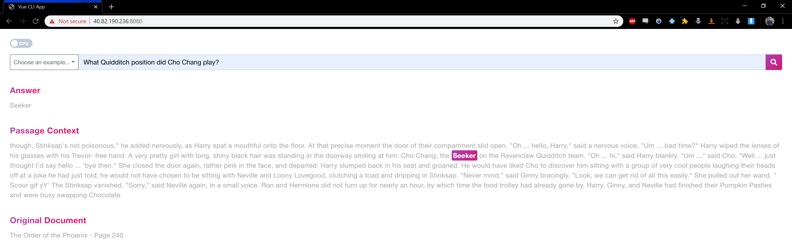

In this article, we walk through this use-case:

<Callout>

_Building a BERT-powered Natural Language Processing model, trained on Harry Potter books to answer context-specific questions, served in a containerized web-app._

</Callout>

## Context

As a part of my most recent project, I had an absolute blast learning about applying NLP - or [Natural Language Processing](https://becominghuman.ai/a-simple-introduction-to-natural-language-processing-ea66a1747b32) - for insight extraction from unstructured data.
Sprint-to-sprint, we threw every NLP processing technique under the sun at our data during this engagement, using [Azure Databricks](https://azure.microsoft.com/en-ca/services/databricks/) as the primary processing engine and leveraging it's ability to use industry grade open-source NLP libraries
such as [spaCy](https://spacy.io/), [TensorFlow](https://www.tensorflow.org/hub), [gensim](https://radimrehurek.com/gensim/), [NLTK](https://www.nltk.org/), ... (the list goes on and on) and my personal favorite - [BERT](https://arxiv.org/abs/1810.04805).

I wanted to take the techniques I learned with BERT in this engagement and apply it on a small side-project in a domain I deeply cared about growing up - _Harry Potter_. By the end of this article, I'll leave you with:

- **An appreciation of BERT**, and how it revolutionized Natural Language Processing that affects our lives every day (Google Searches)
- **How to use the [CDQA suite](https://cdqa-suite.github.io/cdQA-website/)** - an amazing open-source framework running BERT under the hood
- **[A Databricks transformation pipeline](https://rakirahman.blob.core.windows.net/public/notebooks/HP-corpus-transformation-text-to-csv.html)** to use BERT on any text-based dataset (in this case Harry Potter books)
- **A demo of the model** in action while answering Harry Potter trivia questions
- **Docker packages and Azure ARM-template** based deployment code in [Github](https://github.com/mdrakiburrahman/bert-app-harry-potter) for you to deploy the BERT web app in your own Azure environment

## Use case - cutting edge Natural Language Processing on your data

The idea is, if it works on the Harry Potter books, it'll probably work on your ([multilingual](https://github.com/google-research/bert/blob/master/multilingual.md)) data. Since all the components used are scalable, the pipeline demonstrated here can be easily extrapolated into a larger, enterprise-scale implementation, that does the following:

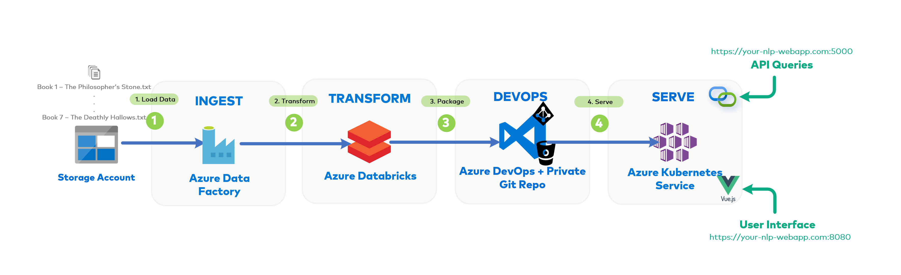

1. Ingest your unstructured data into Cloud Storage/Data Lake using [**Azure Data Factory**](https://azure.microsoft.com/en-ca/services/data-factory/) for Source-Destination transfer
2. Transform your data and prep it into a format to be "NLP ready" using [Azure Databricks](https://azure.microsoft.com/en-ca/services/databricks/)
3. Package the data, BERT model API and front-end engine (in this case it's a [Vue.js](https://vuejs.org/) app) in a self-enclosed [Docker container](https://www.docker.com/resources/what-container), to be deployed into [Azure Container Instances](https://azure.microsoft.com/en-ca/services/container-instances/) (DEV environment - like this demo) or [Azure Kubernetes Service](https://azure.microsoft.com/en-ca/services/kubernetes-service/) (PROD environment)
4. Use the deployed Web App as a User-Interface tool to interact with BERT, or expose the trained BERT API to orchestrate automated insight extraction as part of some larger workflow (i.e. automating the part where you ask questions on the UI, as part of some larger scheduled pipeline)

## The secret sauce - `BERT`

You might have noticed that around 2018, Google became _really_ good at understanding your searches (everything from auto-fill, top results, recommendations etc).
Google owes this success primarily to an NLP tool it developed and trained called "`BERT` - `B`idirectional `E`ncoder `R`epresentations from `T`ransformers" (also the children's character from Sesame Street).


<Callout>

💡 [This article](https://www.kaggle.com/abhinand05/bert-for-humans-tutorial-baseline) does an amazing job explaining how BERT works under the hood.

</Callout>

### BERT simplified - _Why Google Search is so good_

While Google's web-crawling capabilities (used for populating the actual search results) has always been top notch, pre-2018 NLP tools couldn't do something critical - something that humans are really good at doing - **bidirectional context inference**.

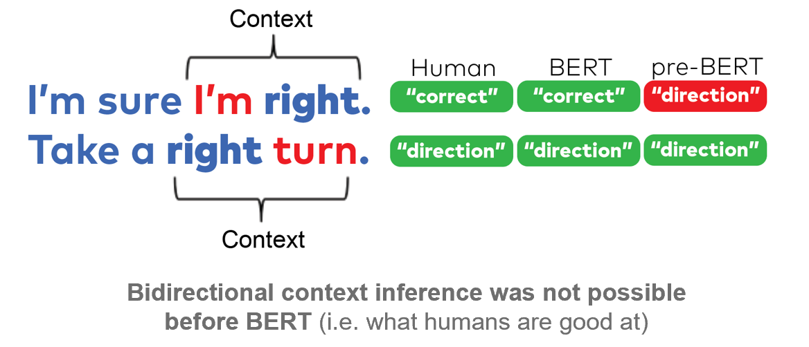

Before BERT, previous NLP models would have interpreted the word `right` in the sentence above as "direction" in both cases, without understanding the fact that the word `I'm` and `turn` in both directions completely changes the meaning of the actual word.
This is because, as the name suggests, NLP models before (like [**OpenAI GPT**](https://openai.com/blog/better-language-models/) - BERT's predecessor) were largely **unidirectional**, meaning it could infer context only in **one-direction** (reading a sentence left-to-right once without having the ability to go back and refine it's understanding based on the subtle context building up).

<Callout>

👶🏼 **Pre-BERT**: A good analogy here would be how a human baby just learning to talk struggles to understand why the word `right` would mean totally different things in both sentences.

</Callout>

To tackle this, Google built out BERT's Transformer-based Architecture, pre-trained BERT on **3.3 Billion words** (Wikipedia + Books) over the years, before releasing it as an [open source tool](https://github.com/google-research/bert) for the rest of the world to use. BERT can also be trained on Industry-Specific Data (like regulatory data etc) to pick up on specific context/nuances.

<Callout>

🤓 **BERT**: Imagine that the same baby now read **_3.3 Billion Words_** across Wikipedia Articles and Books. Now that you give it 7 measly Harry Potter books, it'll read them quickly and answer your questions no problem.

</Callout>

[This article](https://www.blog.google/products/search/search-language-understanding-bert/) does a fantastic job explaining exactly how Google uses BERT today to understand your searches better than ever. Here's a final example to drive the point home:

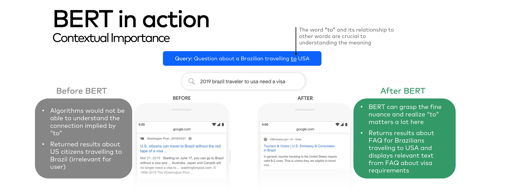

### Shout Out: `CDQA`

I heavily relied on CDQA for this POC. To oversimplify, the team at CDQA took BERT, created an API layer around it, built OCR capabilities to scan PDFs, and built a front-end that integrates with the API to create a **`C`losed `D`omain `Q`uestion `A`nswering System**, agnostic to the data source.

I basically took their code, transformed the Harry Potter books with Databricks, found a way to Dockerize it (through extensive Googling and learning Vue.js) and served it in Azure Containers.

<Callout>

💡 That being said, containerizing a Vue.js + BootstrapVue app and Flask API wrapper around a scikit-learn model was **_definitely_** a learning experience!

</Callout>

I'd highly recommend checking out the [CDQA site](https://cdqa-suite.github.io/cdQA-website/) and [GitHub](https://github.com/cdqa-suite/cdQA) to better understand the full capabilities of this amazing open-source tool:

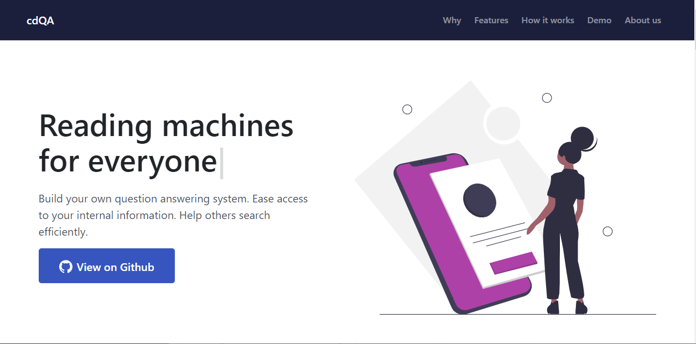

## Q/A Test: Verdict

When the questions are decently worded, the deployed model is actually fairly good at answering most of the questions I threw at it from several Harry Potter trivia sites.

Here's a few illustrated:

### Question 1: Where is Azkaban fortress located?

<Callout>

🤖: `The North Sea (The Prisoner of Azkaban - Page 208)`

</Callout>

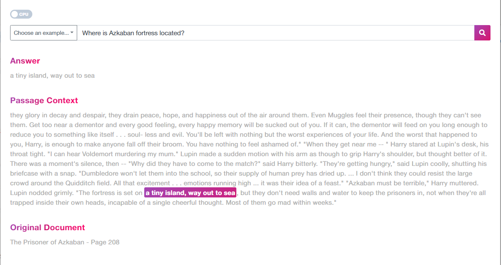

### Question 2: What is the name of Harry's pet owl?

<Callout>

🤖: `Hedwig (The Prisoner of Azkaban - Page 62)`

</Callout>

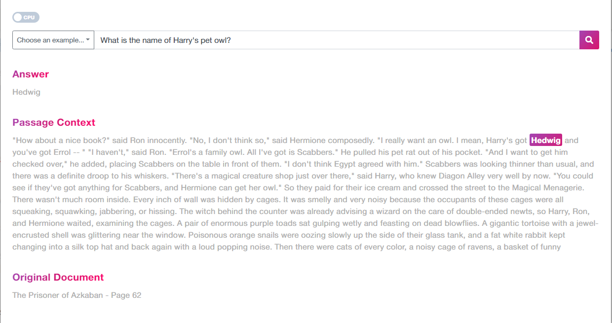

### Question 3: What is the name of Argus Filch's pet cat?

<Callout>

🤖: `Mrs. Norris (The Chamber of Secrets - Page 138)`

</Callout>

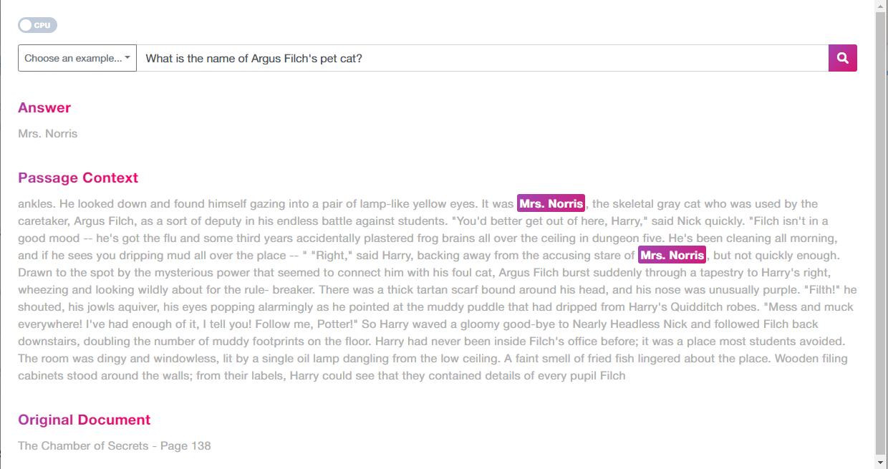

### Question 4: What school did Viktor Krum go to?

<Callout>

🤖: `Durmstrang Institute (The Goblet of Fire - Page 295)`

</Callout>

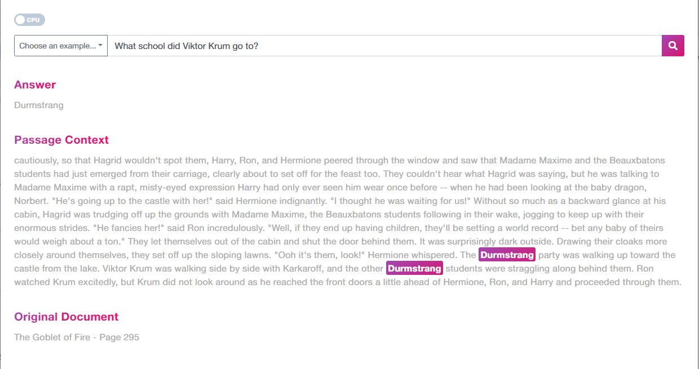

### Question 5: What is Hagrid's mother's name?

<Callout>

🤖: `Fridwulfa (The Goblet of Fire - Page 484)`

</Callout>

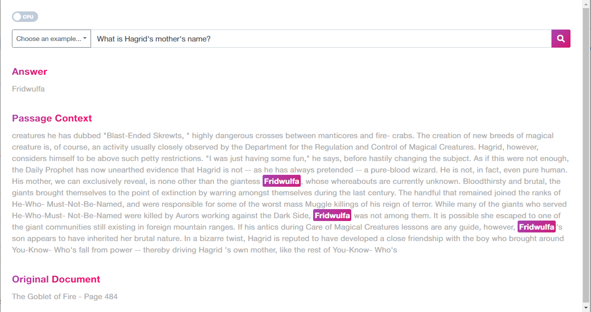

Despite having read the series over multiple times, I didn't remember that last one!

Let's throw the model a curveball.

### Question 6: What is Ginny Weasley's actual first name?

The Answer is **Ginevra** - but BERT returns:

<Callout>

🤖: `Ron's Younger Sister (The Philosopher's Stone - Page 346)`

</Callout>

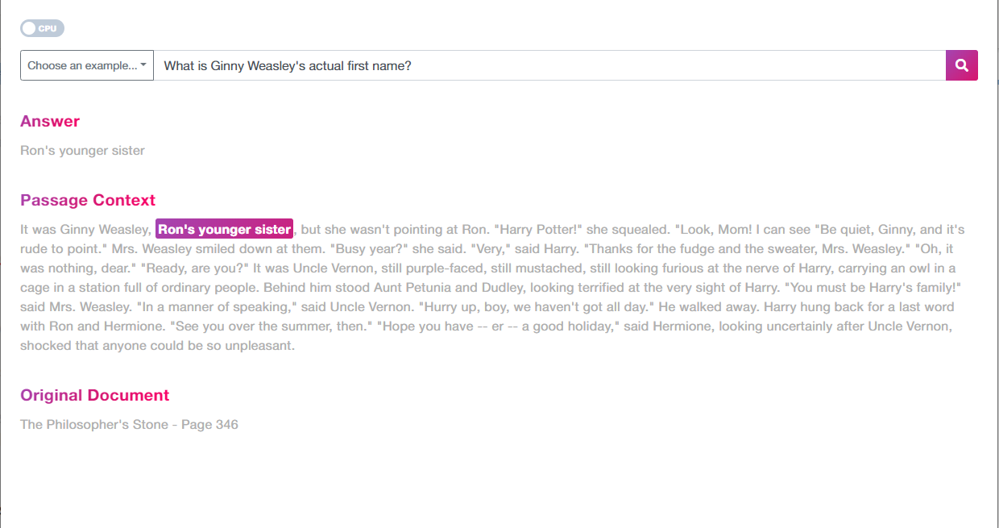

It seems that the model isn't able to pick up on the fine nuance that Ginny's **true** first name is mentioned in the book somewhere obscure without explicit reference (something like `"Ginny is short for Ginevra", said Molly` would have been a breeze for BERT to pick up), and returns a synonym for Ginny instead (i.e. _technically_ it's true that she's indeed Ron's younger sister).

Kudos to Google for crushing it though (although one can argue that our BERT model doesn't have access to the FAQ site Google's BERT implementation found this answer on):

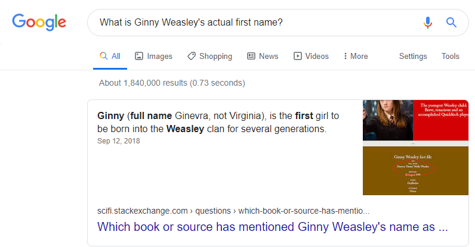

When we ask it the straightforward question `"Who is Ginevra?"`, it's quick to return a hilarious answer from the time when Harry visits Luna's dad:

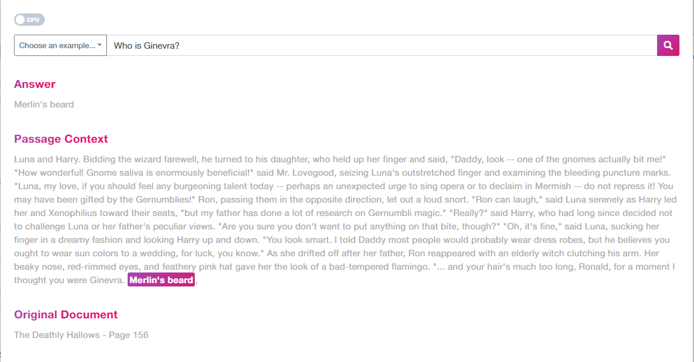

## API calls for enterprise-style automation

As mentioned in the flow diagram above, we can make calls against the model API as well for automation capabilities; i.e. _asking the model the same questions/new questions as new data flows in for daily insight extraction as part of a business need._

Notice how the front-end is actually making `GET` API calls every time we search:

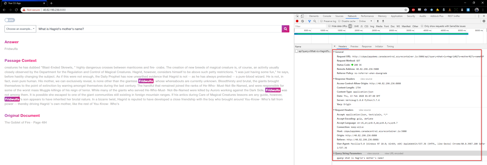

We can make the same call using [Postman](https://www.postman.com/), or any other tool as well:

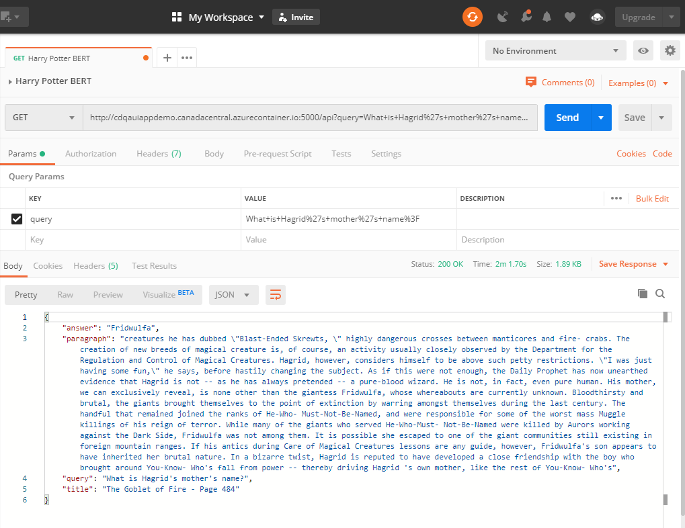

## How to deploy

Because the app is containerized (i.e. all the dependencies etc are built into the container), deploying it is the easiest part! All the code used is available in my [**Github repository**](https://github.com/mdrakiburrahman/bert-app-harry-potter):

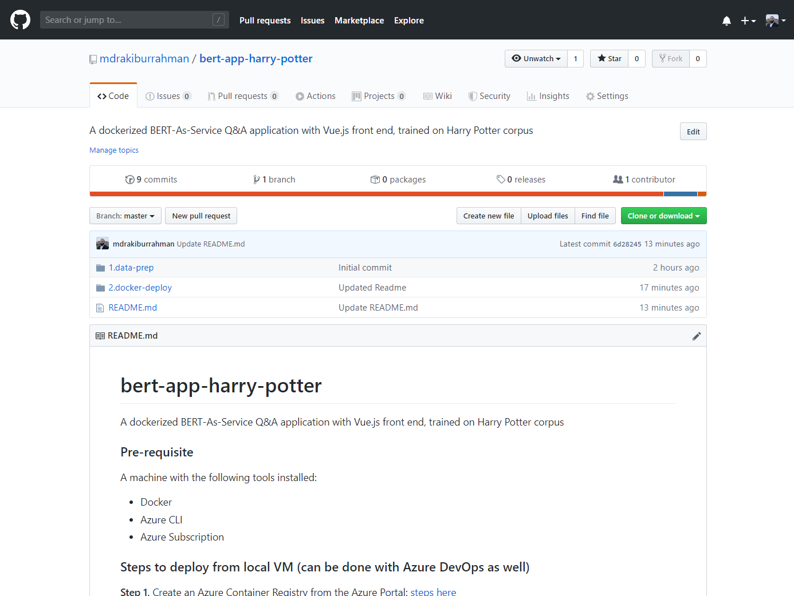

### Step 1

Create an Azure Container Registry from the Azure Portal: [steps here](https://docs.microsoft.com/en-us/azure/container-registry/container-registry-get-started-portal)

This is where we'll push our containers to.

### Step 2

Clone the [Git Repo](https://github.com/mdrakiburrahman/bert-app-harry-potter) into the machine's local.

### Step 3

Build the containers using the following docker commands (cd into the respective directories in `2.docker-deploy`):

```bash
docker build -t dockerize-cdqa-ui-test .
docker build -t dockerize-cdqa-api-test .
```

<Callout>

This will build the two containers on your local Docker Registry.:

📦 `api`: BERT model as a Flask API

📦 `ui`: Vue.js front end web app

</Callout>

### Step 4

Run the following commands to push the containers to your Azure Container Registry (from _Step 1_), and deploy the Containers into a Container Group:

```bash
az login
az account set --subscription "Your--Subscription--Name"


docker tag dockerize-cdqa-ui-test yourazurecontainerregistry.azurecr.io/cdqa-ui
docker tag dockerize-cdqa-api-test yourazurecontainerregistry.azurecr.io/cdqa-api

az acr login --name YourAzureContainerRegistry


docker push yourazurecontainerregistry.azurecr.io/cdqa-ui
docker push yourazurecontainerregistry.azurecr.io/cdqa-api


az group deployment create --resource-group HP-POC-CDQA-Docker --template-file azuredeploy.json
```

Note that `azuredeploy.json` is the ARM template that contains the Container Group configuration (i.e. the brains behind the Azure deployment).

Once the deployment is completed, you'll be able to browse to the UI from the Public IP address populated in Azure:

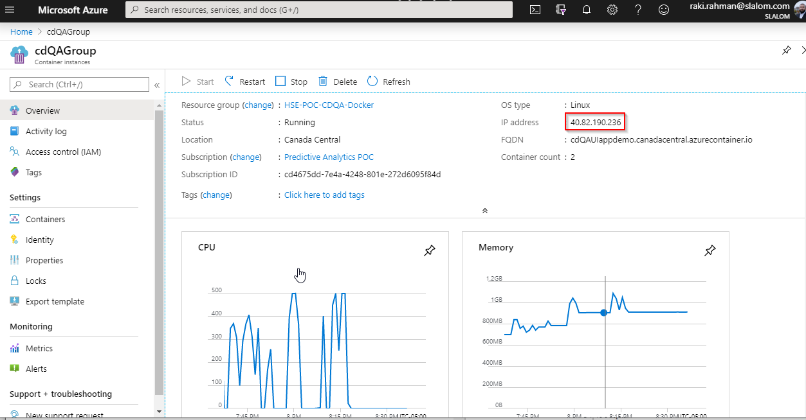

And adding `:8080` (the port exposed on the Container for accessing the UI):

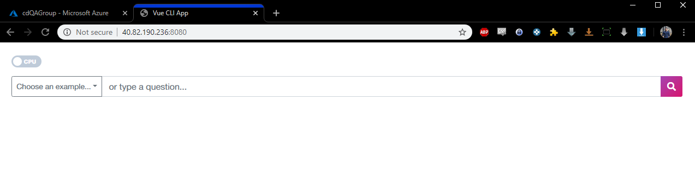

## In Conclusion

Hopefully through this fun example, I was able to demonstrate how easy it is to leverage the power of BERT, and Natural Language Processing as a whole in pulling out valuable context specific information from any text-based data - a feat that would have been impossible just a couple years back.

Having the ability to integrate this tool with an enterprise-scaled Data Pipeline running on Azure Databricks, and using the capabilities of Vue.js (and other similar frameworks) to create an elegant User-Interface makes BERT on Azure Containers an easily operationalized, scalable and effective tool that can pay big dividends if utilized correctly.
