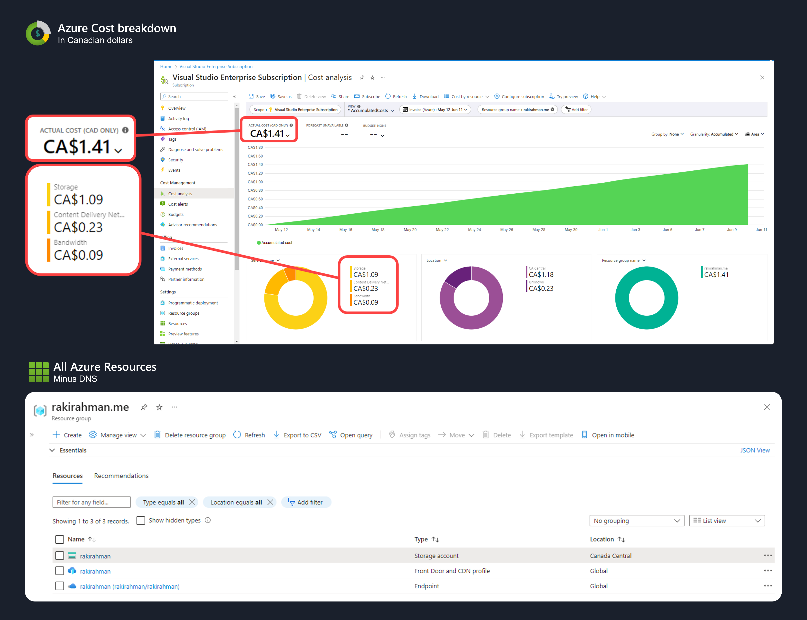
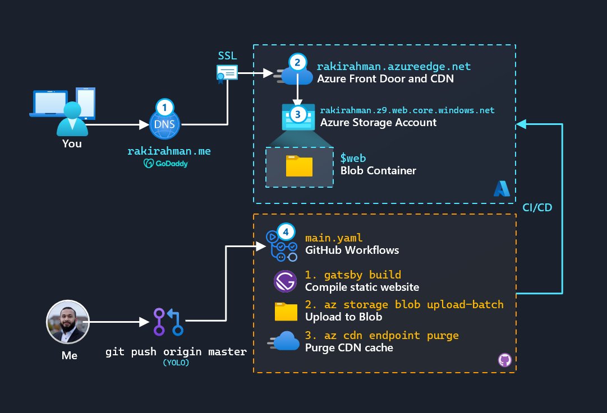
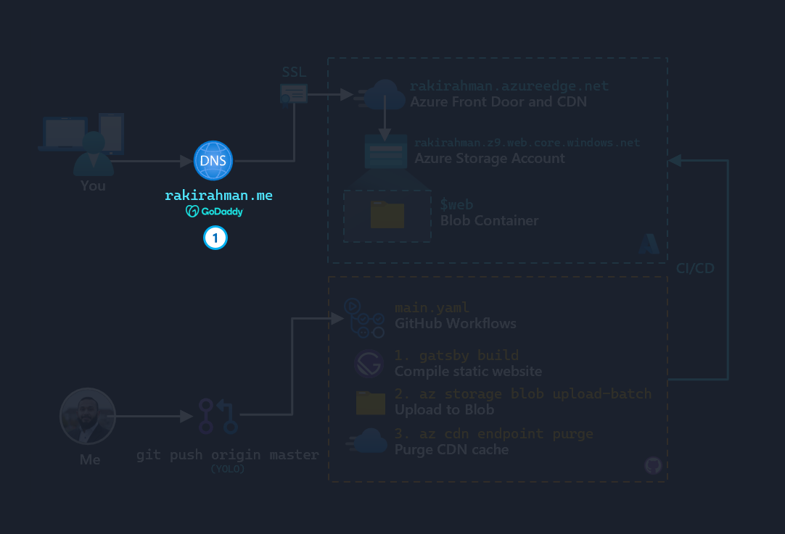
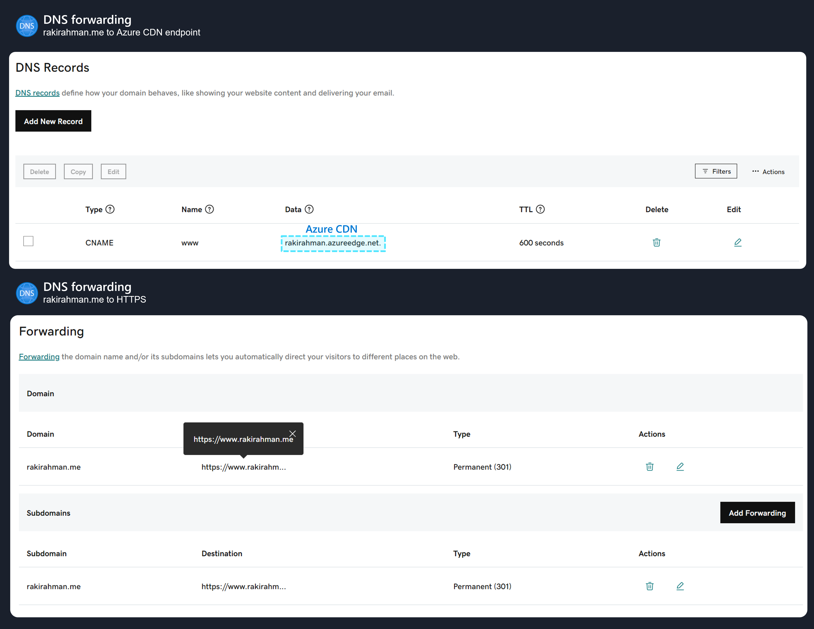
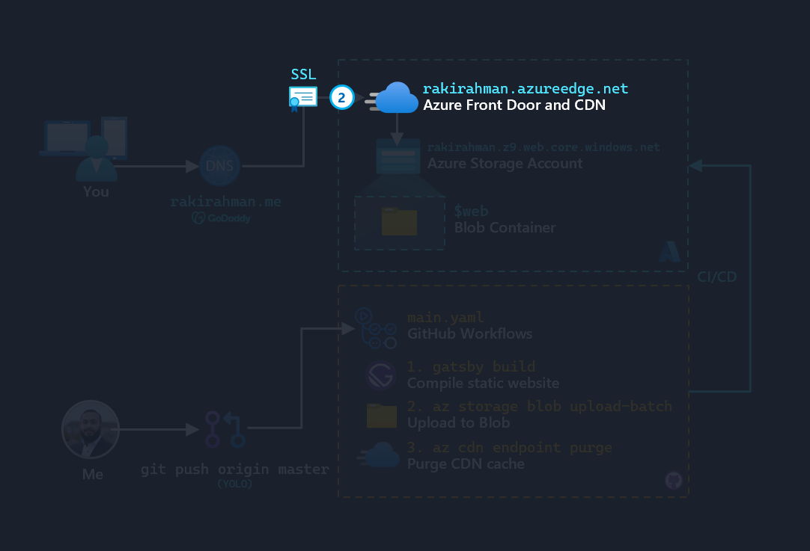
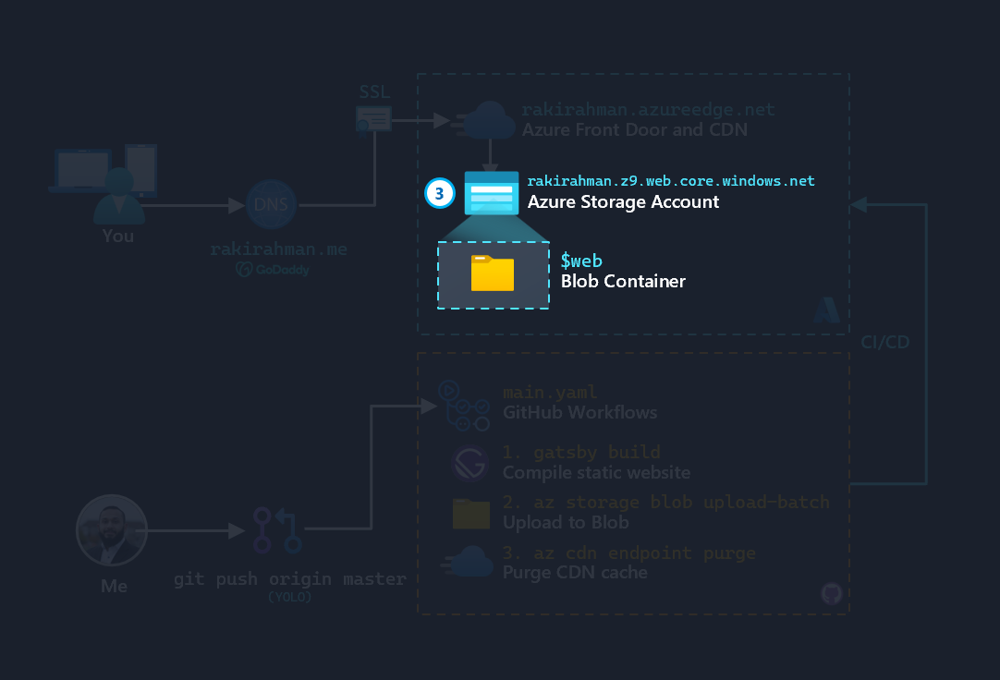
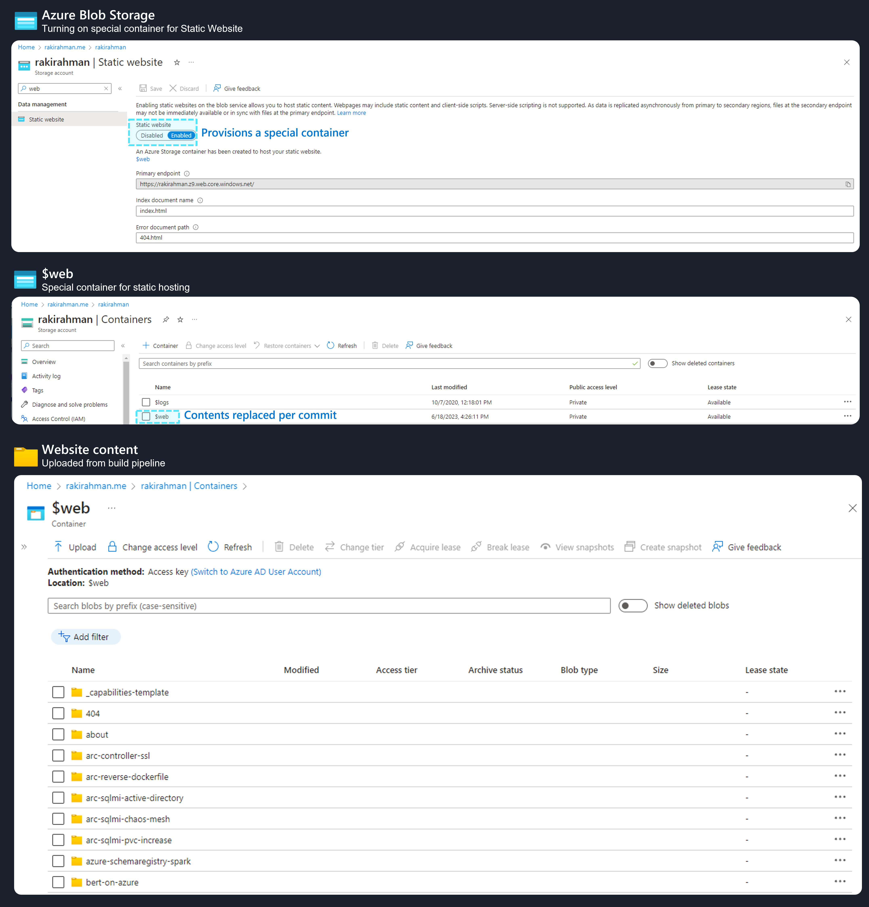
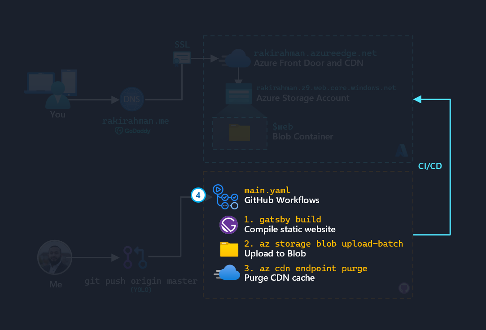
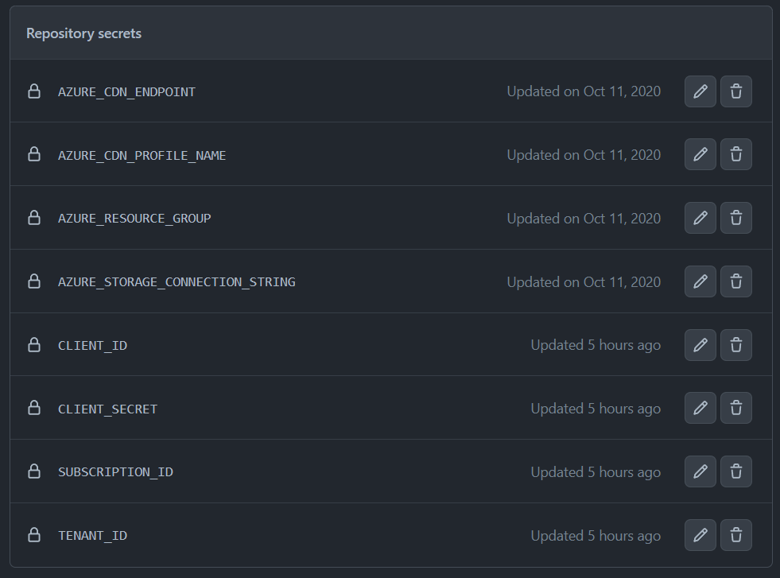
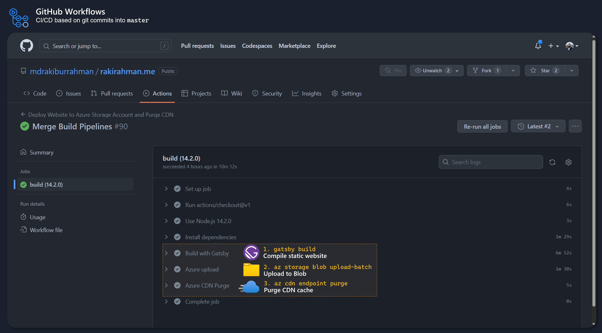

import { Callout } from "../../src/components/atoms.js"
import { ExtLink, InlinePageLink } from "../../src/components/atoms.js"

Recently, my Visual Studio Enterprise subscription I received when I joined Microsoft expired after almost 3 years, so I was forced to convert it into a Pay-As-You-Go Subscription with a Credit Card. The expired subscription also took my website down for a couple of days, so I thought it'd be a good idea to document the setup in case of future calamities.

Going forward - this website will now set me back about $1.50/month on average, so about half the cost of a Tim Horton's coffee:



If you deploy the 3 Azure Resources above, you should be able to follow the rest of this article to get an identical website up and running - if you run into any problems, please feel free to open an [issue here](https://github.com/mdrakiburrahman/rakirahman.me/issues/new) and I'll update this article with more details!

<Callout>

📝 This site is built with [Gatsby](https://www.gatsbyjs.com/), which lets you author pages via markdown. Gatsby produces static pages that are blazing fast.

</Callout>


Here's the architecture for the website:



1. **Domain/DNS**: From [GoDaddy](https://www.godaddy.com/), this is the only piece that's not Azure hosted. The reason I went with GoDaddy is because Azure DNS doesn't offer `*.me` domains.

2. **[Azure CDN](https://learn.microsoft.com/en-us/azure/frontdoor/)**: Basically, this solves the problem of SSL termination by offering a managed certificate from Microsoft.

3. **[Azure Storage Account - Static Website](https://learn.microsoft.com/en-us/azure/storage/blobs/storage-blob-static-website)**: A small container where you can periodically publish static HTML content without breaking the bank.

4. **[GitHub Actions](https://github.com/features/actions)**: Azure DevOps' cooler cousin, this converts Git Commit into HTML files.

Let's break down the configuration for each of the 4 components. Instead of wordy paragraphs, I thought it'd be more useful to share screenshots and links to relevant docs that will provide more details.

## DNS - GoDaddy.com



The DNS setup is straightforward, once the Azure CDN is deployed and we receive an FQDN, it's a straightforward `CNAME` forward. The only tricky piece was force forwarding all traffic, e.g. `rakirahman.me` or `www.rakirahman.me` to all end up at `https://www.rakirahman.me`, settings for this is in the 2nd screenshot.



## Azure CDN



This is probably the most important component, and the part that took the longest to set up (besides building the actual website). The settings below show how to setup the managed HTTPS cert, along with forwarding traffic from HTTP to HTTPS (this was tricky because it's not well documented/screenshotted).

<Callout>

📝 [Here's a gist](https://gist.github.com/mdrakiburrahman/3c30a2a601372ce68c2821dfdbcff214) of the JSON representation of the Azure CDN, extracted from Azure Portal - this captures everything the screenshots show.

</Callout>


## Storage Account



Once the Storage Account is provisioned, the [steps here](https://learn.microsoft.com/en-us/azure/storage/blobs/storage-blob-static-website#setting-up-a-static-website) can be used to turn on the Static Web Hosting container - `$web`.

<Callout>

📝 Note that the Storage Account name can be anything, not necessarily your website's domain name, we can configure the origin backend via Azure CDN - see above.

</Callout>



## Github workflows



Basically, every time I push something to the `master` branch, GitHub workflows spins up a Linux machine that deploys the website to Azure.

<Callout>

🚀 Sample run: [link](https://github.com/mdrakiburrahman/rakirahman.me/actions/runs/5305765546/jobs/9603046303) and YAML definition: [link](https://github.com/mdrakiburrahman/rakirahman.me/blob/master/.github/workflows/main.yml)

</Callout>

These are the secrets you need [configured in GitHub](https://docs.github.com/en/rest/actions/secrets?apiVersion=2022-11-28):



To connect to the Storage Account to upload fresh content, we use a good old Connection String.
The Service Principal is required to purge the CDN endpoint cache, every time we deploy new content.

To create a Service Principal with least privilege for this pipeline, run:

```bash
az ad sp create-for-rbac -n "your-spn" --role "CDN Endpoint Contributor" --sdk-auth --scopes /subscriptions/.../resourceGroups/rakirahman.me
```

This will return the Service Principal credentials, that has the minimum-required permissions applied at the Resource Group level.

Take the output of the command above, and store each value as a separate secret in Github:

```json
{
  "clientId": "...",                // CLIENT_ID
  "clientSecret": "...",            // CLIENT_SECRET
  "subscriptionId": "...",          // SUBSCRIPTION_ID
  "tenantId": "...",                // TENANT_ID
  ...
}
```

The other 4 secrets are self-explanatory resource names (refer to the YAML definition).

Once that's done, every commit to `master` will kick off the CICD pipeline:



That's it!