import { Callout } from "../../src/components/atoms.js"
import { ExtLink, InlinePageLink } from "../../src/components/atoms.js"

<Callout>

💡 In this article - we set up an end-to-end real-time data ingestion pipeline from Braze Currents to **Azure Synapse**, leveraging **Databricks Autoloader**.

</Callout>

If you've never heard of [Braze](https://www.braze.com/product) before, it's basically the [Customer Engagement System](https://en.wikipedia.org/wiki/Customer_engagement) that enables Mobile Apps like [Headspace](https://www.headspace.com/) to send timely (and thoughtful) push notifications like this:


Each end-user is identified by a unique `braze_id` - against which Braze collects data as part of their app [SDK](https://www.braze.com/docs/developer_guide/platform_integration_guides/android/initial_sdk_setup/android_sdk_integration/). So for example, if you go over to Headspace - you can see your unique **Braze ID**:

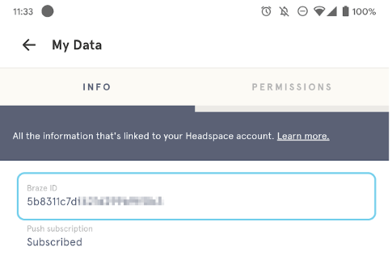

For more information on how Braze manages it's User Lifecycle, check out this [article](https://www.braze.com/docs/user_guide/data_and_analytics/user_data_collection/user_profile_lifecycle/).

## Ingesting Currents data in real-time

Once data is ingested into their system via the SDK, Braze allows us to export data in real-time using an integration system called "[Currents](https://www.braze.com/docs/user_guide/data_and_analytics/braze_currents/)" (that actually runs [Kafka](https://www.youtube.com/watch?v=1DpET624Qro) under the hood). Essentially, Braze leverages Kafka Connect to serialize real-time Customer Engagement Events into `.avro` format, and drops those files in real-time into [Azure Storage](https://www.braze.com/docs/partners/data_and_infrastructure_agility/cloud_storage/microsoft_azure_blob_storage_for_currents/?redirected=true) as a managed connection.

This becomes our entry point for analytics on Azure.

<Callout>

📦 All sample data files, scripts and artifacts used in this article is available on [GitHub](https://github.com/mdrakiburrahman/braze-poc).

</Callout>

That's all the context we need on Braze for now - let's dive into the data side of things.

## How Braze Uses Currents + Azure Pipeline

Braze recommends a 4 step process on their [website](https://www.braze.com/docs/user_guide/data_and_analytics/braze_currents/how_braze_uses_currents/) on how to ingest Currents Data:

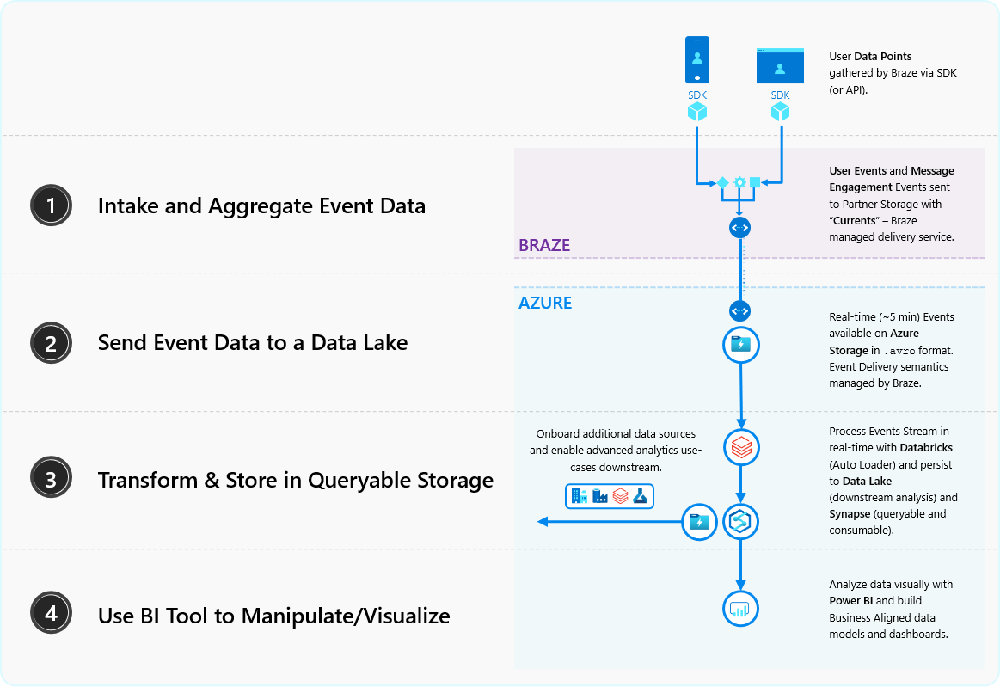

This is the blueprint we'll follow:

### Step 1: Intake and Aggregate Event Data

Although we don't have access to a live Braze environment, thankfully, Braze has made their sample data available on their [GitHub](https://github.com/Appboy/currents-examples/tree/master/sample-data/Avro).

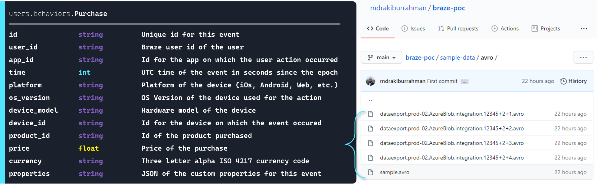

Above, I've taken the schema for `Purchase` table, and created **17** Unique Purchase Events spread across **4** `.avro` files that we can use to simulate Currents.

### Step 2: Send Event Data to a Data Lake

We're going to be dropping these `.avro` files into Azure Storage to simulate the Currents integration according to the [Braze's delivery semantics](https://www.braze.com/docs/user_guide/data_and_analytics/braze_currents/event_delivery_semantics/):


We will be dropping these files manually via Storage Explorer to simulate the Braze drops (which happen **Every 5 minutes** or **Every 15,000 events** - whichever comes first).

### Step 3: Transform & Store in Queryable Storage

We will be ingesting this data using Databricks [Autoloader](https://docs.microsoft.com/en-us/azure/databricks/spark/latest/structured-streaming/auto-loader), transforming on-the-fly on a Spark Dataframe, and storing it in Delta Tables and Synapse.

### Step 4: Use BI Tool to Manipulate/Visualize

Once the data is in Synapse, we can easily point Power BI to it and spin up a dashboard.

## Pre-Requisites & Environment Setup

### Resource Providers

Ensure the following Resource Providers are registered on your Azure Subscription:

- `Microsoft.Databricks`
- `Microsoft.Storage`
- `Microsoft.Synapse`
- `Microsoft.EventGrid`
- `Microsoft.KeyVault`

To register a resource provider, view step-by-step guide [here](https://docs.microsoft.com/en-us/azure/azure-resource-manager/management/resource-providers-and-types#azure-portal).

### App Registration/Service Principal

Create a Service Principal, and make note of:

- `clientId`
- `tenantId`
- `clientSecret`

To register a resource provider, view step-by-step guide [here](https://docs.microsoft.com/en-us/azure/active-directory/develop/howto-create-service-principal-portal#register-an-application-with-azure-ad-and-create-a-service-principal).

### Deploy Azure Resources

Here are the Azure services we need to deploy. Any configuration changes besides the default configurations are highlighted below as well.

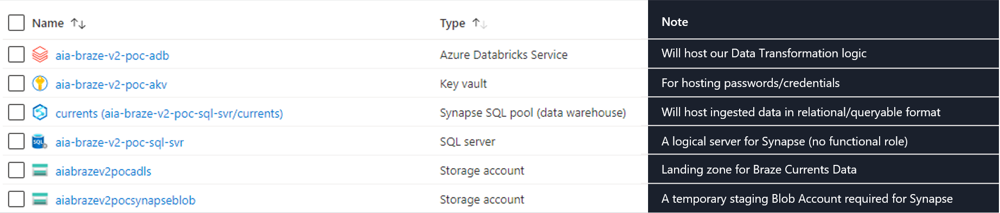

**Databricks**

For Databricks, we configure the **Premium** Tier (will be useful down the line - such as for Secrets Management).

**Storage Accounts**

Note that we configure **2** Storage Accounts:

1. **Data Lake Account** - where we will be landing our Braze data
2. **Blob Account** - as Synapse needs a [regular/dedicated](https://docs.microsoft.com/en-us/azure/databricks/data/data-sources/azure/synapse-analytics#temporary-data-management) - i.e. Staging area for Structured Streaming.

_Data Lake Account_

We pick `StorageV2` in Account kind, and ensure `Hierarchial namespace` is `Enabled` (will be useful down the line).

_Blob Account_

We pick `BlobStorage` in Account kind.

**Synapse SQL Pool**

We start with a modest Synapse Tier `DW100c` to start, and ensure `None` is selected for `Use existing data`.

**Key Vault**

We create with out-of-the-box configurations.

### Configure Azure Resources

**Assign Service Principal permissions**

Assign the Service Principal the following permissions on our Resource Group (for it to create and configure the Event Grid):

- `Contributor`

Note that the actual permissions required after the one time setup can be demoted to:

- `Contributor` on our **ADLS Storage Account** and
- `Contributor` on the **Event Grid** (once it's created by Autoloader - coming up)

**Setup ADLS Directory Structure**

We create two containers on ADLS:

1. `landing`: Where the Currents Data will land
2. `bronze`: Where we will be storing our parsed Delta Table and sample schema file

We create `bronze/tmp/sample.avro` containing our event schema:
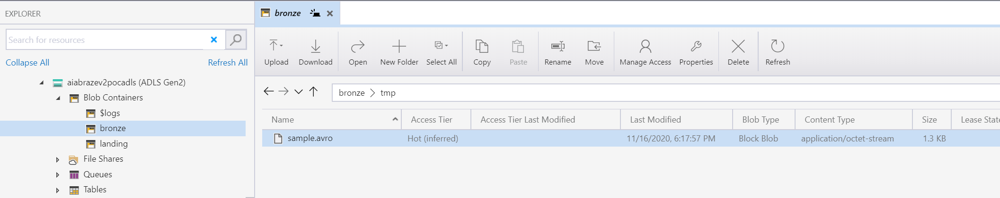

We also create the drop folder structure in `landing`:

`currents/dataexport.prod-02.AzureBlob.integration.12345/event_type=users.behaviors.Purchase/`

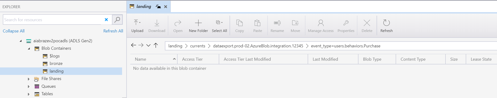

**Setup Blob Directory Structure**

We create a `synapse` container on our Blob Storage Account - and leave it empty.

**Setup Key Vault Secrets**

- `adls-storageAccount-Name`: Name of our ADLS Storage Account
- `adls-storageAccount-AccessKey`: Access Key to our ADLS Storage Account
- `adls-storageQueue-SAS`: Shared Access Signature to manage queues on our ADLS Storage Account
- `blob-storageAccount-Name`: Name of our Blob Storage Account
- `blob-storageAccount-AccessKey`: Access Key to our Blob Storage Account
- `sp-clientId`: Client ID of our Service Principal
- `sp-clientSecret`: Secret of our Service Principal
- `sp-tenantId`: Our Azure AD Tenant Id
- `sp-subscriptionId`: Our Subscription Id
- `sp-rgName`: Our Resource Group name
- `synapse-userName`: User Name for our Synapse Account
- `synapse-password`: Password for our Synapse Account
- `synapse-server`: Server Name hosting Synapse
- `synapse-db`: Database Name on Synapse

**Cluster Setup on Databricks**

We create a standard Cluster under Databricks `7.4 (Apache Spark 3.0.1, Scala 2.12, Python 3)` runtime.

For this POC, we will not be requiring any special libraries.

**Connect Key Vault to Databricks Secret**

To create a Key Vault backed secret scope, view step-by-step guide [here](https://docs.microsoft.com/en-us/azure/databricks/security/secrets/secret-scopes#--create-an-azure-key-vault-backed-secret-scope).

Run the following in a Databricks Notebook and ensure the secrets we configured are visible:

```python
dbutils.secrets.list("key-vault-secrets")
```

**Import Notebooks to Databricks**

We import the notebooks available on [GitHub](https://github.com/mdrakiburrahman/braze-poc/tree/main/databricks-notebooks) into our Databricks Workspace.

### First run

We begin by running [`1.pre-requisites-ingestion`](https://rakirahman.blob.core.windows.net/public/notebooks/braze-poc/1.pre-requisites-ingestion.html) to mount our ADLS `bronze` container to `/mnt/bronze`.

Then, we run the following from [`1.autoloader-from-currents-landing`](https://rakirahman.blob.core.windows.net/public/notebooks/braze-poc/1.autoloader-from-currents-landing.html):

```python
# ADLS
adls_account = dbutils.secrets.get(scope="key-vault-secrets", key="adls-storageAccount-Name")
adls_key = dbutils.secrets.get(scope="key-vault-secrets", key="adls-storageAccount-AccessKey")

spark.conf.set("fs.azure.account.key." + adls_account + ".blob.core.windows.net", adls_key)
spark.conf.set("fs.azure.account.key." + adls_account + ".dfs.core.windows.net", adls_key)

# Blob
blob_account = dbutils.secrets.get(scope="key-vault-secrets", key="blob-storageAccount-Name")
blob_key = dbutils.secrets.get(scope="key-vault-secrets", key="blob-storageAccount-AccessKey")

spark.conf.set("fs.azure.account.key." + blob_account + ".blob.core.windows.net", blob_key)
```

The above block imports the necessary connection secrets and sets the application parameters when Spark connects to our Storage Accounts.

We import the temporary avro file into a dataframe to infer the dataset schema for Autoloader:

```python
df_tmp = spark.read.format("avro").load("/mnt/bronze/tmp/sample.avro")
dataset_schema = df_tmp.schema
```

This sets up the `cloudFilesConf` permissions object that we pass in to create the Autoloader dataframe:

```python
queue_sas = dbutils.secrets.get(scope="key-vault-secrets", key="adls-storageQueue-SAS")

cloudFilesConf = {
  "cloudFiles.subscriptionId": dbutils.secrets.get(scope="key-vault-secrets", key="sp-subscriptionId"),
  "cloudFiles.connectionString": queue_sas,
  "cloudFiles.format": "avro",
  "cloudFiles.tenantId": dbutils.secrets.get(scope="key-vault-secrets", key="sp-tenantId"),
  "cloudFiles.clientId": dbutils.secrets.get(scope="key-vault-secrets", key="sp-clientId"),
  "cloudFiles.clientSecret": dbutils.secrets.get(scope="key-vault-secrets", key="sp-clientSecret"),
  "cloudFiles.resourceGroup": dbutils.secrets.get(scope="key-vault-secrets", key="sp-rgName"),
  "cloudFiles.useNotifications": "true",
  "cloudFiles.includeExistingFiles": "true",
  "cloudFiles.validateOptions": "true",
}
```

We point spark to the root path of our `Purchase` folder, and initiate the autoloader dataframe:

```python
autoloader_df = (spark.readStream.format("cloudFiles")
                 .options(**cloudFilesConf)
                 .option("recursiveFileLookup", "true") # This lets us ignore folder level partitioning into the incoming Dataframe
                 .schema(dataset_schema)
                 .load("wasbs://landing@{}.blob.core.windows.net/currents/dataexport.prod-02.AzureBlob.integration.12345/event_type=users.behaviors.Purchase/".format(adls_account))
                )
```

Except - a `date` column kept getting added to the schema.

<Callout>

❗ The `.option("recursiveFileLookup", "true")` bit is a lifesaver.

</Callout>

What kep happening was, because Braze's drop semantics would include this `date=YYYY-MM-DD-HH` bit:

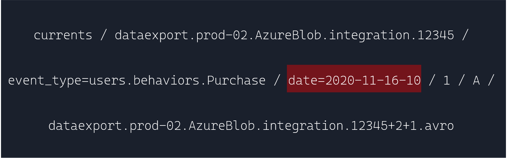

Spark would keep picking up `date` as a column:
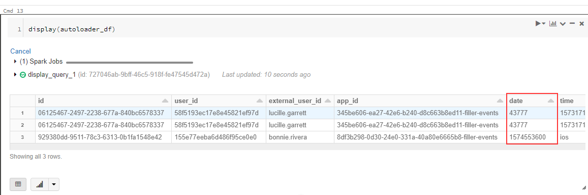

Specifying `.option("recursiveFileLookup", "true")` turns off [Partition Inference](https://spark.apache.org/docs/latest/sql-data-sources-generic-options.html#recursive-file-lookup), meaning Spark simply processes what's in the dropped `.avro` file.

We then proceed to insert a real timestamp for watermarking purposes instead:

```python
autoloader_df = autoloader_df \
  .withColumn("time_inserted", current_timestamp()) \
  .withColumn("time", col("time").cast("bigint")) \
  .withColumn("price", col("price").cast("float"))
```

We then setup the Synapse Connector:

<Callout>

💎 The new [`copy`](https://docs.microsoft.com/en-us/sql/t-sql/statements/copy-into-transact-sql?view=azure-sqldw-latest) command used above is brilliant - we don't have to specify any other settings.

</Callout>

```python
# Configure the write semantics for Azure Synapse connector in the notebook session conf
spark.conf.set("spark.databricks.sqldw.writeSemantics", "copy")
spark.conf.set("spark.sql.files.ignoreMissingFiles", "true")

# Set Azure Synapse Properties and Connection String
user = dbutils.secrets.get(scope="key-vault-secrets", key="synapse-userName")
password = dbutils.secrets.get(scope="key-vault-secrets", key="synapse-password")
dbtable = "users_behaviors_Purchase"
servername = dbutils.secrets.get(scope="key-vault-secrets", key="synapse-server")
databasename = dbutils.secrets.get(scope="key-vault-secrets", key="synapse-db")

jdbc_url = "jdbc:sqlserver://{}.database.windows.net:1433;database={};user={}@{};password={};encrypt=true;trustServerCertificate=false;hostNameInCertificate=*.database.windows.net;loginTimeout=30;".format(servername,databasename,user,servername,password)
```

And finally, kick off both streams:

```python
(autoloader_df.writeStream
  .format("delta")
  .trigger(once=True)
  .outputMode("append")
  .option("checkpointLocation", "/mnt/bronze/currents/users.behaviors.Purchase_Checkpoints/")
  .start("/mnt/bronze/currents/users.behaviors.Purchase")
)

# Structured Streaming API to continuously write the data to a table in Azure Synapse
(autoloader_df.writeStream
  .format("com.databricks.spark.sqldw")
  .trigger(once=True)
  .option("url", jdbc_url)
  .option("tempDir", "wasbs://{}@{}.blob.core.windows.net/{}".format("synapse", blob_account, "tempDir"))
  .option("forwardSparkAzureStorageCredentials", "true")
  .option("dbTable", dbtable)
  .option("checkpointLocation", "/tmp_checkpoint_location")
  .start()
)
```

Due to the `.trigger(once=True)` above, both Streams kick off, does some "stuff" (we see below), and shut down:

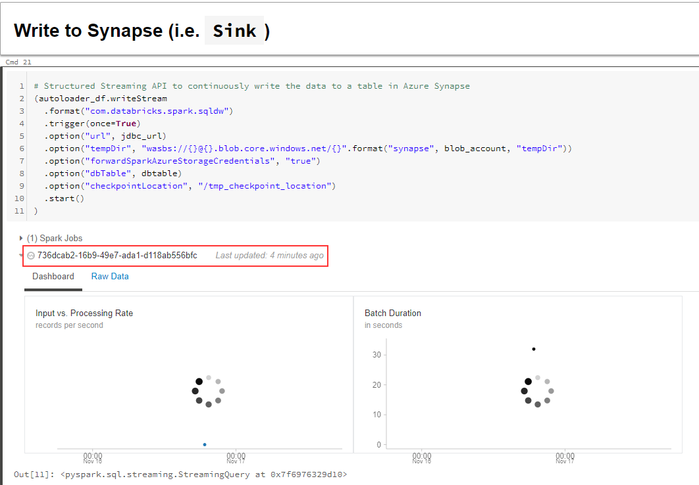

Let's look at some of the "stuff" that happened.

On our resrouce group, we see a new Event Grid get created:

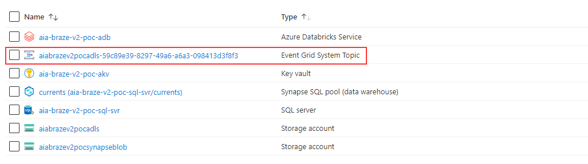

Within this Event Grid - we note 2 topics, one for our Delta Stream, the other for Synapse:

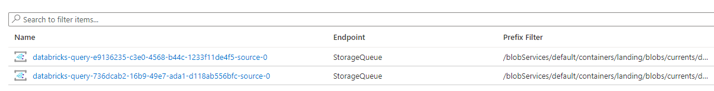

And 2 queues on our Storage Account as well:
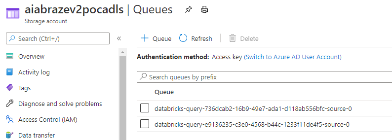

In other words - for each stream:

1. A new `.avro` file is dropped (by Braze or by us) - as we'll see shortly
2. The Event Grid Topic watching the ADLS location grabs the location of the new file, drops it in the queue
3. The queue holds this file location - until our Streaming DataFrame grabs and processes the file as part of the next microbatch, and clears the queue entry
4. Rinse and repeat for the next file

<Callout>

💡 For the subsequent runs, let's comment out wiith `.trigger(once=True)` on both Stream definitions to keep a continuous stream running.

🥇 To follow [best practices](https://docs.microsoft.com/en-us/azure/databricks/spark/latest/structured-streaming/auto-loader#permissions), let's also remove the `Contributor` permission on our Service Principal from the Resource Group - and update to:

- `Contributor` on our **ADLS Storage Account** and
- `Contributor` on the newly created **Event Grid**

</Callout>

### Streaming demo

We register our Delta Table with the Hive Metastore by running the following in `2.bronze-table-from-delta`:

```sql
DROP TABLE IF EXISTS CURRENTS.users_behaviors_Purchase;
DROP DATABASE IF EXISTS CURRENTS;

CREATE DATABASE IF NOT EXISTS CURRENTS;
USE CURRENTS;

DROP TABLE IF EXISTS users_behaviors_Purchase;
CREATE TABLE IF NOT EXISTS users_behaviors_Purchase
USING delta
OPTIONS (path "/mnt/bronze/currents/users.behaviors.Purchase")
```

Since our Delta Table is empty (no data dropped yet) running a `SELECT` returns empty result:

```sql
SELECT * FROM CURRENTS.users_behaviors_Purchase
```

Similarly, before dropping a file - we query our Synapse Database and notice 2 tables - data & checkpoint - are already created (with no data):

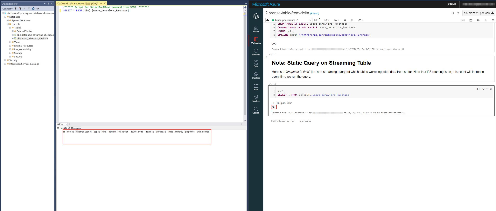

We kick off our Streams.

We drop our first file in our landing container at `../event_type=users.behaviors.Purchase/date=2020-11-16-10/`:

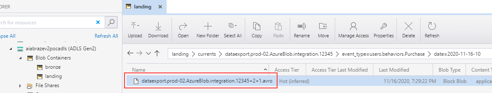

Our Stream spikes on both sinks:


And our Delta and Synapse Tables both have the data upon querying:


### Wrap up

We explored the convenience of Autoloader in setting up a low-configuration Stream Ingestion pipeline - demonstrated with Braze's Currents `.avro` data, while leveraging the `COPY` command in Synapse for a hassle-free experience.

In a Production implementation, depending on the number of tables being subscribed to from Currents, a different Streaming DataFrame per table (i.e. drop location) can be setup.
