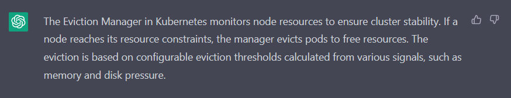
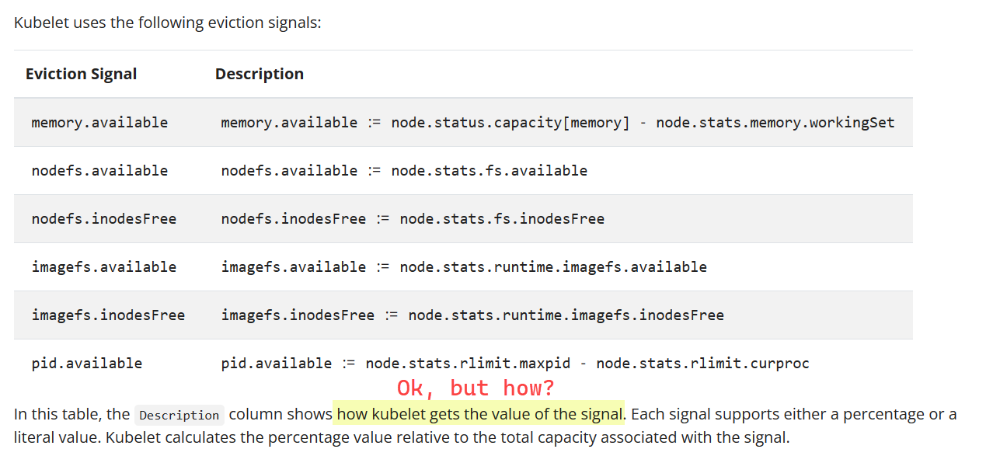
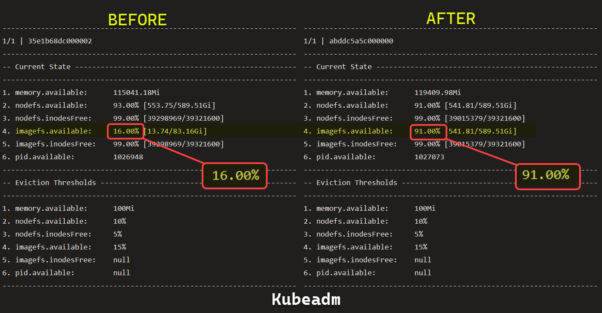
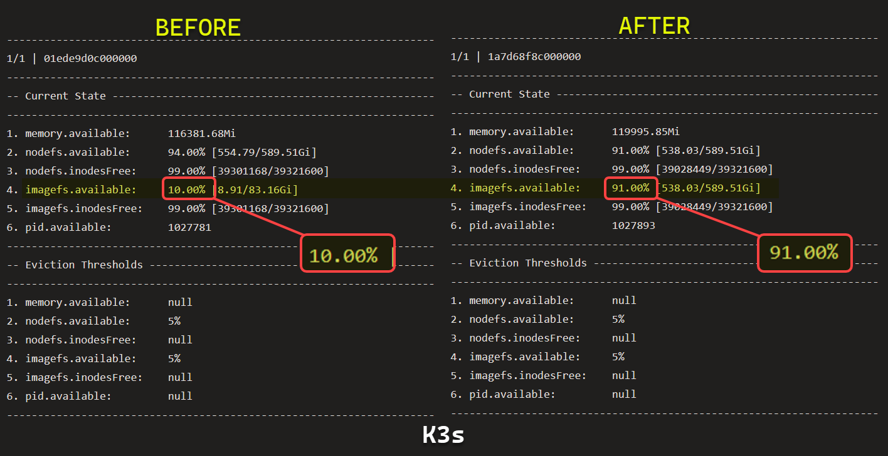
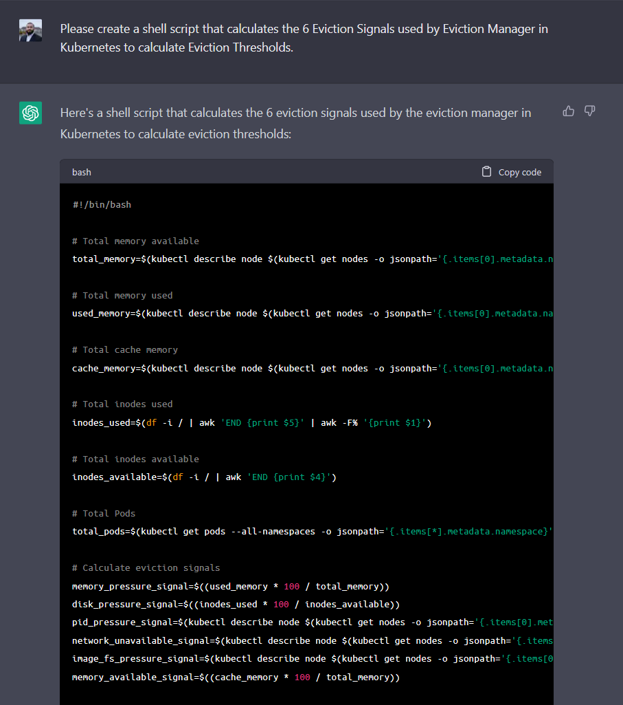

import { Callout } from "../../src/components/atoms.js"
import { ExtLink, InlinePageLink } from "../../src/components/atoms.js"

Eviction Manager is probably the most annoying, the most critical component of Kubernetes.

It's a Kubernetes Operator responsible for [Node-pressure Eviction](https://kubernetes.io/docs/concepts/scheduling-eviction/node-pressure-eviction/) - or in simpler words:



Basically, it keeps Kubernetes up and running by protecting the nodes.

The annoying part is when as an end user of Kubernetes, you're just trying to run some workloads, and are suddenly faced with this:

```bash
kubelet[25910]: I1226 07:49:26.395164   25910 eviction_manager.go:351] "Eviction manager: must evict pod(s) to reclaim" resourceName="ephemeral-storage"
kubelet[25910]: I1226 07:57:57.626197   25910 eviction_manager.go:369] "Eviction manager: pods ranked for eviction" pods=["your-precious-namespace/your-precious-pod-1" ...]
kubelet[25910]: I1226 07:49:46.845358   25910 eviction_manager.go:577] "Eviction manager: pod is evicted successfully" pod="your-precious-namespace/your-precious-pod-1"
kubelet[25910]: I1226 07:49:46.845358   25910 eviction_manager.go:577] "Eviction manager: pod is evicted successfully" pod="your-precious-namespace/your-precious-pod-2"
...
```

When this happens to your day-to-day workloads one too many times, the biggest goal is to usually figure out the **why/when/how** it triggers.

[Kubernetes documentation](https://kubernetes.io/docs/concepts/scheduling-eviction/node-pressure-eviction/#eviction-signals) provides a mysterious definition of 6 eviction signals Kubelet tracks:



There are many Stack Overflow threads [[1](https://stackoverflow.com/questions/54155534/kubernetes-eviction-manager-evicting-control-plane-pods-to-reclaim-ephemeral-sto), [2](https://stackoverflow.com/questions/70931881/what-does-kubelet-use-to-determine-the-ephemeral-storage-capacity-of-the-node)] from folks that are equally in the dark. So from there, if you start to take matters into your own hands to read through Eviction Manager's [control loop](https://github.com/kubernetes/kubernetes/blob/7366fab496852dd7e7201701f64414ceded0aa77/pkg/kubelet/eviction/eviction_manager.go#LL232C2-L232C2) from source code on Github, it's even more confusing to figure out what signals the control loop uses to _actually fire_.

Kubernetes, being a distributed system, doesn't give you a straight line view of all the logs from all Control Plane pods that leads to a trigger that leads to evicted workloads.

<Callout>

🤕 Recently, [Kubernetes 1.25](https://github.com/kubernetes/kubernetes/blob/master/CHANGELOG/CHANGELOG-1.25.md#promoted-local-ephemeral-storage-capacity-isolation-to-stable) promoted [Ephemeral Storage Capacity Isolation](https://github.com/kubernetes/enhancements/tree/master/keps/sig-storage/361-local-ephemeral-storage-isolation) as a first-class citizen for causing Pod Evictions - besides CPU and Memory - so Eviction Manager is more aggressive than ever before.

In other words, if a Pod uses too much non-PVC space - e.g. for logs or `tmpfs` - it's probably going to get booted.

</Callout>

My team self-manages a small fleet of Kubernetes Clusters that became a victim of Eviction Manager across the board. After banging my head against the wall for a couple days of seemingly random evictions, I managed to figure out the actual calculations required to figure out the 6 signals above, so we can know at any given point in time, how close Eviction Manager is to waking up:

```bash
# HH:MM:SS
#
timestamp() {
  date +"%T"
}

# Prints the eviction signals (current state vs threshold) used by kubelet for pod evictions
# for all nodes. Kubelet gathers these metrics from cadvisor running on the node.
#
#  - https://kubernetes.io/docs/concepts/scheduling-eviction/node-pressure-eviction/#eviction-signals
#  - https://github.com/google/cadvisor
#
print_node_pressure_signals() {
  if [ $# -eq 1 ]; then
    export PHASE=$1
  else
    export PHASE="default"
  fi
  echo "=================================================================================="
  echo "$(timestamp) | INFO | Eviction signals for all nodes"
  echo "=================================================================================="
  echo
  echo "- - - - - - - - - - - - - - - - - - - - - - - - - - - - - - - - - - - - - - - - - "
  echo " Phase: ${PHASE}"
  echo "- - - - - - - - - - - - - - - - - - - - - - - - - - - - - - - - - - - - - - - - - "
  NODES=($(kubectl get nodes -o jsonpath='{.items[*].metadata.name}'))
  NODE_COUNT=${#NODES[@]}

  for ((i=1; i<=${NODE_COUNT}; i++)); do
    NODE=${NODES[$i-1]}
    # =======
    # Refresh
    # =======
    CURRENT_PAYLOAD=$(kubectl get --raw "/api/v1/nodes/${NODE}/proxy/stats/summary");
    THRESHOLD_PAYLOAD=$(kubectl get --raw "/api/v1/nodes/${NODE}/proxy/configz");

    # ====================
    # Current Calculations
    # ====================
    # -- 1. Memory --
    MEMORY_AVAILABLE_BYTES=$(echo ${CURRENT_PAYLOAD} | jq .node.memory.availableBytes);
    # MB
    MEMORY_AVAILABLE_MB=$(echo "scale=2; ${MEMORY_AVAILABLE_BYTES}/1024/1024" | bc);

    # -- 2. Nodefs capacity --
    NODEFS_AVAILABLE_BYTES=$(echo ${CURRENT_PAYLOAD} | jq .node.fs.availableBytes);
    NODEFS_CAPACITY_BYTES=$(echo ${CURRENT_PAYLOAD} | jq .node.fs.capacityBytes);
    # GB
    NODEFS_AVAILABLE_GB=$(echo "scale=2; ${NODEFS_AVAILABLE_BYTES}/1024/1024/1024" | bc);
    NODEFS_CAPACITY_GB=$(echo "scale=2; ${NODEFS_CAPACITY_BYTES}/1024/1024/1024" | bc);
    # %
    NODEFS_PERCENTAGE=$(echo "scale=2; ${NODEFS_AVAILABLE_GB}/${NODEFS_CAPACITY_GB}*100" | bc);

    # -- 3. Nodefs Inodes --
    NODEFS_INODES_AVAILABLE=$(echo ${CURRENT_PAYLOAD} | jq .node.fs.inodesFree);
    NODEFS_INODES_CAPACITY=$(echo ${CURRENT_PAYLOAD} | jq .node.fs.inodes);
    # %
    NODEFS_INODES_PERCENTAGE=$(echo "scale=2; ${NODEFS_INODES_AVAILABLE}/${NODEFS_INODES_CAPACITY}*100" | bc);

    # -- 4. Imagefs capacity --
    IMAGEFS_AVAILABLE_BYTES=$(echo ${CURRENT_PAYLOAD} | jq .node.runtime.imageFs.availableBytes);
    IMAGEFS_CAPACITY_BYTES=$(echo ${CURRENT_PAYLOAD} | jq .node.runtime.imageFs.capacityBytes);
    # GB
    IMAGEFS_AVAILABLE_GB=$(echo "scale=2; ${IMAGEFS_AVAILABLE_BYTES}/1024/1024/1024" | bc);
    IMAGEFS_CAPACITY_GB=$(echo "scale=2; ${IMAGEFS_CAPACITY_BYTES}/1024/1024/1024" | bc);
    # %
    IMAGEFS_PERCENTAGE=$(echo "scale=2; ${IMAGEFS_AVAILABLE_GB}/${IMAGEFS_CAPACITY_GB}*100" | bc);

    # -- 5. Imagefs Inodes --
    IMAGEFS_INODES_AVAILABLE=$(echo ${CURRENT_PAYLOAD} | jq .node.fs.inodesFree);
    IMAGEFS_INODES_CAPACITY=$(echo ${CURRENT_PAYLOAD} | jq .node.fs.inodes);
    # %
    IMAGEFS_INODES_PERCENTAGE=$(echo "scale=2; ${NODEFS_INODES_AVAILABLE}/${NODEFS_INODES_CAPACITY}*100" | bc);

    # -- 6. Pid stats --
    #
    PID_MAX=$(echo ${CURRENT_PAYLOAD} | jq .node.rlimit.maxpid);
    PID_CURR=$(echo ${CURRENT_PAYLOAD} | jq .node.rlimit.curproc);
    PID_AVAILABLE=$(echo "scale=2; ${PID_MAX}-${PID_CURR}" | bc);

    # =========
    # Threshold
    # =========
    # Thresholds available differs by K8s distros

    # -- 1. Memory --
    MEMORY_AVAILABLE_MB_THRESHOLD=$(echo ${THRESHOLD_PAYLOAD} | jq '.kubeletconfig.evictionHard."memory.available"' | sed 's/"//g');
    # -- 2. Nodefs capacity --
    NODEFS_AVAILABLE_PERCENTAGE_THRESHOLD=$(echo ${THRESHOLD_PAYLOAD} | jq '.kubeletconfig.evictionHard."nodefs.available"' | sed 's/"//g');
    # -- 3. Nodefs Inodes --
    NODEFS_INODES_AVAILABLE_PERCENTAGE_THRESHOLD=$(echo ${THRESHOLD_PAYLOAD} | jq '.kubeletconfig.evictionHard."nodefs.inodesFree"' | sed 's/"//g');
    # -- 4. Imagefs capacity --
    IMAGEFS_AVAILABLE_PERCENTAGE_THRESHOLD=$(echo ${THRESHOLD_PAYLOAD} | jq '.kubeletconfig.evictionHard."imagefs.available"' | sed 's/"//g');
    # -- 5. Imagefs Inodes --
    IMAGEFS_INODES_AVAILABLE_PERCENTAGE_THRESHOLD=$(echo ${THRESHOLD_PAYLOAD} | jq '.kubeletconfig.evictionHard."imagefs.inodesFree"' | sed 's/"//g');
    # -- 6. Pid stats --
    PID_AVAILABLE_PERCENTAGE_THRESHOLD=$(echo ${THRESHOLD_PAYLOAD} | jq '.kubeletconfig.evictionHard."pid.available"' | sed 's/"//g');

    echo
    echo " --------------------------------------------------------------------- "
    echo " ${i}/${NODE_COUNT} | ${NODE}"
    echo " --------------------------------------------------------------------- "
    echo " -- Current State ---------------------------------------------------- "
    echo " --------------------------------------------------------------------- "
    echo " 1. memory.available:      ${MEMORY_AVAILABLE_MB}Mi";
    echo " 2. nodefs.available:      ${NODEFS_PERCENTAGE}% [${NODEFS_AVAILABLE_GB}/${NODEFS_CAPACITY_GB}Gi]";
    echo " 3. nodefs.inodesFree:     ${NODEFS_INODES_PERCENTAGE}% [${NODEFS_INODES_AVAILABLE}/${NODEFS_INODES_CAPACITY}]";
    echo " 4. imagefs.available:     ${IMAGEFS_PERCENTAGE}% [${IMAGEFS_AVAILABLE_GB}/${IMAGEFS_CAPACITY_GB}Gi]";
    echo " 5. imagefs.inodesFree:    ${IMAGEFS_INODES_PERCENTAGE}% [${IMAGEFS_INODES_AVAILABLE}/${IMAGEFS_INODES_CAPACITY}]";
    echo " 6. pid.available:         ${PID_AVAILABLE}";
    echo " --------------------------------------------------------------------- "
    echo " -- Eviction Thresholds ---------------------------------------------- "
    echo " --------------------------------------------------------------------- "
    echo " 1. memory.available:      ${MEMORY_AVAILABLE_MB_THRESHOLD}"
    echo " 2. nodefs.available:      ${NODEFS_AVAILABLE_PERCENTAGE_THRESHOLD}"
    echo " 3. nodefs.inodesFree:     ${NODEFS_INODES_AVAILABLE_PERCENTAGE_THRESHOLD}"
    echo " 4. imagefs.available:     ${IMAGEFS_AVAILABLE_PERCENTAGE_THRESHOLD}"
    echo " 5. imagefs.inodesFree:    ${IMAGEFS_INODES_AVAILABLE_PERCENTAGE_THRESHOLD}"
    echo " 6. pid.available:         ${PID_AVAILABLE_PERCENTAGE_THRESHOLD}"
    echo " --------------------------------------------------------------------- "
    echo
  done
}
```

The script loops over all nodes on the cluster, queries Kubelet, and prints out the `Current State vs Threshold` like this:


So for example, running `print_node_pressure_signals` on a loop as workloads progressed allowed us to visually figure out while scrolling through the logs that our Container Runtime was filling up with stale image layers, even though Pods were deleted. As soon as `imagefs` dipped below `15%`, Eviction Manager's Control Loop would fire, and evict pods. This crystal-clear evidence lead us to making a 2 line change that mounted a drive to where `imagefs` resides, and we never saw Eviction Manager fire again, regardless of how long we left the cluster running:



The same script works for any Kubernetes installs - e.g. K3s:



And [here's an example](https://github.com/k3s-io/k3s/issues/2068#issuecomment-1374672584) of how to tweak `containerd` to change the `imagefs` mount.

## Bonus

If you ask ChatGPT to figure out the problem above, this is what you get:



Event though it may look like it, the script doesn't actually work, because it's not even querying the correct API endpoints where you would scrape the same [cadvisor](https://github.com/google/cadvisor) signal data kubelet scrapes - the endpoint is not documented anywhere clearly on the internet. ChatGPT must have read the Kubernetes documentation in the original screenshot and made a creative guess.

Unfortunately, I don't think ChatGPT has ever used Kubernetes before.
