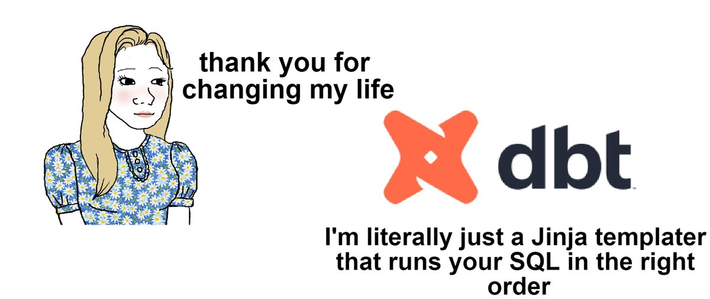
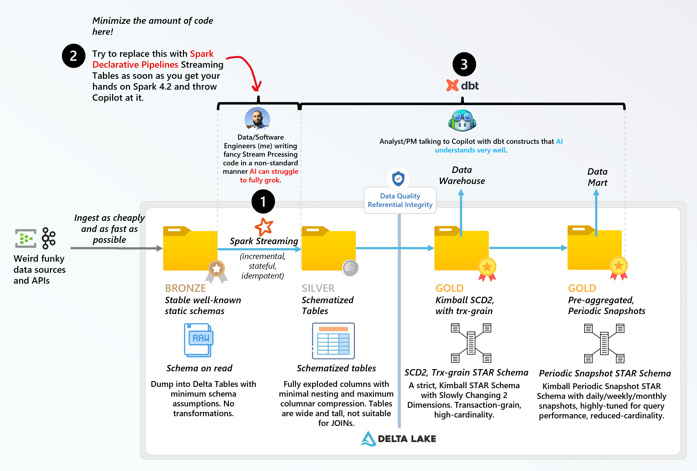
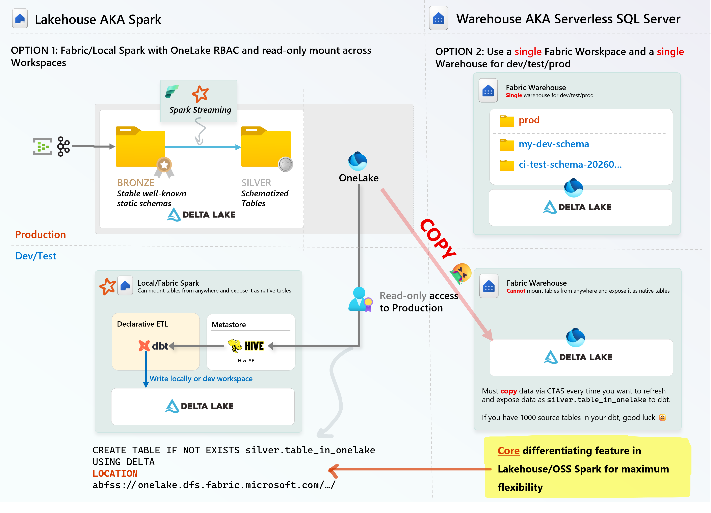
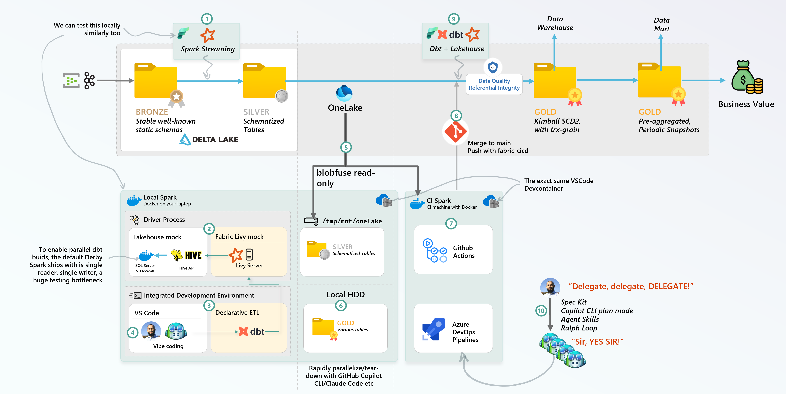
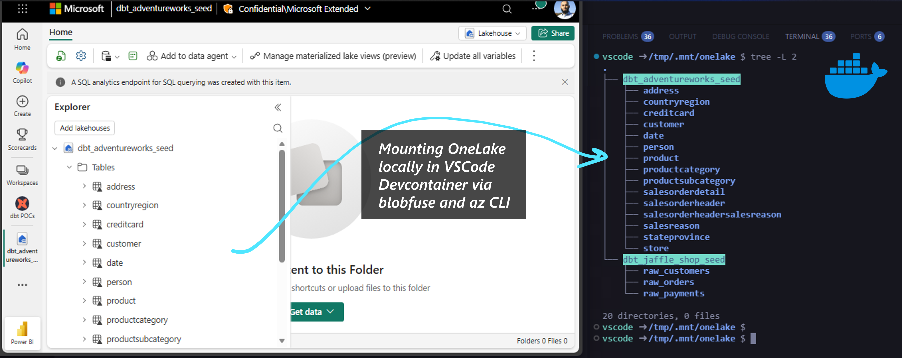
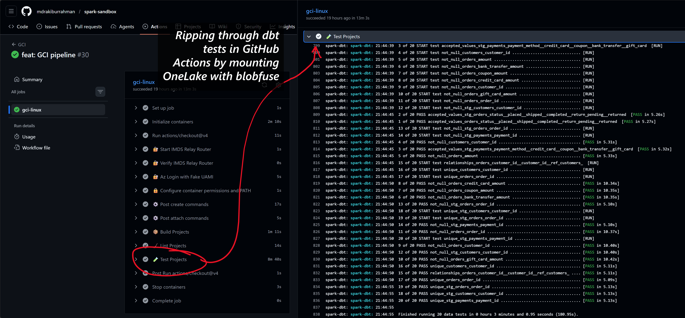
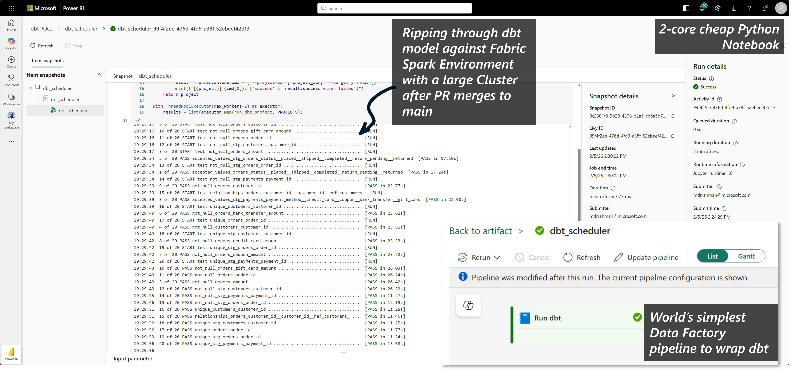

import { Callout } from "../../src/components/atoms.js"
import { ExtLink, InlinePageLink } from "../../src/components/atoms.js"

The writing on the wall is clear: AI is here to stay and here to write code going forward whether you like it or not.

## What does dbt have to do with AI?

In a gold rush, sell shovels. I think that's what made and will continue to make [dbt](https://www.getdbt.com/) so successful.

You're a dinosaur fighting a meteor if you keep dismissing AI-generated code as "sloppy". AI is extremely competent at producing code, the reason it's sloppy is because you, Mr. Human, are not able to clearly convey your intent and years of context the way it makes sense in your head, over to the AI.

To help yourself, what you really want is to help the little helpful robot along with **guardrails** so it can write the code exactly the way you'd have written it yourself with your slow meat muscle fingers and clickity-clackity keyboard - except AI is 10000x faster.

And when it opens the PR, you want to set up **test automation infrastructure** so you can merge changes **_rapidly_** with **_high confidence_**. You then free yourself up to research more business problems you can solve with data and code. Rinse and repeat.

This is how you generate business value for your employer.

Turns out this is easier said than done, especially if you have a super-unique codebase (everyone does) that GPTs haven't been pre-trained on. A bunch of markdown
files can only get you so far before you run out of tokens and context windows.

Your ETL app is probably also full of leaky abstractions that are going to confuse GPT because your (my) crappy code cannot be generalized into a concise public-facing API/entrypoint. This makes sense, you (I) never started this journey looking to build a software product, you were (I was) probably just trying to hack some Notebooks glued together to meet some deadline and now you're (we're) here.

On the other hand, imagine if GPTs were pre-trained on 5+ years of ETL patterns that spanned many many vendors like [Snowflake](https://docs.snowflake.com/en/user-guide/tutorials/dbt-projects-on-snowflake-getting-started-tutorial), [BigQuery](https://www.getdbt.com/data-platforms/bigquery), [Databricks](https://github.com/databricks/dbt-databricks) et al, and you could bring those robust patterns into your codebase in a way where you just say something and dbt knows exactly how to implement it without needing to extend your Notebook spaghetti.

That's dbt. 

Check out their [MCP server](https://github.com/dbt-labs/dbt-mcp) and [Agent Skills](https://docs.getdbt.com/blog/dbt-agent-skills), it's awesome.

## What exactly is dbt?

### Similarity to kubernetes

<Callout>

"Game recognize game" is a phrase acknowledging mutual respect between individuals operating at a high level or possessing similar expertise. It signifies that skilled, experienced people recognize talent, competence, and mastery in others.

</Callout>

If you've ever worked with Kubernetes, you'll recognize yaml files for [kubernetes manifest](https://kubernetes.io/docs/concepts/overview/working-with-objects/#describing-a-kubernetes-object). It's great, you declare what you want, the [`kubectl`](https://kubernetes.io/docs/reference/kubectl/) API does client-side validation, then fires off API requests to the Kubernetes server in the right order to make the thing happen. It doesn't matter if you want one thing or 1000 things, `kubectl` knows exactly the right sequence to make the thing reliably _every single time_.

This basically meant it was significantly easier to adopt Kubernetes, and people kept spinning up _lots of things_.

Then the problem was, you had many _things_ that had duplicated business logic in the yaml (e.g. naming, labels etc).

Along came [helm](https://github.com/helm/helm), the equivalent of [Jinja templates](https://jinja.palletsprojects.com/en/stable/) built in Go (because Kubernetes is also written in [Go](https://github.com/kubernetes/kubernetes)). Helm basically gives you [pre-processing functions](https://helm.sh/docs/chart_template_guide/function_list/) so you can stitch yaml together without duping business logic.

| C1                                                                              | C2                                                                                                                                               | C3                                                                                                                                                                                                            | C4                                                                                                                                                                    |
| ------------------------------------------------------------------------------- | ------------------------------------------------------------------------------------------------------------------------------------------------ | ------------------------------------------------------------------------------------------------------------------------------------------------------------------------------------------------------------- | --------------------------------------------------------------------------------------------------------------------------------------------------------------------- |
| `Problem`                                                                       | `Concept`                                                                                                                                        | `Helm`                                                                                                                                                                                                        | `dbt`                                                                                                                                                                 |
| Doing things in parallel in the right order is hard when you have many things to do | [Directed Acyclic Graphs](https://en.wikipedia.org/wiki/Directed_acyclic_graph) and [DRY](https://en.wikipedia.org/wiki/Don%27t_repeat_yourself) | [Functions](https://helm.sh/docs/chart_template_guide/function_list/), [values](https://helm.sh/docs/chart_template_guide/values_files/) and [variables](https://helm.sh/docs/chart_template_guide/variables) | dbt [Jinja functions](https://docs.getdbt.com/reference/dbt-jinja-functions-context-variables), [project manifest](https://docs.getdbt.com/reference/dbt_project.yml) |
| Error handling and logging is hard                                              | Observability                                                                                                                                    | helm [status](https://helm.sh/docs/helm/helm_status/)                                                                                                                                                         | dbt [Events and logs](https://docs.getdbt.com/reference/events-logging)                                                                                               |
| Static checking code for correctness is hard                                      | Rapid, static analysis                                                                                                                           | helm [lint](https://helm.sh/docs/helm/helm_lint/) and [rendering](https://helm.sh/docs/helm/helm_template/)                                                                                                   | dbt [linting](https://docs.getdbt.com/docs/cloud/studio-ide/lint-format) and [rendering](https://docs.getdbt.com/reference/commands/build#the-render-method)          |
| Testing is hard                                                                   | Failing fast before the bug ships saves you production cleanup headaches                                                                         | helm [unit tests](https://github.com/helm-unittest/helm-unittest)                                                                                                                                             | dbt [tests](https://docs.getdbt.com/docs/build/data-tests)                                                                                                            |

Someone much smarter than me at Fivetran definitely has a much more comprehensive list on the exact data problems dbt solves, which is why they acquired it in [October 2025](https://www.fivetran.com/press/fivetran-and-dbt-labs-unite-to-set-the-standard-for-open-data-infrastructure-2025):

I'd usually never take a dependency on an acquired OSS tool unless there's public announcements for support on the platform I'm running my code on. 

Thankfully, soon after the acquisition [Microsoft Fabric](https://blog.fabric.microsoft.com/en-US/blog/dbt-job-in-microsoft-fabric-ship-trustworthy-sql-models-faster-preview/) and [Fivetran](https://www.getdbt.com/blog/dbt-labs-integrates-dbt-fusion-engine-in-microsoft-fabric) both joined forces to declare strategic future investments for dbt support in Fabric - probably because there's a billion teams using dbt in production.

So that was the signal I needed to go off spending a couple months learning dbt really well.

### Learning dbt

To grok dbt, these are the resources I used:

| C1                                                                                                                       | C2                                                                                              | C3           | C4                                                                                                              |
| ------------------------------------------------------------------------------------------------------------------------ | ----------------------------------------------------------------------------------------------- | ------------ | --------------------------------------------------------------------------------------------------------------- |
| `Resource`                                                                                                               | `Link`                                                                                          | `Type`       | `Comment`                                                                                                       |
| Data Engineering with dbt: A practical guide to building a cloud-based, pragmatic, and dependable data platform with SQL | [Amazon](https://www.amazon.ca/Data-Engineering-dbt-cloud-based-dependable-ebook/dp/B0C4LL19G7) | Book         | Incredible book, 2 thumbs up                                                                                    |
| Official quickstarts                                                                                                     | [Link](https://docs.getdbt.com/guides/microsoft-fabric?step=13)                                 | Tutorials    | Basic, but effective                                                                                            |
| Every locally reproducible blog I could get my hands on with dbt tutorials                                               | [My stash of tutorials](https://github.com/mdrakiburrahman/dbt-demo/tree/main/tutorials)        | Tutorials    | I tried DuckDB, Postgres, SQL Server, Local Spark, Fabric Data Warehouse, and Fabric Spark until it all clicked |
| Studying various dbt adapters                                                                                            | The [Databricks adapter](https://github.com/databricks/dbt-databricks) is really well written   | Code surfing | This is only useful if you're trying to build one of these, otherwise don't waste your time                     |

### Where does dbt suck?

The only parts about dbt that personally smell bad to me are:

* [Incremental Models](https://docs.getdbt.com/best-practices/materializations/4-incremental-models): after you cut through all the marketing fat, it's basically using timestamp columns in your dataset for watermarking - this is a poor pattern because it is impossible to guarantee exactly-once when you have [late-arriving events](https://en.wikipedia.org/wiki/Early-arriving_fact). You also cannot guarantee [idempotency](https://en.wikipedia.org/wiki/Idempotence).
* [Seeds](https://docs.getdbt.com/reference/commands/seed): this smells really really bad. It basically reads a CSV file from git, serializes it into a gigantic `INSERT INTO ... VALUES (...)` command, and fires it over the network 🤮
* [Schema on read](https://developer.confluent.io/patterns/event/schema-on-read/): this is a reality Data Engineers have to live with, and dbt has no elegant solutions for it. It expects the data to be available to the backend engine of choice in a schematized format.

### Where to use dbt in the medallion?

Using the above as the basis of my mental model, here's how I'd adopt dbt in a production medallion architecture today:

1. To deal with the reality of schema-on-read, you need Spark primitives like [inferring complex JSON schema](https://cloudsqale.com/2023/10/25/spark-reading-json-sampling/) on read - and then piping it through a Spark Stream, which has [checkpoints](https://spark.apache.org/docs/latest/streaming-programming-guide.html#checkpointing) and [robust fault tolerance](https://spark.apache.org/docs/latest/streaming-programming-guide.html#fault-tolerance-semantics) for idempotency guarantees.
   
   To be extremely clear on why you need this code, the **only** value add of this is the fact that you can infer extremely nested and complex schemas trivially with Spark DataFrames API, and the fact that Spark Streaming has a checkpoint folder that stores state required for idempotency and exactly-once guarantees.

2. The problem with 1 is, all these Software Engineers (ahem, me) get too fancy with the stream processing code that AI struggles to understand and extend robustly at scale, because there is no **public facing, concise manifest that declares the code's behavior that AI understands**. 
   [Spark Declarative Pipelines](https://spark.apache.org/docs/latest/declarative-pipelines-programming-guide.html) exactly solves this problem by boxing these Software Engineers into a YAML, without losing all the benefits of 1 with Spark Streaming.

3. For everything else, use dbt with full processing, so you can blow up the tables and reprocess them. In step 1, you can partition with [Liquid Clustering](https://delta.io/blog/liquid-clustering/) etc. your data such that if your dbt model uses predicates, this full processing will be dirt cheap, since the lookups will be fast.

Basically: 

1. In the age of AI, you want to minimize custom, proprietary ETL bootstrapping code specific to your codebase that AI cannot robustly understand.
2. Spark Streaming incremental processing capability is best in class, and you want to adopt Spark Declarative Pipelines as soon as you can get your hands on Spark 4.2 to bring in the Spark-specific declarative API to get similar benefits as dbt.

## Fabric Spark and Fabric Data Warehouse architectural limitations for ETL

[Snowflake](https://docs.snowflake.com/en/) is the granddaddy of Modern Data Warehouses that dbt has arguably the most adoption with. I learnt a lot about why Data Analysts like the dbt + Snowflake combo from [this book](https://www.amazon.ca/Data-Engineering-dbt-cloud-based-dependable-ebook/dp/B0C4LL19G7) - tldr; it's _easy_ and it _just works_ (functionally).

The problem with dev/test setup is, the level of isolation in the book is a Snowflake schema. The idea is, everyone - dev/test/prod - uses the same Snowflake warehouse, which allows you to refer to tables from the `prod` schema, and use it in your `my-dev` schema in dbt.

This of course, means some admin needs to use the database engine's schema level RBAC to stop developers from writing into the `prod` schema.

In a polyglot engine offering like Fabric, this goes against the [OneLake Security principle](https://learn.microsoft.com/en-us/fabric/onelake/security/get-started-security), where RBAC should be at the storage layer, not per compute layer. So, using a single giant Warehouse's RBAC and schemas to maintain dev/test/prod access is a huge headache as it goes against the grain of the platform, and the grain of how I'd use Fabric.

<Callout>

Similarly, someone in Snowflake land shared this sentiment too, and they built this thing called [fakesnow](https://github.com/tekumara/fakesnow) to simulate Snowflake locally. I bet the author wishes Snowflake could just release a Docker Container so they could be done with this problem without mocking the Snowflake SQL surface area!

</Callout>

On the other hand, Fabric Spark offers the exact same API as local Spark, and since Spark lets you mount tables into its hive metastore agnostic of where it's physically located, this means we can mount Production OneLake Delta tables as read-only in our dev/test local or Fabric workspaces. As long as the identity doing the mounting has read access to storage, they can mount and read to their heart's content.

That means, we can use local Spark in GitHub Actions/your laptop to rip through your model with as many AI models as you need to do something in parallel. If we don't have a beefy machine, you can always use a dev/test Fabric Spark workspace via the Livy endpoint using your laptop's VS Code, ultra flexible.

Having a similar "external delta table mounted into a regular looking table" would solve this problem in Fabric Warehouse, but it doesn't exist yet:

That being said, if you're on a small team that doesn't care too much about dev/test/prod isolation, in my opinion, you should totally go with a single Fabric Warehouse in prod for your ELT and use schemas for RBAC isolation, since it comes with less fancy knobs, less integration points and less room for bugs and headaches.

Plus, SQL Server has always had a reputation to be blazing fast _if_ you can lock it down. The [Fabric Warehouse Engine](https://learn.microsoft.com/en-us/fabric/data-warehouse/architecture) has a robust, completely serverless architecture, and in my tests - have locked SQL Server the _heck down_ when it comes to perf on Delta Lake tables 😊. They're just missing a few quality of life things that Spark has had since my grandpa's days because Spark was born with a complete compute/storage isolation, including the metastore API.

So for now, off with Spark and dbt I go. The good thing about dbt is, you're pretty much one AI-generated PR away from migrating the entire codebase into another backend, since your entire model can be tested and diff checked in one shot.

## How to dbt on Fabric Spark?

1. Do whatever you have to do get data in the Lakehouse in a schematized, columnar format, like Spark Streaming. Make sure you partition/cluster your data on **predicate columns**, so your local dev-env can work on a subset of production data via dbt-injected filter predicates. 
   
   For example, locally, have dbt inject in `WHERE timestamp > ago(7d)` to process a small amount of data, but in cloud, omit the filter.

2. Mock Fabric Spark locally by spinning up Livy for dbt Spark SQL - see devcontainer [here](https://github.com/mdrakiburrahman/spark-devcontainer/blob/01772ae05f0cb5469d0a456becf222fe01f0a42b/.devcontainer/overlay/install-packages.sh#L82), Hive for metastore - see devcontainer [here](https://github.com/mdrakiburrahman/spark-devcontainer/blob/main/.devcontainer/config/defaults/hive-site.xml.tmpl), and SQL Server in docker for parallel dbt builds - see devcontainer [here](https://github.com/mdrakiburrahman/spark-sandbox/blob/main/projects/spark-scala/.scripts/init-metastore.sh).
3. Bootstrap your dbt project with [`dbt-fabricspark`](https://github.com/microsoft/dbt-fabricspark) adapter to work with local Livy and Fabric Livy in different runtime targets, see Adventureworks [profiles.yml example here](https://github.com/mdrakiburrahman/spark-sandbox/blob/main/projects/spark-dbt/dbt-adventureworks/profiles.yml).
4. Use Github CLI, VSCode chat, Claude Code, or whatever AI tool you like to start asking AI to express your business logic, and tests - in dbt.
   
   Be prepared to be highly impressed at how well GPTs understand dbt thanks to years and years of training material.

5. Mount your **production silver tables** from OneLake locally via blobfuse - [see yaml](https://github.com/mdrakiburrahman/spark-sandbox/blob/main/projects/spark-scala/blobfuse-onelake-config.yaml.tmpl). Use [this little Spark job](https://github.com/mdrakiburrahman/spark-sandbox/blob/main/projects/spark-scala/spark-demo/src/main/scala/me/rakirahman/sparkdemo/etl/drivers/general/management/DeltaMountDriver.scala) to mount into Hive metastore so dbt can refer to it in plain SQL as dbt `sources/seeds` - see [here](https://github.com/mdrakiburrahman/spark-sandbox/blob/f2048584fcb9f995a30af6e5639ddcf6d7f58a8e/projects/spark-dbt/dbt-adventureworks/dbt_project.yml#L31).
6. Fire dbt `local-local` - see [here](https://github.com/mdrakiburrahman/spark-sandbox/blob/main/projects/spark-dbt/.scripts/run-dbt-local.sh), watch it use all your local machine's cores to rip through the model generation via local Spark. 
   
   You can even fire the build from local into Fabric Spark using the [`local-fabric`](https://github.com/mdrakiburrahman/spark-sandbox/blob/f2048584fcb9f995a30af6e5639ddcf6d7f58a8e/projects/spark-dbt/dbt-adventureworks/profiles.yml#L21) target too.

   Since both local Spark and Fabric Spark are running Spark SQL, the business logic will execute exactly the same. The benefit with Fabric is you can throw beefy clusters and [NEE](https://learn.microsoft.com/en-us/fabric/data-engineering/native-execution-engine-overview?tabs=sparksql) etc. at the problem to process historical data significantly faster.

7. Once you're comfortable with the branch, open PR in your CI provider. Run the exact same devcontainer in CI as well, with the exact same data mounted from OneLake to run the exact same tests. See example CI run [here](https://github.com/mdrakiburrahman/spark-sandbox/actions/runs/22043480981).
8. Once PR merges, package up the dbt project - [see here](https://github.com/mdrakiburrahman/spark-sandbox/blob/main/projects/spark-dbt/.scripts/package-fabric.sh), and push the zip into OneLake.
9. Access the zip from OneLake and run in a lightweight 2-Core Python Notebook - [see here](https://github.com/mdrakiburrahman/spark-sandbox/blob/main/projects/spark-dbt/.notebooks/run-dbt-fabric.ipynb), and fire `fabric-fabric`. This is a workaround until the [Fabric native dbt job](https://learn.microsoft.com/en-us/fabric/data-factory/dbt-job-overview) supports Fabric Spark.
10. Once you build trust in this system and its reliability and quality, instead of learning ETL code, learn how to orchestrate AI instead so you can have 100s of Agents parallelizing business problems.

The flow above is not as complex as it sounds, you don't have to do anything yourself - the devcontainer does the heavy lifting - take a moment to try out the [VSCode Devcontainer](https://github.com/mdrakiburrahman/spark-sandbox), since it's regression-tested via GitHub Actions on commodity hardware [see here](https://github.com/mdrakiburrahman/spark-sandbox/blob/main/.github/workflows/gci.yaml), I'm highly confident it'll work on anyone's laptop as long as you have Docker Desktop and internet access:

## Demo

`youtube:https://www.youtube.com/embed/AmSNav-KTqg`

## Repos to reproduce this locally

* Devcontainer git repo with Livy/Hive/Spark install here: [mdrakiburrahman/spark-devcontainer](https://github.com/mdrakiburrahman/spark-devcontainer)
* Spark with dbt and automation for Fabric Lakehouse: [mdrakiburrahman/spark-sandbox](https://github.com/mdrakiburrahman/spark-sandbox)

## Next Steps

While going through the above exercise, I filed a bunch of bugs in the [dbt-fabricspark adapter](https://github.com/microsoft/dbt-fabricspark/issues). I've been running [this PR branch](https://github.com/microsoft/dbt-fabricspark/pull/56) in production to unblock myself without merging any PRs or waiting for new releases.

I'm working with the repo's original author to merge these PRs into `main`, and then doing a new release of the dbt Fabric Spark Adapter.

Since I'm taking a dependency on this Adapter for some critical business logic, I plan on helping to maintain this Adapter going forward.