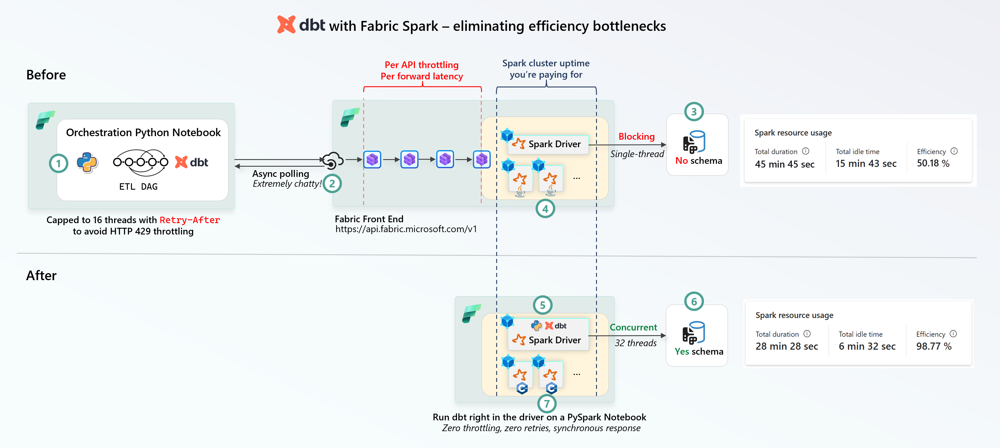
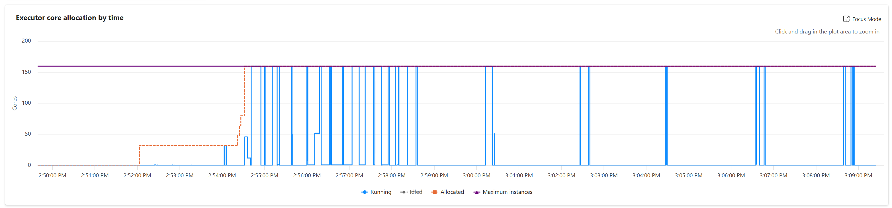
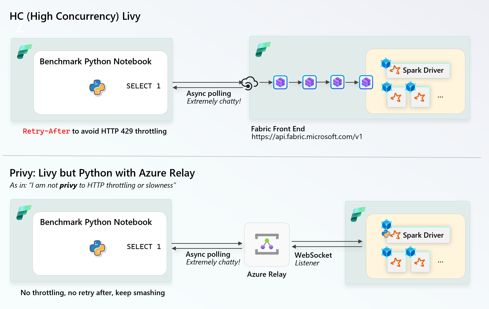

import { Callout, ExtLink, InlinePageLink } from "../../src/components/atoms.js"
import {
  LivyPrivyBenchmark,
  SparkNeeVisualizations,
} from "../../src/components/visualizations"

I've been working with the good folks on the Fabric Spark Engineering team on optimizing every nook and cranny of our dbt setup so we can onboard a LOT more data to OneLake. 

Here are my lessons learned.

<Callout>

I also started experimenting with live visualizations on this static blog using [hyparquet](https://github.com/hyparam/hyparquet).

</Callout>

## Before and after

Original architecture (1-4) VS new architecture (5-7):

1. A [standalone Python Notebook](https://learn.microsoft.com/en-us/fabric/data-engineering/using-python-experience-on-notebook) would fire [`dbtRunner`](https://docs.getdbt.com/reference/programmatic-invocations) as a lightweight orchestrator.
2. The dbt adapter would talk to the Fabric Platform Front end (`https://api.fabric.microsoft.com/v1`) per query - which would eventually - after several network hops - initialize a [Livy session for high concurrency](https://learn.microsoft.com/en-us/fabric/data-engineering/get-started-high-concurrency-livy). Any throttling ([`HTTP 429`](https://developer.mozilla.org/en-US/docs/Web/HTTP/Reference/Status/429)) would come back with a [`Retry-After`](https://developer.mozilla.org/en-US/docs/Web/HTTP/Reference/Headers/Retry-After), which is on average 60 seconds. Every single query would go through this same path, with multiple network hops.
3. Using a "classic" or no-schema lakehouse, we discovered that only a **single `DROP` and other catalog mutating operations can execute at a time** - i.e. the catalog enforces [a global semaphore](https://en.wikipedia.org/wiki/Semaphore_(programming)).
4. Running on a Spark 3.5 cluster without [Native Execution Engine (NEE)](https://learn.microsoft.com/en-us/fabric/data-engineering/native-execution-engine-overview?tabs=sparksql), Spark performs all operation on the row-wise [`InternalRow.scala`](https://github.com/apache/spark/blob/branch-3.5/sql/catalyst/src/main/scala/org/apache/spark/sql/catalyst/InternalRow.scala). This is the reality of Spark of the ye old days that we all know.
5. Run `dbtRunner` right on the driver-node, with no HTTP requests getting in the way. I created this execution mode [in this PR to `dbt-fabricspark`](https://github.com/microsoft/dbt-fabricspark/pull/273) with `method: session`
6. Migrated the dbt target to a [schema-enabled lakehouse](https://learn.microsoft.com/en-us/fabric/data-engineering/lakehouse-schemas), which comfortably allows 32 CTAS-es at once without any problem.
7. Running dbt on a Spark 3.5 cluster with NEE on.

Both used [Spark Dynamic Allocation](https://spark.apache.org/docs/latest/job-scheduling.html#dynamic-resource-allocation) with 8-200 Executors, 16 cores each.

The result is:

* About **~50%+** runs are faster on average
* Around **~99%** Executor efficiency - which is basically the best bin-packing you can get for your money
* Zero time wasted on retrying after throttling or async polling, hundreds of dbt tests rapid fire one after the other

<SparkNeeVisualizations />

  Visual design inspired (ahem...ripped off from) from{" "}
  <ExtLink link="https://www.hamiltonulmer.com/customer-dashboards-r2-hyparquet/">
    Hamilton Ulmer's gorgeous blog on Hyparquet
  </ExtLink>
  .

### Notes

* We're rolling out the changes above gradually from August 28th, everything is trending downwards - which means with zero infra allocation, everything is getting faster.
* The dbt model/query names names are anonymized.
* `dbt-1` and `dbt-2` are the smallest models (data volume wise) - only 1 GB or so, `dbt-4` is the largest - 100 TB or so.
* We had been optimizing all queries over the last month, but the "NEE rollout" marks when the above architectural improvements were deployed.

### Observations

* Our heaviest dbt model - `dbt-4` made the most gains. This makes sense, as the model scales up to 200 Large Executors, so the gains multiply linearly as each Executor works harder in the new setup.
* Number of queries (and therefore tests) are almost 3x faster without async polling, i.e. you can fire 3x more queries in the same pocket of time. This also multiplies the more tests you add.

## Livy vs. "Privy"

We found that during very, very heavy DAGs (22+ concurrency) with lots of little [dbt tests](https://docs.getdbt.com/docs/build/data-tests?version=2) - the dbt adapter async polling and retrying against the Livy API left our cluster Execution at horrendous levels due to a [retry storm](https://learn.microsoft.com/en-us/azure/architecture/antipatterns/retry-storm/):

So, I created a little library called [`mdrakiburrahman/privy`](https://github.com/mdrakiburrahman/privy), which basically uses [an Azure Relay](https://learn.microsoft.com/en-us/azure/azure-relay/relay-what-is-it#architecture-processing-of-incoming-relay-requests) to setup a direct ingress into a Spark Driver without any Livy hops.

<Callout>

I also added support to the dbt adapter for `method: privy` in an abandoned POC branch [here](https://github.com/microsoft/dbt-fabricspark/pull/262/changes), but did not merge it, because IMO the `method: session` approach is a lot more elegant with no additional Azure Relay infra overheady.
In the future, it would be ideal for Fabric Spark to have a direct ingress controller which minimizes latency, network hops, and throttling - similar to Privy or the [Fabric Data Warehouse Gateway](https://learn.microsoft.com/en-us/azure/azure-sql/database/connectivity-architecture?view=azuresql).

</Callout>

Here are the results from benchmarking Privy VS High Concurrency Livy with a simple `SELECT 1` query:

<LivyPrivyBenchmark />

So— the transport overhead is pretty real. If you have the option to do so, orchestrating dbt with Fabric Spark right inside the Driver Node allows you to max out your Spark Clusters.

## Lessons Learned

| C1                             | C2                                                                                                                                           | C3                                                                                                                             | C4                                                                                                                                                            |
| ------------------------------ | -------------------------------------------------------------------------------------------------------------------------------------------- | ------------------------------------------------------------------------------------------------------------------------------ | ------------------------------------------------------------------------------------------------------------------------------------------------------------- |
| **Component**                  | **Lessons Learned**                                                                                                                          | **Why**                                                                                                                        | **Comment**                                                                                                                                                   |
| dbt orchestration              | [`method: session`](https://github.com/microsoft/dbt-fabricspark/pull/273) on driver node with a small PySpark notebook is the most reliable | Instant response, maximum concurrency, reliability and bin packing                                                             | Livy is fine for local dev/test                                                                                                                               |
| Spark Version                  | 4.1 has the most optimizations, with dbt, you should always use the latest version of Spark since it's all SQL anyway                        | Latest innovations                                                                                                             | No reason not to use latest, Spark SQL is backward compatible, you gain nothing using an old version                                                          |
| NEE                            | Turning it on allows most queries to run 40% faster, it's only going to get faster over time                                                 | [SIMD](https://en.wikipedia.org/wiki/Single_instruction,_multiple_data)/Vectorized Execution makes the best use of modern CPUs | No reason not to turn it on, it's got unsupported operator fallback built in, you lose nothing                                                                |
| Dynamic Allocation/Autoscaling | This is how you can get 99% Executor Utilization, it's an **extremely** cost efficient way to run Spark on Fabric                            | As the dbt DAG pressure builds up, Spark adds more nodes, when pressure winds down, nodes go away                              | With the latest NEE version, the autoscaler task scheduling is extremely fast to scale out                                                                    |
| Schema on Lakehouse            | Concurrent catalog mutations is N-times faster than single-threaded mutations (like `DROP` statements)                                       | Self explanatory                                                                                                               | If you use dbt [full-refresh](https://docs.getdbt.com/reference/resource-configs/full_refresh?version=2), there's no "data migration" required, just run dbt! |

Happy COGS savings!