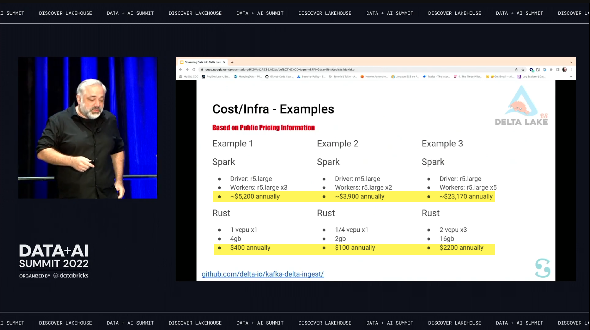
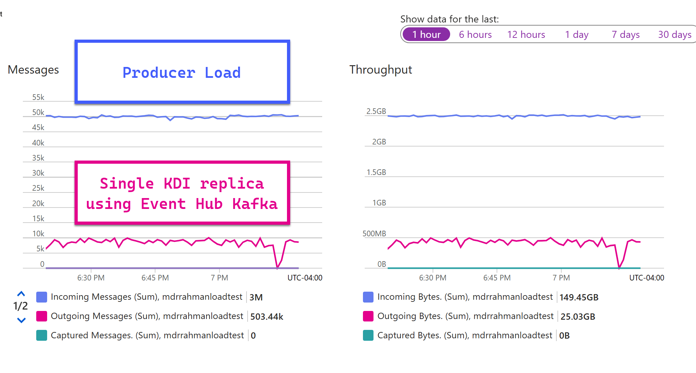

import { Callout } from "../../src/components/atoms.js"
import { ExtLink, InlinePageLink } from "../../src/components/atoms.js"

The basic premise of a **highly-efficient, ingestion focused app** is straightforward - get data from `A` to `B`, where:

1. `A` is a resilient, partitioned, contiguous pub-sub buffer with concurrent writer support, like Apache Kafka or Event Hub.
2. `B` is a `SQL`-friendly state store that supports [predicate pushdown](https://techcommunity.microsoft.com/blog/sqlserver/predicate-pushdown-and-why-should-i-care/385946), meaning when you supply a query predicate like `WHERE TIMESTAMP > ago(1d)`, the query engine avoids doing expensive full storage scans and reads a subset of the files. 

  So for example, Event Hub or Kafka is a great `A` and a terrible `B`, since to find a piece of data - say with [Apache Presto/Trino](https://trino.io/docs/current/connector/kafka-tutorial.html), you have to do slow, linear scans of potentially billions of records over the wire - since there is no indexing/skipping mechanism.

[Snowpipe](https://docs.snowflake.com/en/user-guide/data-load-snowpipe-intro) is an example of one such ingestion app that has single-handedly made Snowflake highly profitable by allowing end users to shovel data into it. [Delta Live Tables](https://learn.microsoft.com/en-us/azure/databricks/delta-live-tables/) is another example.

It's important this ingestion process is highly focused and efficient without unnecessary transformation engine overhead; otherwise, you pay a "Distributed applications COGS tax" (CPU/Memory/Disk) - say if you (ab)use a Stream Processing Engines for such simple ingestion - like [Apache Spark](https://spark.apache.org/docs/3.5.1/structured-streaming-programming-guide.html)/[Apache Flink](https://flink.apache.org/)/[Azure Stream Analytics](https://learn.microsoft.com/en-us/azure/stream-analytics/stream-analytics-introduction)/[Fabric Event streams](https://learn.microsoft.com/en-us/fabric/real-time-intelligence/event-streams/overview?tabs=enhancedcapabilities) etc (which is what most people rightfully do, since it's easy). 

Although the initial development cost is nothing (Spark Streaming takes [a couple lines](https://docs.delta.io/latest/delta-streaming.html#append-mode) to sink to Delta), when you combine:

```bash
# of use cases * # of events * time left on * infra overhead per job = $$$
```

Many others in the industry, including the folks at Scribd did a whole analysis on this specifically with a Delta Lake sink - see [blog](https://tech.scribd.com/blog/2021/kafka-delta-ingest.html), and [Data + AI Summit 2022 video - `16:10`](https://youtu.be/do4jsxeKfd4?si=o9gIkDmJEJQOneWD):




They wrote the [delta-io/kafka-delta-ingest](https://github.com/delta-io/kafka-delta-ingest) (AKA KDI) project in [Rust](https://www.rust-lang.org/) - which reads from Kafka clusters with [the `rdkafka` Rust Crate](https://crates.io/crates/rdkafka/0.23.1/dependencies). 

<Callout>

🛞 **Are ingestion apps like KDI reinventing the wheel?**
   
If you're building a regular old Business Intelligence batch-style pipeline with a small data volume coming in as a stream, these ingestion COGS don't realy matter much and you should just do what's easy with a couple Streaming Engine pipelines to Delta and call it a day.

But if you're building a 24/7 software product with millions of users, these costs add up over the days/months/years the more you leave it running - so it's important for Engineers of those products - people like me - to solve the engineering problems that helps reduce COGS multi-fold.

</Callout>

## Problems with `kafka-delta-ingest` and Event Hub

There's a couple major problems when you try to point KDI against an Azure Event Hub - in decreasing order of priority:

### Event Hub Kafka surface is not good at batching compared to AMQP
    
When you're trying to bulk deserialize to a sink that expects Parquet, the most important concept to nail down is batching so you don't end up with a million tiny Parquet files every hour.

The [Event Hub Kafka shim layer](https://learn.microsoft.com/en-us/azure/event-hubs/azure-event-hubs-kafka-overview) doesn't have full Kafka API coverage - see [an example of one of many issues](https://github.com/open-telemetry/opentelemetry-collector-contrib/issues/11846#issuecomment-1678721194). 

For this particular use case I'm interested in, Event Hub Kafka does not expose [sufficient knobs](https://learn.microsoft.com/en-us/azure/event-hubs/apache-kafka-configurations) to configure client-side batching behavior, compared to the large list of Kafka knobs [a real Kafka implementation like Confluent exposes](https://docs.confluent.io/platform/current/installation/configuration/consumer-configs.html#max-poll-records) - e.g. `max.poll.records`, and the equivalent the real Event Hub SDK built on [AMQP](https://en.wikipedia.org/wiki/Advanced_Message_Queuing_Protocol) exposes in [`EventProcessorClientOptions`](https://learn.microsoft.com/en-us/dotnet/api/azure.messaging.eventhubs.eventprocessorclientoptions?view=azure-dotnet) - such as [`PrefetchCount`](https://learn.microsoft.com/en-us/dotnet/api/azure.messaging.eventhubs.eventprocessorclientoptions.prefetchcount?view=azure-dotnet#azure-messaging-eventhubs-eventprocessorclientoptions-prefetchcount). 

These client SDK settings make batched reading easy with consistent throughput. It works mostly by taking advantange of the client side CPU threads and a predictable in-memory buffer over the underlying communication channel (e.g. AMQP) to eagerly poll and keep a batch of events ready-to-go for the end user of the SDK (me), in a highly reliable manner (by reusing underlying primitives like sockets, [`TaskFactories`](https://learn.microsoft.com/en-us/dotnet/api/system.threading.tasks.taskfactory?view=net-8.0) etc.).

Rust's `rdkafka` crate does not perform well with Event Hub Kafka, when you compare to Event Hub AMQP in other languages.

I'm not a Kafka or AMQP protocol expert, so it's important for me that the Client SDKs and publicly documented examples: "just get me data into my process's callback, fast".

<Callout>

🚫 **The fundamental problem**

So with KDI + Event Hub, you're essentially bottlenecked by your communication channel to the Event Hub source, a pretty terrible foundation to start on.

</Callout>

### In 2024, there is no production ready Event Hub AMQP Rust Crate

Which means contributing good Event Hub support into KDI is out the window, because there's no Microsoft maintained, production ready Event Hub Rust Crate, yet.

There's an up-and-coming one [here](https://github.com/Azure/azure-sdk-for-rust/tree/main/sdk/eventhubs/azure_messaging_eventhubs), but I spoke to the author, who mentioned it's not ready for Production yet. There's an [experimental one](https://docs.rs/azeventhubs/latest/azeventhubs/) built by a good samaritan - [see reddit](https://www.reddit.com/r/rust/comments/12yacqr/announcing_azeventhubs/) - that looks just like the C# SDK, but I can't take a dependency on that in Production due to supply chain risks - see [example](https://www.reddit.com/r/kubernetes/comments/1gll6uw/kaniko_unmaintained/?share_id=I14IlsIRdHNslX7Gl0CY4) - with single-maintainer projects like this (CVEs etc), in a language unknown to my team (Rust).

### KDI depends on a single writer process when flushing buffer

The KDI project does not co-ordinate transactions between replicas and does everything in-process.

Couple that with Delta Lake's [Optimistic Concurrency Control](https://docs.delta.io/latest/concurrency-control.html), it means when you have multiple replicas (like multiple [`Pods`](https://kubernetes.io/docs/concepts/workloads/pods/)), dealing with Delta metadata refreshes from conccurent transactions are your replicas' problem.

KDI relies on an [internal concurrent buffer](https://github.com/delta-io/kafka-delta-ingest/blob/main/src/value_buffers.rs) that's flushed when [buffer size or latency limit is reached](https://github.com/delta-io/kafka-delta-ingest/blob/b7638eda8642985b5bd56741de526ea051d784c0/src/lib.rs#L475), where a [_single writer_](https://github.com/delta-io/kafka-delta-ingest/blob/main/doc/DESIGN.md#application-design) is responsible for flushing that in-memory buffer to Delta, as a single transaction.

This means, the moment you introduce multiple replica processes, you increase the risk of getting into [the dreaded Delta Retry Storm](https://github.com/delta-io/delta-rs/discussions/2426) which [is an antipattern](https://learn.microsoft.com/en-us/azure/architecture/antipatterns/retry-storm/) - because Delta Lake does not have a good answer (ahem - any answer) for Concurrent Transactions today. 

<Callout>

🫸 Someone might say, but [Spark supports concurrent transactions into disjoint partitions in Delta Lake](https://github.com/delta-io/delta/issues/9#issuecomment-564364724)! The Delta Lake docs say [`INSERT`'s cannot conflict](https://docs.delta.io/latest/concurrency-control.html#write-conflicts)!

If you dig into it, you'll find Spark handles all of this in the client side with a lot of fairly complicated code - see [ConflictChecker.scala](https://github.com/delta-io/delta/blob/master/spark/src/main/scala/org/apache/spark/sql/delta/ConflictChecker.scala#L560) and [isolationLevels.scala](https://github.com/delta-io/delta/blob/master/spark/src/main/scala/org/apache/spark/sql/delta/isolationLevels.scala).

</Callout>

At the extreme end, if you throw say, 100 replicas at a 100 partition Event Hub Topic, you are guaranteed to get into a permanent retry storm, because `delta-rs` has [a finite number of retries](https://github.com/delta-io/delta-rs/blob/3f355d87119661fc7cf28877b620b589277ba1d1/crates/core/src/operations/transaction/mod.rs#L572) ([15](https://github.com/delta-io/delta-rs/blob/3f355d87119661fc7cf28877b620b589277ba1d1/crates/core/src/operations/transaction/mod.rs#L111) by default), there will always be a handful of replicas that are guaranteed to sit there, retrying forever, as their brethren commits their transactions, until the replicas loses the Event Hub partition leadership and sits there wasting infra.

<Callout>

🤬 **Client-side retries don't work at scale**

Relying on client-side retries as an isolation mechanism is extremely rudimentary and doesn't scale, specially on `APPEND` transactions that has zero-chances of conflict.

Can you imagine if regular old databases like Postgres or SQL Server made you retry when someone else was writing an unrelated row? 

In my humble opinion, besides lack of mutli-table transactions, this is the single largest problem with Delta Lake from being a seriously disruptive HDFS-backed state store today. We know this problem can be solved because there are database vendors like Azure SQL or MongoDB that stores data files in remote storage, Delta Lake just needs some engineering innovation to offer this feature, like yanking the logic out of Spark, and putting it into a language like Rust, that any client can invoke.

So that's basically the Delta Kernel.

Thankfully, the good folks building that project - which [`delta-dotnet` uses](https://github.com/delta-incubator/delta-dotnet/pull/89) are [looking into solving this for blind `APPEND`s soon](https://github.com/delta-incubator/delta-kernel-rs/issues/377#issue-2573721298), but the code is not written yet.

</Callout>

Our use case requires the ability to flush an arbitrarily large number of events, which means we need an arbitrarily large buffer, which means we cannot do things in a single replica. 

Distributed Mutexes using [pessimistic global locking](https://en.wikipedia.org/wiki/Lock_(computer_science)#Database_locks) cannot scale horizontally when you're trying to flush an ever growing in-memory buffer concurrently, each of your replicas **must** have the ability to parallel flush. You essentially build up a traffic jam of events that either results in getting `OOMKill`-ed, or your event deserialization coming to a grinding halt.

<Callout>

💡**Delta Bulk Upload**

In fact, [the authors](https://www.buoyantdata.com) of `delta-rs` and `kafka-delta-ingest` built this [`oxbow`](https://github.com/buoyant-data/oxbow/tree/main/lambdas/sqs-ingest) project as a workaround to this problem - for "Delta Bulk Upload".

The idea is, clients blind-append Parquet with zero chance of conflicts, which distributed object stores like S3/ADLS/GCS etc will happily let you do. Then you use `oxbow` to read AWS S3 SNS notifications to find [what Parquet was written](https://github.com/buoyant-data/oxbow/blob/5cb7b022236c41d776d65aeb49a7716fac57b38b/tests/data/s3-event-multiple.json#L30), and **bulk update** the Delta Transaction log.

BAM, the next time you read the Delta table, all those parquet files are loaded. If your "bulk-uploader" process crashes, no problem, SNS is durable, just reprocess from your checkpoint.

</Callout>

### Teething problems with Rust

I don't know Rust. Neither does my team, we're all Dotnet experts. 

Learning syntax aside, adopting a new language into your product requires a bunch of future-facing CICD investments. 

Unless it's an all-up-strategy, adopting it only for a single ingestion app is wasteful. Making the pattern work in Dotnet opens up doors for wider internal adoption.

You can always have both, Rust for certain use cases, and Dotnet for others. It never hurts to have a Dotnet-native pattern for something, because of how vast the project is from the billions of dollars Microsoft has invested into the ecosystem.

### Benchmark: `kafka-delta-ingest` single writer VS `delta-dotnet` multi writer

Unfortunately, even a very large tank of a KDI replica would not have been able to keep up with our load generator. We were falling short by about **1/5th**, the bottleneck was the Event Hub Kafka client's lack of batch configuration knobs:



In the rest of this blog, let's explore how to build a similar app like KDI in C#, that can perform across multiple replicas, and produce results like this:


<Callout>

📉 The little dip above is a [helm chart upgrade](https://helm.sh/docs/helm/helm_upgrade/) during the test, I didn't have A/B rollout configured.

</Callout>

We've completely flipped the narrative around - our load generator cannot create enough events to stress the sink. 

Not only are we able to obliterate past arbitrarily large event backlogs with stable, flatline performance, but in my test above, the bottleneck was the 16 PU Event Hub in my dev env. With [dedicated event hubs](https://learn.microsoft.com/en-us/azure/event-hubs/event-hubs-dedicated-overview), we can probably gain multiple more folds in throughput.

---

## Demo

Here's a short demo of:

1. Near instant reaction and scale up across 3 Event Hub topics.
2. Creating fresh delta tables
3. Flushing parquet
4. Performing bulk upload
5. Scaling down to zero replicas when the work is done

`youtube:https://www.youtube.com/embed/hsBMnUX4Pfc`

## Delta Dotnet Sink Architecture

<Callout>

📖 **Open Sourcing this Dotnet App?**

Unlke KDI - which is a general purpose plug-and-play OSS project, this app I worked on is tightly coupled with a bunch of internal business logic, which means, it's not really designed to be a standalone an OSS project, yet.

So instead, let's focus on the lessons learned and design patterns in Dotnet that applies everywhere when dealing with very large in-memory buffers that happens to end in a Delta Lake sink, doing this at-scale was the tricky part.

Delta Lake was a fairly exotic type of sink, at least in the Dotnet ecosystem, until now 🙂.

</Callout>

### Diagram

The architecture below was heavily influenced by the [OpenTelemetry-Collector Exporter Helper](https://github.com/open-telemetry/opentelemetry-collector/blob/main/exporter/exporterhelper/README.md) library, something we make heavy use of in Golang. The difference is, the Dotnet Architecture below offers at-least-once guarantee thanks to Event Hub checkpoints, whereas OpenTelemetry is mostly best-effort, with a ["filesystem persistent queue"](https://github.com/open-telemetry/opentelemetry-collector/blob/main/exporter/exporterhelper/README.md#persistent-queue) that's a lot less durable compared to Event Hub (e.g. pod eviction means your data is gone).


### Pseudocode

1. [**KEDA Azure Event Hub connector**](https://keda.sh/docs/2.16/scalers/azure-event-hub/) monitors Event Hub offsets per partition and the committed offsets. If a threshold exceeds, the KEDA Operator asks [**Kubernetes Horizontal Pod Autoscaler**](https://keda.sh/docs/2.7/concepts/#architecture) to schedule new replicas.
2. Replica starts up, a class implementing a base class override of [`PluggableCheckpointStoreEventProcessor<TPartition>`](https://github.com/Azure/azure-sdk-for-net/blob/main/sdk/eventhub/Azure.Messaging.EventHubs/samples/Sample08_CustomEventProcessor.md) takes ownership of one or more partitions, and begins to eagerly poll events in an inaccessible AMQP buffer, managed by the Event Hub SDK.
3. In a "push" model the Event Hub SDK calls back the registered [`delegate`](https://learn.microsoft.com/en-us/dotnet/csharp/programming-guide/delegates/) called [`OnProcessingEventBatchAsync`](https://learn.microsoft.com/en-us/dotnet/api/azure.messaging.eventhubs.eventprocessorclient.onprocessingeventbatchasync?view=azure-dotnet) with a list of [`EventData`](https://learn.microsoft.com/en-us/dotnet/api/azure.messaging.eventhubs.eventdata?view=azure-dotnet). 

   Since the Event Hub SDK does not currently expose the ability for an end-user to request pausing of the AMQP poller, we need a custom Memory Throttle Gate to cap our buffer. 
   
   This is done elegantly (compared to [`Task.Delay`](https://learn.microsoft.com/en-us/dotnet/api/system.threading.tasks.task.delay?view=net-8.0)) using [`System.Threading.ManualResetEvent`](https://learn.microsoft.com/en-us/dotnet/api/system.threading.manualresetevent?view=net-8.0) to gate all partitions assigned to the replica, as soon as our `delegate` is invoked.

   We essentially "freeze" the ingestion until memory is freed from buffer parquet flush.
   
   In this Event Hub Processor SDK "push" model, the Memory Gate ensures the process memory does not go beyond a pre-defined limit, say, 90% of the Pod's [`Limit`](https://kubernetes.io/docs/concepts/configuration/manage-resources-containers/#requests-and-limits). Throttling incoming events gives more time for the buffer in `7` to flush, releasing memory pressure by the CLR Garbage Collector, as soon as the buffered variables go out of the method's scope (C# GC is pretty great, at least much easier to use compared to JVMs).

4. The Batch Orchestrator with the registered `delegate` above forwards the Event Batch to a **Sink Transaction Provider**. It can also do other things, like recording latency, emitting metrics about the batch, etc.
5. The **Sink Transaction Provider** is responsible for generating a resilient "transaction" against one or more sinks. It does so using a **Sink Transaction Record**.
6. The **Sink Transaction Record** is an object storing the list of `EventData`, Event metadata (offset, partition etc.), and a list of [`System.Threading.Tasks`](https://learn.microsoft.com/en-us/dotnet/api/system.threading.tasks.task?view=net-8.0) that represents the pending task of flushing to a Sink.
7. A given **Sink**, say for Delta Lake, requires a **Sink Buffer Provider**, since we want to build up a bigger batch to flush to Parquet. It stores this data in a rented [`ArrayPool<T>`](https://learn.microsoft.com/en-us/dotnet/api/system.buffers.arraypool-1?view=net-8.0), which decreases memory pressure during Garbage Collection, as allocated memory blocks are reused for large arrays. A [`SemaphoreSlim`](https://learn.microsoft.com/en-us/dotnet/api/system.threading.semaphoreslim?view=net-8.0) is used when appending to this array to ensure thread safety.
8. The **Sink Transaction Record**, which contains the "pending work" to flush to all sinks, is stored in a [`ConcurrentDictionary<Partition, Queue<SinkTransactionRecord>`](https://learn.microsoft.com/en-us/dotnet/api/system.collections.concurrent.concurrentdictionary-2?view=net-8.0). We are effectively building up a mini-view of the Event Hub in this buffer, where each offset is represented as a list of pending `Tasks`.

   At this point, we return control to the Event Hub SDK again, the time elapsed to add to buffer in this 8 step process so far is on the order of milliseconds. We have effectivelly built up 2 buffers rapidly (as fast as we can read from Event Hub, without running out of memory and throttling ourselves):

   1. The sink specific buffer (`7`), and;
   2. The partition checkpoint buffer (`8`) containing the pending tasks for the offset's across all owned partitions.

9. A [`System.Threading.Timer`](https://learn.microsoft.com/en-us/dotnet/api/system.threading.timer?view=net-8.0) callback evaluates the size of the buffer, and the latency since the last buffer flush. If exceeded, it invokes the Delta Writer Client to initiate a flush.
10. The Delta Dotnet writer Client initiates the flush.
11. For flushing parquet, [`parquet-dotnet`](https://github.com/aloneguid/parquet-dotnet) is used to flush the `EventData` as `BinaryData`/`byte[]`, alongside Hive Style partitions e.g. `YearMonthDate=20241110`. 

    Upon rigorous benchmarking, we chose this library over [`delta-rs`](https://github.com/delta-io/delta-rs) (Arrow `RecordBatch` transfer to Rust) or [`ParquetSharp`](https://github.com/G-Research/ParquetSharp) (C++ FFI), as both requires data transfer via globally allocated pointers over [P/Invoke](https://learn.microsoft.com/en-us/dotnet/standard/native-interop/pinvoke), which was susceptible to memory leak during our high throughput tests.

    Memory is the most important component in this critical application, and it's extremely important to have full control over the Garbage Collection process - which is arguably the only reason we're using Dotnet in the first place. 
    
    We decided that, if we're going to leave post-Parquet-flush memory relief to the other side of an FFI, we might as well write the app in Rust for peace of mind against dealing with runaway pointers causing Memory Leak pains - which are sometimes near impossible to spot and debug (good luck freezing your distroless container image and generating a [`dotnet-dump`](https://learn.microsoft.com/en-us/dotnet/core/diagnostics/dotnet-dump)).

12. Once the flush completes, it uses an [`EventHubProducerClient`](https://learn.microsoft.com/en-us/javascript/api/@azure/event-hubs/eventhubproducerclient?view=azure-node-latest) to write the metadata (parquet location), similar to `oxbow`'s [SQS Ingest](https://github.com/buoyant-data/oxbow/tree/main/lambdas/sqs-ingest). We could have used [Event Grid Blob Storage Events](https://learn.microsoft.com/en-us/azure/storage/blobs/storage-blob-event-overview), but using an Event Hub seems more natural, and less tied to the Storage Layer (e.g. this delta-bulk-uploader works locally).

    Once the transaction completes, a [`TaskCompletionSource<bool>`](https://learn.microsoft.com/en-us/dotnet/api/system.threading.tasks.taskcompletionsource-1?view=net-8.0) is set to `true`. 
    
    This completes the "receipt" for the queued transaction being completed now.

13. A `System.Threading.Timer` traverses over all partitions, looking for `Tasks` that are [`IsCompleted`](https://learn.microsoft.com/en-us/dotnet/api/system.threading.tasks.task.iscompleted?view=net-8.0).

    If the sink transaction **succeeded**, it updates the Event Hub Blob Checkpoint by invoking the [`UpdateCheckPointAsync`](https://learn.microsoft.com/en-us/dotnet/api/azure.messaging.eventhubs.eventprocessorclient.updatecheckpointasync?view=azure-dotnet) Method that we stored as a `delegate` in our buffer from the callback (so we can just blind fire the ready to go delegate and await it).
    
    If the sink transaction **failed despite retries** (rare), we have no choice but to send it to a [Dead Letter Queue](https://en.wikipedia.org/wiki/Dead_letter_queue) to retry later; e.g. a dedicated Event Hub Topic.

    This completes our at-least-once guarantee.
  
14. That parquet metadata we persisted to a single partition Event Hub queue in `12` is fed into a special purpose single-replica of this same code that deals solely with Delta Transaction Logs (orders of magnitude less volume). Except this time, it updates the Delta Transaction log with the Parquet files that are already persisted in OneLake.
15. We use another in-memory buffer here to bulk update the Delta Transaction Log, so we end up with nicely sized JSON files.

### Sample `appsettings.json`

The Appsettings.json below lets us see what behavior we can tweak in the architecture.


```json
{
  // Settings to configure parquet writer
  "ParquetDotnetWriterConfiguration": {
    // Parquet Dotnet compression algorithm
    "CompressionMethod": "Snappy",
    // Parquet Dotnet compression setting
    "CompressionLevel": "SmallestSize",
    // If the flush in step 11 fails - e.g. network I/O timeout from outbound saturation of the Pod, cleanup the files before retrying
    "ParquetCleanUpOnCancel": true
  },
  // Replication configuration, can be multiple source/sink permutations
  "EventHubReplicationConfiguration": {
    "ReplicationConfiguration": [
      {
        // The source, usually an Event Hub
        "SourceEventHubConfiguration": {
          // Event Hub Authentication using AKS Workload Identity
          "EventHubAuthType": "WorkloadIdentityCredential",
          // Event Hub namespace
          "Namespace": "your-event-hub-fqdn.servicebus.windows.net",
          // Event Hub Topic name
          "Name": "your-partitioned-topic-with-lots-of-events",
          // Event Hub Tenant ID
          "EventHubTenantId": "...",
          // Event Hub Consumer Group for these writer replicas
          "ConsumerGroupName": "delta-dotnet-writer-app",
          "IngestionConfiguration": {
            // Number of Batch Orchestrator threads to spin up in this proc, allows better thread utilization during local testing
            "NumOrchestrators": 1,
            // Number of events in a batch, per CPU
            "MaxBatchSizePerCpu": 50,
            // Event Hub SDK setting, number of events to eagerly fetch
            "PrefetchCount": 3000,
            // Event Hub SDK setting, limit buffer size - useful if single events are very large (e.g. 1 MB)
            "PrefetchSizeInMegaBytes": 10,
            // Event Hub SDK setting, receive timeout to get an empty heartbeat callback (keep-alive)
            "ReceiveTimeout": "00:01:00",
            // Event Hub SDK setting, retry on failure
            "RetryDelay": "00:00:01",
            // Event Hub SDK setting, forfeit partition ownership if no activity
            "PartitionOwnershipExpirationInterval": "00:02:00",
            // Event Hub SDK setting, partition load balancing interval
            "LoadBalancingUpdateInterval": "00:00:30",
            // Event Hub SDK setting, start from earliest event in topic
            "EventHubDefaultOffset": "Earliest",
            // Memory Throttle Gate: evaluates memory usage on this timer
            "MemoryUsageEvaluationInterval": "00:00:05",
            // Memory Throttle Gate: if memory exceeds, maximum throttle will be this long before the Event is allowed through, even if memory pressure exists
            "MaxMemoryUsageThrottleDuration": "00:01:00",
            // Memory Throttle Gate: if memory exceeds this, throttling starts, events across all partitions are locked using a System.Threading.ManualResetEvent
            "MaxMemoryUsageInMegaBytes": 1024
          }
        },
        // The parquet sink
        "SinkParquetConfiguration": [
          {
            // DFS Authentication using AKS Workload Identity
            "OneLakeAuthType": "WorkloadIdentityCredential",
            // Onelake Workspace ID
            "WorkspaceId": "your-workspace-id",
            // Onelake Sink path
            "OneLakePath": "raw/eventhub/your-event-hub-fqdn/your-partitioned-topic-with-lots-of-events",
            // Onelake DFS endpoint, based on the cloud
            "OneLakeDfsEndpoint": "onelake.dfs.fabric.microsoft.com",
            // Onelake tenant id
            "OneLakeTenantId": "...",
            // Enum can be: ParquetSharp, ParquetDotnet, DeltaRs etc.
            "ParquetWriterType": "ParquetDotnet",
            // Partition column style, supports multiple hive style partitions
            "PartitionColumns": [ "YearMonthDate" ],
            "SinkConfiguration": {
              // Timeout for the Parquet flush operation
              "BufferFlushTimeout": "00:03:00",
              // Timer callback checks if buffer flush conditions are met
              "BufferFlushEvaluationInterval": "00:00:01",
              // Maximum number of events to store in the buffer. Larger = more memory usage
              "MaxBufferSize": 512,
              // Maximum time elapsed since last flush, allows us to keep data fresh
              "MaxBufferLatency": "00:00:30"
            },
            "DeltaBulkLoadConfiguration": {
              // Event Hub Authentication using AKS Workload Identity
              "EventHubAuthType": "WorkloadIdentityCredential",
              // Event hub namespace
              "EventHubNamespace": "your-event-hub-fqdn.servicebus.windows.net",
              // Single partitioned event hub for Parquet Metadata
              "EventHubName": "delta-bulk-loader",
              // Event Hub Tenant ID
              "EventHubTenantId": "..."
            }
          }
        ],
        // The Event Hub blob checkpoint
        "BlobCheckpointConfiguration": {
          // Storage Account for Event Hub checkpoints
          "StorageAccountName": "your-blob-storage",
          // Storage Container for Event Hub checkpoints
          "StorageContainerName": "delta-dotnet-checkpoints",
          // Maximum number of retries to update checkpoint
          "MaxRetries": 10,
          // Starting delay between reries
          "RetryDelay": "00:00:01",
          // Maximum delay between reries
          "RetryMaxDelay": "00:00:05",
          // Retry backoff
          "RetryMode": "Fixed",
          // Timeout for network connections via HttpClient
          "NetworkTimeout": "00:00:30"
        },
        // The Partition checkpoint provider in 13
        "BatchedSinkTransactionConfiguration": {
          // Maximum timeout of a blob checkpoint operation
          "CheckpointUpdateTimeout": "00:03:00",
          // Evaluates whether or not new transactions have completed with this timer
          "CheckpointUpdateEvaluationInterval": "00:00:01",
          // Maximum number of partitions to update checkpoints for. More means increased chances of failure due to Network I/O failures
          "CheckpointUpdateEvaluationMaxDegreeOfParallelism": 10,
          // Maximum number of contiguously successful transactions to batch in a partition, before updating the checkpoint. Higher means in case of replica restart, we reprocess this many duplicate events
          "CheckpointUpdateMaxOffsetsBatchedPerPartition": 128,
          // Whether or not a dead letter queue implementation is present in the codebase
          "DeadLetterQueueSupported": false
        }
      }
    ]
  }
}
```

## Lessons Learned

1. It’s important for the proc writing Parquet to use managed code, without any FFI boundaries for memory management. If you delegate this important task to an [FFI implementation](https://en.wikipedia.org/wiki/Foreign_function_interface) because you don't want to write Parquet, you're going to have a hard time at very large scale from corner cases of pointers and [GCHandle](https://learn.microsoft.com/en-us/dotnet/api/system.runtime.interopservices.gchandle?view=net-8.0) release misses.
   
   Also, operations over the FFI is atomic. When parquet + transaction log updates are done in sync, retry storm means you are continuously in a failing loop of recreating `RecordBatch` pointers and retrying, which leads to extreme memory pressure, if those pointers aren't immediately releaed to the OS for some reason, see [`jemalloc`](https://github.com/delta-io/delta-rs/issues/2068#issuecomment-1889624741) problem with Arrow.

   Chasing memory deallocation bugs are problems you don't want to deal with, specially when it's not your code that might have the bug.

   These bugs are  possible in Rust too, the borrow checker's ownership guarantees goes out the window in an [`unsafe`](https://doc.rust-lang.org/book/ch19-01-unsafe-rust.html) context. Rust can't do anything at compile time when you're responsible for deallocating a pointer some other programming language sent at runtime.

2. It’s also important for the proc writing Delta Trx logs to use the latest protocol, FFI boundaries are OK here, since you're essentially dealing in JSON. As soon as the [Delta Kernel closes this issue](https://github.com/delta-incubator/delta-kernel-rs/issues/377#issue-2573721298), your proc can enjoy writing Parquet in managed code, and always enjoy being on the [latest Delta Writer protocol](https://docs.delta.io/2.0.0/versioning.html).
   
   As of 2024, wrapping `delta-rs` is the best bet.

3. Decoupling `1` (parquet flush) and `2` (transaction log update) above is **the key to unlocking arbitrarily large throughput to Delta Lake**. Bulk uploading Delta Transaction Log updates allows us to bypass the concurrent writer problem.

   The rest of the problem is easy using fancy Dotnet constructs like `TaskCompletionSource` and `ManualResetEvent`, as we discussed above - none of that stuff is difficult.

   The infrastructure bin packing problem is also easy, if you're using Kubernetes with KEDA or HPA - it's just YAML.

---

Check out the [`delta-dotnet`](https://github.com/delta-incubator/delta-dotnet) project here to take it for a spin!