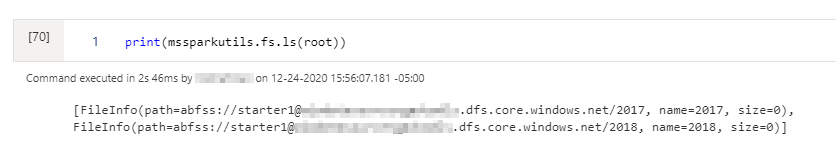
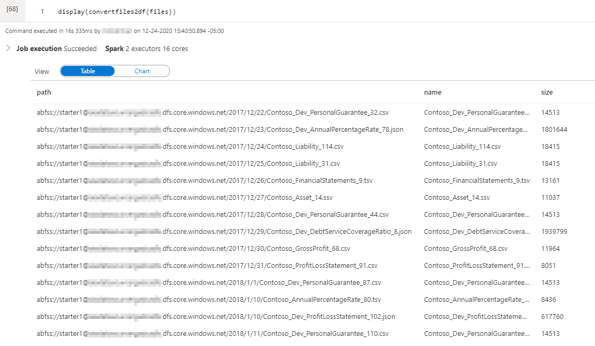

import { Callout } from "../../src/components/atoms.js"
import { ExtLink, InlinePageLink } from "../../src/components/atoms.js"

By default, [`mssparkutils`](https://docs.microsoft.com/en-us/azure/synapse-analytics/spark/microsoft-spark-utilities?pivots=programming-language-python#list-files) file listing capabilities don't come with a recursion flag - probably by design.

One of the gotchas I ran into when going through a recent [OpenHack](https://openhack.microsoft.com/) was manually clicking through a Data Lake with a hefty number of file sources and partitions. I was in my Synapse notebook crunched for time, wishing there was a way to recursively list all files from a root directory, to figure out what DataFrames I needed to import, what the schema looks like, what the transformation pipeline is going to look like etc.

The out-of-the-box `mssparkutils.fs.ls('path')` command returns something like this:



We're also left with the default formatting above, as the `display()` command is geared towards DataFrames. Calling `display(mssparkutils.fs.ls(root))` returns:

```bash
AssertionError: dataType <py4j.java_gateway.JavaMember object at 0x7fa481050358> should be an instance of <class 'pyspark.sql.types.DataType'>
Traceback (most recent call last):

  File "/home/trusted-service-user/cluster-env/env/lib/python3.6/site-packages/notebookutils/visualization/display.py", line 96, in display
    df = _convert(data)
```

Since `mssparkutils.fs.ls(root)` returns a list object instead.

## `deep_ls` & `convertfiles2df` for Synapse Spark Pools

<Callout>

⚠️ Running recursion on a Production Data Lake with a large number of small files isn't a very good idea. Recursive listing is only suitable for speeding up development.

</Callout>

The following functions functionally achieve **recursion** and **pretty printing** in Synapse Spark Pool notebooks:

```python
def deep_ls(path: str, max_depth=1):
    """
    List all files and folders in specified path and
    subfolders within maximum recursion depth.
    """

    # List all files in path
    li = mssparkutils.fs.ls(path)

    # Return all files
    for x in li:
        if x.size != 0:
            yield x

    # If the max_depth has not been reached, start
    # listing files and folders in subdirectories
    if max_depth > 1:
        for x in li:
            if x.size != 0:
                continue
            for y in deep_ls(x.path, max_depth - 1):
                yield y

    # If max_depth has been reached,
    # return the folders
    else:
        for x in li:
            if x.size == 0:
                yield x

def convertfiles2df(files):
    """
    Converts FileInfo object into Pandas DataFrame to enable display
    """
    # Disable Arrow-based transfers since the Pandas DataFrame is tiny
    spark.conf.set("spark.sql.execution.arrow.enabled", "false")

    schema = ['path','name','size']
    df = pd.DataFrame([[getattr(i,j) for j in schema] for i in files], columns = schema).sort_values('path')
    return(df)
```

For `convertfiles2df`, we're basically taking the list returned by `mssparkutils.fs.ls`, and converting it into DataFrame, so it works with the notebook `display` command.

```python
# Get files
files = list(deep_ls(root, max_depth=20))

# Display with Pretty Printing
display(convertfiles2df(files))
```

The example call above returns:



Much easier on the eye, and saves going through all the folders manually!

<Callout>

📦 Full example script available in GitHub [here](https://gist.github.com/mdrakiburrahman/dade03380b8907c85341ece18c795e4e).

</Callout>
