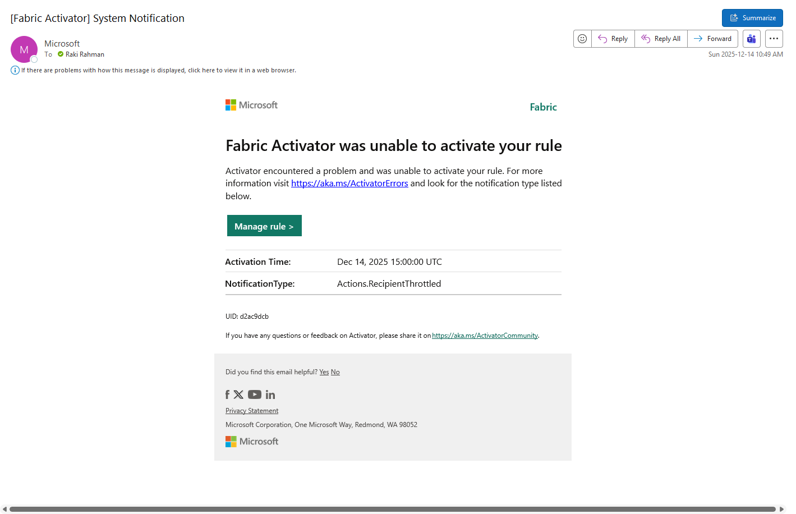

import { Callout } from "../../src/components/atoms.js"
import { ExtLink, InlinePageLink } from "../../src/components/atoms.js"

Say you have a few 1000 Spark Jobs that are wrapped in a few 1000 Pipelines.

In Synapse, you could pipe all execution logs into a Log Analytics workspace, and use [this approach](https://www.c-sharpcorner.com/article/monitor-azure-synapse-analytics-using-log-analytics/) to setup a generic alert that sent a notification on any pipeline failure:


And get, say, a Teams Alert like this:


The official [Fabric Data Factory docs](https://learn.microsoft.com/en-us/fabric/data-factory/create-alerts-for-pipeline-runs) at the time of writing has 2 approaches:

1. Per activity level alert inlined in the pipeline.
2. Using Fabric Activator Job Events, that monitors particular pipelines.

`1` is messy to author and manage.

`2` means you end up having 1000 rules. You can also forget to add a pipeline to a rule and have silent failures.

There are lots of people complaining [on Reddit](https://www.reddit.com/r/MicrosoftFabric/comments/1lk08x9/ideas_data_pipeline_failure_notification/) about how this is difficult. Since the Log Analytics KQL approach worked in Synapse for me, the Fabric Eventhouse KQL approach should work here too.

Let's look at the easiest approach that works for all 1000 pipelines in one shot.

## How to

First, you must [turn on Workspace Monitoring](https://learn.microsoft.com/en-us/fabric/fundamentals/workspace-monitoring-overview) so Fabric Platform level tables are automatically sinked into Eventhouse:


This `ItemJobEventLogs` from [here](https://learn.microsoft.com/en-us/fabric/fundamentals/item-job-event-logs#considerations) is the important table:


From there, create a rule with this KQL:

```sql
ItemJobEventLogs
| extend SecondsAgo = datetime_diff('second', now(), ingestion_time())
| where JobType == 'Pipeline' and JobStatus == 'Failed' and SecondsAgo <= 540
| order by Timestamp desc
| project Timestamp, SecondsAgo, ItemName, WorkspaceName, JobScheduleTime, JobStartTime, JobEndTime, JobStatus
```

Create the alert:


Fail some demo pipeline:


It triggers the Reflex:


And there's your alert:


It works at scale since the Eventhouse buffers the data, and you can come back and query history easily 😊.

## Caveat

### Activator must fire within the poll time for at-least once guarantees

<Callout>

There's a couple gotchas in the KQL above. To avoid getting all historical failures all the time, we set `and SecondsAgo <= 540` (or `9m`). This seemingly random `9m` decision comes with caveats.

</Callout>

What the stateless query assumes is the Reflex itself is always running. It's a single-point-of-failure for your event notifications:

1. The Reflex **must** poll KQL at a faster interval than the lookup (say every `5m`). The repercussion of that is, this alerting engine isn't exactly once, if the Reflex trigger clocks overlap inside the 9 minute window, you get the same alert twice (which is fine, you just need an alert). If the Reflex never fires, you never get an alert that you should have gotten.

2. We're using Eventhouse ingestion time as the watermark (and not event time), so even if the ingestion is delayed, we maximize our chances of getting an alert as long as the Reflex runs in the next `9m`.

Note that if Activator Reflex is down - you seem to get this sort of an email - if you get that, you may have had silent failures:



### This solution is not exactly-once guarantee

The way to solve this problem is when the Reflex runs, we must store watermark state somewhere and construct the query with it, this isn't trivial since Reflex doesn't have a programmatic interface.

It's interesting, in the Log Analytics approach - [state](https://learn.microsoft.com/en-us/azure/azure-monitor/alerts/alerts-overview#alerts-and-state) is managed by the platform, but that's not the case for Activator at this time.

Hopefully stateful Activator queries that run off KQL comes as a feature one day.

To get exactly-once, we can always use Spark Streaming (since it stores state in checkpoints), but that requires managing yet another SPOF thing (we're trying to monitor Spark Jobs here, don't use the thing to monitor the thing!).

### Aesthetic

The only final criticism I have is I can't embed more emojis into the Fabric Activator Teams Alert 😡.
