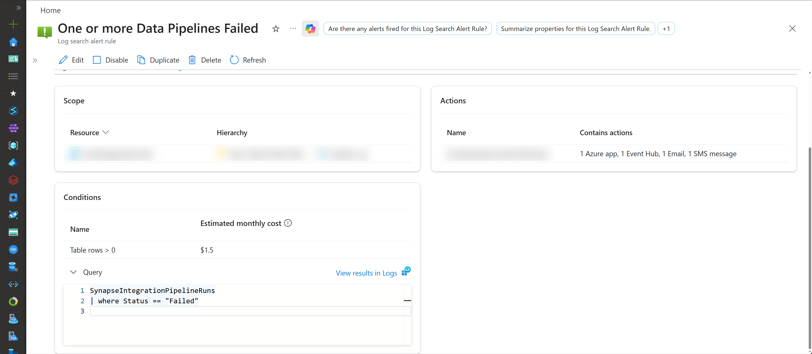
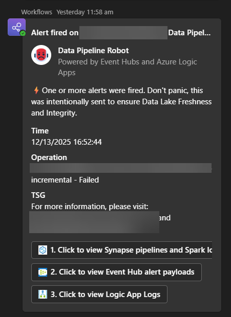
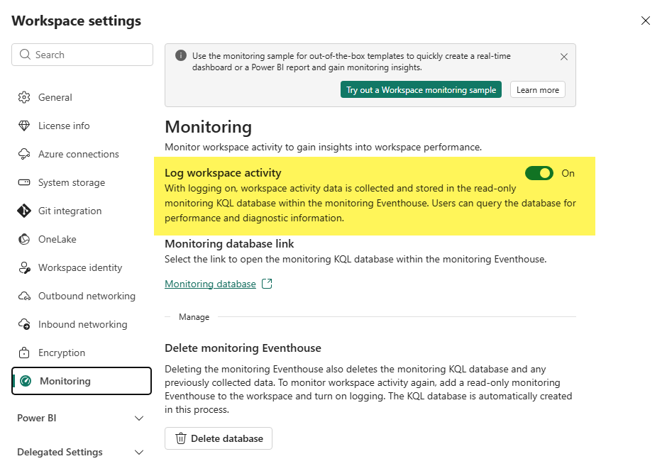
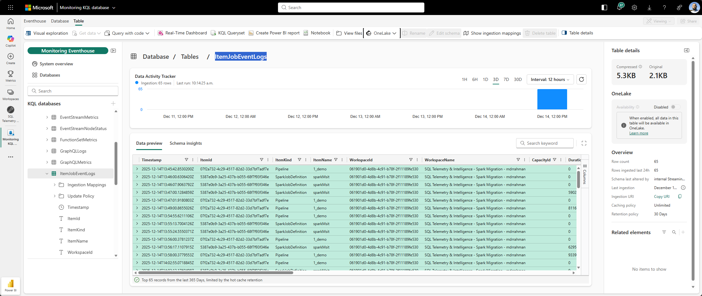
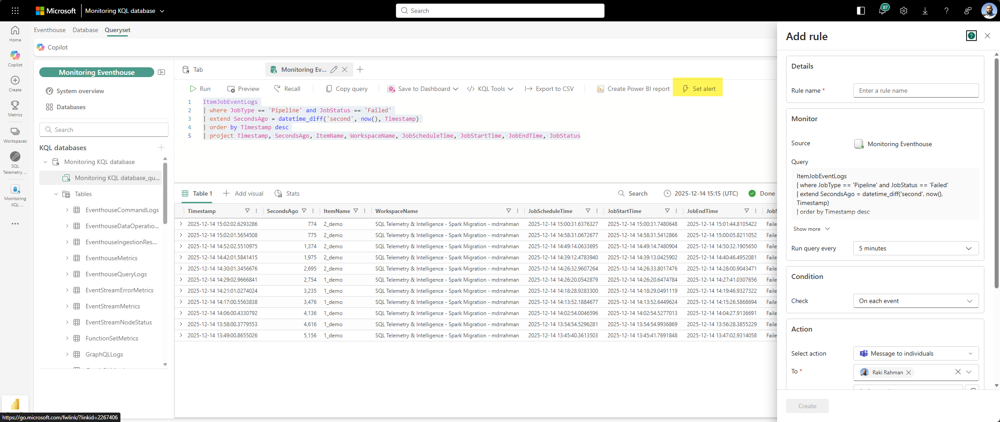
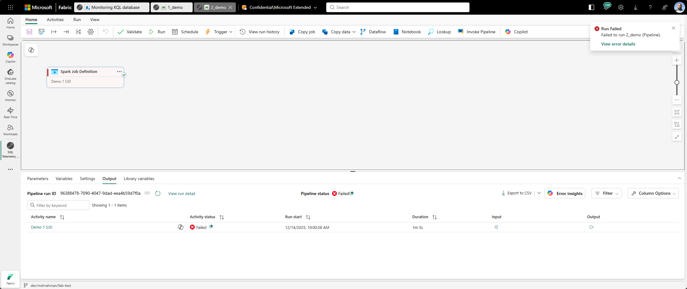
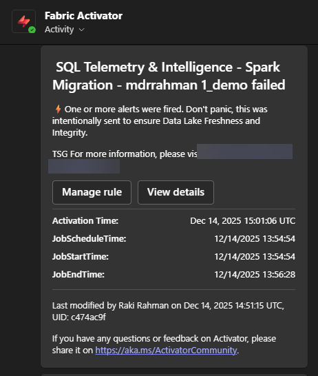

import { Callout } from "../../src/components/atoms.js"
import { ExtLink, InlinePageLink } from "../../src/components/atoms.js"

Say you have a few 1000 Spark Jobs that are wrapped in a few 1000 Pipelines.

In Synapse, you could pipe all execution logs into a Log Analytics workspace, and use [this approach](https://www.c-sharpcorner.com/article/monitor-azure-synapse-analytics-using-log-analytics/) to setup a generic alert that sent a notification on any pipeline failure:



And get, say, a Teams Alert like this:



The official [Fabric Data Factory docs](https://learn.microsoft.com/en-us/fabric/data-factory/create-alerts-for-pipeline-runs) at the time of writing has 2 approaches:

1. Per activity level alert inlined in the pipeline.
2. Using Fabric Activator Job Events, that monitors particular pipelines.

`1` is messy to author and manage.

`2` means you end up having 1000 rules. You can also forget to add a pipeline to a rule and have silent failures.

There are lots of people complaining [on Reddit](https://www.reddit.com/r/MicrosoftFabric/comments/1lk08x9/ideas_data_pipeline_failure_notification/) about how this is difficult. Since the Log Analytics KQL approach worked in Synapse for me, the Fabric Eventhouse KQL approach should work here too.

Let's look at the easiest approach that works for all 1000 pipelines in one shot.

## How to

First, you must [turn on Workspace Monitoring](https://learn.microsoft.com/en-us/fabric/fundamentals/workspace-monitoring-overview) so Fabric Platform level tables are automatically sinked into Eventhouse:



This `ItemJobEventLogs` from [here](https://learn.microsoft.com/en-us/fabric/fundamentals/item-job-event-logs#considerations) is the important table:



From there, create a rule with this KQL:

```sql
ItemJobEventLogs
| where JobType == 'Pipeline' and JobStatus == 'Failed'
| extend SecondsAgo = datetime_diff('second', now(), Timestamp)
| order by Timestamp desc
| project Timestamp, SecondsAgo, ItemName, WorkspaceName, JobScheduleTime, JobStartTime, JobEndTime, JobStatus
```



Fail some demo pipeline:



It triggrs the Reflex:


And there's your alert:



It works at scale since the eventhouse buffers the data, and you can come back and query history easily 😊.

## Caveat

The only criticism I have is I can't embed more emojis into the Fabric Teams Alert 😡.
