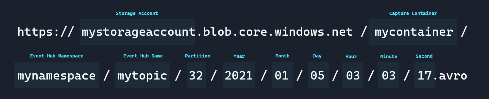
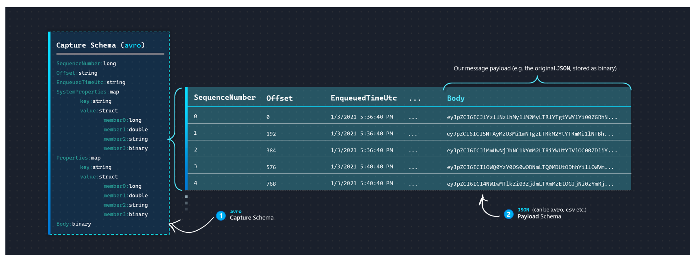
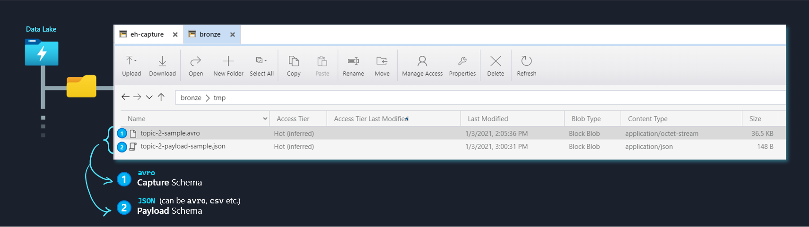
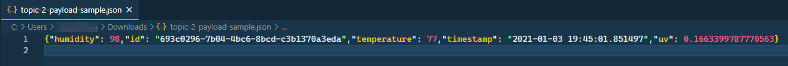
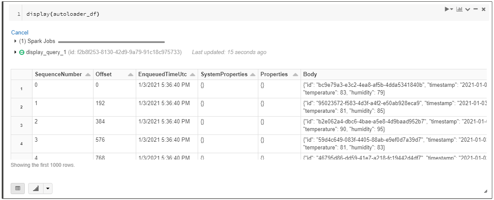
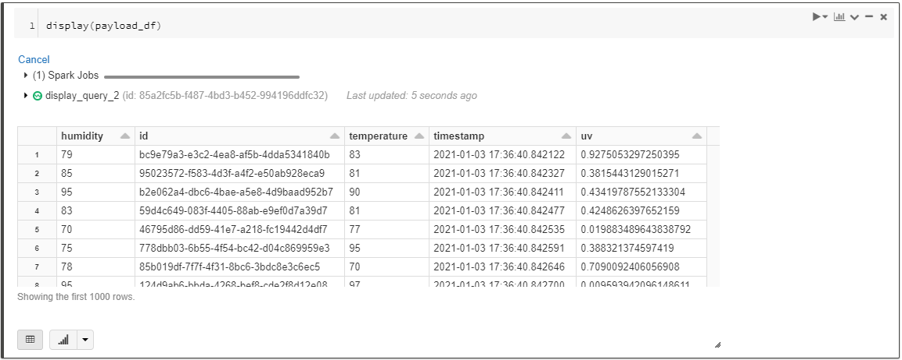

import { Callout } from "../../src/components/atoms.js"
import { ExtLink, InlinePageLink } from "../../src/components/atoms.js"

[Event Hub Capture](https://docs.microsoft.com/en-us/azure/event-hubs/event-hubs-capture-overview) is a reliable, hassle-free and cost-effective way to easily ingest Event Hub data in a Data Lake, enabling a number of downstream use cases, such as:

- Going beyond the 7 day retention period: [link](https://docs.microsoft.com/en-us/azure/event-hubs/event-hubs-faq#what-is-the-maximum-retention-period-for-events)
- Analytical exploration on historical data: a great article [here](https://medium.com/streaming-at-scale-in-azure/streaming-at-scale-with-event-hub-capture-79c30fb9f3e5)
- And the general flexibility that comes with having a managed event deserialization pipeline (without Event Hub Capture, we'd otherwise have to implement the pipeline from scratch)

Once Capture is set up with a [couple clicks](https://docs.microsoft.com/en-us/azure/event-hubs/event-hubs-capture-enable-through-portal#capture-data-to-azure-storage), captured data is written in `avro` format with the semantics below:


At this point, we have full creative freedom on how we want to process these `avro` files.

The most straightforward way would be for us to process the incoming data in batches and persist/UPSERT into a relational store (e.g. [Delta Tables](https://docs.databricks.com/delta/delta-update.html#upsert-into-a-table-using-merge), [Synapse SQL Pools](https://docs.microsoft.com/en-us/sql/t-sql/statements/merge-transact-sql?view=sql-server-ver15)), similar to any average Batch Ingestion pipeline (couple articles here on batch ingesting Event Hub Capture files: [1](https://caiomsouza.medium.com/processing-event-hubs-capture-files-avro-format-using-spark-azure-databricks-save-to-parquet-95259001d85f), [2](http://blog.itaysk.com/2017/01/14/processing-event-hub-capture-files-using-spark), [3](https://simonlearningsqlserver.wordpress.com/category/databricks/)).

<Callout>

💨 To skip straight to the pipeline, click [here](#the-pipeline).

</Callout>

## Why Autoloader?

There are a couple fundamental disadvantages with the traditional approach:

- We miss out on creating an **[Event-Driven](https://talks.rmoff.net/nw3OuA/the-changing-face-of-etl-event-driven-architectures-for-data-engineers)** pipeline.

  Every time a new file is being dropped into our Storage Account, Azure's infrastructure captures an ["Event"](https://docs.microsoft.com/en-us/azure/storage/blobs/storage-blob-event-overview), and makes the event metadata (e.g. _what/when_) available to us via an [Event Grid](https://docs.microsoft.com/en-us/azure/event-grid/overview). We can choose to build downstream pipelines that "react" to these events (or queue them up and process them _as a stream_ with [`Trigger.Once`](https://databricks.com/blog/2017/05/22/running-streaming-jobs-day-10x-cost-savings.html)), allowing for tighter, more efficient end-to-end integration (rather than processing on a timer based schedule).

  When we process the capture data as a batch, we're essentially not taking advantages of these Events. As a result, say we schedule the Batch job every hour, there might be times when we process a large number of events (peak times), at other times, the job might run only to find there are no events to process at all.

  Using an Event-Driven pipeline allows us to minimize the backlog, and is a more efficient and elegant solution.

- Using the logic in the articles linked earlier showcases scanning the _entire_ set of captured `avro` files into a DataFrame (fine for demo purposes), before we process it (UPSERT etc.), which can quickly become inefficient as the dataset grows in proportion to time.

  Of course, we can build in some sort of watermark/data-skipping logic into our pipeline (in addition to Spark's inherently [lazy](../spark-certification-study-guide-part-1/#dataframe-transformations-vs-actions-vs-operations) execution semantics, we can specifically tell it to only read in files from the capture folder _after_ this time), but that requires us to design/implement/maintain that logic.

  Using an Event-Driven pipeline lets us skip this altogether.

Databricks [Autoloader](https://docs.microsoft.com/en-us/azure/databricks/spark/latest/structured-streaming/auto-loader) allows us to process incoming files by combining the main components driving an Event-Driven pipeline (configuring an Event Grid to listen to ADLS, setting up [queues](https://docs.microsoft.com/en-us/azure/storage/queues/storage-queues-introduction) etc.) into an abstracted source called [`cloudFiles`](https://docs.microsoft.com/en-us/azure/databricks/spark/latest/structured-streaming/auto-loader#use-cloudfiles-source).

In this article, I wanted to share a sample design pattern on how we can apply Autoloader to process Event Hub Capture files.

<Callout>

📝 If you're not familiar with Autoloader, take a look at the illustrated view in [this article](../braze-to-synapse-with-autoloader-illustrated/).

</Callout>

## The Pipeline

<Callout>

💡 I wrote this article in response to a [request](https://github.com/mdrakiburrahman/rakirahman.me/issues/2). If you have any interesting ideas for an article, feel free to open an issue on GitHub [here](https://github.com/mdrakiburrahman/rakirahman.me/issues/new)!

</Callout>

### Producer

For our event producer, we have a simple Python script available in this [article](https://docs.microsoft.com/en-us/azure/event-hubs/event-hubs-capture-python#create-a-python-script-to-send-events-to-your-event-hub), writing data into Event Hub as JSON payloads, where each event looks like this:

```json
{
  "humidity": 93,
  "id": "b4e4de2c-fb40-4313-8d6e-22f7d70ca75d",
  "temperature": 99,
  "timestamp": "2021-01-03 20:08:33.893592",
  "uv": 0.8591755189878726
}
```

For this Event Hub, we can quickly enable Capture through the [Azure Portal](https://docs.microsoft.com/en-us/azure/event-hubs/event-hubs-capture-enable-through-portal#capture-data-to-azure-storage).

The key point to note here that will influence our design options going forward, is how we chose to serialize the payload. In this case, we went with `JSON`, which as we'll shortly see, influences our options on how we can deserialize the payload downstream (i.e. in Spark).

<Callout>

💡 Great article [here](https://www.confluent.io/blog/avro-kafka-data/) on why using `avro` is a better idea for serializing payloads compared to `JSON`.

</Callout>

### Schema Parsing: capture (`avro`) and payload (`json`)

Structured Streaming (which is the Spark API Autoloader [uses](https://docs.microsoft.com/en-us/azure/databricks/spark/latest/structured-streaming/auto-loader#use-cloudfiles-source)), requires us to explicitly specify the schema via `.schema(<schema definition>)` when we declare the DataFrame. Spark documentation [here](https://spark.apache.org/docs/latest/structured-streaming-programming-guide.html#schema-inference-and-partition-of-streaming-dataframesdatasets) describes this further.

Event Hub Capture stores our payload in `avro` format, with the following schema:



There's **2** places here where we need to supply Spark with the schema:

1. **Capture Schema**: i.e. the schema of the `avro` file from Event Hub capture. This schema is not likely to change very often - since it's managed by Azure and same for everyone (i.e. it's agnostic to our payload).
2. **Payload Schema**: i.e. the schema of our payload from the `Body` column - which for this example is `json`. This schema is tied to our application logic.

At this point, there are **3** methods we can leverage to supply Spark with the schemas above:

#### Method 1: `Sample payload file`

We can supply Spark with **sample files** (one for each of our schemas above), and have Spark infer the schema from these sample files before it kicks off the Autoloader pipeline.



Note that in case of `JSON`, Spark expects the data to be delimited per line (similar to [JSONL](https://jsonlines.org/)):


For Event Hub capture, we can simply copy any of the `avro` files generated by Capture into `{topic}-sample.avro`.

Then, we can read in these sample files and construct the schema at runtime:

```python
# 1. Capture schema
capture_tmp = spark.read.format("avro").load("/mnt/bronze/tmp/{}-sample.avro".format(topic))
capture_schema = capture_tmp.schema

# 2. Payload schema
payload_tmp = spark.read.json("/mnt/bronze/tmp/{}-payload-sample.json".format(topic))
payload_schema = payload_tmp.schema

```

If the payload schema changes, we need to simply upload a new file into the same location. For this demo, since our payload is in `JSON` (not supported by Azure Schema Registry yet), this is the method we'll be using.

<Callout>

⭐ If we were using an `avro` payload, **Method 3** would hands down be the most elegant path forward.

</Callout>

Although this isn't as elegant as using a Schema Registry (**Method 3**), it still saves us the pain of defining the Schema structure by hand (**Method 2**).

#### Method 2: `Define schema in code`

Without using sample files, we can define the schema ourselves in code via `StructType`: [example](https://sparkbyexamples.com/spark/spark-sql-structtype-on-dataframe/), and then by doing something like this:

```python
# ...
# Read in Avro Data from Capture with the same methods of defining the schema as below, into `autoloader_df`
# ...

payload_schema = StructType([
                StructField("humidity", LongType(), True),
                # ... Other columns
                ])

payload_df = autoloader_df \
            .select(from_json(col("Body"), defined_schema).alias("json_payload")) \
            .select("json_payload.*") \
            # ... Perform other operations
```

The **benefit** here is, we don't have to worry about managing the sample payload file.

The **disadvantage** is, the bits of code above for our `StructType` definition becomes the source of truth for the schema, which is not very dynamic - i.e. if the schema changes, we have to go into the code and update it. Also, if the schema is particularly complex (nested fields etc.), we need to write it all out ourselves.

#### Method 3: `Use Azure Schema Registry`

The most robust implementation would be to use Azure Schema Registry - illustrated [here](../azure-schemaregistry-spark/).

However it's not immediately relevant for this particular use case since our `Body` is in `JSON` (at the time of writing, Azure Schema Registry currently only supports `avro` payloads for now - [link](https://docs.microsoft.com/en-us/azure/event-hubs/schema-registry-overview#schemas)).

### Consumer: Autoloader with Method 1 for Schema Parsing

<Callout>

💡 We gloss over the Autoloader setup details below. Article explaining technical details on setting up Autoloader from scratch [here](../braze-to-synapse-with-autoloader).

</Callout>

Now that we've dealt with the Capture Schema and Payload Schema, the Autoloader pipeline is no different than any other implementation.

We pass in `capture_schema` first to read in the capture dataframe `autoloader_df`:

```python
autoloader_df = (spark.readStream.format("cloudFiles")
                 .options(**cloudFilesConf)
                 .option("recursiveFileLookup", "true") # This lets us ignore folder level partitioning into the incoming Dataframe
                 .schema(capture_schema) # Event Hub Capture schema inferred from avro
                 .load("wasbs://{}@{}.blob.core.windows.net/{}/{}/".format(capture_container, adls_account, eh_namespace, topic))
                )

# Convert Body from Binary to String
autoloader_df = autoloader_df.withColumn("Body", autoloader_df["Body"].cast(StringType()))
```



Then, to get our original payload back, we pass in `payload_schema` and use `from_json`:

```python
payload_df = autoloader_df \
              .select(from_json(col("Body"), payload_schema).alias("json_payload")) \
              .select("json_payload.*")
```

Note how we're able to get back our original payload, without manually defining the schema in code - thanks to the sample file:



We now have our Event Hub Capture being parsed by the Autoloader pipeline, available in `payload_df`.

At this point, we're free to do whatever we want, such as writing to Delta Tables:

```python
(payload_df.writeStream
  .format("delta")
  .trigger(once=True)
  .outputMode("append")
  .option("checkpointLocation", "your-checkpoint-location")
  .start("your-delta-table-path")
)
```

## Wrap Up

We explored how to use Autoloader to process Event Hub Capture files in an Event-Driven manner.

The main takeaway here was figuring out how to deal with schema parsing for both the Capture `avro` files and our Payload (`json` for today) - we passed sample files over to Spark to infer the schema before kicking off Autoloader, but also discussed why using Azure Schema Registry would further strengthen the pipeline, had we used `avro` payloads.

<Callout>

📦 Full consumer script available in GitHub [here](https://gist.github.com/mdrakiburrahman/5a0bc0c55eebe5173ed54a8db5e394c4).

</Callout>
