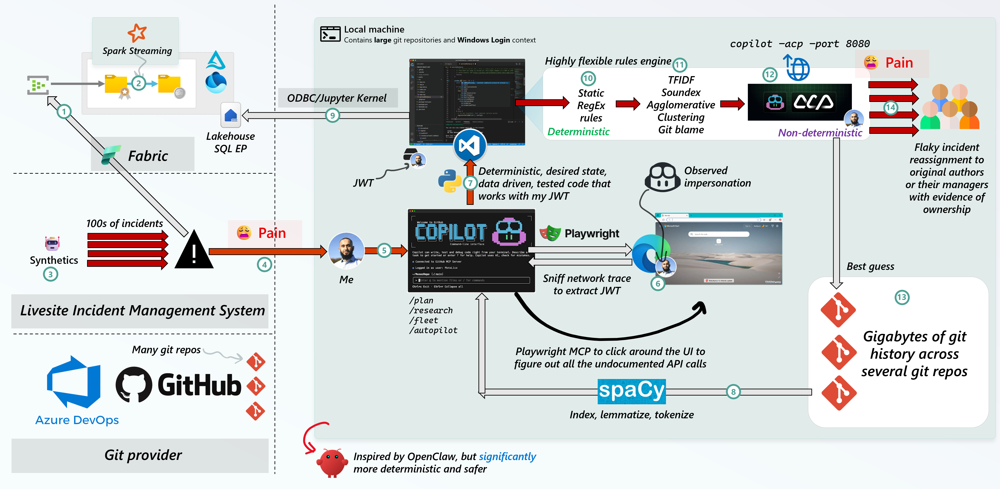
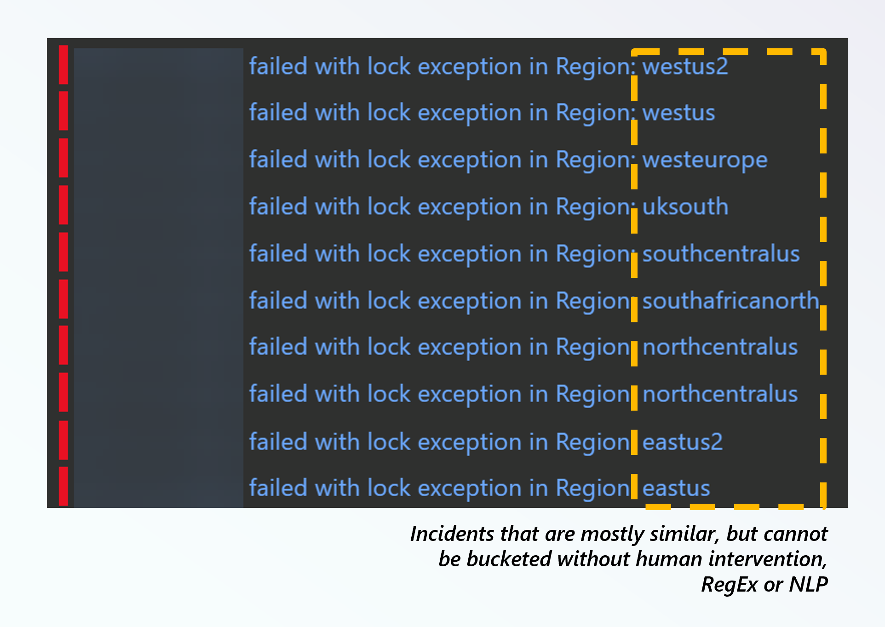
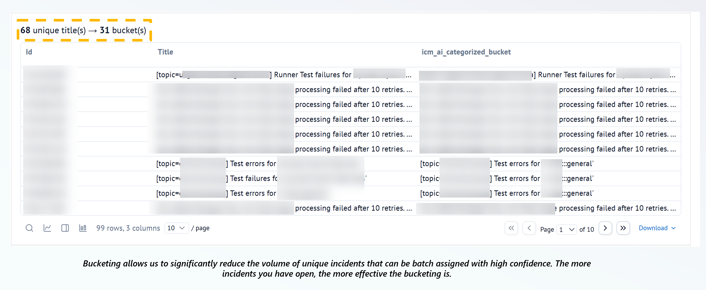
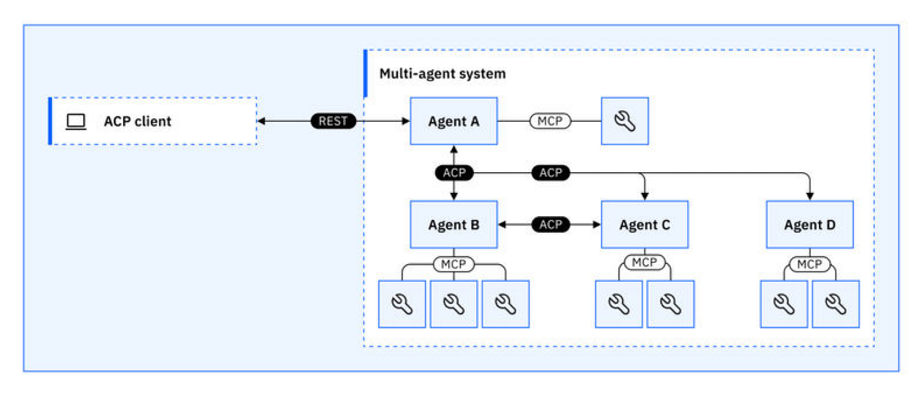
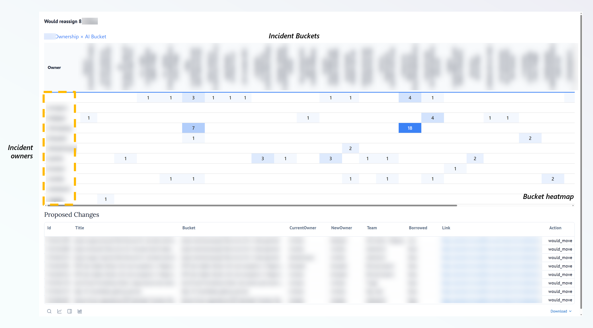
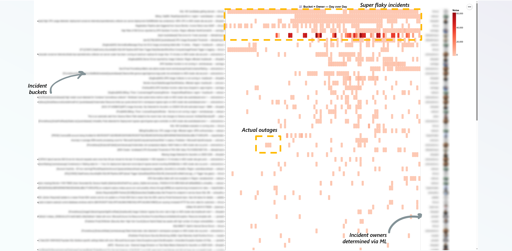
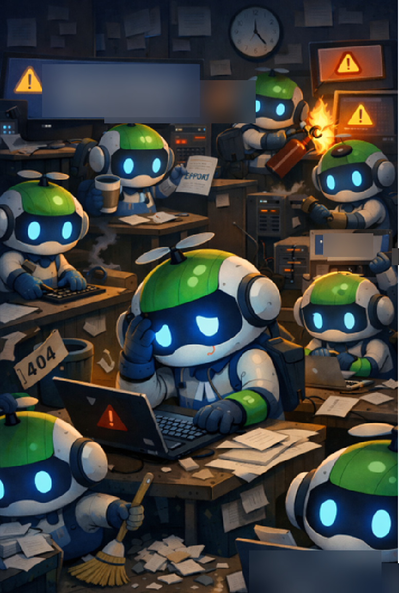

import { Callout } from "../../src/components/atoms.js"
import { ExtLink, InlinePageLink } from "../../src/components/atoms.js"

I was on-call for livesite duty the last couple of weeks and getting blasted with flaky incidents.

These incidents come from both old and new code and do not have clear ownership assignment - this information is buried in git breadcrumbs somewhere, which could have gone through several refactorings. 
The original authors could also have left the company, and a "soft ownership handover" would have been done to someone who has never touched that code since.

This results in a textbook definition of what we call [toil](https://sre.google/sre-book/eliminating-toil). By Google SRE definition:

<QuoteBlock author="Vivek Rau" source="Site Reliability Engineering: How Google Runs Production Systems">
    If you're performing a task for the first time ever, or even the second time, this work is not toil. 
    Toil is work you do over and over. 
    If you're solving a novel problem or inventing a new solution, this work is not toil.
</QuoteBlock>

[OpenClaw](https://openclaw.ai/) is fascinating for a single reason: it can impersonate you and has access to your local filesystem, which contains personal information.

I wanted to take this concept and see if I could apply it to my situation, without actually using OpenClaw.

Basically, my takeaway is, if you can combine:

1. Traditional [desired state](https://en.wikipedia.org/wiki/Finite-state_machine)/long-running apps
2. Browser automation to rapidly extract API signatures and turning it into handler code
3. Unfettered access to real-time telemetry and source-of-truth APIs
4. Some good old Machine Learning via deterministic Natural Language Processing
5. The ability to invoke state of the art LLM models that have access to your local filesystem

You can effectively solve any problem while having a ton of fun doing it 😁

<Callout>

I won't go into details about the specific incident management system since it's not universally relevant, but this should apply to systems like [ServiceNow](https://www.servicenow.com/) or [PagerDuty](https://www.pagerduty.com/).

</Callout>

The OpenClaw-inspired system below was mostly vibe coded in Python (due to the rich set of NLP libraries) with a couple manual tweaks here and there. 

I just thought up creative ideas, validated the assumptions with [/research](https://docs.github.com/en/copilot/tutorials/copilot-chat-cookbook/communicate-effectively/synthesizing-research?versionId=free-pro-team%40latest&productId=copilot&restPage=get-started%2Cfeatures) mode, and used [/fleet](https://docs.github.com/en/copilot/concepts/agents/copilot-cli/fleet) mode to generate functionally correct code extremely rapidly (not production ready, but it drives the point home extremely well), while dealing with livesite incidents:



1. The incident management system sends event data to an Event Hub ([Fabric EventStream](https://learn.microsoft.com/en-us/fabric/real-time-intelligence/event-streams/overview?tabs=enhancedcapabilities) or regular Event Hub)
2. The data is multiplexed tables, with extremely nested JSON schemas. We use [Spark Streaming](https://spark.apache.org/docs/latest/streaming/index.html) to make quick work of parsing it into Delta Tables with [schema-on-read](https://spark.apache.org/docs/latest/sql-data-sources-json.html) and [recursive explosions](https://stackoverflow.com/questions/39275816/exploding-nested-struct-in-spark-dataframe).
3. I go on-call, and a barrage of 100s of incidents come to the incident queue. They're _mostly_ similar looking, but are sometimes bound to different regions or have slightly different root cause symptoms (e.g. `lock exception`), so you cannot group them into one bucket without using your eyes:

  

4. Self-explanatory, I receive 100s of TODOs as email notifications. Textbook toil.
5. After I got sick of trying to manually group/bucket/triage, I reached for [GitHub Copilot CLI](https://github.com/features/copilot/cli) to throw together a Python project with a [Marimo Notebook](https://marimo.io/) entrypoint.

  

  <Callout>

  The fundamental benefit of Marimo versus traditional Jupyter Notebook is the fact that it's not an `ipynb` file; the exact same code runs as a long running app with a main entrypoint. The UI is also quite nice.

  </Callout>

6. The incident management system we use has a rich set of undocumented APIs that interface with the browser. To figure out the AuthN and the API signatures, I pointed Copilot CLI against [microsoft/playwright-mcp](https://github.com/microsoft/playwright-mcp). 

  This allowed it to very rapidly click around the UI at the hyperlinks I hinted it towards, and figure out all the API calls required to extract data out of the site using paging, and convert it into [Pandas DataFrames](https://github.com/pandas-dev/pandas). The data size is small, and Pandas works with all ML libraries, speed isn't relevant here, so it's a no-brainer.

7. Using [playwright package with Python bindings](https://pypi.org/project/playwright/), the app is able to launch a headless browser to refresh the token. It is effectively long running with a self-healing token refresh mechanism (I left it on for a week in an infinite loop).

8. Before the app launches, GitHub Copilot builds an index of the code by pivoting on code authors per file, see `git blame --porcelain` [docs](https://git-scm.com/docs/git-blame). 
   
   It wasn't very sophisticated - just enough to get by, a simple python program that basically reads code files as text, tokenizes and [lemmatizes](https://en.wikipedia.org/wiki/Lemmatization) it (remove stopwords).
   This was basically an attempt to build a glorified lookup dictionary of human authors to files to terms.

   The key here is, since Copilot and Python have access to Gigabytes of source code and git history on my NVMe backed hard drive, iterating on this algorithm in `/fleet` mode across CPUs was extremely fast. 
   I added some unit tests to place rigid rules around what I **know** to be the correct ownership, and Copilot iterated around the test case to tune the algorithm until it passed.

   This is basically a poor man's [test/train split](https://scikit-learn.org/stable/modules/generated/sklearn.model_selection.train_test_split.html).

9. Various telemetry data, including service logs and incident telemetry is available on Fabric, which the app queries via the new [Microsoft ODBC Driver for Microsoft Fabric Data Engineering (Preview)](https://learn.microsoft.com/en-us/fabric/data-engineering/spark-odbc-driver).

   We opt for the Lakehouse endpoint as the Spark SQL's surface area for Regex, JSON and string manipulation covers a wider surface area than Fabric SQL Endpoint (albeit the latter is often faster at what it does best).
   We can also use Catalyst Functions and UDFs to expose regular code as SQL functions, see [postgres/teradata functions for Spark](https://github.com/yaooqinn/itachi/tree/main/src/main/scala/org/apache/spark/sql/catalyst/expressions).

10. For terminology we for sure know is owned by an individual, we assign it with 100% determinism via good old RegEx.

11. Then, for lesser confidence but still 100% deterministic behavior, we apply [TFIDF](https://scikit-learn.org/stable/modules/generated/sklearn.feature_extraction.text.TfidfVectorizer.html), [Soundex](https://en.wikipedia.org/wiki/Soundex) and [Agglomerative clustering](https://en.wikipedia.org/wiki/Hierarchical_clustering).
    
    This effectively allows us to bucket the incidents above:

    
    
12. The super fun part. For incidents where you have no idea what to do via ML, you can launch Copilot CLI **as an HTTP server** via [ACP support](https://github.blog/changelog/2026-01-28-acp-support-in-copilot-cli-is-now-in-public-preview/).

    What that means is, since Copilot CLI is hooked up to all your organization's MCP servers **AND** your local filesystem, your app can just communicate with it like a regular HTTP API, with access to several cutting edge models alongside the context:

    ```bash
    copilot --acp --port 8080
    ```

    

    <Callout>

    🤯 This was the big brain moment for me, where you basically give a traditional, deterministic app an "escape hatch" to use AI when all else fails.

    See [Agent Client Protocol](https://agentclientprotocol.com/get-started/introduction).

    </Callout>

13. The Copilot CLI is hooked up with several MCP servers it can reach out to based on the prompt, including searching through and reasoning over git.

14. File the incident against the rightful owner per bucket, with a rich visualization of time series trends:

    

    

## Code

Since most of the business logic is tied to the internal incident management system, I can't share the whole app.

But the most interesting bit is the bucketing algorithm, see [incident-bucketing.py](https://gist.github.com/mdrakiburrahman/137012f17f0c51d65a40f416e77a636c).

## Verdict

I gave the app a cheeky little name - "The Janitor":



I'm working on containerizing it and taking it into Production to significantly reduce toil. We can also have the Copilot CLI spawn sub-agents to triage buckets asynchronously and attempt to fix the code/synthetic bug.