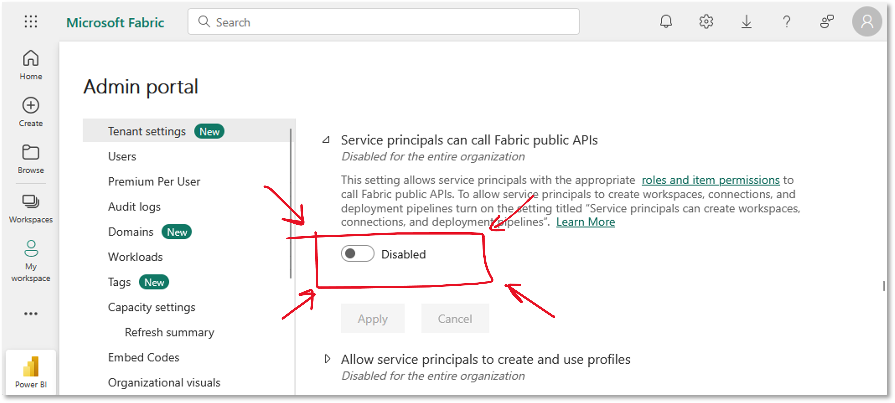
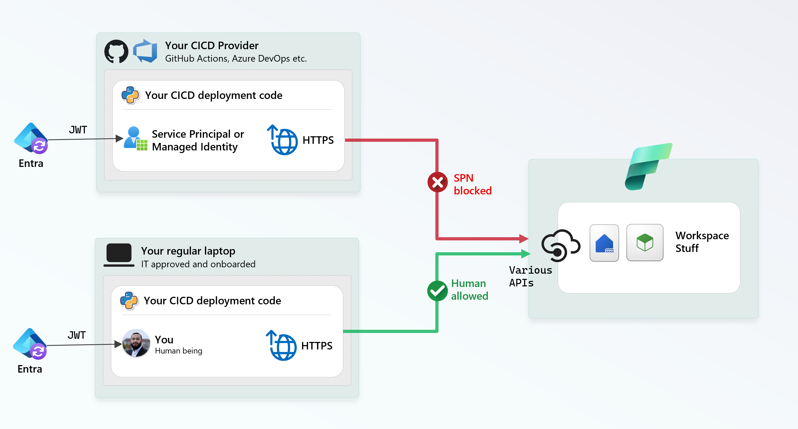
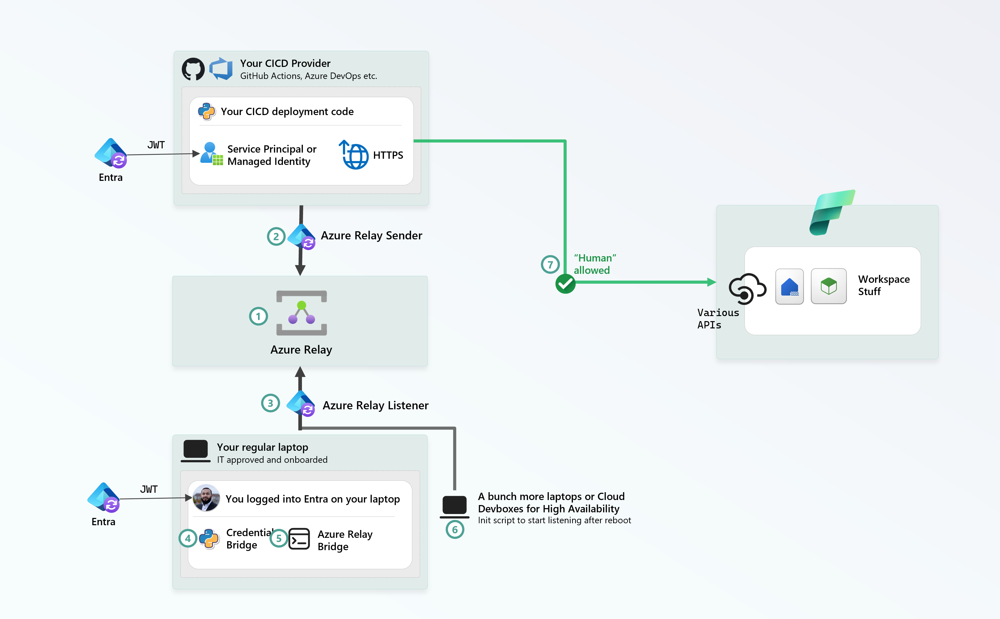
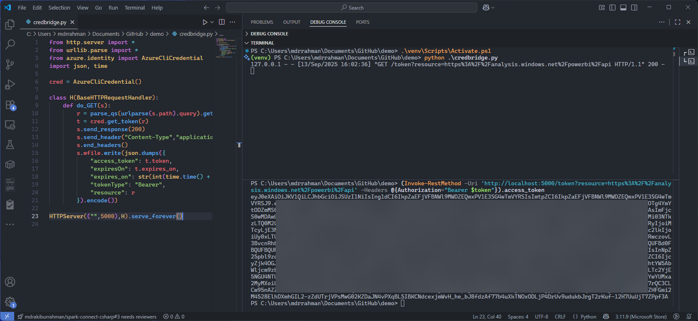

import { Callout } from "../../src/components/atoms.js"
import { ExtLink, InlinePageLink } from "../../src/components/atoms.js"

If you use Fabric (or any other Data Analytics Platform) seriously, you'll realize the only way to get your whole org to become productive on the product is to have robust Git-based CICD. Otherwise, the workspace quickly becomes a garbage dump of stray notebooks (`notebook-99`) and junky tables (`temp-table-100-test`).

The north star is:

1. Each developer has their own Fabric workspace (and preferably, capacities) where they can hack and break things without fear
2. They open Pull Requests that are peer-reviewed
3. The PR is regression tested via automation in a "prod-mimic" environment (AKA staging)
4. After the PR merges, recent commits are batched up and deployed into production workspaces, where your C-Suite gathers insights out of your beautiful Power BI reports and Semantic Models.

## The problem

`3` and `4` doesn't work if this button is `Disabled` on your company's Tenant:



<Callout>

🤓 The [official docs](https://learn.microsoft.com/en-us/rest/api/fabric/articles/identity-support#service-principal-tenant-setting) say:

_"If you don't have the Fabric administrator role, contact a Fabric administrator in your organization, to enable the setting."_

Except - if you work at a large enterprise, you need to go through 500 layers of escalations to figure out who has the authority to get this button clicked. 

If you're lucky enough to find the chosen one, you probably need to beg them to click the button.


(The point I'm trying to make is, this is a large organization specific problem, specially one that is security conscious - which is probably why this button exists in Fabric in the first place.)

</Callout>

So in short, the problem can be summarized as this:



Whatever deployment code you're running, say - it's a mix of [fabric-cli](https://microsoft.github.io/fabric-cli/), [fabric-cicd](https://microsoft.github.io/fabric-cicd/latest/) and other automation for Semantic Models (XMLA endpoint etc) - it all works locally as your identity, it just doesn't work in your CICD infrastructure.

## The solution

### Azure Relay

Or any other authenticated reverse-proxy solution, like [ngrok](https://ngrok.com/) or [VSCode Dev Tunnel](https://code.visualstudio.com/docs/remote/tunnels). 

Azure Relay is in my opinion the best reverse-proxy, because it's already protected by Entra ID AuthN and ARM AuthZ - meaning, it' secured, and it's also built for High Availability support. In fact, many large-scale Azure Services that operate on Hybrid/multi-cloud infrastructure are built on Relay.

<Callout>

📝 For more information, see:

* [My writeup on Relay](https://www.rakirahman.me/relay-tunnel/)
* [How Azure Relay actually works](https://learn.microsoft.com/en-us/azure/azure-relay/relay-what-is-it#architecture-processing-of-incoming-relay-requests)
* [How Power BI On-premises data gateway uses Relay too](https://learn.microsoft.com/en-us/data-integration/gateway/service-gateway-onprem-indepth)
* [How Data Factory Self-Hosted Integration Runtime uses Relay too](https://learn.microsoft.com/en-us/azure/data-factory/create-self-hosted-integration-runtime?tabs=data-factory#get-url-of-azure-relay-via-ui)
* [How Azure Arc uses Relay too](https://learn.microsoft.com/en-us/azure/azure-arc/kubernetes/cluster-connect?tabs=azure-cli)

</Callout>

### Architecture



1. Create an Azure Relay, takes 30 seconds.
2. Give your SPN/Managed Identity `Azure Relay Sender`, so it can send HTTPS requests to it.
3. Give yourself `Azure Relay Listener`, so your code can listen on it.
4. Setup a small app in your favorite language - say Python - to wrap `TokenCredential` via a REST API on a port, say `5000`.
5. Launch [Azure Relay Bridge](https://github.com/Azure/azure-relay-bridge) - a small CLI tool to bridge port `5000` from your machine to the Relay
6. Optional - repeat Steps 4 and 5 on more machines for High Availability (in case your laptop reboots, another one is up)
7. Retrieve a token via the remote API via your SPN, use that to call Fabric, it'll work 😁

### Tutorial

Step 1 - 3 is straightforward, [use this tutorial](https://learn.microsoft.com/en-us/azure/azure-relay/relay-hybrid-connections-python-get-started#create-a-namespace-using-the-azure-portal) to spin up a vanilla Relay (it's dirt cheap, since we're not going to be sending high volume of data through it.)

For Step 4, let's launch a dead simple Python app, inspired by this [`azure-cli-credentials-proxy`](https://github.com/workleap/azure-cli-credentials-proxy/tree/main)

```python
from http.server import *
from urllib.parse import *
from azure.identity import AzureCliCredential
import json, time

cred = AzureCliCredential()

class H(BaseHTTPRequestHandler):
    def do_GET(s):
        r = parse_qs(urlparse(s.path).query).get("resource", [""])[0]
        t = cred.get_token(r)
        s.send_response(200)
        s.send_header("Content-Type","application/json")
        s.end_headers()
        s.wfile.write(json.dumps({
            "access_token": t.token,
            "expiresOn": t.expires_on,
            "expires_on": str(int(time.time() + 3600)),
            "tokenType": "Bearer",
            "resource": r
        }).encode())

HTTPServer(("",5000),H).serve_forever()
```

Launch it, say, from powershell - the only dependency is `azure.identity`:

```powershell
python -m venv venv
.\venv\Scripts\Activate.ps1
pip install azure-identity==1.23.0
python .\credbridge.py
```

You can now invoke it locally to get a token from this simple server for the Fabric API:

```powershell
(Invoke-RestMethod -Uri 'http://localhost:5000/token?resource=https%3A%2F%2Fanalysis.windows.net%2Fpowerbi%2Fapi' -Headers @{Authorization="Bearer $token"}).access_token
```



For Step 5 - [Download Azure Relay Bridge release from GitHub](https://github.com/Azure/azure-relay-bridge/releases):

```powershell
function Get-Zip {
    param($Url, $Dest)
    if (!(Test-Path $Dest)) { New-Item -ItemType Directory -Path $Dest | Out-Null }
    $tmp = Join-Path $env:TEMP "$(New-Guid).zip"
    Invoke-WebRequest $Url -OutFile $tmp
    Expand-Archive $tmp -DestinationPath $Dest -Force
    Remove-Item $tmp -Force
}

Get-Zip "https://github.com/Azure/azure-relay-bridge/releases/download/v0.15.0/azbridge.0.15.0.win-x64.zip" "C:\...\azbridge"
```

And launch it to start listening:

```powershell
C:\...\azbridge\azbridge.exe -H mdrrahman:http/localhost:5000 -x "Endpoint=sb://your-relay.servicebus.windows.net/;EntityPath=your-hybrid-connection"
```

Now, you can make a remote call from some other machine as the SPN, and get a token.

Let's say your CICD runs on a linux machine:

```bash
remote_relay_access_token() {
    local encoded_resource=$(printf '%s' "$2" | jq -sRr @uri)
    local relay_token=$(az account get-access-token --resource 'https://relay.azure.net' --query accessToken -o tsv)
    curl -s -H "Authorization: Bearer $relay_token" "$1?resource=$encoded_resource" | jq -r '.access_token'
}

remote_relay_access_token "https://your-relay.servicebus.windows.net/your-hybrid-connection/token" "https://api.fabric.microsoft.com"
```

## Conclusion

1. Using Azure Relay as an Entra-protected secured hop allows us to bridge SPN with another identity. 
   This is identical to how Azure Key Vault works (you use one identity to retrieve a secret, that lets you become another identity) - the Vault being the credential bridge.

2. You can setup High Availability - if you have multiple physical machines, Azure Relay will round-robin requests.
   Basically, you're building a poor man's [VMSS](https://learn.microsoft.com/en-us/azure/virtual-machine-scale-sets/overview).

3. Azure Relay is dirt cheap for this use case, perhaps `$5/month`, because tokens are reused throughout a CI session - and volume of data transferred is very low.

4. Your IT Security person can't really complain, what you're doing is equivalent to using the Fabric UI to generate tokens on your behalf to click stuff,
   we're just taking the "UI" out of the picture here.

   What they can do is remove your Fabric Workspace Contributor access (in which case, you can't use the product via the UI anyway).

Automate responsibly!