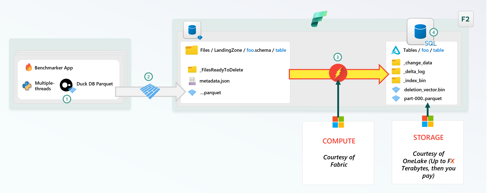
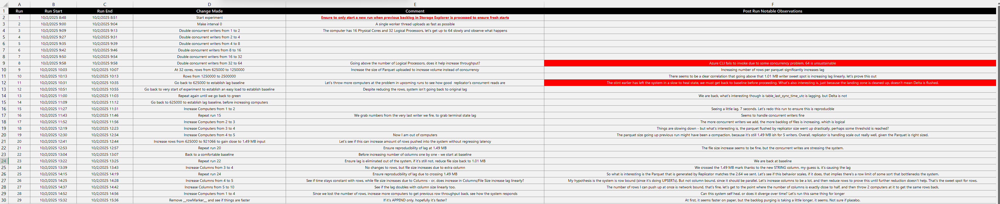
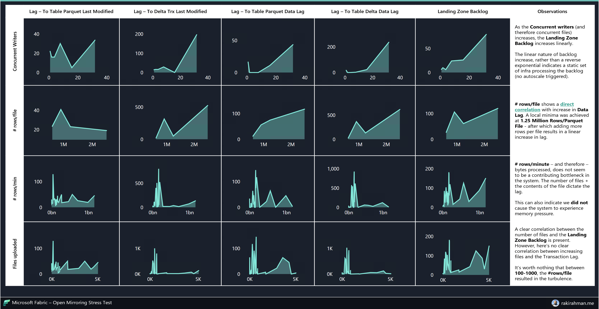

import { Callout } from "../../src/components/atoms.js"
import { ExtLink, InlinePageLink } from "../../src/components/atoms.js"

Open Mirroring is the "easy" button into Fabric.

Ingestion is the hardest part of building a Data Platform:

* Dealing with ingestion lag is painful
* Dealing with compaction is painful
* Tombstoning and schema validation is painful
* Everything needs a lot of infra, money and full time employees

[Fabric Open Mirroring](https://learn.microsoft.com/en-us/fabric/mirroring/open-mirroring) is a super clever feature that was built on top of the battle-tested replication engine introduced a few years ago in [Synapse Link](https://learn.microsoft.com/en-us/azure/synapse-analytics/synapse-link/sql-synapse-link-overview)  - which I think has now evolved into [Mirrored Databases](https://learn.microsoft.com/en-us/fabric/mirroring/sql-server).

The basic idea is, Open Mirroring gives you a `Landing Zone` OneLake folder, and you just start blasting Parquet files in there (it also supports [CSV/delimited text](https://learn.microsoft.com/en-us/fabric/mirroring/open-mirroring-landing-zone-format#delimited-text-requirements), but you need to specify schema). 

No need to deal with Delta Transaction Protocol pains 🤕, Compaction pains 🤕, or Optimistic concurrency pains 🤕.
Literally every language - including [Javascript](https://github.com/ironSource/parquetjs) (if it counts) - can write Parquet - it's super accessible.

The writer client can specify fancy change data capture semantics using a `__rowMarker__` enum column, or, you can do pure `APPEND` only workloads - which is what I'm interested in - to squeeze out the **absolute maximum amount of throughput**.

Best of all, it's free, the compute is totally free, and the storage is free up to a very generous number - see [here](https://learn.microsoft.com/en-us/fabric/mirroring/open-mirroring#open-mirroring-cost-considerations).

As someone that deals with ingestion headaches at ginormous scale - [see here](https://www.rakirahman.me/delta-dotnet), my mental model is:

💊 Open Mirroring = Painkiller-As-A-Service

<Callout>

🤔 The closest feature I can think of in recent times is [Zerobus in Databricks' Lakeflow Connect](https://www.databricks.com/blog/whats-new-zerobus-and-other-announcements-improve-data-ingestion-lakeflow-connect).

But that involves using Protobuf to generate a client-specific SDK - [see demo here](https://www.youtube.com/watch?v=KR_jPI24WHc). 

Since Parquet is self-describing, I'm curious why Databricks went with Protobuf instead of having clients directly upload Parquet concurrently. Perhaps because it avoids the need for the client to buffer before flushing and instead, the server buffers. Schema evolution with Proto might be more involved. 

Databricks will need to host a super performant gRPC endpoint that handles [backpressure](https://en.wikipedia.org/wiki/Back_pressure) etc, OneLake/ADLS is already as close as you can get to infinite scale and solves this problem already.

Both are cool, I'm peronally interested in **maximum throughput at lowest COGS**.

</Callout>

## Stress Test Architecture

I wrote a small multi-threaded Python App that uses DuckDB to flush Parquet with various schemas and other tunables into the `LandingZone`, and then reads the Mirrored Delta tables while diffing with the written files to generate certain Metrics, like Ingestion Lag.

You can run it locally - [see code here](https://github.com/mdrakiburrahman/fabric-open-mirroring-benchmark/tree/main/projects/python).

1. Multi-threaded App comes up and cooks up Parquet based on the SQL statement
2. Each writer thread flushes Parquet to LandingZone concurrently using DuckDB's Parquet Writer for ADLS
3. Fabric Open Mirroring "senses" a new file was uploaded (Event Driven, I imagine). Data is compacted into Delta Tables with [Deletion Vectors](https://docs.delta.io/delta-deletion-vectors/) for Merge-On-Read, [Delta Change Data Feed](https://docs.delta.io/delta-change-data-feed/), etc.
4. Your data is available in Fabric SQL endpoint in near-real time (**~30-60 seconds** in my runs until I deliberately made the system unstable)

<Callout>

⚡`3` has [The Flash's](https://en.wikipedia.org/wiki/The_Flash) icon because I get the sense that this thing is **FAST**.

</Callout>

I went up to **1.2 Billion Rows/Minute** on an F2 SKU, with 5 identical 32 core Windows Devboxes blasting Parquet simultaneously. The CPU was 100% hot on all machines. It was amazing.

Here's a short demo:

`youtube:https://www.youtube.com/embed/PXKf0fhJhws`

## Data Collection Methodology

Similar to Physics Experiments, I made **one** small change at a time to inputs, and observed how the system behaves:

A. Run

B. Run Start

C. Run End

D. Change Made

E. Comment/Thought Process

F. Post Run Notable Observations - **RED** implies I broke something with my input (AKA Significant Lag and Backlog) and had to let the system self-recover before moving onto the next run

The Excel file above and a small Power BI report is available in `results` [here](https://github.com/mdrakiburrahman/fabric-open-mirroring-benchmark/tree/main/results).

## Results

<Callout>

⚠️ These are **empirical** results from hacking around tunables I can think of as a black-box tester. I'm sure there's significant improvements that can be made on the writer to squeeze out more perf from the system, once a Best Practice doc for maximum APPEND-only throughput is released by the Open Mirroring team.

</Callout>

Explanation of the Input-Output variables

| C1                 | C2                                   | C3                                                                                                                                                                                                                                                                 |
| ------------------ | ------------------------------------ | ------------------------------------------------------------------------------------------------------------------------------------------------------------------------------------------------------------------------------------------------------------------ |
| `Input`            | `Output`                             | `Comment`                                                                                                                                                                                                                                                          |
| Concurrent Writers | -                                    | Number of concurrent DuckDB writer threads uploading Parquet files                                                                                                                                                                                                 |
| # Rows/File        | -                                    | Number of rows per Parquet file                                                                                                                                                                                                                                    |
| # Rows/Minute      | -                                    | Number of rows uploaded per minute, across all machines                                                                                                                                                                                                            |
| Files Uploaded     | -                                    | Number of files uploaded across an experiment run                                                                                                                                                                                                                  |
|                    | Lag - To Table Parquet Last Modified | Scans the Delta Table's Parquet directory to find the last modified parquet file, the idea is, this number tells us if the replication system is "doing stuff"                                                                                                     |
|                    | Lag - To Delta Trx Last Modified     | Scans the Delta Transaction log to find the last committed transaction                                                                                                                                                                                             |
|                    | Lag - To Table Parquet Data Lag      | Takes the most recently modified parquet file and reads it to diff the writer timestamp vs the max committed time data column, the idea is, this shows us what lag is in the latest Parquet file, that may or may not have been committed in the Delta Transaction |
|                    | Lag - To Table Delta Data Lag        | Reads the Delta table's max committed time data column, this is what a regulard Delta Lake Client will read                                                                                                                                                        |
|                    | Landing Zone Backlog                 | At the end of a writer run, how many backlogged files are present in `LandingZone` that need to be processed by the mirroring engine                                                                                                                               |

Observations:

* `1,167,451,155 rows/minute` with `5068` Parquet files uploaded in **run 21** was the best run, the `Lag - To Table Delta Data Lag` 11.3 seconds, which is _**amazing**_.
* Increasing `# Rows/File` generally improves throughput, until I got to `1,250,000` rows in **run 9** - at this point, the latency took a huge hit.
* The replicator generally replicates Parquet Files with the same size as what the writer client sent (~1.49 MB was what I was sending). In other words, it currently doesn't act like Spark where it tries to buffer until 128 MB is reached, my guess is, it's optimized for latency.
* Just because the `LandingZone`is purged doesn't mean the Delta Transaction will be committed, the 2 things are async.
* There is definitely a sweet spot to the `Size/encoding/compression of parquet file + # rows + # columns = max throughput` that makes Open Mirroring rip the hardest. I was not able to find this spot empirically this time around (ran out of time during benchmarking).

## Verdict

Even though Mirroring was originally introduced to get data from OLTP systems into OLAP Delta Tables, I think the overall replication feature is a fantastic way to ingest APPEND only workloads too without managing a bunch of expensive Streaming Processing infrastructure I discussed [here](https://www.rakirahman.me/delta-dotnet/#diagram).

In fact - if I could have my way, I would use it as the de-facto ingestion contract to get data into Fabric.

You see, it's _pretty_ hard to beat free 😜