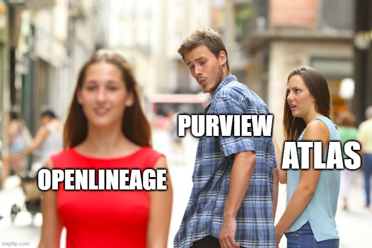
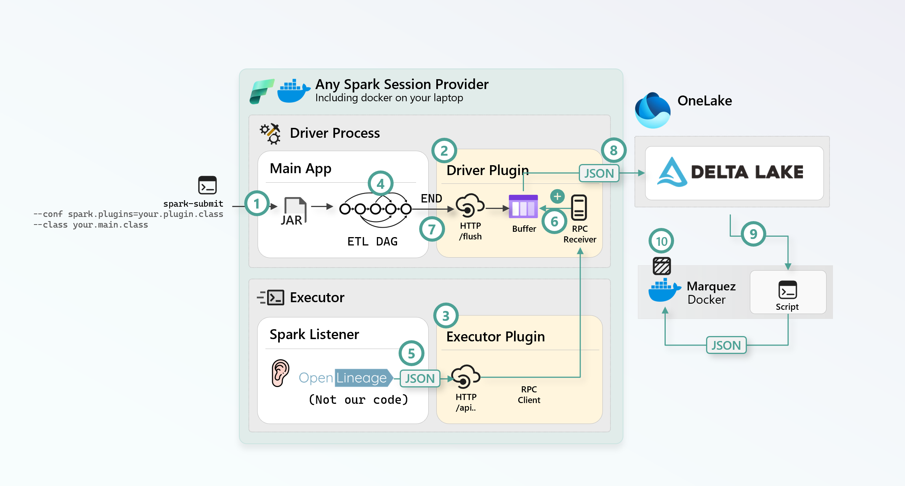
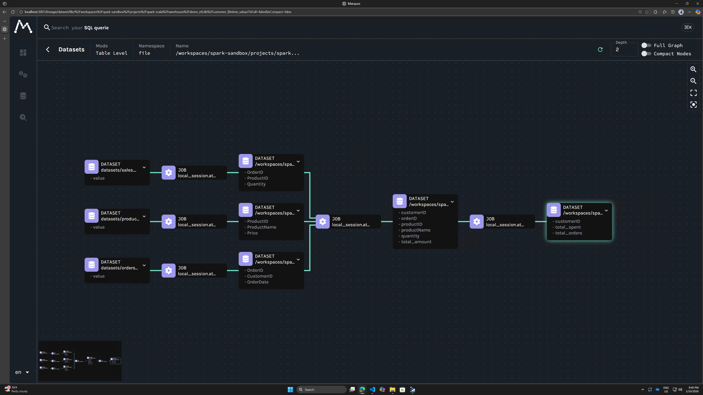
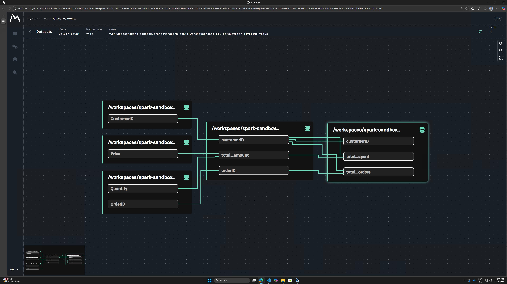
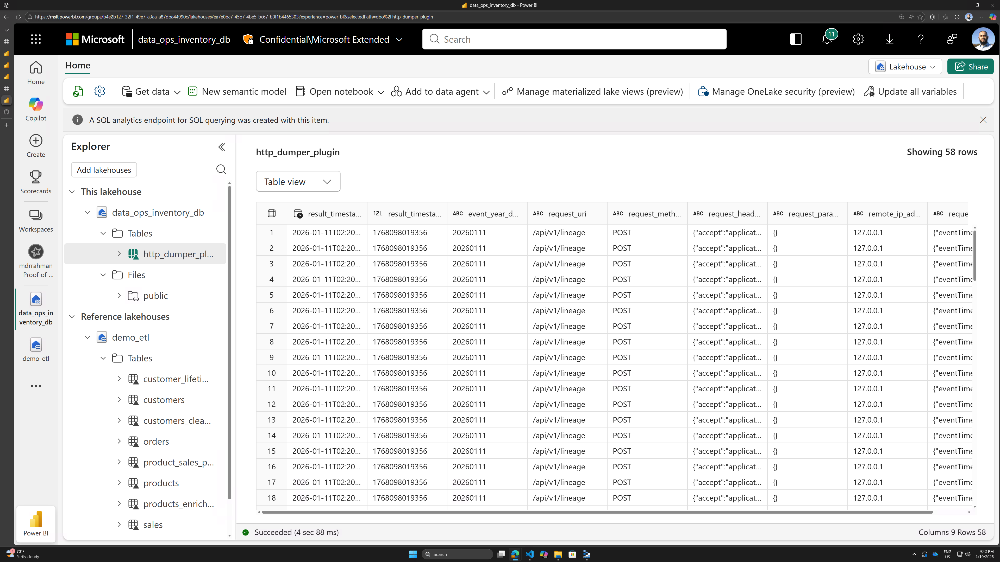

import { Callout } from "../../src/components/atoms.js"
import { ExtLink, InlinePageLink } from "../../src/components/atoms.js"

## Why?

When the amount of ETL and tables in your Data Platform reaches a non-trivial volume, you'll realize you'll need a lineage solution to:

1. Onboard any new engineer to contribute meaningfully
2. Let end-users make sense of the data

_"Go read the ETL code"_ is not a viable strategy. AI-based string search also doesn't let you get a "top-down" view of the system either, if you have 1000s of jobs and queries.

There must be a better solution.

## Who?

Many vendors realized this early on:

1. [dbt's](https://www.getdbt.com/lp/data-lineage) most lucrative feature IMO is the built-in DAG-based lineage. It's quite rudimentary (because it's not column level), but super easy to setup - you just have to use dbt for all of your ETL.

2. [Databricks' Unity Catalog](https://learn.microsoft.com/en-us/azure/databricks/data-governance/unity-catalog/data-lineage) has a pretty awesome UI for lineage - see this great [guided product demo](https://app.getreprise.com/launch/MnqjQDX/). But, the [API](https://learn.microsoft.com/en-us/azure/databricks/data-governance/unity-catalog/data-lineage#response) and lineage has a schema that's specific to Databricks - it feels very similar to Purview to me, albeit a little more modern.

3. [AWS](https://aws.amazon.com/blogs/big-data/amazon-datazone-introduces-openlineage-compatible-data-lineage-visualization-in-preview/) seems to have a pretty great looking OpenLineage compatible API and lineage solution. I don't use AWS though.

4. [Purview](https://learn.microsoft.com/en-us/purview/legacy/how-to-purview-custom-lineage-api-user-guide) has an Atlas based lineage model with Purview specific constructs you need to get your head around.

## OpenLineage

After doing research for a few months on the Open-Source data model centric lineage solutions out there (see this great blog: [Top 5 Open Source Data Lineage Tools](https://www.montecarlodata.com/blog-open-source-data-lineage-tools/)), I've come to the conclusion that OpenLineage is the way to go for the following reasons:

1. The [schema](https://github.com/OpenLineage/OpenLineage/blob/main/spec/OpenLineage.md) and [client SDKs](https://github.com/OpenLineage/OpenLineage/tree/main/integration) are very well written, much better than Atlas, IMO. It very much reminds me of [OpenTelemetry](https://github.com/open-telemetry/opentelemetry-specification/blob/main/specification/metrics/data-model.md), which I'm a fan of.

2. [The author of Parquet - Julien Le Dem](https://julien.ledem.net/) created OpenLineage. He knows a thing or two about data.

3. Purview, despite being built on Atlas, went through [_great heroic efforts_](https://openlineage.io/blog/openlineage-microsoft-purview/) to try and become compatible with OpenLineage. That tells me:

  

  My empirical observation is that, the OpenLineage effort has fizzled away, and the only documented production reference implementation [in this blog](https://techcommunity.microsoft.com/blog/microsoft-security-blog/end-to-end-data-lineage-from-spark-big-data-environment/3721358) is not very elegant - it involves [Azure Functions and Azure Table for buffering](https://github.com/microsoft/DataLineage/tree/main/sparklin), why can't I just use Spark and Delta (AKA this blog)? 
  
  I also don't fully understand why you actually need another service like Purview for lineage and why you can't do it natively on Fabric. The UI can be recreated from the OpenLineage data model (see demo) and the search indexing for term-based fast lookup is solvable problem (e.g. see [IndexTable](https://github.com/indextables/indextables_spark)), specially if you want to do offline analysis and can handle a little latency.

4. Datadog - also a current [leader](https://www.datadoghq.com/blog/datadog-observability-platforms-gartner-magic-quadrant-2025/) in the Data Observability space is also investing in [OpenLineage](https://www.datadoghq.com/blog/data-lineage/).

5. As you'll see in the demo, I found that _**Fabric Spark actually already ships with OpenLineage installed**_. So, someone smarter than me has already started thinking ahead.

6. Since the schema of OpenLineage is open-source, we can pool our knowledge together as humanity and build awesome analysis techniques (queries, SDKs, ML techniques etc.)

The good news is, OpenLineage loves Spark, and you get robust column-level lineage quite easily. This is in contrast to other [creative approaches like this](https://www.reddit.com/r/MicrosoftFabric/comments/1q8lci5/fabric_data_lineage_dependency_visualizer/) in Fabric Warehouse where you use RegEx to parse relationships yourself. Based on my rudimentary understanding of this problem space, this doesn't work for complex SQL for column-level lineage, because you need a robust parser/lexer.

## OpenLineage to Delta Lake Ingestion

Spark is perfectly adequate as an engine to do literally anything you can dream of with your data.

<Callout>

I'm a strong believer that you don't need Azure Functions/UDFs/Event Hub etc. to glue things together inside a Data Platform once data is available in the hands of Spark. More logos, more problems.

Spark is all you need, as you'll see below with the flexibility of Spark Plugins. You can also unit and integration test all this code so it's always 100% reliable.

</Callout>

The architecture I came up with so far is as follows:

1. You `spark-submit` with configurations for both OpenLineage, and your [Spark Plugin](https://blog.madhukaraphatak.in/categories/spark-plugin/)
2. A Spark Plugin for Driver comes up, that hosts a REST API with a `/flush` endpoint, and a simple in-memory append-only buffer
3. An Executor Plugin comes up, that listens on any REST route, and forwards the HTTP call to the Driver via an RPC method, [`send`](https://github.com/apache/spark/blob/acc80fd1b205792a43cc352a8e492e34bbe880da/core/src/main/java/org/apache/spark/api/plugin/PluginContext.java#L72) that can send any serializable `Object` across nodes
4. Your main app goes off and does some ETL
5. The [OpenLineage Spark Listener](https://github.com/OpenLineage/OpenLineage/blob/7f43016a8f01dea38c9cd4b96685bf1d7790d933/integration/spark/app/src/main/java/io/openlineage/spark/agent/OpenLineageSparkListener.java#L60) listens for various Spark Engine events, and emits the OpenLineage data model (as JSON), to our REST API per executor node
6. Our Executor REST API forwards the entire HTTP payload wholesale via RPC to the Driver, who buffers it
7. Your main app finishes ETL and fires a `/flush` method on the Driver
8. The Driver flushes the buffered JSONs into a Delta Table with the captured HTTP metadata per JSON
9. When you're ready to view the lineage, you reconstruct all of those HTTP JSONs from the Delta tables (using SQL queries to filter what timeframe you need)
10. You push those into [Marquez](https://marquezproject.ai/) on Docker Desktop, and there's your column-level lineage

Here's a demo that walks through the details:

`youtube:https://www.youtube.com/embed/qz3d00dfWvQ`

The result:

## Repos to reproduce this locally

The video, and the repo READMEs below shows you how you can reproduce this locally:

1. This repo has the [OpenLineage plugin](https://github.com/mdrakiburrahman/spark-sandbox/tree/main/projects/spark-scala/common-executor/src/main/scala/me/rakirahman/spark/plugin/httpdumperplugin) code demo'd above, [this PR](https://github.com/mdrakiburrahman/spark-sandbox/pull/1) has the diffs.

2. [A small repo](https://github.com/mdrakiburrahman/openlineage-sandbox) I created after studying OpenLineage tutorials with simple scripts to run Marquez on Docker locally.

## Considerations for production

1. The REST API in the plugin is simple enough where I don't see it causing problems in production. That being said, every piece of code you have to run and manage is a headache, and it'd be ideal if Fabric could someday sink OpenLineage into Delta tables on our behalf (using a Fabric managed Spark Plugin like this blog, or otherwise).

2. Pulling out of the Delta tables and hydrating Marquez locally is not ideal for large historical volumes. Technically, I can vibe-code a Marquez drop-in replacement in Fabric using the [Extensibility Toolkit](https://learn.microsoft.com/en-us/fabric/extensibility-toolkit/extensibility-toolkit-overview), but IMO, Fabric should visualize OpenLineage payloads directly as a first-class feature, similar to Marquez - because this will _significantly_ help every single Customer in making sense of their data estate.

## Conclusion

As we saw, the actual changes to each ETL job is almost non-existent, you only need that one plugin file and can get deep-visibility right-inside Delta Lake for 1000s of ETL jobs.

It'd be cool if every other engine inside and outside Fabric supported OpenLineage (or any kind of column-level lineage) someday! 

But in the meantime, enjoy rich visibility into your Spark code 😊