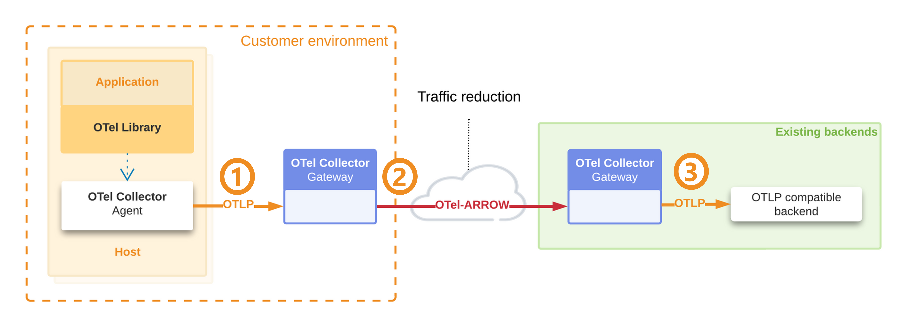
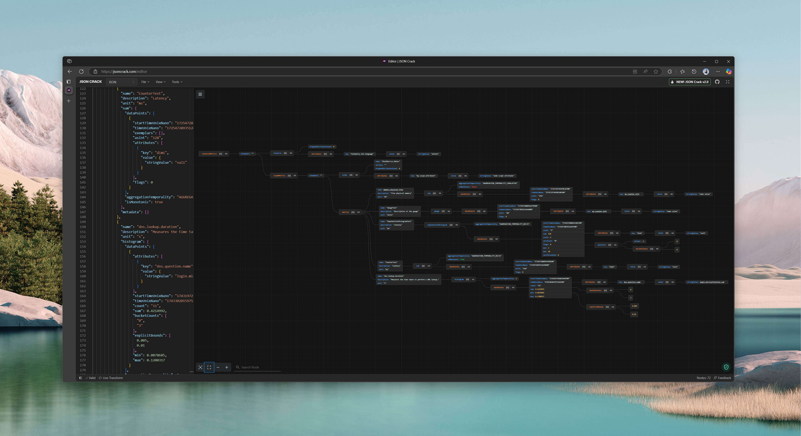
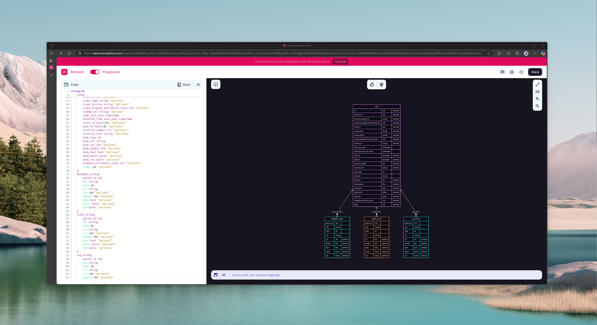
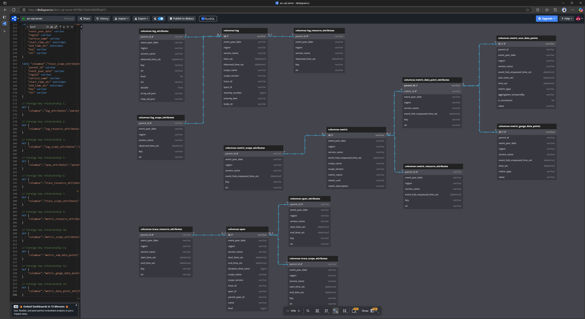
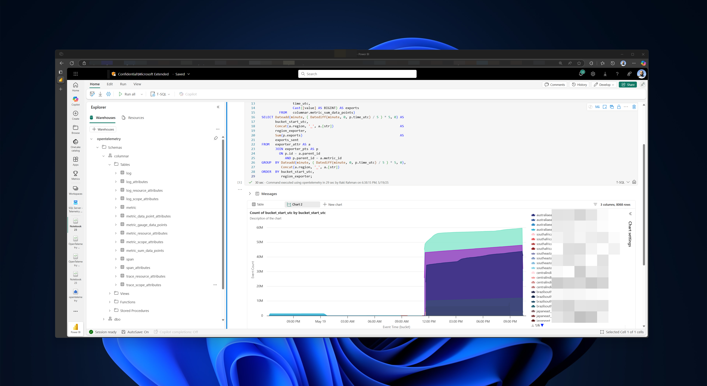

import { Callout } from "../../src/components/atoms.js"
import { ExtLink, InlinePageLink } from "../../src/components/atoms.js"

Not too long ago, each billion dollar **data warehousing vendor** had their **own proprietary _storage_ format** in how **Columnar** data was stored in their locked-down hard disk drives.

Around the same time, each billion dollar **observability vendor** had their **own proprietary _telemetry_ format** in how Clients transmitted **Instrumentation** data in their locked-down time-series databases.

Then, [Delta Lake](https://delta.io/)/[Apache Iceberg](https://iceberg.apache.org/)/[Apache Hudi](https://hudi.apache.org/) - AKA the Lakehouse trio - came around, and showed the industry how to store **performant, ACID compliant data** in an **Open-Source format**.

Around the same time, [OpenTelemetry](https://opentelemetry.io/) came along, and became the de facto industry standard on how a client and server should be exchanging **rich, expressive telemetry** data, in an **Open-Source standard**.

See the pattern?

* **OpenTelemetry**: Created a [protocol](https://opentelemetry.io/docs/specs/otel/protocol/)/[tooling](https://github.com/open-telemetry/opentelemetry-collector-contrib)/[agentry](https://opentelemetry.io/docs/collector/) for delightful telemetry
* **Lakehouse**: Created a [protocol](https://github.com/delta-io/delta/blob/master/PROTOCOL.md)/[tooling](https://delta.io/blog/delta-kernel/)/[patterns](https://delta.io/blog/delta-lake-upsert/) for delightful read/write

There's an obvious synergy between the 2, it makes a lot of sense to store telemetry data (OpenTelemetry) in a Columnar format (Delta), so you can do trend-analysis, aggregates etc. on it.

Nothing exists on the internet as of May 2025 on how to do this hands-to-keyboard - besides this [Github issue](https://github.com/open-telemetry/otel-arrow/issues/399), so in this blog, I layout how I approached storing OpenTelemetry data in Delta Lake.

<Callout>

🤖 I understand the value add of blogs with code are becoming increasingly irrelevant in the day of GPTs.

I - too - have GPT write most of my Spark code nowadays (like the sample below), but - the part GPTs cannot do yet, is identify patterns by observing emerging trends, like `otel-arrow` in the industry while reading through Hacker News or tasteful sub-Reddits (yet).

Also, good luck getting GPT to generate an ERD diagram as beautiful as the one I have below (without an MCP server).

👨: 1, 🤖: 0 

(For now)

</Callout>

## A short primer on OTeL Arrow

OTeL Arrow is an ambitious protocol that basically aims to increase the compression of OpenTelemetry data over the wire via tried and tested columnar compression (e.g. [Bit packing, Run Length Encoding](https://parquet.apache.org/docs/file-format/data-pages/encodings/)) that data formats like Apache Parquet have enjoyed for years. 

The basic idea is exactly what you'd come up with via some common sense - from [here](https://github.com/open-telemetry/otel-arrow?tab=readme-ov-file#phase-1):



1. Client [batches](https://opentelemetry.io/docs/specs/otel/configuration/sdk-environment-variables/#batch-logrecord-processor) verbose `otlp` data in memory, sends to collector as regular `otlp`
2. Collector turns it into a columnar schema, `exports` it over the wire as compressed Arrow. Less bytes sent over the wire == less bandwidth, less cost.
2. Collector on the other side `receives` it as a columnar schema, converts it back into `otlp`, sends it to existing exporters

<Callout>

📝 For more information, see:

* [github/otel-arrow](https://github.com/open-telemetry/otel-arrow/tree/main)
* [Achieve a 10x Reduction in Telemetry Traffic Using OpenTelemetry Protocol with Apache Arrow](https://opentelemetry.io/blog/2023/otel-arrow/)
* [OpenTelemetry Protocol with Apache Arrow - Phase 2 Announcement](https://opentelemetry.io/blog/2025/otel-arrow-phase-2/)
* [OpenTelemetry explores a new high-performance telemetry pipeline built with Apache Arrow and Rust!](https://www.reddit.com/r/rust/comments/1koywpk/opentelemetry_explores_a_new_highperformance/)
* [[otel-arrow-rust] Parquet Exporter #399](https://github.com/open-telemetry/otel-arrow/issues/399) (this is basically what I threw together in the last couple days, using Spark)

</Callout>

## Schema comparison of OTeL Arrow vs OTeL JSON

The magic happens where the good folks at `otel-arrow` took the [insanely verbose](https://github.com/open-telemetry/opentelemetry-proto/tree/main/examples) `otlp_proto/json` schema, and did the data modelling to turn it into a columnar format - [see here](https://github.com/open-telemetry/oteps/blob/main/text/0156-columnar-encoding.md#logs-arrow-mapping).




It doesn't take a genius to figure out which schema is easier to query 😜.

What does the second picture remind you of?

It's a [STAR Schema - Power BI's bread and butter](https://learn.microsoft.com/en-us/power-bi/guidance/star-schema). That's where I come in, take the schema from the good folks at OTeL Arrow, and use Spark to convert OTel JSON (which we export today, unfortunately) into a full blown STAR Schema, stored in Delta Lake in Apache Parquet format.

## OTeL Arrow schema on Delta Lake

After pow-wowing on the OTeL Arrow schema with my friend, Github Copilot, to rapidly generate the Spark SQL transformation code - I ended up schema evolving the OTeL Arrow schema to make it a little bit more query friendly with the [Fabric SQL Server Endpoint](https://learn.microsoft.com/en-us/fabric/data-engineering/lakehouse-sql-analytics-endpoint), by storing data in the most primitive format possible (integers, strings etc.):



<Callout>

🎁 The full DBML is [here](https://gist.github.com/mdrakiburrahman/e294364f335f9d05c6bdf974298f10c8), take it and pop it into [dbdiagram.io](https://dbdiagram.io/home) to get the ERD back.

</Callout>

## Querying in Fabric SQL

So suppose you have some service that runs in 50+ AKS clusters worldwide, and you want to track how it's doing.

In the old world, you'd have to learn [PromQL](https://promlabs.com/promql-cheat-sheet/) 🤮 - and good luck doing a distributed PromQL query across 50+ databases 🐌.

In the Delta Lake world, you can use good old [T-SQL Notebook](https://blog.fabric.microsoft.com/en-us/blog/announcing-public-preview-of-t-sql-notebook-in-fabric) - a Data Scientist's best friend:

```sql
WITH exporter_attr
     AS (SELECT parent_id,
                metric_id,
                region,
                [str]
         FROM   columnar.metric_data_point_attributes
         WHERE  service_name = 'some-service'
                AND [key] = 'some-metric'
                AND [str] IN ( 'some-dimension-1', 'some-dimension-2' )),
     exporter_pts
     AS (SELECT id,
                parent_id,
                time_utc,
                Cast([value] AS BIGINT) AS exports
         FROM   columnar.metric_sum_data_points)
SELECT Dateadd(minute, ( Datediff(minute, 0, p.time_utc) / 5 ) * 5, 0) AS
       bucket_start_utc,
       Concat(a.region, '_', a.[str])                                  AS
       region_exporter,
       Sum(p.exports)                                                  AS
       exports_sent
FROM   exporter_attr AS a
       JOIN exporter_pts AS p
         ON p.id = a.parent_id
            AND p.parent_id = a.metric_id
GROUP  BY Dateadd(minute, ( Datediff(minute, 0, p.time_utc) / 5 ) * 5, 0),
          Concat(a.region, '_', a.[str])
ORDER  BY bucket_start_utc,
          region_exporter; 
```



## Apache Spark Transformation code

So now for the boring star of the show, the Spark code that hydrates these pretty tables.

This isn't end-to-end Spark code (that will be a lot of boilerplate implementation details), but a simple file that contains all the core transformation business logic.

```scala
package me.rakirahman.etl.schema.opentelemetrycollector.otlp.json.v1

import org.apache.spark.sql.SparkSession
import org.apache.spark.sql.types.StructType

/** Represents an immutable configuration for foreign keys.
  *
  * @param dim_table_name
  *   The dimension table name.
  * @param fk_col_in_dim
  *   The foreign key column in the dimension table.
  * @param fk_col_in_fact
  *   The foreign key column in the fact table.
  */
case class ForeignKeyConfig(
    dim_table_name: String,
    fk_col_in_dim: String,
    fk_col_in_fact: String
)

/** Enumeration defining the different types of OpenTelemetry data types.
  */
object OpenTelemetryTypes extends Enumeration {
  type TelemetryTypes = Value
  val Log = Value("log")
  val Metric = Value("metric")
  val Trace = Value("trace")
}

/** Enumeration defining the different types of OpenTelemetry data
  * representation.
  */
object OpenTelemetryRepresentations extends Enumeration {
  type Representation = Value
  val Raw = Value("raw")
  val Flattened = Value("flattened")
  val Columnar = Value("columnar")
}

/** Enumeration defining the different types of OpenTelemetry Columnar data
  * types.
  */
object OpenTelemetryColumnarTypes extends Enumeration {
  type ColumnarTelemetryTypes = Value

  val Log = Value("log")
  val Metric = Value("metric")
  val Span = Value("span")

  val LogAttributes = Value("log_attributes")
  val ResourceAttributes = Value("resource_attributes")
  val ScopeAttributes = Value("scope_attributes")
  val SpanAttributes = Value("span_attributes")

  val MetricDataPointAttributes = Value("metric_data_point_attributes")
  val MetricGaugeDataPoints = Value("metric_gauge_data_points")
  val MetricHistogramDataPoints = Value("metric_histogram_data_points")
  val MetricSumDataPoints = Value("metric_sum_data_points")
}

/** Constants related to OpenTelemetry processing.
  */
object OpenTelemetryConstantGenerators {

  /** Generates the name of the raw temporary view for the given telemetry type.
    *
    * @param telemetryType
    *   The [[OpenTelemetryTypes]].
    * @param representation
    *   The [[OpenTelemetryRepresentations]].
    * @return
    *   The name of the raw temporary view.
    */
  def getView(
      telemetryType: OpenTelemetryTypes.Value,
      representation: OpenTelemetryRepresentations.Value
  ): String = s"${telemetryType.toString}_${representation.toString}"

  /** Returns the sequence of [[OpenTelemetryColumnarTypes]] corresponding to
    * the given [[OpenTelemetryTypes]] value.
    *
    * @param telemetryType
    *   The [[OpenTelemetryTypes]].
    * @return
    *   A sequence of [[OpenTelemetryColumnarTypes]] corresponding to the
    *   telemetry type.
    * @throws Exception
    *   if the telemetry type is not mapped.
    */
  def getOpenTelemetryColumnarTypes(
      telemetryType: OpenTelemetryTypes.Value
  ): Seq[OpenTelemetryColumnarTypes.Value] =
    telemetryType match {

      case OpenTelemetryTypes.Log =>
        Seq(
          OpenTelemetryColumnarTypes.Log,
          OpenTelemetryColumnarTypes.ResourceAttributes,
          OpenTelemetryColumnarTypes.ScopeAttributes,
          OpenTelemetryColumnarTypes.LogAttributes
        )

      case OpenTelemetryTypes.Trace =>
        Seq(
          OpenTelemetryColumnarTypes.Span,
          OpenTelemetryColumnarTypes.ResourceAttributes,
          OpenTelemetryColumnarTypes.ScopeAttributes,
          OpenTelemetryColumnarTypes.SpanAttributes
        )

      case OpenTelemetryTypes.Metric =>
        Seq(
          OpenTelemetryColumnarTypes.Metric,
          OpenTelemetryColumnarTypes.ResourceAttributes,
          OpenTelemetryColumnarTypes.ScopeAttributes,
          OpenTelemetryColumnarTypes.MetricDataPointAttributes,
          OpenTelemetryColumnarTypes.MetricSumDataPoints,
          OpenTelemetryColumnarTypes.MetricGaugeDataPoints,
          OpenTelemetryColumnarTypes.MetricHistogramDataPoints
        )

      case _ =>
        throw new Exception(s"Unmapped OpenTelemetry type: '${telemetryType}'")

    }

  /** Generates a sequence of unique table names for the specified
    * [[OpenTelemetryTypes.Value]].
    *
    * @param telemetryType
    *   The [[OpenTelemetryTypes]].
    * @return
    *   A sequence of unique table names.
    */
  def getOpenTelemetryColumnarTables(
      telemetryType: OpenTelemetryTypes.Value
  ): Seq[String] =
    getOpenTelemetryColumnarTypes(telemetryType).map { colType =>
      getUniqueTableName(telemetryType, colType)
    }

  /** Generates a unique, non-conflicting table name across
    * [[OpenTelemetryTypes.Value]] types based on the
    * [[OpenTelemetryColumnarTypes]].
    *
    * @param telemetryType
    *   The [[OpenTelemetryTypes]].
    * @param columnarType
    *   The [[OpenTelemetryColumnarTypes]].
    * @return
    *   A unique table name string for the given types.
    */
  def getUniqueTableName(
      telemetryType: OpenTelemetryTypes.Value,
      columnarType: OpenTelemetryColumnarTypes.Value
  ): String = if (
    Set(
      OpenTelemetryColumnarTypes.ResourceAttributes,
      OpenTelemetryColumnarTypes.ScopeAttributes
    ).contains(columnarType)
  )
    s"${telemetryType.toString.toLowerCase}_${columnarType.toString}"
  else
    columnarType.toString

  /** Retrieves the columnar dependencies for a given
    * [[OpenTelemetryTypes.Value]].
    *
    * @param telemetryType
    *   The [[OpenTelemetryTypes]].
    * @return
    *   A sequence of sequences, where each inner sequence contains the
    *   [[OpenTelemetryColumnarTypes.Value]] that are dependencies for the
    *   specified telemetry type.
    */
  def getOpenTelemetryColumnarDependencies(
      telemetryType: OpenTelemetryTypes.Value
  ): Seq[Seq[OpenTelemetryColumnarTypes.Value]] =
    telemetryType match {
      case OpenTelemetryTypes.Log =>
        Seq(
          Seq(
            OpenTelemetryColumnarTypes.ResourceAttributes,
            OpenTelemetryColumnarTypes.ScopeAttributes,
            OpenTelemetryColumnarTypes.LogAttributes
          ),
          Seq(OpenTelemetryColumnarTypes.Log)
        )
      case OpenTelemetryTypes.Trace =>
        Seq(
          Seq(
            OpenTelemetryColumnarTypes.ResourceAttributes,
            OpenTelemetryColumnarTypes.ScopeAttributes,
            OpenTelemetryColumnarTypes.SpanAttributes
          ),
          Seq(OpenTelemetryColumnarTypes.Span)
        )
      case OpenTelemetryTypes.Metric =>
        Seq(
          Seq(
            OpenTelemetryColumnarTypes.MetricDataPointAttributes
          ),
          Seq(
            OpenTelemetryColumnarTypes.MetricSumDataPoints,
            OpenTelemetryColumnarTypes.MetricGaugeDataPoints,
            OpenTelemetryColumnarTypes.MetricHistogramDataPoints
          ),
          Seq(
            OpenTelemetryColumnarTypes.ResourceAttributes,
            OpenTelemetryColumnarTypes.ScopeAttributes
          ),
          Seq(OpenTelemetryColumnarTypes.Metric)
        )
      case _ =>
        throw new Exception(s"Unmapped OpenTelemetry type: '${telemetryType}'")
    }

  /** Retrieves the foreign key configurations for tables based on the specified
    * OpenTelemetry type.
    *
    * @param telemetryType
    *   The [[OpenTelemetryTypes]].
    * @return
    *   A map where the key is the table name and the value is a sequence of
    *   [[ForeignKeyConfig]].
    */
  def getOpenTelemetryForeignKeyConfigs(
      telemetryType: OpenTelemetryTypes.Value
  ): Map[String, Seq[ForeignKeyConfig]] = {
    telemetryType match {
      case OpenTelemetryTypes.Log =>
        Map(
          "log_attributes" -> Seq(ForeignKeyConfig("log", "id", "parent_id")),
          "log_resource_attributes" -> Seq(
            ForeignKeyConfig("log", "id", "parent_id")
          ),
          "log_scope_attributes" -> Seq(
            ForeignKeyConfig("log", "id", "parent_id")
          )
        )
      case OpenTelemetryTypes.Trace =>
        Map(
          "span_attributes" -> Seq(ForeignKeyConfig("span", "id", "parent_id")),
          "trace_resource_attributes" -> Seq(
            ForeignKeyConfig("span", "id", "parent_id")
          ),
          "trace_scope_attributes" -> Seq(
            ForeignKeyConfig("span", "id", "parent_id")
          )
        )
      case OpenTelemetryTypes.Metric =>
        Map(
          "metric_resource_attributes" -> Seq(
            ForeignKeyConfig("metric", "id", "parent_id")
          ),
          "metric_scope_attributes" -> Seq(
            ForeignKeyConfig("metric", "id", "parent_id")
          ),
          "metric_sum_data_points" -> Seq(
            ForeignKeyConfig("metric", "id", "parent_id")
          ),
          "metric_gauge_data_points" -> Seq(
            ForeignKeyConfig("metric", "id", "parent_id")
          ),
          "metric_histogram_data_points" -> Seq(
            ForeignKeyConfig("metric", "id", "parent_id")
          ),
          "metric_sum_data_points" -> Seq(
            ForeignKeyConfig("metric_data_point_attributes", "parent_id", "id")
          ),
          "metric_gauge_data_points" -> Seq(
            ForeignKeyConfig("metric_data_point_attributes", "parent_id", "id")
          ),
          "metric_histogram_data_points" -> Seq(
            ForeignKeyConfig("metric_data_point_attributes", "parent_id", "id")
          ),
          "metric_data_point_attributes" -> Seq(
            ForeignKeyConfig("metric", "id", "metric_id")
          )
        )
      case _ =>
        throw new Exception(s"Unmapped OpenTelemetry type: '${telemetryType}'")
    }
  }

  /** Returns the raw to flattened transformation SQL query string associated
    * with the the given [[OpenTelemetryTypes]] value.
    *
    * @param telemetryType
    *   The [[OpenTelemetryTypes]].
    * @return
    *   The corresponding transformation SQL query as a string.
    */
  def getRawToFlattenedSql(
      telemetryType: OpenTelemetryTypes.Value
  ): String =
    telemetryType match {

      case OpenTelemetryTypes.Log =>
        """|WITH resource_exploded AS (
           |  SELECT
           |    rl.resource.attributes AS resource_attributes,
           |    rl.scopeLogs AS scopeLogs,
           |    region,
           |    event_year_date,
           |    COALESCE((SELECT first(attr.value.stringValue) FROM (SELECT explode(rl.resource.attributes) as attr) WHERE attr.key = 'service.name'), 'unknown-app') AS service_name
           |  FROM log_raw
           |  LATERAL VIEW explode(parsed.resourceLogs) AS rl
           |),
           |scope_exploded_raw AS (
           |  SELECT
           |    re.resource_attributes,
           |    sl.scope.name AS scope_name,
           |    sl.scope.version AS scope_version,
           |    sl.scope.attributes AS scope_attributes,
           |    sl.logRecords,
           |    re.region,
           |    re.event_year_date,
           |    re.service_name
           |  FROM resource_exploded AS re
           |  LATERAL VIEW explode(scopeLogs) AS sl
           |),
           |scope_exploded AS (
           |  SELECT
           |    SHA2(CONCAT_WS(
           |      '|',
           |      to_json(resource_attributes),
           |      scope_name,
           |      scope_version,
           |      to_json(scope_attributes),
           |      to_json(logRecords),
           |      region,
           |      service_name,
           |      event_year_date
           |    ), 256) AS log_id,
           |    resource_attributes,
           |    scope_name,
           |    scope_version,
           |    scope_attributes,
           |    logRecords,
           |    region,
           |    service_name,
           |    event_year_date
           |  FROM scope_exploded_raw
           |),
           |log_exploded AS (
           |  SELECT
           |    se.log_id,
           |    se.resource_attributes,
           |    se.scope_name,
           |    se.scope_version,
           |    se.scope_attributes,
           |    lr.timeUnixNano AS time_unix_nano,
           |    lr.observedTimeUnixNano AS observed_time_unix_nano,
           |    CAST(timestamp_micros(CAST(CAST(lr.timeUnixNano AS BIGINT) / 1000 AS BIGINT)) AS TIMESTAMP) AS time_utc,
           |    CAST(timestamp_micros(CAST(CAST(lr.observedTimeUnixNano AS BIGINT) / 1000 AS BIGINT)) AS TIMESTAMP) AS observed_time_utc,
           |    lr.traceId AS trace_id,
           |    lr.spanId AS span_id,
           |    lr.severityNumber AS severity_number,
           |    lr.severityText AS severity_text,
           |    lr.body.stringValue AS body_str,
           |    lr.attributes AS log_attributes,
           |    se.region,
           |    se.service_name,
           |    se.event_year_date
           |  FROM scope_exploded AS se
           |  LATERAL VIEW explode(logRecords) AS lr
           |)
           |SELECT * FROM log_exploded
           |""".stripMargin

      case OpenTelemetryTypes.Trace =>
        """|WITH resource_exploded AS (
           |  SELECT
           |    rs.resource.attributes AS resource_attributes,
           |    rs.scopeSpans AS scope_spans,
           |    region,
           |    event_year_date,
           |    COALESCE((SELECT first(attr.value.stringValue) FROM (SELECT explode(rs.resource.attributes) as attr) WHERE attr.key = 'service.name'), 'unknown-app') AS service_name
           |  FROM trace_raw
           |  LATERAL VIEW explode(parsed.resourceSpans) AS rs
           |),
           |scope_exploded_raw AS (
           |  SELECT
           |    re.resource_attributes,
           |    ss.scope.name AS scope_name,
           |    ss.scope.version AS scope_version,
           |    ss.scope.attributes AS scope_attributes,
           |    ss.spans AS spans,
           |    re.region,
           |    re.event_year_date,
           |    re.service_name
           |  FROM resource_exploded AS re
           |  LATERAL VIEW explode(scope_spans) AS ss
           |),
           |scope_exploded AS (
           |  SELECT
           |    SHA2(CONCAT_WS(
           |      '|',
           |      to_json(resource_attributes),
           |      scope_name,
           |      scope_version,
           |      to_json(scope_attributes),
           |      to_json(spans),
           |      region,
           |      service_name,
           |      event_year_date
           |    ), 256) AS span_group_id,
           |    resource_attributes,
           |    scope_name,
           |    scope_version,
           |    scope_attributes,
           |    spans,
           |    region,
           |    service_name,
           |    event_year_date
           |  FROM scope_exploded_raw
           |),
           |span_exploded AS (
           |  SELECT
           |    se.span_group_id,
           |    se.resource_attributes,
           |    se.scope_name,
           |    se.scope_version,
           |    se.scope_attributes,
           |    sp.traceId,
           |    sp.spanId,
           |    sp.parentSpanId,
           |    sp.name,
           |    sp.startTimeUnixNano AS start_time_unix_nano,
           |    sp.endTimeUnixNano AS end_time_unix_nano,
           |    CAST(timestamp_micros(CAST(CAST(sp.startTimeUnixNano AS BIGINT) / 1000 AS BIGINT)) AS TIMESTAMP) AS start_time_utc,
           |    CAST(timestamp_micros(CAST(CAST(sp.endTimeUnixNano AS BIGINT) / 1000 AS BIGINT)) AS TIMESTAMP) AS end_time_utc,
           |    CAST((CAST(sp.endTimeUnixNano AS BIGINT) - CAST(sp.startTimeUnixNano AS BIGINT)) AS BIGINT) AS duration_time_nano,
           |    sp.kind,
           |    sp.attributes AS span_attributes,
           |    se.region,
           |    se.service_name,
           |    se.event_year_date
           |  FROM scope_exploded AS se
           |  LATERAL VIEW explode(spans) AS sp
           |)
           |SELECT * FROM span_exploded
           |""".stripMargin

      case OpenTelemetryTypes.Metric =>
        """|WITH resource_exploded AS (
           |  SELECT
           |    rm.resource.attributes AS resource_attributes,
           |    rm.scopeMetrics AS scopeMetrics,
           |    region,
           |    event_year_date,
           |    COALESCE((SELECT first(attr.value.stringValue) FROM (SELECT explode(rm.resource.attributes) as attr) WHERE attr.key = 'service.name'), 'unknown-app') AS service_name,
           |    event_hub_enqueued_time_utc
           |  FROM metric_raw
           |  LATERAL VIEW explode(parsed.resourceMetrics) AS rm
           |),
           |scope_exploded_raw AS (
           |  SELECT
           |    re.resource_attributes,
           |    sm.scope.name AS scope_name,
           |    sm.scope.version AS scope_version,
           |    sm.scope.attributes AS scope_attributes,
           |    sm.metrics,
           |    re.region,
           |    re.event_year_date,
           |    re.service_name,
           |    re.event_hub_enqueued_time_utc
           |  FROM resource_exploded AS re
           |  LATERAL VIEW explode(scopeMetrics) AS sm
           |),
           |scope_exploded AS (
           |  SELECT
           |    SHA2(CONCAT_WS(
           |      '|',
           |      to_json(resource_attributes),
           |      scope_name,
           |      scope_version,
           |      to_json(scope_attributes),
           |      to_json(metrics),
           |      region,
           |      service_name,
           |      event_year_date,
           |      event_hub_enqueued_time_utc
           |    ), 256) AS metric_id,
           |    resource_attributes,
           |    scope_name,
           |    scope_version,
           |    scope_attributes,
           |    metrics,
           |    region,
           |    service_name,
           |    event_year_date,
           |    event_hub_enqueued_time_utc
           |  FROM scope_exploded_raw
           |),
           |metric_exploded AS (
           |  SELECT
           |    se.metric_id,
           |    se.resource_attributes,
           |    se.scope_name,
           |    se.scope_version,
           |    se.scope_attributes,
           |    m.name AS metric_name,
           |    m.unit AS metric_unit,
           |    m.description AS metric_description,
           |    m.sum,
           |    m.gauge,
           |    m.histogram,
           |    se.region,
           |    se.service_name,
           |    se.event_year_date,
           |    se.event_hub_enqueued_time_utc
           |  FROM scope_exploded AS se
           |  LATERAL VIEW explode(metrics) AS m
           |)
           |SELECT * FROM metric_exploded
           |""".stripMargin

      case _ =>
        throw new Exception(s"Unmapped OpenTelemetry type: '${telemetryType}'")

    }

  /** Returns the flattened to columnar transformation SQL query string
    * associated with the the given [[OpenTelemetryTypes]] and
    * [[OpenTelemetryColumnarTypes]] values.
    *
    * @param telemetryType
    *   The [[OpenTelemetryTypes]].
    * @param columnarType
    *   The [[OpenTelemetryColumnarTypes]].
    * @return
    *   The corresponding transformation SQL query as a string.
    */
  def getFlattenedToColumnarSql(
      telemetryType: OpenTelemetryTypes.Value,
      columnarType: OpenTelemetryColumnarTypes.Value
  ): String =
    telemetryType match {
      case OpenTelemetryTypes.Log =>
        columnarType match {
          case OpenTelemetryColumnarTypes.Log =>
            """|SELECT
               |  log_id AS id,
               |  event_year_date,
               |  region,
               |  service_name,
               |  time_utc,
               |  observed_time_utc,
               |  scope_name,
               |  scope_version,
               |  trace_id,
               |  span_id,
               |  severity_number,
               |  severity_text,
               |  body_str
               |FROM log_flattened
               |""".stripMargin
          case OpenTelemetryColumnarTypes.ResourceAttributes =>
            """|SELECT
               |  log_id AS parent_id,
               |  event_year_date,
               |  region,
               |  service_name,
               |  observed_time_utc,
               |  attr.key,
               |  attr.value.stringValue AS str
               |FROM log_flattened
               |LATERAL VIEW explode(resource_attributes) AS attr
               |""".stripMargin
          case OpenTelemetryColumnarTypes.ScopeAttributes =>
            """|SELECT
               |  log_id AS parent_id,
               |  event_year_date,
               |  region,
               |  service_name,
               |  observed_time_utc,
               |  attr.key,
               |  attr.value.stringValue AS str
               |FROM log_flattened
               |LATERAL VIEW explode(scope_attributes) AS attr
               |""".stripMargin
          case OpenTelemetryColumnarTypes.LogAttributes =>
            """|WITH log_attributes_exploded AS (
               |  SELECT
               |    log_id AS parent_id,
               |    event_year_date,
               |    region,
               |    service_name,
               |    observed_time_utc,
               |    attr.key AS key,
               |    attr.value.stringValue AS str,
               |    attr.value.boolValue AS bool,
               |    attr.value.intValue AS int,
               |    attr.value.doubleValue AS double,
               |    transform(attr.value.arrayValue.values, x -> x.stringValue) AS array_val,
               |    map_from_entries(
               |      transform(
               |        attr.value.kvlistValue.values,
               |        x -> struct(x.key, x.value.stringValue)
               |      )
               |    ) AS map_val
               |  FROM log_flattened
               |  LATERAL VIEW explode(log_attributes) AS attr
               |)
               |SELECT
               |  parent_id,
               |  event_year_date,
               |  region,
               |  service_name,
               |  observed_time_utc,
               |  key,
               |  str,
               |  bool,
               |  int,
               |  double,
               |  array_val,
               |  to_json(array_val) AS array_val_json,
               |  map_val,
               |  to_json(map_val) AS map_val_json
               |FROM log_attributes_exploded
               |""".stripMargin
          case _ =>
            throw new Exception(
              s"Unmapped OpenTelemetry columnar type: '${columnarType}'"
            )
        }

      case OpenTelemetryTypes.Trace =>
        columnarType match {
          case OpenTelemetryColumnarTypes.Span =>
            """|SELECT
               |  span_group_id AS id,
               |  event_year_date,
               |  region,
               |  service_name,
               |  start_time_utc,
               |  end_time_utc,
               |  duration_time_nano,
               |  scope_name,
               |  scope_version,
               |  traceId AS trace_id,
               |  spanId AS span_id,
               |  parentSpanId AS parent_span_id,
               |  name,
               |  kind
               |FROM trace_flattened
               |""".stripMargin
          case OpenTelemetryColumnarTypes.ResourceAttributes =>
            """|SELECT
               |  span_group_id AS parent_id,
               |  event_year_date,
               |  region,
               |  service_name,
               |  start_time_utc,
               |  end_time_utc,
               |  attr.key,
               |  attr.value.stringValue AS str
               |FROM trace_flattened
               |LATERAL VIEW explode(resource_attributes) AS attr
               |""".stripMargin
          case OpenTelemetryColumnarTypes.ScopeAttributes =>
            """|SELECT
               |  span_group_id AS parent_id,
               |  event_year_date,
               |  region,
               |  service_name,
               |  start_time_utc,
               |  end_time_utc,
               |  attr.key,
               |  attr.value.stringValue AS str
               |FROM trace_flattened
               |LATERAL VIEW explode(scope_attributes) AS attr
               |""".stripMargin
          case OpenTelemetryColumnarTypes.SpanAttributes =>
            """|SELECT
               |  span_group_id AS parent_id,
               |  event_year_date,
               |  region,
               |  service_name,
               |  start_time_utc,
               |  end_time_utc,
               |  attr.key,
               |  attr.value.stringValue AS str
               |FROM trace_flattened
               |LATERAL VIEW explode(span_attributes) AS attr
               |""".stripMargin
          case _ =>
            throw new Exception(
              s"Unmapped OpenTelemetry columnar type: '${columnarType}'"
            )
        }

      case OpenTelemetryTypes.Metric =>
        columnarType match {
          case OpenTelemetryColumnarTypes.Metric =>
            """|SELECT
               |  metric_id AS id,
               |  event_year_date,
               |  region,
               |  service_name,
               |  event_hub_enqueued_time_utc,
               |  scope_name,
               |  scope_version,
               |  metric_name,
               |  metric_unit,
               |  metric_description
               |FROM metric_flattened
               |""".stripMargin
          case OpenTelemetryColumnarTypes.ResourceAttributes =>
            """|SELECT
               |  metric_id AS parent_id,
               |  event_year_date,
               |  region,
               |  service_name,
               |  event_hub_enqueued_time_utc,
               |  attr.key,
               |  attr.value.stringValue AS str
               |FROM metric_flattened
               |LATERAL VIEW explode(resource_attributes) AS attr
               |""".stripMargin
          case OpenTelemetryColumnarTypes.ScopeAttributes =>
            """|SELECT
               |  metric_id AS parent_id,
               |  event_year_date,
               |  region,
               |  service_name,
               |  event_hub_enqueued_time_utc,
               |  attr.key,
               |  attr.value.stringValue AS str
               |FROM metric_flattened
               |LATERAL VIEW explode(scope_attributes) AS attr
               |""".stripMargin
          case OpenTelemetryColumnarTypes.MetricDataPointAttributes =>
            """|WITH sum_attrs AS (
               |  SELECT
               |    metric_id,
               |    SHA2(CONCAT_WS('|', metric_id, metric_name, 'sum', dp.startTimeUnixNano, dp.timeUnixNano, to_json(dp.attributes)), 256) AS datapoint_id,
               |    dp.attributes,
               |    event_hub_enqueued_time_utc,
               |    region,
               |    service_name,
               |    event_year_date
               |  FROM metric_flattened
               |  LATERAL VIEW explode(sum.dataPoints) AS dp
               |  WHERE sum IS NOT NULL
               |),
               |gauge_attrs AS (
               |  SELECT
               |    metric_id,
               |    SHA2(CONCAT_WS('|', metric_id, metric_name, 'gauge', dp.timeUnixNano, to_json(dp.attributes)), 256) AS datapoint_id,
               |    dp.attributes,
               |    event_hub_enqueued_time_utc,
               |    region,
               |    service_name,
               |    event_year_date
               |  FROM metric_flattened
               |  LATERAL VIEW explode(gauge.dataPoints) AS dp
               |  WHERE gauge IS NOT NULL
               |),
               |histogram_attrs AS (
               |  SELECT
               |    metric_id,
               |    SHA2(CONCAT_WS('|', metric_id, metric_name, 'histogram', dp.startTimeUnixNano, dp.timeUnixNano, to_json(dp.attributes)), 256) AS datapoint_id,
               |    dp.attributes,
               |    event_hub_enqueued_time_utc,
               |    region,
               |    service_name,
               |    event_year_date
               |  FROM metric_flattened
               |  LATERAL VIEW explode(histogram.dataPoints) AS dp
               |  WHERE histogram IS NOT NULL
               |),
               |all_attrs AS (
               |  SELECT * FROM sum_attrs
               |  UNION ALL
               |  SELECT * FROM gauge_attrs
               |  UNION ALL
               |  SELECT * FROM histogram_attrs
               |)
               |SELECT
               |  datapoint_id AS parent_id,
               |  metric_id,
               |  event_year_date,
               |  region,
               |  service_name,
               |  event_hub_enqueued_time_utc,
               |  attr.key,
               |  attr.value.stringValue AS str
               |FROM all_attrs
               |LATERAL VIEW explode(attributes) AS attr
               |""".stripMargin
          case OpenTelemetryColumnarTypes.MetricSumDataPoints =>
            """|WITH sum_dp_exploded AS (
               |  SELECT
               |    event_year_date,
               |    region,
               |    service_name,
               |    event_hub_enqueued_time_utc,
               |    metric_id,
               |    metric_name,
               |    sum.aggregationTemporality,
               |    sum.isMonotonic,
               |    dp.asInt,
               |    dp.startTimeUnixNano,
               |    dp.timeUnixNano,
               |    CAST(timestamp_micros(CAST(CAST(dp.startTimeUnixNano AS BIGINT) / 1000 AS BIGINT)) AS TIMESTAMP) AS start_time_utc,
               |    CAST(timestamp_micros(CAST(CAST(dp.timeUnixNano AS BIGINT) / 1000 AS BIGINT)) AS TIMESTAMP) AS time_utc,
               |    SHA2(CONCAT_WS('|', metric_id, metric_name, 'sum', dp.startTimeUnixNano, dp.timeUnixNano, to_json(dp.attributes)), 256) AS datapoint_id,
               |    dp.attributes
               |  FROM metric_flattened
               |  LATERAL VIEW explode(sum.dataPoints) AS dp
               |  WHERE sum IS NOT NULL
               |)
               |SELECT
               |  datapoint_id AS id,
               |  metric_id AS parent_id,
               |  event_year_date,
               |  region,
               |  service_name,
               |  event_hub_enqueued_time_utc,
               |  start_time_utc,
               |  time_utc,
               |  'sum' AS metric_type,
               |  aggregationTemporality AS aggregation_temporality,
               |  isMonotonic AS is_monotonic,
               |  asInt AS value
               |FROM sum_dp_exploded
               |""".stripMargin
          case OpenTelemetryColumnarTypes.MetricGaugeDataPoints =>
            """|WITH gauge_dp_exploded AS (
               |  SELECT
               |    event_year_date,
               |    region,
               |    service_name,
               |    event_hub_enqueued_time_utc,
               |    metric_id,
               |    metric_name,
               |    dp.asInt,
               |    dp.timeUnixNano,
               |    CAST(timestamp_micros(CAST(CAST(dp.timeUnixNano AS BIGINT) / 1000 AS BIGINT)) AS TIMESTAMP) AS time_utc,
               |    SHA2(CONCAT_WS('|', metric_id, metric_name, 'gauge', dp.timeUnixNano, to_json(dp.attributes)), 256) AS datapoint_id,
               |    dp.attributes
               |  FROM metric_flattened
               |  LATERAL VIEW explode(gauge.dataPoints) AS dp
               |  WHERE gauge IS NOT NULL
               |)
               |SELECT
               |  datapoint_id AS id,
               |  metric_id AS parent_id,
               |  event_year_date,
               |  region,
               |  service_name,
               |  event_hub_enqueued_time_utc,
               |  time_utc,
               |  'gauge' AS metric_type,
               |  asInt AS value
               |FROM gauge_dp_exploded
               |""".stripMargin
          case OpenTelemetryColumnarTypes.MetricHistogramDataPoints =>
            """|WITH histogram_dp_exploded AS (
               |  SELECT
               |    event_year_date,
               |    region,
               |    service_name,
               |    event_hub_enqueued_time_utc,
               |    metric_id,
               |    metric_name,
               |    histogram.aggregationTemporality,
               |    dp.count,
               |    dp.sum,
               |    dp.min,
               |    dp.max,
               |    dp.bucketCounts,
               |    dp.explicitBounds,
               |    dp.startTimeUnixNano,
               |    dp.timeUnixNano,
               |    CAST(timestamp_micros(CAST(CAST(dp.startTimeUnixNano AS BIGINT) / 1000 AS BIGINT)) AS TIMESTAMP) AS start_time_utc,
               |    CAST(timestamp_micros(CAST(CAST(dp.timeUnixNano AS BIGINT) / 1000 AS BIGINT)) AS TIMESTAMP) AS time_utc,
               |    SHA2(CONCAT_WS('|', metric_id, metric_name, 'histogram', dp.startTimeUnixNano, dp.timeUnixNano, to_json(dp.attributes)), 256) AS datapoint_id,
               |    dp.attributes
               |  FROM metric_flattened
               |  LATERAL VIEW explode(histogram.dataPoints) AS dp
               |  WHERE histogram IS NOT NULL
               |)
               |SELECT
               |  datapoint_id AS id,
               |  metric_id AS parent_id,
               |  event_year_date,
               |  region,
               |  service_name,
               |  event_hub_enqueued_time_utc,
               |  time_utc,
               |  start_time_utc,
               |  'histogram' AS metric_type,
               |  aggregationTemporality AS aggregation_temporality,
               |  count,
               |  sum,
               |  min,
               |  max,
               |  bucketCounts AS bucket_counts,
               |  to_json(bucketCounts) AS bucket_counts_json,
               |  explicitBounds AS explicit_bounds,
               |  to_json(explicitBounds) AS explicit_bounds_json
               |FROM histogram_dp_exploded
               |""".stripMargin
          case _ =>
            throw new Exception(
              s"Unmapped OpenTelemetry columnar type: '${columnarType}'"
            )
        }

      case _ =>
        throw new Exception(s"Unmapped OpenTelemetry type: '${telemetryType}'")

    }

  /** Returns the Spark Schema corresponding to the given [[OpenTelemetryTypes]]
    * value.
    *
    * @param spark
    *   The [[SparkSession]] for schema inference.
    * @param telemetryType
    *   The [[OpenTelemetryTypes]].
    * @return
    *   The [[StructType]].
    * @throws Exception
    *   if the telemetry type is not mapped.
    */
  def getSchema(
      spark: SparkSession,
      telemetryType: OpenTelemetryTypes.Value
  ): StructType = {

    telemetryType match {
      case OpenTelemetryTypes.Log    => LogsSchema(spark).schema
      case OpenTelemetryTypes.Trace  => TraceSchema(spark).schema
      case OpenTelemetryTypes.Metric => MetricsSchema(spark).schema
      case _ =>
        throw new Exception(
          s"Unmapped OpenTelemetry type: '${telemetryType}'"
        )
    }
  }

  /** Returns a Spark Schema sample corresponding to the given
    * [[OpenTelemetryTypes]] value.
    *
    * @param spark
    *   The [[SparkSession]] for schema inference.
    * @param telemetryType
    *   The [[OpenTelemetryTypes]].
    * @return
    *   The schema sample.
    * @throws Exception
    *   if the telemetry type is not mapped.
    */
  def getSchemaSample(
      spark: SparkSession,
      telemetryType: OpenTelemetryTypes.Value
  ): String = {

    telemetryType match {
      case OpenTelemetryTypes.Log    => LogsSchema(spark).Sample.head
      case OpenTelemetryTypes.Trace  => TraceSchema(spark).Sample.head
      case OpenTelemetryTypes.Metric => MetricsSchema(spark).Sample.head
      case _ =>
        throw new Exception(
          s"Unmapped OpenTelemetry type: '${telemetryType}'"
        )
    }
  }
}
```

If you [Z-ORDER](https://delta.io/blog/2023-06-03-delta-lake-z-order/) on all the `id` JOIN columns above and also specify time predicates, your JOIN queries will be run in near constant time.

---

Happy SQL!
