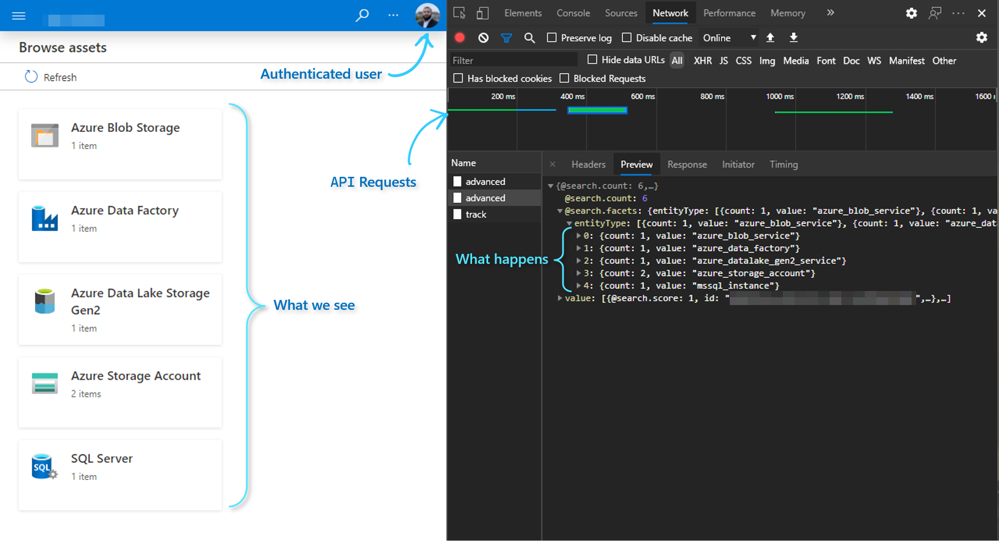
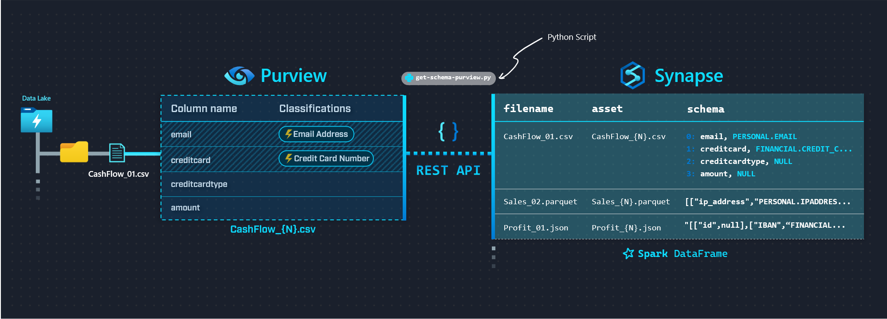
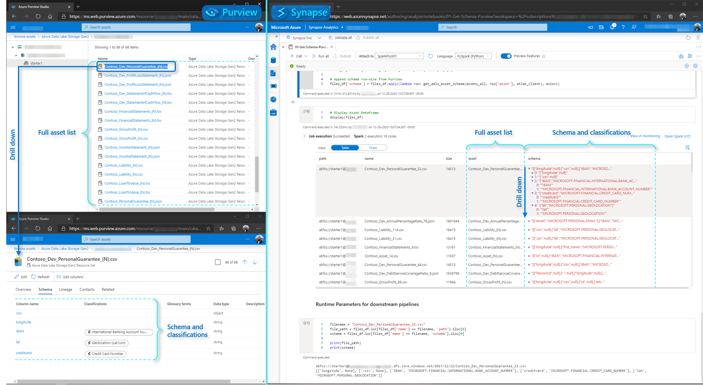
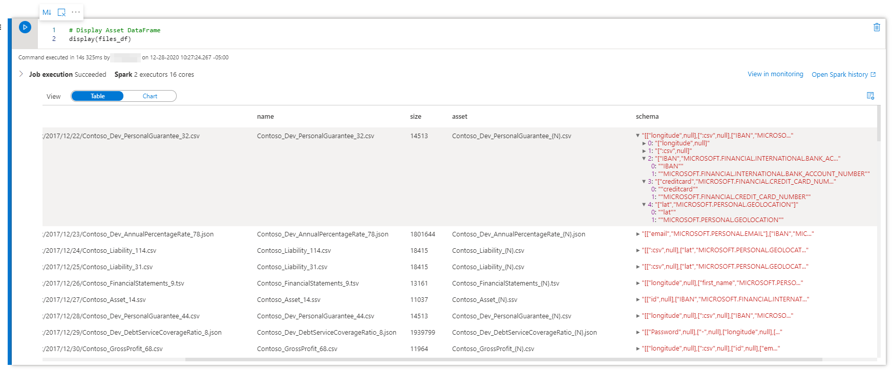

import { Callout } from "../../src/components/atoms.js"
import { ExtLink, InlinePageLink } from "../../src/components/atoms.js"

<Callout>

💡 In this article - we explore a Python script written in Synapse with some reusable functions to programmatically access Purview's REST API.

</Callout>

Once **Azure Purview** is deployed and initially set up (i.e. [Data Sources registered](https://docs.microsoft.com/en-us/azure/purview/manage-data-sources), [Assets scanned](https://docs.microsoft.com/en-us/azure/purview/create-a-scan-rule-set) and [Classifications applied](https://docs.microsoft.com/en-us/azure/purview/apply-classifications)), there's two high level approaches to interacting with the managed service:

1. **[Purview Studio](https://docs.microsoft.com/en-us/azure/purview/use-purview-studio)**: i.e. the visual interface (great overview [here](https://youtu.be/27bA4KFiEKk))
2. **[Purview REST API](https://docs.microsoft.com/en-us/azure/purview/tutorial-using-rest-apis)**: i.e. the programmatic interface - based on Apache Atlas [V2 REST API](https://atlas.apache.org/api/v2/index.html) (Swagger definition available [here](https://github.com/Azure/Purview-Samples/tree/master/rest-api))

In fact, every time we click around in Purview Studio, the Front-End Web App (i.e. what we see) is really systematically calling the REST APIs under-the-hood using the authenticated user's OAuth token:


Amongst many other things, we can leverage this capability to programmatically access the valuable metadata made available through Purview's features - such as Asset Scans and Classifications, to enable downstream Data Engineering capabilities/processes (that would otherwise be extremely cumbersome to automate and implement in a scalable manner).

In simple words, the idea is:

- **Purview** gives us intelligent metadata: _"These are the files on your Data Lake and the underlying columns that contain sensitive data"_
- And in return, we can say to **Synapse**: _"Go ahead and use Spark Pools to drop, obfuscate, anonymize or otherwise deal with those columns"_

The first step to achieving this is to programmatically enable Synapse Spark Pools to retrieve the metadata from Purview (in this case, the schema and sensitivity labels).

In this article, I wanted to share some of the initial tools/techniques to enable us in achieving this important first step - getting the schema and senstivity labels from Purview into Synapse Spark Pools, available in the form of a Spark DataFrame. Once we have the metadata available in Spark, there's a whole world of existing/up-and-coming Data Engineering capabilities we can leverage to allow us to take action on this metadata (we'll explore this in another article).

<Callout>

❗ These techniques/tools are from some initial exploration of the Purview REST API - shared here as a **starting point** for exploratory/education purposes using common Python libraries.

For official Microsoft content - please refer to the [Purview Documentation](https://docs.microsoft.com/en-us/azure/purview/).

</Callout>

## The Pipeline

Here's a summarized view of what we want to achieve (click to enlarge):


We'll be achieving this using a single Python script `get-schema-purview.py` (linked [below](#pipeline-walkthrough)), while leveraging a couple of helpful Python Libraries along the way (listed [below](#libraries-used-in-synapse-spark-pool)).

And the end result, side-by-side:


## Pre-Requisites & Environment Setup

### Purview and Data Estate setup

To quickly populate a Data Lake and set up Purview scans, follow [this five-part tutorial series](https://docs.microsoft.com/en-us/azure/purview/tutorial-scan-data) that comes with a [helpful starter kit (`zip` file)](https://download.microsoft.com/download/9/7/9/979db3b1-0916-4997-a7fb-24e3d8f83174/PurviewStarterKitV4.zip) to generate a variety of random datasets with PII and non-PII data.

### App Registration/Service Principal

Once Purview is set up to scan the Data Lake, the next step is to create a Service Principal that will allow us to access the REST API - steps [here](https://docs.microsoft.com/en-us/azure/purview/tutorial-using-rest-apis#create-a-service-principal-application).

To localize the Python script to point to our Purview implementation, we make note of the:

- `clientId`
- `tenantId`
- `clientSecret`

### Libraries used in Synapse Spark Pool

Here's the contents of the [`requirements.txt`](https://docs.microsoft.com/en-us/azure/synapse-analytics/spark/apache-spark-azure-portal-add-libraries#requirements-format) file used to install libraries on the Synapse Spark Pool:

```txt
jmespath
pyapacheatlas
```

#### JMESPath: [link](https://jmespath.org/)

JMESPath is a nifty library that makes it a breeze to navigate [(query](https://jmespath.org/examples.html#working-with-nested-data), [filter](https://jmespath.org/examples.html#filters-and-multiselect-hashes) etc.) complex JSON data in Python. We use it to comfortably parse and iterate through the JSON payloads received from the Purview REST API.

#### PyApacheAtlas: [link](https://github.com/wjohnson/pyapacheatlas)

PyApacheAtlas is a Python library in development by a fellow Microsoft CSA - [Will Johnson](https://github.com/wjohnson). Essentially, the library presents a programmatic wrapper around the Atlas API, accessible through an [`AtlasClient`](https://github.com/wjohnson/pyapacheatlas/blob/master/pyapacheatlas/core/client.py) object.

We use a combination of the Purview REST API (via JMESPath), and the `AtlasClient` object to achieve getting the full list of Assets from Purview, and iterating to populate the corresponding metadata per Asset.

<Callout>

🚀 It's best practice to pin the specific version of the libraries with `==X.X.X` to avoid version compatibility (omitted for our purposes here).

</Callout>

## Pipeline Walkthrough

<Callout>

📦 `get-schema-purview.py` script is available on GitHub [here](https://gist.github.com/mdrakiburrahman/026b4875a65879ee3076018374c1d998).

❗ This script applies the simple recursion techniques I outlined in [this article](../directory-recursion-synapse/) against our Data Lake and Purview API to retrieve asset names and schemas.

While this is fine for exploration, due diligence (i.e. implementing a more optimal, piecemeal approach) should be applied for Production implementations on a case-by-case basis to avoid long-running jobs - [see here](https://www.cs.cornell.edu/courses/cs3110/2012sp/lectures/lec20-master/lec20.html).

</Callout>

Let's look at the relevant components from the script.

The first function `azuread_auth` is straightforward and not Purview specific - it simply allows us to authenticate to Azure AD using our Service Principal and the Resource URL we want to navigate (in this case, Purview: `https://purview.azure.net`):

```python
def azuread_auth(tenant_id: str, client_id: str, client_secret: str, resource_url: str):
    """
    Authenticates Service Principal to the provided Resource URL, and returns the OAuth Access Token
    """
    url = f"https://login.microsoftonline.com/{tenant_id}/oauth2/token"
    payload= f'grant_type=client_credentials&client_id={client_id}&client_secret={client_secret}&resource={resource_url}'
    headers = {
    'Content-Type': 'application/x-www-form-urlencoded'
    }
    response = requests.request("POST", url, headers=headers, data=payload)
    access_token = json.loads(response.text)['access_token']
    return access_token
```

We're going to be passing around the `access_token` returned above every time we make a call to Purview's REST API.

Next, we leverage PyApacheAtlas to return a `client` using `purview_auth`:

```Python
def purview_auth(tenant_id: str, client_id: str, client_secret: str, data_catalog_name: str):
    """
    Authenticates to Atlas Endpoint and returns a client object
    """
    oauth = ServicePrincipalAuthentication(
        tenant_id = tenant_id,
        client_id = client_id,
        client_secret = client_secret
    )
    client = PurviewClient(
        account_name = data_catalog_name,
        authentication = oauth
    )
    return client
```

Once we have our proof of authentication (`access_token` and `client`) - we're ready to programmatically access the Purview REST API.

We use `get_all_adls_assets` to recursively retrieve all scanned assets from our Data Lake from the Purview REST API.

<Callout>

🌲 **Note**: this function intentionally traverses the tree structure until only assets remain (i.e. no folders are returned, only files).

</Callout>

The API parameter used to determine whether we hit the end is `isLeaf`:

```Python
def get_all_adls_assets(path: str, data_catalog_name: str, azuread_access_token: str, max_depth=1):
    """
    Retrieves all scanned assets for the specified ADLS Storage Account Container.

    Note: this function intentionally recursively traverses until only assets remain (i.e. no folders are returned, only files).
    """

    # List all files in path
    url = f"https://{data_catalog_name}.catalog.purview.azure.com/api/browse"

    headers = {
            'Authorization': f'Bearer {azuread_access_token}',
            'Content-Type': 'application/json'
            }

    payload="""{"limit": 100,
                "offset": null,
                "path": "%s"
                }""" % (path)

    response = requests.request("POST", url, headers=headers, data=payload)

    li = json.loads(response.text)

    # Return all files
    for x in jmespath.search("value", li):
        if jmespath.search("isLeaf", x):
            yield x

    # If the max_depth has not been reached, start
    # listing files and folders in subdirectories
    if max_depth > 1:
        for x in jmespath.search("value", li):
            if jmespath.search("isLeaf", x):
                continue
            for y in get_all_adls_assets(jmespath.search("path", x), data_catalog_name, azuread_access_token, max_depth - 1):
                yield y

    # If max_depth has been reached,
    # return the folders
    else:
        for x in jmespath.search("value", li):
            if jmespath.search("!isLeaf", x):
                yield x
```

Note a couple points regarding this function:

- We can further expand the implementation by abstracting away the data source and making `source_type` into a parameter (i.e. besides ADLS, we can query metadata about [other sources](https://docs.microsoft.com/en-us/azure/purview/sources-and-scans) supported on Purview - e.g. SQL DB, Cosmos DB etc.).

  We'll just need to deal with curating the `payload` on a case-by-case basis, but the basic premise remains the same.

- Note the `limit: 100` parameter is there because I didn't want to deal with [API Pagination logic](https://medium.com/swlh/paginating-requests-in-apis-d4883d4c1c4c) (the demo Data Lake is small).

  This parameter can be increased for larger implementations up until we hit the upper limit defined by the API - at which point we need to implement pagination best practices into our script logic (no different than other Azure/non-Azure APIs).

- For deeper folder structures, `max_depth` can be increased as desired

Once we have a list of all our assets, we can iterate through the list and retrieve the Schema and Classification from Purview inline:

```python
files_df['schema'] = files_df.apply(lambda row: get_adls_asset_schema(assets_all, row['asset'], atlas_client), axis=1)
```

Where we use the `client` object we defined earlier to call `get_adls_asset_schema`:

```python
def get_adls_asset_schema(assets_all: list, asset: str, purview_client: str):
    """
    Returns the asset schema and classifications from Purview
    """
    # Filter response for our asset of interest
    assets_list = list(filter(lambda i: i['name'] == asset, assets_all))

    # Find the guid for the asset to retrieve the tabular_schema or attachedSchema (based on the asset type)
    match_id = ""
    for entry in assets_list:
        # Retrieve the asset definition from the Atlas Client
        response = purview_client.get_entity(entry['id'])

        # API response is different based on the asset
        if asset.split('.', 1)[-1] == "json":
            filtered_response = jmespath.search("entities[?source=='DataScan'].[relationshipAttributes.attachedSchema[0].guid]", response)
        else:
            filtered_response = jmespath.search("entities[?source=='DataScan'].[relationshipAttributes.tabular_schema.guid]", response)

        # Update match_id if source is DataScan
        if filtered_response:
            match_id = filtered_response[0][0]

    # Retrieve the schema based on the guid match
    response = purview_client.get_entity(match_id)
    asset_schema = jmespath.search("[referredEntities.*.[attributes.name, classifications[0].[typeName][0]]]", response)[0]

    return asset_schema
```

Note a couple takeaways from here:

- JMESPath is awesome
- The Atlas API response is slightly different based on the filetype (e.g. `json` vs `csv`), hence we deal with it case-by-case.

  This makes sense, since `json` technically has `attachedSchema` (i.e. Schema that comes as a part of the object itself), whereas `csv` is of type `tabular_schema` (i.e. Schema that Purview had to infer)

Finally, once the functions are done calling the API, we can call a `display(files_df)` on our DataFrame to get back the final output:



<Callout>

💡 `files_df` is a Pandas DataFrame, but we can easily convert to Spark with `files_df = spark.createDataFrame(files_df)`.

Shouldn't make a difference for our purposes since the DataFrame is small.

</Callout>

## Wrap Up

We explored how to call the Purview REST API with Python to programmatically obtain Purview Asset Metadata - i.e. Schema and Classifications into Synapse as a DataFrame. At this point, we can feed the Classification Metadata into further Data Pipelines to enable desirable Use Cases downstream.
