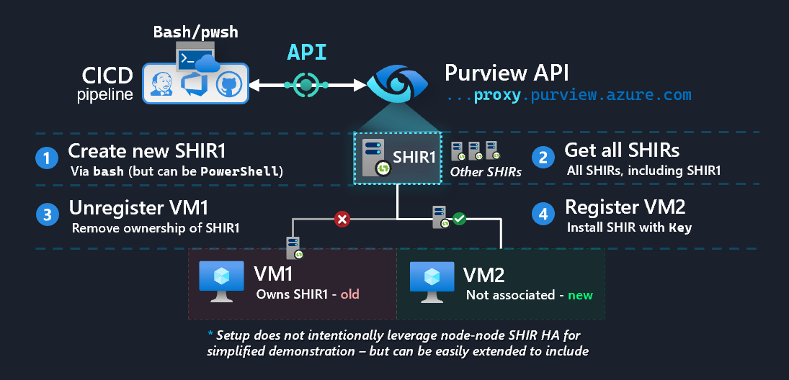
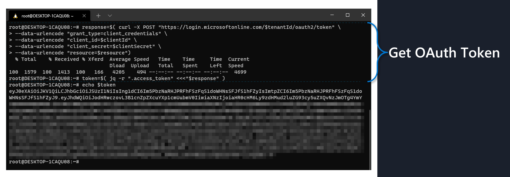
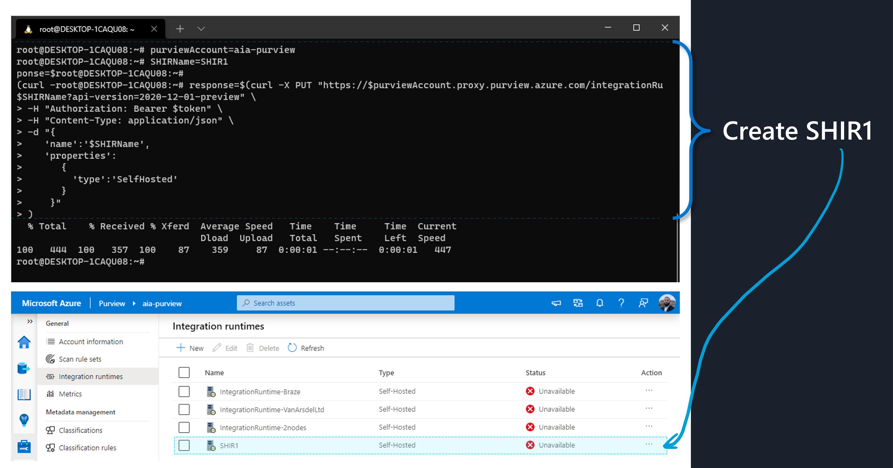
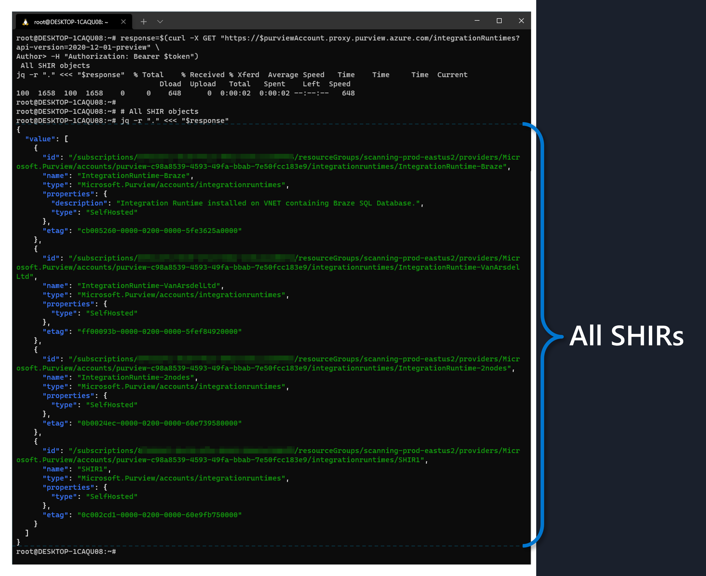
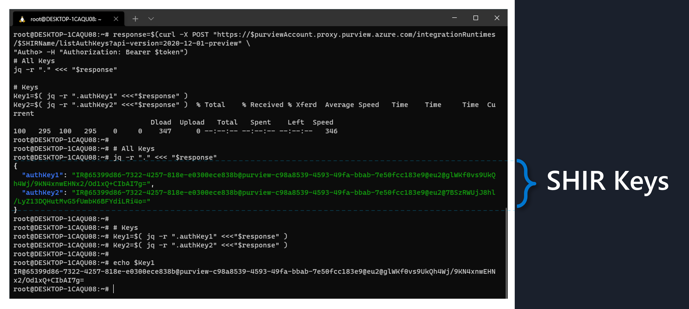
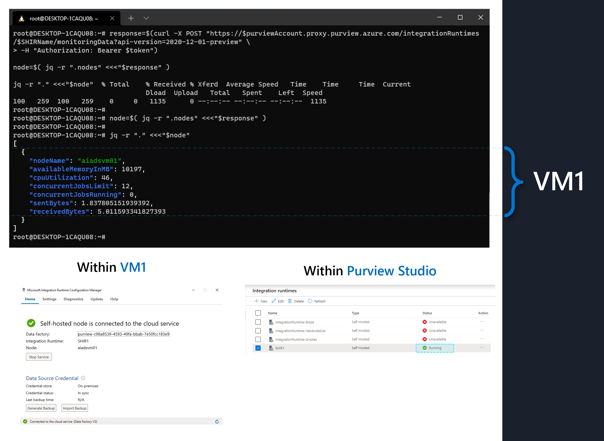
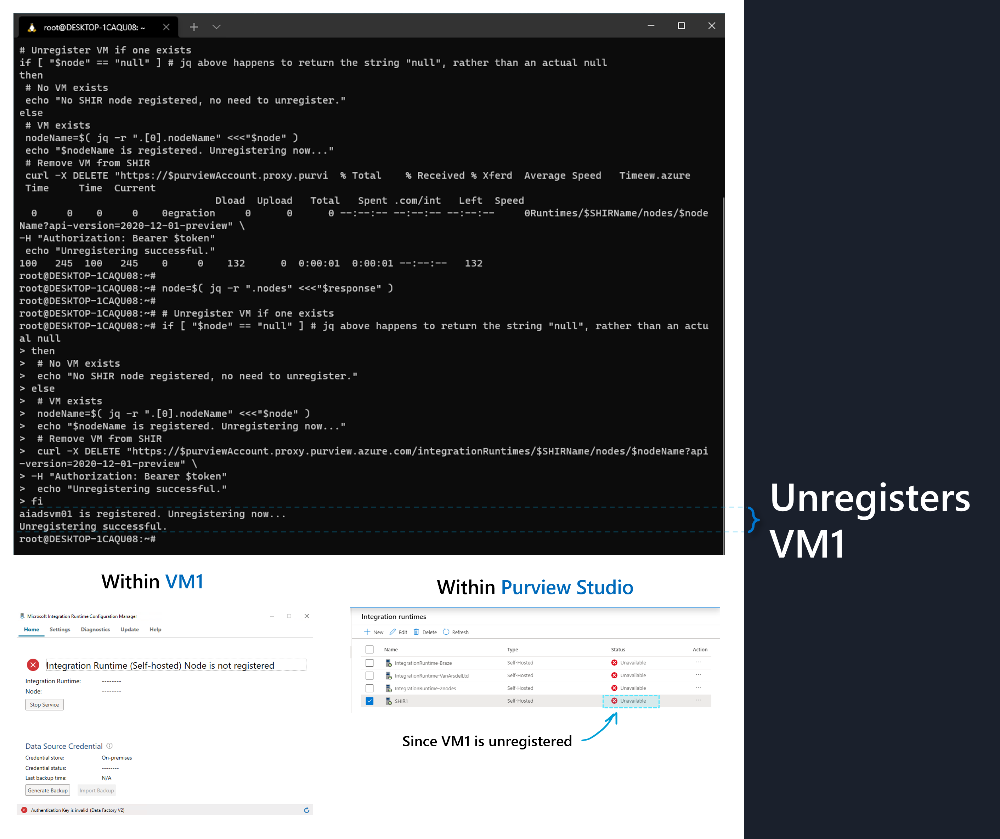
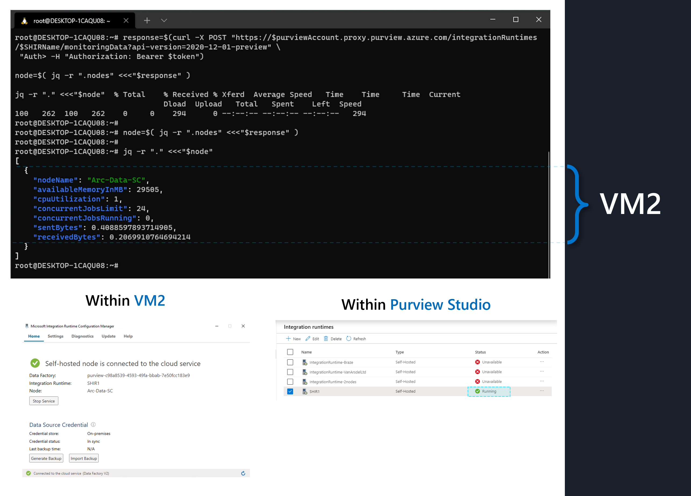

import { Callout } from "../../src/components/atoms.js"
import { ExtLink, InlinePageLink } from "../../src/components/atoms.js"

Organizations often need to automate management of [**Self-hosted Integration Runtime** (SHIR)](https://docs.microsoft.com/en-us/azure/data-factory/concepts-integration-runtime#self-hosted-integration-runtime) nodes - for example, when **VM1** (a Windows machine) needs to be replaced by **VM2** (a _newer_ Windows machine) - which contains a patched/updated base image. In the absence of automation, one would need to perform a series of manual steps involving RDP-ing into both machines, clicking around within the Purview Studio to delete/modify scans etc. every time this need arises.

Data Factory SHIR offers [`az datafactory integration-runtime`](https://docs.microsoft.com/en-us/cli/azure/datafactory/integration-runtime?view=azure-cli-latest) module for day-to-day SHIR management, as well as [Powershell scripts](https://docs.microsoft.com/en-us/azure/data-factory/self-hosted-integration-runtime-automation-scripts) for first time installations. This allows us to leverage an existing CI/CD pipeline ([Azure DevOps Pipeline tasks](https://docs.microsoft.com/en-us/azure/devops/pipelines/tasks/utility/powershell?view=azure-devops), [GitHub Actions](https://docs.github.com/en/actions/guides/building-and-testing-powershell), [Jenkins](https://youtu.be/mbeQWBNaNKQ) etc.) that offers some form of stateless script runtime (e.g. Bash or Powershell) to automate these day-to-day operations. As Azure Purview rapidly moves into GA, we can expect these innovations to be available for consumption in a similar manner - but at the time of writing (July 2021) it's not quite there yet.

As a workaround, this article offers a scripted approach involving the `https://your--purview--acct.**proxy**.purview.azure.com` endpoint that allows us to achieve end-to-end automation, imitating what's available in Data Factory SHIR today - which is the focus of the rest of this article.

<Callout>

⚠ **Warning:** the workaround scripts presented here is not to be considered as official guidance or recommendation from Microsoft. It is presented for educational purposes only, and comes “as-is” and confers no rights, warranties, guarantees, support etc.

That being said, if you run into any problems, feel free to log an issue in my personal GitHub [here](https://github.com/mdrakiburrahman/rakirahman.me/issues/new), I'd be happy to help 😊.

Furthermore, as Purview modules are released (e.g. within [`az cli`](https://docs.microsoft.com/en-us/cli/azure/reference-index?view=azure-cli-latest#commands)), the techniques illustrated in this article will most likely become obsolete. For up-to-date official updates, refer to Microsoft docs [here](https://docs.microsoft.com/en-us/azure/purview/).

</Callout>

## Automation steps

We're going to demonstrate the SHIR automation lifecycle end-to-end, as follows:



1. **Create new SHIR1**: create a new **SHIR1** entity against an existing Purview Account.
2. **Get all SHIRs**: obtain a JSON payload of all SHIR entities.
3. **Unregister VM1**: we first onboard VM1 from scratch using Powershell (_executed inside VM_), then showcase how to unregister it via bash (_executed from CICD pipeline_).
4. **Register VM2**: unregister VM1, and onboard VM2.

At this point, the automation cycle is complete - i.e. VM1 can be deleted, and this can be repeated going forwards (i.e. VM2 → VM3 → and so on.)

<Callout>

The steps below leverages a **Service Principal** to communicate with Purview's API - for first time configuration steps on how to do this, see <InlinePageLink to="/purview-api-with-synapse/#app-registrationservice-principal">here</InlinePageLink>.

</Callout>

## 1. Create new SHIR1

#### Get OAuth Token

We run the following inside our CICD pipeline (in this case running bash) to obtain an OAuth Token against Purview (note that the [`jq`](https://stedolan.github.io/jq/) usage is completely optional):

```bash
# Localize for your environment
tenantId=<your-tenant-id>
clientId=<service-principal-client-id>
clientSecret=<service-principal-client-secret>
resource=https://purview.azure.net

# Get OAuth Token
response=$( curl -X POST "https://login.microsoftonline.com/$tenantId/oauth2/token" \
--data-urlencode "grant_type=client_credentials" \
--data-urlencode "client_id=$clientId" \
--data-urlencode "client_secret=$clientSecret" \
--data-urlencode "resource=$resource")

token=$( jq -r ".access_token" <<<"$response" )
```

If we call `echo $token`, we should see the Token value if authentication was successful - e.g. something like this:



#### Create new SHIR Object in Purview

The following creates a SHIR entity named **SHIR1** against an existing Purview Account:

```bash
# Localize for your environment
purviewAccount=<your-purview-acct>
SHIRName=SHIR1

# Create Self Hosted Integration Runtime Object
response=$(curl -X PUT "https://$purviewAccount.proxy.purview.azure.com/integrationRuntimes/$SHIRName?api-version=2020-12-01-preview" \
-H "Authorization: Bearer $token" \
-H "Content-Type: application/json" \
-d "{
   'name':'$SHIRName',
   'properties':
      {
        'type':'SelfHosted'
      }
    }"
)
```

And we see **SHIR1** get created within Purview Studio:


## 2. Get all SHIRs

We can get a list of all our SHIR entities (not the individual VMs - but the Purview Objects) as follows:

```bash
response=$(curl -X GET "https://$purviewAccount.proxy.purview.azure.com/integrationRuntimes?api-version=2020-12-01-preview" \
-H "Authorization: Bearer $token")

# List of SHIR objects
jq -r "." <<< "$response"
```

This can be useful if we were performing management across multiple SHIR objects (in this demo, we're only using **SHIR1** - but this can be easily extended by adding another layer to our automation logic.)



## 2½. Onboard VM1 for demonstration

Before we can unregister VM1, for this demo we first need a VM1 to be registered against SHIR1 (since we created SHIR1 from scratch [above](#1-create-new-shir1)). In reality, we would have already onboarded VM1 at some previous point in time (that's the whole idea for us wanting to replace VM1 with a newer, patched VM2).

At a high level, there's two patterns we can leverage at this point:

1. Grab SHIR Key from Purview inside CICD pipeline as our Service Principal, then pass in SHIR Key1 to the VM to register itself.
2. Pass in Service Principal creds _inside_ the VM, have it gather SHIR Key1 from Purview, then have it register itself.

We proceed with **Method 1** - as it doesn't involve us injecting our Service Principal creds into the VM, but rather just the SHIR Key1 (which is limited to the scope of SHIR1) - i.e. it's arguably more secure.

### Gather SHIR Keys

We can grab Key1 and Key2 from SHIR1 inside our CICD pipeline as follows:

```bash
response=$(curl -X POST "https://$purviewAccount.proxy.purview.azure.com/integrationRuntimes/$SHIRName/listAuthKeys?api-version=2020-12-01-preview" \
-H "Authorization: Bearer $token")

# All Keys
jq -r "." <<< "$response"

# Keys
Key1=$( jq -r ".authKey1" <<<"$response" )
Key2=$( jq -r ".authKey2" <<<"$response" )
```



Now, we can pass in any one of the Keys, e.g. Key1, as well as a PowerShell script that contains the **SHIR onboarding logic** (i.e. [latest executable download](https://www.microsoft.com/en-us/download/details.aspx?id=39717) → installation → registration) into VM1 (e.g. as a [Custom Script Extension](https://docs.microsoft.com/en-us/azure/virtual-machines/extensions/custom-script-windows#extension-schema) if we're deploying an Azure VM). Here, we can make use of the [PowerShell scripts](https://github.com/nabhishek/SelfHosted-IntegrationRuntime_AutomationScripts) provided by the Data Factory team.

<Callout>

📦 For this demo, I've slightly modified the Data Factory scripts to take in SHIR Key as a single parameter - available as a gist [here](https://gist.github.com/mdrakiburrahman/cc99928d639fa10e905d36d2ed844429).

</Callout>

### Register VM1 with SHIR Key

We run the SHIR onboarding PowerShell script inside VM1 (once again, for this demo we showcase via RDP - but in reality this would be done as part of the CICD pipeline):

```powershell
# Download script
$SHIRInstallScriptURL = "https://gist.githubusercontent.com/mdrakiburrahman/cc99928d639fa10e905d36d2ed844429/raw/SHIRInstall.ps1"
$ScriptPath = "$PWD\SHIRInstall.ps1"

$client = New-Object System.Net.WebClient
$client.DownloadFile($SHIRInstallScriptURL, $ScriptPath)

# Execute script
.\SHIRInstall.ps1 $Key # Pass in SHIR Key1 via CICD pipeline

# Tail logs from script (for demo only)
Get-Content -Path ".\tracelog.log" -Wait # tracelog.log is generated by the script

```

VM1 SHIR onboarding (takes about 2.5 minutes):


And we can progammatically get the VM1 registration info back in bash:

```bash
response=$(curl -X POST "https://$purviewAccount.proxy.purview.azure.com/integrationRuntimes/$SHIRName/monitoringData?api-version=2020-12-01-preview" \
-H "Authorization: Bearer $token")

node=$( jq -r ".nodes" <<<"$response" )

jq -r "." <<<"$node"
```



## 3. Unregister VM1

The following script will unregister the VM that's registered against SHIR1 (currently, this is VM1). We have the script query the Purview API for the currently registered VM's name to keep the logic stateless (i.e. otherwise, we'd need to pass in the name of the VM from a state-store somewhere; e.g. a database - which adds unnecessary complexity):

```bash
# Get name of currently registered VM
response=$(curl -X POST "https://$purviewAccount.proxy.purview.azure.com/integrationRuntimes/$SHIRName/monitoringData?api-version=2020-12-01-preview" \
-H "Authorization: Bearer $token")

node=$( jq -r ".nodes" <<<"$response" )

# Unregister VM if one exists
if [ "$node" == "null" ] # jq above happens to return the string "null", rather than an actual null if ".nodes" is empty
then
 # No VM exists
 echo "No SHIR node registered, no need to unregister."
else
 # VM exists
 nodeName=$( jq -r ".[0].nodeName" <<<"$node" )
 echo "$nodeName is registered. Unregistering now..."
 # Remove VM from SHIR
 curl -X DELETE "https://$purviewAccount.proxy.purview.azure.com/integrationRuntimes/$SHIRName/nodes/$nodeName?api-version=2020-12-01-preview" \
-H "Authorization: Bearer $token"
 echo "Unregistering successful."
fi

```

We see it picks up the fact that VM1 is registered, and unregisters it:


<Callout>

💡 Notice how SHIR1 is showing as **unavailable** in Purview Studio, since we didn't configure [node-node HA](https://docs.microsoft.com/en-us/azure/data-factory/create-self-hosted-integration-runtime#high-availability-and-scalability) for this demo. Note that this requires a [TLS/SSL cert](https://docs.microsoft.com/en-us/azure/data-factory/create-self-hosted-integration-runtime#tlsssl-certificate-requirements) for the nodes to intercommunicate securedly (which is not our focus point today).

Since SHIR1 has no VM's associated with it at _this exact point in time_ (i.e. before we've had a chance to Register VM2), if a Scan were to run from Purview that utilizes SHIR1, it would fail. This is where we can be clever about making the VM2 registration happen in quick succession inside our CICD pipeline.

</Callout>

At this point, we can deallocate and delete VM1 as needed - as it's no longer required for our SHIR scanning pipeline.

## 4. Register VM2

Finally, to register our new node, we leverage the [script from above](#register-vm1-with-shir-key) on VM2 (a new, patched Windows VM), to register it against SHIR1:


And we see our VM2 registered:


And that's it! We can now repeat [Step 3](#3-unregister-vm1) and [Step 4](#4-register-vm2) above every time we need to replace a VM without any manual steps involved.
