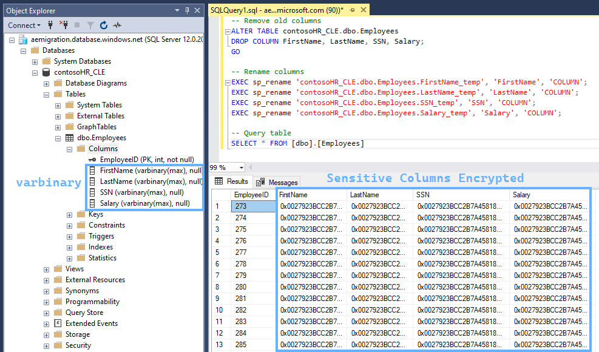
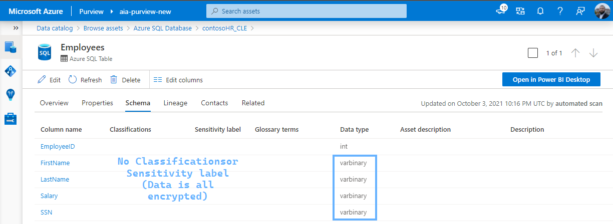
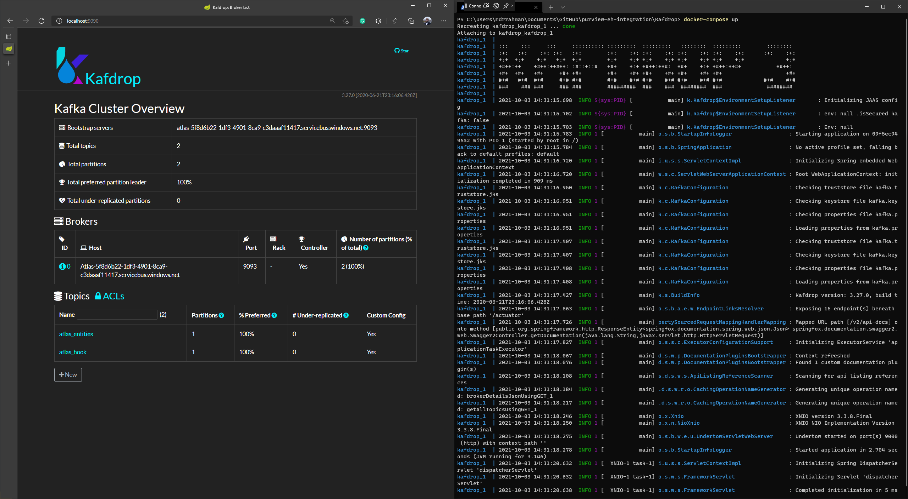
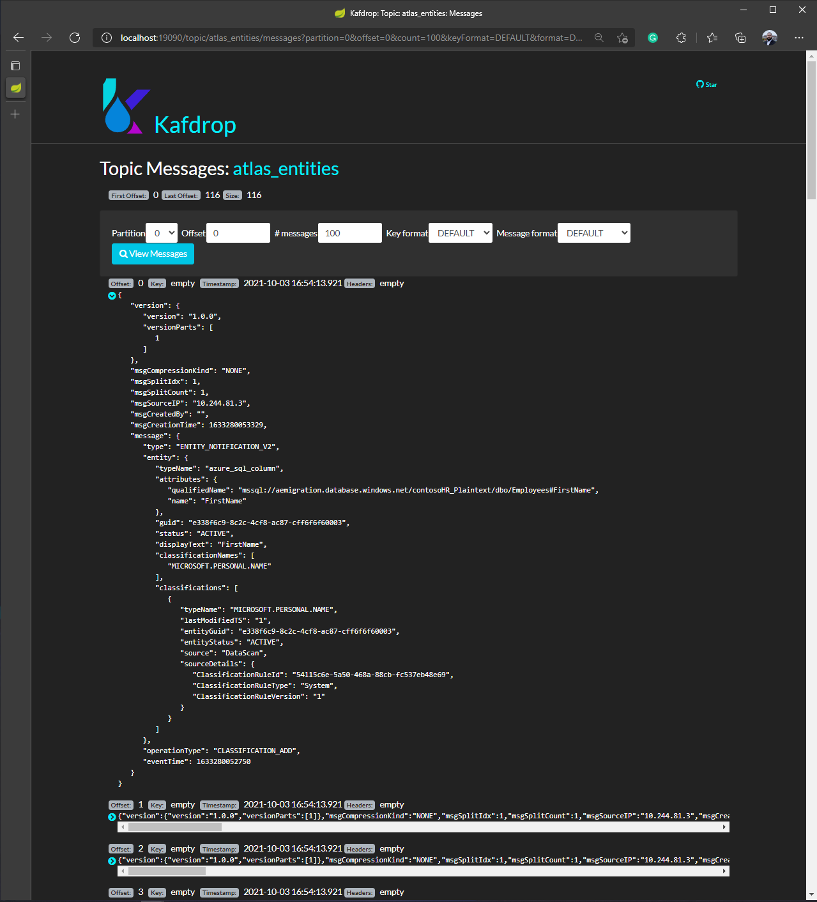
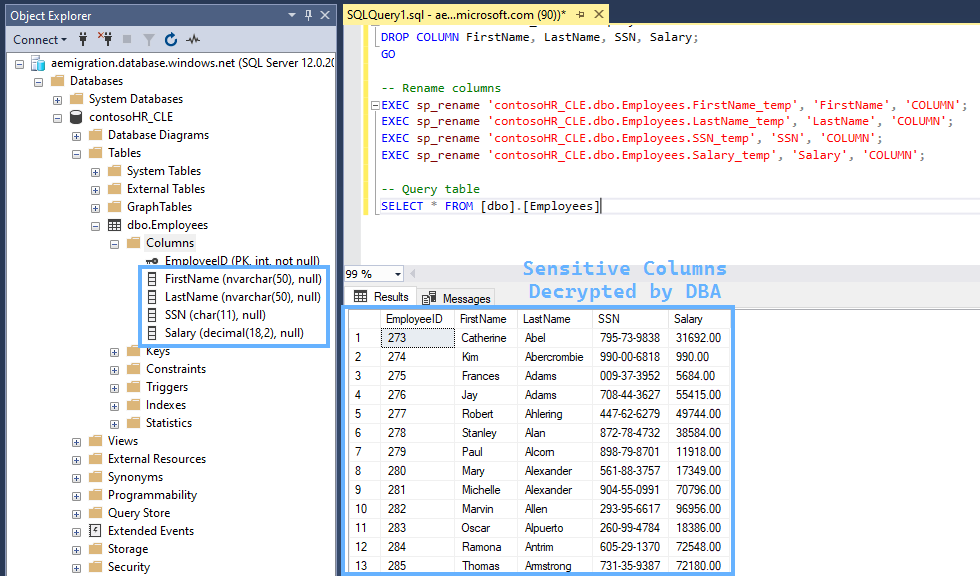
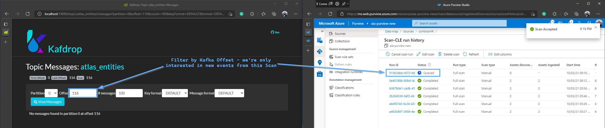
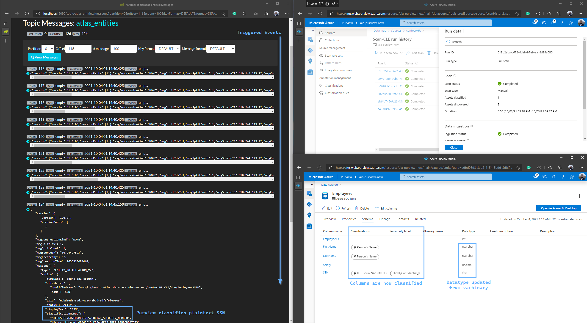
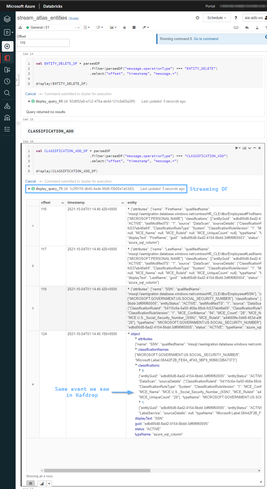

import { Callout } from "../../src/components/atoms.js"
import { ExtLink, InlinePageLink } from "../../src/components/atoms.js"

**Scenario:**

- You have an Azure SQL Database containing sensitive data
- All sensitive columns are encrypted using [SQL Server CLE](https://www.sqlshack.com/an-overview-of-the-column-level-sql-server-encryption/) - stored as `varbinary`
- You're afraid of DBA's leaving sensitive columns unencrypted in the clear, and would like to be notified asynchronously after this happens
- You'd like Purview to scan this Database frequently to periodically assess the schema, and assign [classifications](https://docs.microsoft.com/en-us/azure/purview/apply-classifications)
- If sensitive columns are detected, you'd like to receive the event metadata in a customizable and consumable manner
- Depending on your organization's business logic, you'd like to action these events in some custom manner (e.g. send a text message to a manager, open a ServiceNow ticket etc.)

All of this can be achieved using the Real-time events exposed in Purview's [`ATLAS_ENTITIES`](https://atlas.apache.org/2.0.0/Notifications.html) Atlas Hook that's available as a [Kafka endpoint](https://docs.microsoft.com/en-us/azure/purview/manage-kafka-dotnet#write-code-to-send-messages-to-the-event-hub):


## Demo environment Setup

Our sensitive table in it's original, decrypted format looks something like this:


<Callout>

BACPAC file available [here](https://rakirahman.blob.core.windows.net/public/files/contosohr.bacpac).

</Callout>

We follow the steps from [this doc](https://docs.microsoft.com/en-us/sql/relational-databases/security/encryption/encrypt-a-column-of-data?view=sql-server-ver15) to:

### Enable Encryption

```sql
-- Create a database master key
CREATE MASTER KEY ENCRYPTION BY
PASSWORD = '\yC:teLz8zaF*8tA'; -- Some strong password

-- Create Self Signed Cert
CREATE CERTIFICATE Certificate_test WITH SUBJECT = 'Protect ContosoHR';
GO

-- Create Symmetric Key
CREATE SYMMETRIC KEY SymKey_test WITH ALGORITHM = AES_256 ENCRYPTION BY CERTIFICATE Certificate_test;

-- Validate Symmetric Key creation
SELECT name KeyName,
    symmetric_key_id KeyID,
    key_length KeyLength,
    algorithm_desc KeyAlgorithm
FROM sys.symmetric_keys;

```

### Encrypt all columns

```sql
-- Add new columns
ALTER TABLE contosoHR_CLE.dbo.Employees
ADD
  FirstName_temp varbinary(MAX),
  LastName_temp varbinary(MAX),
  SSN_temp varbinary(MAX),
  Salary_temp varbinary(MAX)
GO

-- Open Symmetric Key so we can encrypt stuff
OPEN SYMMETRIC KEY SymKey_test DECRYPTION BY CERTIFICATE Certificate_test;

-- Encrypt columns
UPDATE contosoHR_CLE.dbo.Employees
SET
	FirstName_temp = EncryptByKey (Key_GUID('SymKey_test'), FirstName),
	LastName_temp = EncryptByKey (Key_GUID('SymKey_test'), LastName),
	SSN_temp = EncryptByKey (Key_GUID('SymKey_test'), SSN),
	Salary_temp = EncryptByKey (Key_GUID('SymKey_test'), CAST(Salary AS char(11)))
FROM contosoHR_CLE.dbo.Employees;
GO

-- Close Symmetric Key
CLOSE SYMMETRIC KEY SymKey_test;
GO

-- Remove old columns
ALTER TABLE contosoHR_CLE.dbo.Employees
DROP COLUMN FirstName, LastName, SSN, Salary;
GO

-- Rename columns
EXEC sp_rename 'contosoHR_CLE.dbo.Employees.FirstName_temp', 'FirstName', 'COLUMN';
EXEC sp_rename 'contosoHR_CLE.dbo.Employees.LastName_temp', 'LastName', 'COLUMN';
EXEC sp_rename 'contosoHR_CLE.dbo.Employees.SSN_temp', 'SSN', 'COLUMN';
EXEC sp_rename 'contosoHR_CLE.dbo.Employees.Salary_temp', 'Salary', 'COLUMN';

-- Query table
SELECT * FROM [dbo].[Employees]
```

This leaves our table in the desired encrypted state:


And we scan this Database using Purview:


This is our starting point.

## Kafdrop setup with Docker Desktop

[Kafdrop](https://github.com/obsidiandynamics/kafdrop) is great! When working with Kafka, you can use it to visualize Kafka topics and messages in real-time, great for development/debugging:



<Callout>

💡 The idea is, we're going to point Kafdrop at Purview's Kafka endpoint, change a few things in our Database, run scans, and visualize the real-time events that get generated to get a good sense of what events we're looking to monitor.

Then, we're going to monitor those events via Spark Streaming in Databricks - using Kafka as the streaming source.

From there, Spark can process, filter and extend via code to achieve all sorts of things - like calling webhooks to send text messages, alerts etc.

</Callout>

Starting Kafdrop is simple with Docker Desktop.

You first create a `docker-compose.yml`:

```yaml
version: "3.2"
services:
  kafdrop-new:
    image: obsidiandynamics/kafdrop:latest
    ports:
      - 19090:9000
    environment:
      KAFKA_BROKERCONNECT: atlas-3f22b60a-a69c-....servicebus.windows.net:9093 # Your Purview Kafka endpoint, available from the Portal
    volumes:
      - ./kafka.properties:/kafka.properties
```

And to work with Event Hub, it needs a `kafka.properties` file containing the Connection String:

```bash
security.protocol=SASL_SSL
sasl.mechanism=PLAIN
sasl.jaas.config=org.apache.kafka.common.security.plain.PlainLoginModule required username="$ConnectionString" password="Endpoint=sb://atlas-3f22b60a-a69c-....servicebus.windows.net/;SharedAccessKeyName=AlternateSharedAccessKey;SharedAccessKey=QBsp+4...";
```

Then you run `docker-compose up`, and browse to the Kafdrop UI at `localhost:19090`. From there, you can browse the messages on your Kafka topic - in Purview's case `atlas_entities` or `atlas_hook` - like so:



The types of messages in `atlas_entities` are distinguishable in the JSON payload by looking at the `message.operationType` field:

```text
   ENTITY_CREATE:         sent when an entity instance is created
   ENTITY_UPDATE:         sent when an entity instance is updated
   ENTITY_DELETE:         sent when an entity instance is deleted
   CLASSIFICATION_ADD:    sent when classifications are added to an entity instance
   CLASSIFICATION_UPDATE: sent when classifications of an entity instance are updated
   CLASSIFICATION_DELETE: sent when classifications are removed from an entity instance
```

## Database Decrypted and exposed as plaintext

The following TSQL decrypts our tables in place:

```sql
-- Add new columns
ALTER TABLE contosoHR_CLE.dbo.Employees
ADD
  FirstName_temp nvarchar(50),
  LastName_temp nvarchar(50),
  SSN_temp char(11),
  Salary_temp decimal(18,2)
GO

-- Open Symmetric Key so we can decrypt stuff
OPEN SYMMETRIC KEY SymKey_test DECRYPTION BY CERTIFICATE Certificate_test;

-- Decrypt columns
UPDATE contosoHR_CLE.dbo.Employees
SET
	FirstName_temp = CONVERT(nvarchar(50), DecryptByKey(FirstName)),
	LastName_temp = CONVERT(nvarchar(50), DecryptByKey(LastName)),
	SSN_temp = CONVERT(char(11), DecryptByKey(SSN)),
	Salary_temp = CONVERT(char(11), DecryptByKey(Salary))
FROM contosoHR_CLE.dbo.Employees;
GO

-- Close Symmetric Key
CLOSE SYMMETRIC KEY SymKey_test;
GO

-- Remove old columns
ALTER TABLE contosoHR_CLE.dbo.Employees
DROP COLUMN FirstName, LastName, SSN, Salary;
GO

-- Rename columns
EXEC sp_rename 'contosoHR_CLE.dbo.Employees.FirstName_temp', 'FirstName', 'COLUMN';
EXEC sp_rename 'contosoHR_CLE.dbo.Employees.LastName_temp', 'LastName', 'COLUMN';
EXEC sp_rename 'contosoHR_CLE.dbo.Employees.SSN_temp', 'SSN', 'COLUMN';
EXEC sp_rename 'contosoHR_CLE.dbo.Employees.Salary_temp', 'Salary', 'COLUMN';

-- Query table
SELECT * FROM [dbo].[Employees]
```



At this point - our sensitive Database is decrypted and visible as plaintext for anyone to query 😧.

## Purview Scan and Event Stream to Kafka

From here, we simulate a scheduled trigger by kicking of a manual Scan - and watch Kafdrop for the sequence of messages that leads to Purview discovering the updated Schema, and classifying the Sensitive Columns:



Here are the real-time events we see Purview places in Kafka, as the scan finishes within a few minutes:

- `CLASSIFICATION_ADD`:
  - Columns that have sensitive data (3) - `FirstName`, `LastName`, `SSN`
- `ENTITY_UPDATE`:
  - **Employees** Table got updated
  - Our columns data type has changed
- `CLASSIFICATION_ADD`:
  - `SSN` - because Purview realizes it's highly confidential

And we see the Asset Schema is updated to reflect the updated state - decrypted columns with sensitive data available in plaintext:


As far as an event-driven application goes, we can easily build a microservice that reads from the above Kafka topic to parse the JSON payload, and use any integration necessary to inform the appropriate authorities. We can also do this sort of stuff pretty easily using Logic Apps ([Source: Event Hubs](https://docs.microsoft.com/en-us/connectors/eventhubs/), [Sink: 3rd Party Connector](https://docs.microsoft.com/en-us/connectors/service-now/)).

Or, instead of a microservice, we can also use Spark Streaming to achieve the same end goal - since Spark Streaming can write to pretty much anything using a [Custom Sink](https://jaceklaskowski.gitbooks.io/spark-structured-streaming/content/spark-sql-streaming-demo-custom-sink-webui.html):



<Callout>

Databricks notebook available [here](https://rakirahman.blob.core.windows.net/public/notebooks/stream_atlas_entities_cleaned.html).

</Callout>

## Conclusion

From here, we can have our Microservice call some webhook endpoint/Enterprise messaging system to inform the appropriate authorities to remediate the situation - or if we're really adventurous, call the [T-SQL](#encrypt-all-columns) above (maybe as a Stored Proc) to re-encrypt the exposed columns automatically (I don't recommend doing this).
