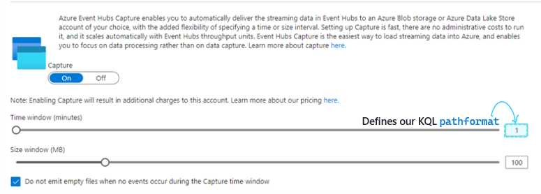
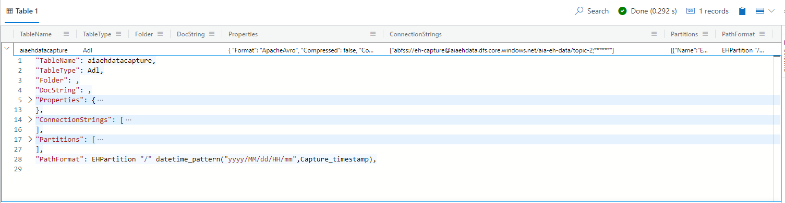
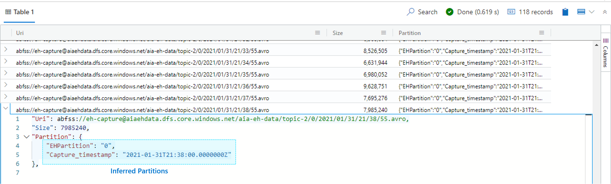
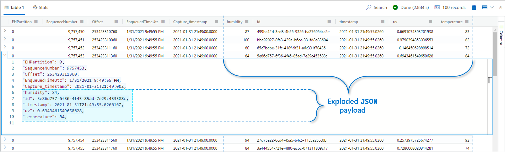

import { Callout } from "../../src/components/atoms.js"
import { ExtLink, InlinePageLink } from "../../src/components/atoms.js"

[Azure Data Explorer](https://docs.microsoft.com/en-us/azure/data-explorer/data-explorer-overview) (ADX) has built-in Data Ingestion capabilities [from Event Hub](https://docs.microsoft.com/en-us/azure/data-explorer/ingest-data-event-hub) - where streaming data is continuously ingested into a [Target Table](https://docs.microsoft.com/en-us/azure/data-explorer/ingest-data-event-hub) on an ADX database. We can also take advantage of external tables on ADX to [query data on Azure Data Lake](<(https://docs.microsoft.com/en-us/azure/data-explorer/data-lake-query-data)>) - in particular, the `avro` files from [Event Hub Capture](https://docs.microsoft.com/en-us/azure/event-hubs/event-hubs-capture-overview).

We looked at how to process Capture files with Auto Loader earlier [here](../event-hub-capture-with-autoloader/). This article presents an alternative approach that allows us to query the same set of `avro` files **_in place_** using [`KQL`](https://docs.microsoft.com/en-us/azure/data-explorer/kusto/query/) instead - with the added benefit of not having to specify the payload schema or move data from the data lake.

<Callout>

💡 The sample Producer and payload details are available [here](../event-hub-capture-with-autoloader/#producer).

</Callout>

Before we structure our `KQL` query to define the external table, we make a note of the **Time window (minutes)** of the Event Hub Capture Frequency - which in our case is **every 1 minute**:


We begin with an existing ADX Database (setup instructions [here](https://docs.microsoft.com/en-us/azure/data-explorer/create-cluster-database-resource-manager)), and create an **external table** on top our Data Lake using the command below:

```sql
// Create External Table
.create external table your_external_table_name (SequenceNumber:long,
                                         Offset:string,
                                         EnqueuedTimeUtc:string,
                                         SystemProperties:dynamic,
                                         Properties:dynamic,
                                         Body: dynamic)
kind=adl
partition by (EHPartition:string, Capture_timestamp:datetime)
pathformat = (EHPartition "/" datetime_pattern("yyyy/MM/dd/HH/mm", Capture_timestamp))

dataformat=apacheavro
(
   h@'abfss://<your--container>@<your--storage--account>.dfs.core.windows.net/<your--event--hub--namespace>/<your--event--hub>;<your--storage--account--key>'
)
```

Note a couple takeaways from here:

- We specify the `avro` schema (and not the `JSON` payload schema that our application dictates) when creating the External Table.

  The `avro` schema isn't likely to change as it's the same for all Event Hubs - meaning we only need to do this once.

- We specify the following "[Virtual columns](https://docs.microsoft.com/en-us/azure/data-explorer/kusto/management/external-tables-azurestorage-azuredatalake#virtual-columns)" via `pathformat`, which also defines the Capture Frequency down to minutes granularity (i.e. in alignment with how our Capture is configured).

  - `EHPartition`: Event Hub Partition
  - `Capture_timestamp`: When capture was performed on ADLS

  **Note:** The naming convention here is arbitrary.

- We specify the external file format as `avro` via `dataformat=apacheavro`


And we see the following confirmation:


We can list the "External table artifacts" (i.e. the `avro` files that make up our External Table) and inferred Partitions via the following command:

```sql
.show external table your_external_table_name artifacts
```



And finally, we can query the contents of our Event Hub Capture `JSON` payloads without having to specify the schema, thanks to the [`bag_unpack()`](https://docs.microsoft.com/en-us/azure/data-explorer/kusto/query/bag-unpackplugin) Kusto command:

```sql
// Query External Table
external_table("your_external_table_name")
| where EHPartition  == 0 // Filter on Event Hub Partition
| where Capture_timestamp between (ago(10m) .. now()) // Filter on data captured for the last 10 minutes
| limit 100
| project EHPartition, SequenceNumber, Offset, EnqueuedTimeUtc, Capture_timestamp, Body  // "SELECT" statement
| evaluate bag_unpack(Body) // Explode JSON payload
```



And we have our original payloads back, along with the [`EventData`](https://docs.microsoft.com/en-us/dotnet/api/microsoft.servicebus.messaging.eventdata?view=azure-dotnet#properties) properties in a queryable format.

<Callout>

🚀 While this is handy, querying external tables will probably not be as performant as querying the physically ingested Event Hub data using the methods described [here](https://docs.microsoft.com/en-us/azure/data-explorer/ingest-data-event-hub).

</Callout>
