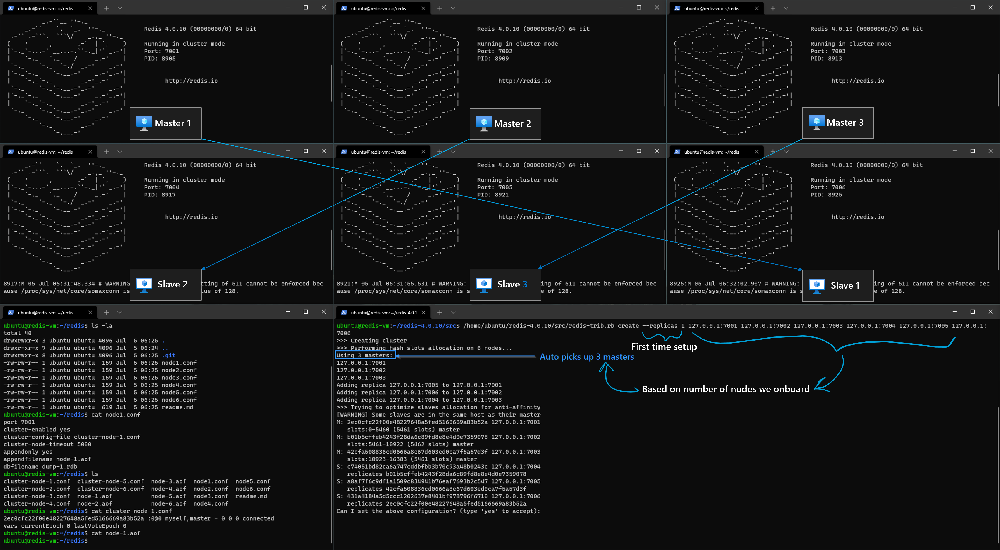
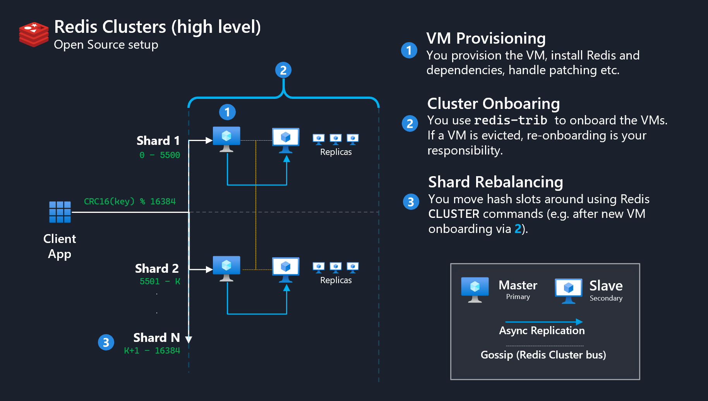
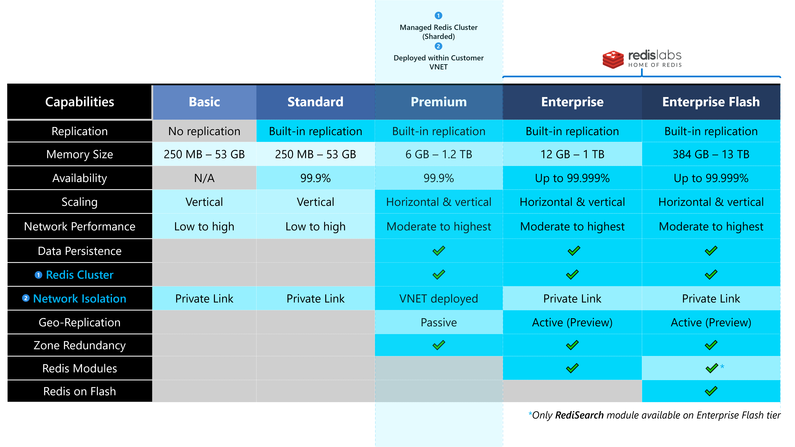
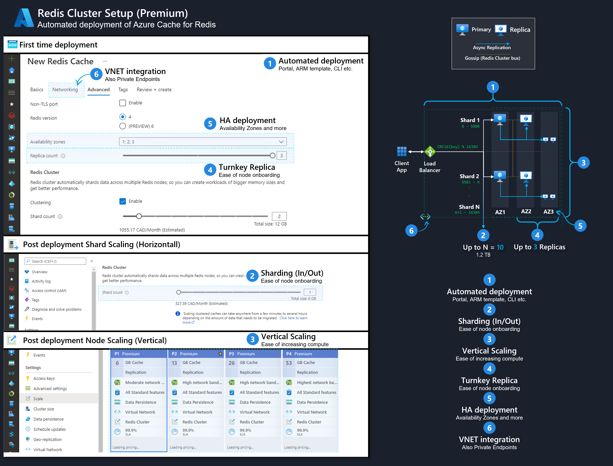

import { Callout } from "../../src/components/atoms.js"
import { ExtLink, InlinePageLink } from "../../src/components/atoms.js"

<Callout>

💡 In this article - we explore exactly how [Azure Cache for Redis](https://docs.microsoft.com/en-us/azure/azure-cache-for-redis/cache-overview) provides a **managed**, **Redis cluster** (i.e. which has **sharding** enabled), that is accessible over a Customer's **Private Network**.

</Callout>

Browsing [Microsoft docs](https://docs.microsoft.com/en-us/azure/azure-cache-for-redis/cache-how-to-premium-clustering), we note:

```text
"Azure Cache for Redis (Premium) offers Redis cluster as implemented in Redis."
```

[Redis Cluster](https://redis.io/topics/cluster-spec) - which is Open Source ([here](https://github.com/redis/redis/commit/ecc9109434002d4667cd01a3b7c067a508c876eb)'s the first ever commit from 2011) is a data sharding solution with automatic management, handling failover and replication.

This raises the question, what innovation does Azure Cache for Redis bring to the table as a managed Database offering?

To appreciate what this entails, let's quickly look at:

- [How Redis Clustering works](#redis-clustering)
- [How to set up a sharded Redis cluster from scratch](#cluster-setup-from-scratch) on a group of Linux VMs running on a laptop (e.g. using [multipass](https://multipass.run/))
- The ["Azure Experience"](#cluster-setup-via-azure) of the above setup, to appreciate the management aspects Azure's Control Plane abstracts away for us

## Redis Clustering

Redis [cluster spec docs](https://redis.io/topics/cluster-spec) and the [cluster setup tutorial](https://redis.io/topics/cluster-tutorial) do a phenomenal job of listing out in detail how Redis clusters work - but in short, here are some takeaways:

### Why

- In Distributed Computing (not specific to Redis), sharding data allows us to horizontally scale-out Compute. In simple words, by systematically distributing a big chunk of data into smaller chunks, we go beyond the computational limits of a single machine (physical or virtual). Sharding a dataset requires us to intelligently design how we want to Partition the data (almost always based on a **Key**).

  **Data Sharding = Divide and conquer.**

- In general, [**Partitioning**](https://redis.io/topics/partitioning#implementations-of-redis-partitioning) data across standalone Redis instances is a non-trivial topic (just like any other Database engine). The 2 approaches - Range, Hash ([Consistent](https://en.wikipedia.org/wiki/Consistent_hashing#:~:text=In%20computer%20science%2C%20consistent%20hashing,is%20the%20number%20of%20slots.) or otherwise) - comes with it's own benefits and drawbacks.

  - For _Range_, you have to manage a key → shard mapping table.
  - For _Hash_, you have to implement hashing algorithms (such as [`crc32`](https://en.wikipedia.org/wiki/Cyclic_redundancy_check))

  The different permutations in implementating (client side, proxy assisted, query routing) adds to further implementation variances - and generally doesn't make the end user's life much easier.

  Because Partitioning is hard, [**Redis Cluster**](https://redis.io/documentation#redis-cluster) was introduced into Redis (GA as of [2015](https://groups.google.com/forum/#!msg/redis-db/dO0bFyD_THQ/Uoo2GjIx6qgJ)), to offer end users of Redis with more of a "de facto standard" for physically implementing Partitioning while leveraging Redis.

### How

- Redis Cluster implementation terminology introduces **Masters** (Primary) and **Slaves** (Replica). At any given point in time, a given shard of data has **1 Master**, and **`N` Slaves** (`N` is configurable via `--replicas N` or [resharding](https://redis.io/topics/cluster-spec#cluster-live-reconfiguration))
- A given node in the Cluster talks to every other node using the [**Redis Cluster Bus**](https://redis.io/topics/cluster-spec#clients-and-servers-roles-in-the-redis-cluster-protocol) using the [Gossip Protocol](https://en.wikipedia.org/wiki/Gossip_protocol) (e.g. [Cassandra](https://docs.datastax.com/en/cassandra-oss/3.0/cassandra/architecture/archGossipAbout.html) does the same thing).
- Master → Slave(s) Shard replication occurs via [async](https://redis.io/topics/cluster-spec#redis-cluster-goals) replication.
- A given key, based on it's hash, is mapped to 1 of 16384 **hash slots** ([reasoning behind the number 16384](https://github.com/redis/redis/issues/2576#issuecomment-101257195)). These hash slots are then distributed amongst the Shards - i.e. Master → Slave(s) .

  The value of a key, say "my_value" is mapped to a given hash slot using the formula:

  ```
  HASH_SLOT = CRC16("my_value") % 16384
  ```

  End users can force certain keys to be grouped together via **hash tags** using curly brackets `{...}` (Redis Enterprise extends this to include [RegEx](https://regexr.com/), great article [here](https://redislabs.com/blog/redis-clustering-best-practices-with-keys/))

    <Callout>

  💡 The main highlight here is that Redis Cluster handles the implementation heavy lifting for us, so all we have to do as an end user is to design our keys intelligently.

    </Callout>

### Cluster setup from scratch

Following this excellent video (and associated [GitHub repo](https://github.com/mdrakiburrahman/redis)) - you can use [multipass](https://multipass.run/) on any laptop to end up with a 6 Node Redis Cluster (3 shards) in a few minutes:

`youtube:https://www.youtube.com/embed/ScsWSeJoq2E`

At the end of the setup, I ended up with something like this:


And here's a logical architecture of the manual setup using OSS tools, and end user responsibilities:


### End user management responsibilities

End user responsibilities observed from this simple demonstration:

1. **VM Provisioning**:

   - In my case, manually setting up 6 VMs via `multipass launch` - in reality this would involve a datacenter/hypervisor/infrastructure etc.
   - Performing several `apt-get` pre-reqs, downloading redis via `wget`, `make` from source after unzip.
   - Installing redis from specific [`node.conf`](https://github.com/mdrakiburrahman/redis/blob/master/node1.conf) files with the correct Cluster Parameters
   - Proper management of the `aof` and `rdb` files per node per disk.
   - Day 2 operations (OS upgrades etc.)

2. **Cluster Onboarding**:

   - In this case, via [`redis-cli --cluster create --cluster-replicas 1 IP1:7001 IP2:7002...`](https://redis.io/topics/cluster-tutorial#creating-the-cluster) - where we have to specify all the participating nodes at creation time.
   - Using [`redis-cli --cluster add-node IPN:700N`](https://redis.io/topics/cluster-tutorial#adding-a-new-node) to add a new node.
   - Using [`redis-server node.conf`](https://redis.io/topics/cluster-tutorial#adding-a-new-node) to re-onboard a node if it crashes.

3. **Shard Rebalancing**:
   - Using [`redis-cli --cluster reshard IPN:700N`](https://redis.io/topics/cluster-tutorial#resharding-the-cluster) to reshard the data, as well as implementing the sharding logic - i.e. answering Redis "How many slots do you want to move?"

<Callout>

📝 The list above is not exhaustive - rather these are simple observations when going through the demo Redis Cluster setup.

</Callout>

We can conclude that although Redis Cluster helps us with tools (such as `redis-cli/trib`), there's management and Day 2 Operations overhead on the end user when it comes to environment management.

## Azure Cache for Redis

### Offerings Summary

The chart below summarizes the different Azure Cache for Redis offerings available at the time of writing:



Further documentation of this feature comparison chart can be found [here](https://docs.microsoft.com/en-us/azure/azure-cache-for-redis/cache-overview#feature-comparison), and per SKU pricing details can be found [here](https://azure.microsoft.com/en-us/pricing/details/cache/).

The lowest SKU that meets our original purposes - a managed Redis cluster (1) that is Network accessible (2) - is met via the **Premium** Tier. Lower Tiers (Basic, Standard) do not offer Clustering.

The [**Enterprise Tier**](https://docs.microsoft.com/en-us/azure/azure-cache-for-redis/cache-overview#special-considerations-for-enterprise-tiers) takes things to the next level from **Premium** thanks to the continued innovations (e.g. [Redis on Flash](https://redislabs.com/blog/persistent-memory-and-redis-enterprise/)) by our friends over at [Redis Labs](https://redislabs.com/) - making Redis "Enterprise Ready" for very large scale (e.g. 13 TB) deployments.

<Callout>

💡 Note that all tiers (e.g. **Basic, Standard, Premium, Enterprise**) are still **network accessible** via [Private Link](https://docs.microsoft.com/en-us/azure/azure-cache-for-redis/cache-private-link) - but **Premium** takes things a step further by deploying the physical Redis nodes _into_ the [**Customer's VNet**](https://docs.microsoft.com/en-us/azure/azure-cache-for-redis/cache-how-to-premium-vnet).

Note that the VNet capability comes with added one-time config responsibility - such as [Inbound](https://docs.microsoft.com/en-us/azure/azure-cache-for-redis/cache-how-to-premium-vnet#inbound-port-requirements) and [Outbound](https://docs.microsoft.com/en-us/azure/azure-cache-for-redis/cache-how-to-premium-vnet#outbound-port-requirements) Port requirements.

</Callout>

### Cluster setup via Azure

We can achieve the end goal of access to a managed, network integrated Redis cluster via a handful of clicks form the Azure Portal.

The diagram below attempts at visually contrasting our [management pain points from above](#end-user-management-responsibilities) - highlighting a subset of the **key capabilities** Azure Cache for Redis brings to the table as a Managed Redis Cluster offering:



The idea here is, the Redis cluster management experience, previously demanding on the end user (despite Redis OSS tooling), is abstracted away by the Azure Control Plane, materialized as the UI (or Azure CLI/API) - in the visual/managed experience we see above.

Detailed information on these above line items can be found here:

1. **Automated deployment**: Deploy Azure Cache for Redis via [PowerShell](https://docs.microsoft.com/en-us/azure/azure-cache-for-redis/cache-how-to-manage-redis-cache-powershell), [CLI](https://docs.microsoft.com/en-us/azure/azure-cache-for-redis/cli-samples), [ARM Template](https://docs.microsoft.com/en-us/azure/azure-cache-for-redis/cache-redis-cache-arm-provision) (Portal shown in screenshot).
2. **Sharding (In/Out)**: During [first time setup](https://docs.microsoft.com/en-us/azure/azure-cache-for-redis/cache-how-to-premium-clustering#set-up-clustering) and [post-deployment](https://docs.microsoft.com/en-us/azure/azure-cache-for-redis/cache-how-to-premium-clustering#change-the-cluster-size-on-a-running-premium-cache).
3. **Vertical Scaling**: [Scaling](https://docs.microsoft.com/en-us/azure/azure-cache-for-redis/cache-how-to-scale#scale-a-cache) within tier and across tiers, as well as [automation](https://docs.microsoft.com/en-us/azure/azure-cache-for-redis/cache-how-to-scale#how-to-automate-a-scaling-operation).
4. **Turnkey Replica**: During [first time setup](https://docs.microsoft.com/en-us/azure/azure-cache-for-redis/cache-how-to-multi-replicas#create-a-cache).
5. **HA deployment**: [Zone redundancy](https://docs.microsoft.com/en-us/azure/azure-cache-for-redis/cache-high-availability#zone-redundancy) and other [HA patterns](https://docs.microsoft.com/en-us/azure/azure-cache-for-redis/cache-high-availability), and DR patterns such as [Geo-Replication](https://docs.microsoft.com/en-us/azure/azure-cache-for-redis/cache-how-to-geo-replication).
6. **VNET Integration**: [VNET support](https://docs.microsoft.com/en-us/azure/azure-cache-for-redis/cache-how-to-premium-vnet) for Premium and [Private Link](https://docs.microsoft.com/en-us/azure/azure-cache-for-redis/cache-private-link) for all tiers.

## Wrap Up

We explored the tooling available when setting up Redis Clusters from scratch and highlighted the management pain points, before contrasting how Azure Cache for Redis alleviates management overhead thanks to Azure's Control Plane operating on the Redis Cluster.

For a condensed summary of Azure Cache for Redis's capabilities, check out this [great overview article](https://docs.microsoft.com/en-us/azure/azure-cache-for-redis/cache-overview).
