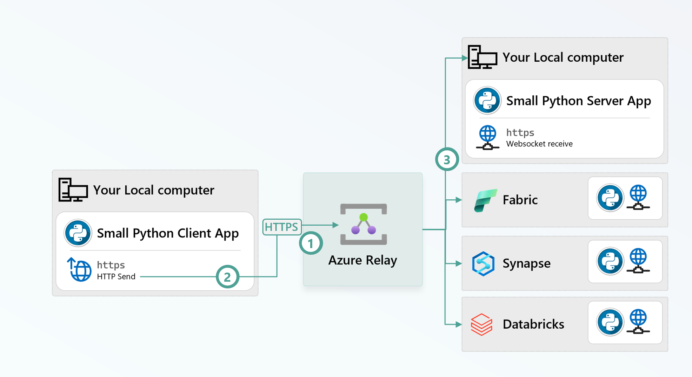

import { Callout } from "../../src/components/atoms.js"
import { ExtLink, InlinePageLink } from "../../src/components/atoms.js"

Azure Relay is a delightful little Azure service allows 2 globally distributed parties to communicate synchronously - [see architecture](https://learn.microsoft.com/en-us/azure/azure-relay/relay-what-is-it#architecture-processing-of-incoming-relay-requests). Services such as [VSCode Remote tunnel](https://code.visualstudio.com/docs/remote/tunnels) use it.

We're going to follow [this tutorial](https://learn.microsoft.com/en-us/azure/azure-relay/relay-hybrid-connections-python-get-started) to make it work in remote Spark Notebook environments:



1. Cloud listeners establish websockets against a particular named [Hybrid Connection](https://learn.microsoft.com/en-us/azure/azure-relay/relay-what-is-it#hybrid-connections).
2. Local machine client app initiates an HTTPS requests to a particular named Hybrid Connection.
3. Requests and responses between the 2 parties are rendezvoused by the Relay

Here's a demo:

<Callout>

To get a bigger view: `Right Click on the GIF > Open Image In New Tab `

</Callout>


The setup is identical in all the Server environments.

First, follow [this doc](https://learn.microsoft.com/en-us/azure/azure-relay/relay-hybrid-connections-python-get-started#create-a-namespace-using-the-azure-portal) to create a Relay Namespace and Hybrid Connections per environment (`local`, `fabric`, `synapse`, `databricks`) - takes 30 seconds.

In the Cloud Notebook server, the only dependency is a websocket package:

```bash
# Fabric and Databricks use "!", Synapse uses "%"
!pip install websocket-client==1.8.0
```

Run this in a notebook cell for the server code:

```python
import base64, hashlib, hmac, math, time, urllib, json, logging, websocket

def hmac_sha256(key, msg):
   hash_obj = hmac.new(key=key, msg=msg, digestmod=hashlib._hashlib.openssl_sha256)
   return hash_obj.digest()

def createListenUrl(serviceNamespace, entityPath, token = None):
   url = 'wss://' + serviceNamespace + '/$hc/' + entityPath + '?sb-hc-action=listen&sb-hc-id=123456'
   if token is not None:
       url = url + '&sb-hc-token=' + urllib.parse.quote(token)
   return url

def createSasToken(serviceNamespace, entityPath, sasKeyName, sasKey):
   uri = "http://" + serviceNamespace + "/" + entityPath
   encodedResourceUri = urllib.parse.quote(uri, safe = '')

   # Define the token validity period in seconds (48 hours in this case)   
   tokenValidTimeInSeconds = 60 * 60 * 48 
   unixSeconds = math.floor(time.time())
   expiryInSeconds = unixSeconds + tokenValidTimeInSeconds

   # Create the plain signature string by combining the encoded URI and the expiry time
   plainSignature = encodedResourceUri + "\n" + str(expiryInSeconds)

   # Encode the SAS key and the plain signature as bytes
   sasKeyBytes = sasKey.encode("utf-8")
   plainSignatureBytes = plainSignature.encode("utf-8")
   hashBytes = hmac_sha256(sasKeyBytes, plainSignatureBytes)
   base64HashValue = base64.b64encode(hashBytes)

   # Construct the SAS token string
   token = "SharedAccessSignature sr=" + encodedResourceUri + "&sig=" +  urllib.parse.quote(base64HashValue) + "&se=" + str(expiryInSeconds) + "&skn=" + sasKeyName
   return token

def run_application(config):
    ns = config["namespace"] + ".servicebus.windows.net"
    token = createSasToken(ns, config["path"], config["keyrule"], config["key"])
    wssUri = createListenUrl(ns, config["path"], token)
    logging.basicConfig(level=logging.INFO, format='%(asctime)s.%(msecs)03d - %(levelname)s - %(message)s', datefmt='%H:%M:%S')
    try:
        ws = websocket.create_connection(wssUri)
        logging.info("Listening for messages on Azure Relay WebSocket...")
        while True:
            cmd = json.loads(ws.recv())
            req = cmd.get('request')
            logging.info(f"Received request:\n{json.dumps(req, indent=2)}")
            opws = ws
            if req and 'method' not in req:
                opws = websocket.create_connection(req['address'])
                cmd = json.loads(opws.recv())
                req = cmd['request']
            body = None
            if req and req.get('body'):
                body = opws.recv()
                try:
                    body = json.loads(body)
                    logging.info(f"Payload (parsed as JSON):\n{json.dumps(body, indent=2)}")
                except json.JSONDecodeError:
                    logging.info(f"Payload (not valid JSON):\n{body}")
            resp = {
                'requestId': req['id'],
                'body': json.dumps(True),
                'statusCode': 200,
                'responseHeaders': {'Content-Type': 'application/json'}
            }
            opws.send(json.dumps({'response': resp}))
            opws.send('{"message": "This is a Fabric Server listener!"}')
            if opws is not ws:
                opws.close()
    except KeyboardInterrupt:
        logging.info("Exiting listener.")
```

Finally, initiate the server:

```python
config = {
        "namespace": "your-relay-namespace",
        "path": "fabric",
        "keyrule": "RootManageSharedAccessKey",
        "key": "..."
    }
run_application(config)
```

Then, on the client side, run:

```python
import json, logging,  requests, sys

def createHttpSendUrl(serviceNamespace, entityPath, token=None):
    url = 'https://' + serviceNamespace + '/' + entityPath + '?sb-hc-action=connect&sb-hc-id=123456'
    if token is not None:
        url = url + '&sb-hc-token=' + urllib.parse.quote(token)
    return url

def run_application(path, message, config):
    ns = config["namespace"] + ".servicebus.windows.net"
    url = createHttpSendUrl(ns, path, createSasToken(ns, path, config["keyrule"], config["key"]))
    logging.basicConfig(level=logging.INFO, format='%(asctime)s.%(msecs)03d - %(levelname)s - %(message)s', datefmt='%H:%M:%S')
    try:
        r = requests.post(url, headers={"Content-Type": "application/json"}, data=json.dumps({"message": message}), timeout=5)
        logging.info("HTTP status: %s", r.status_code)
        logging.info(f"Response (parsed as JSON):\n{json.dumps(json.loads(r.text), indent=2)}")
    except Exception as e:
        logging.error("An error occurred: %s", e)

if __name__ == "__main__":
    if len(sys.argv) != 2:
        raise ValueError("Usage: python client.py <message>")
    with open("config.json") as f:
        run_application(sys.argv[1], "This is a message to Azure Relay Hybrid Connections!", json.load(f))
```

Enjoy the distributed communication!
