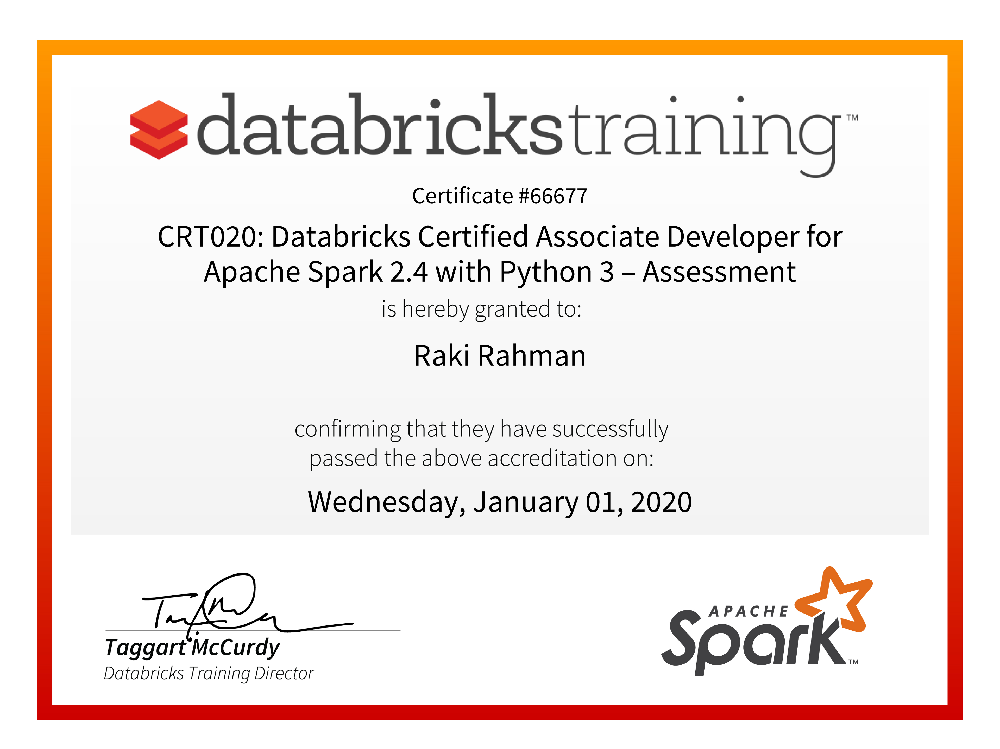
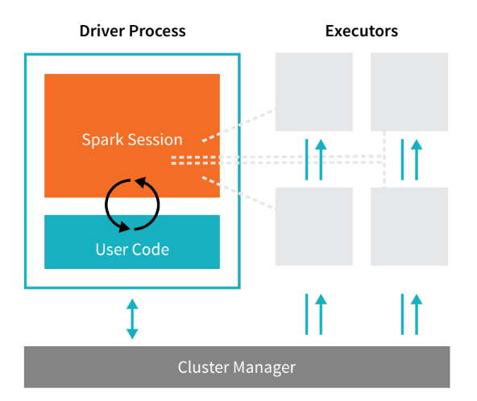
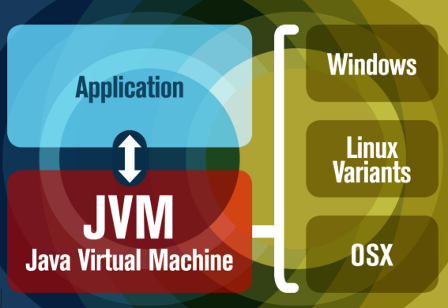
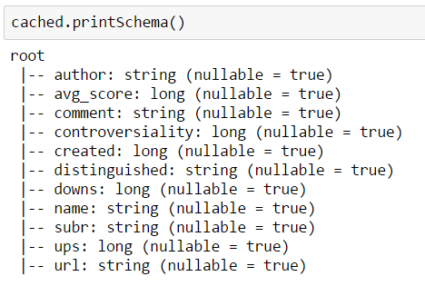
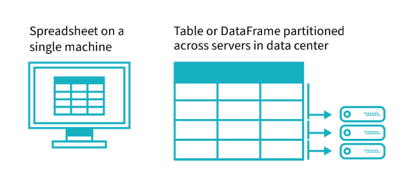
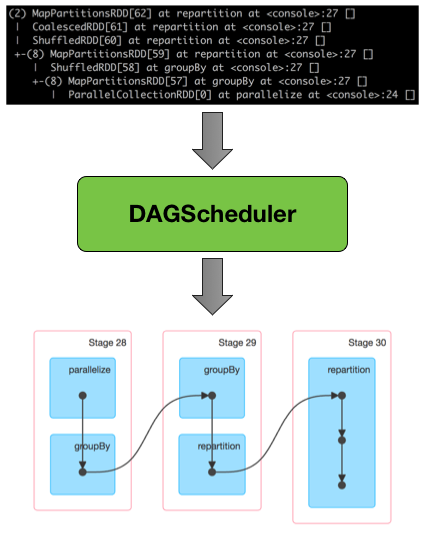
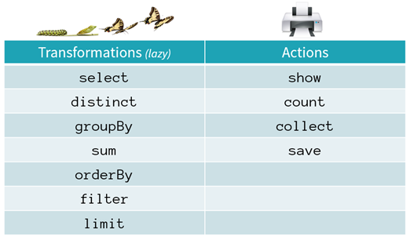
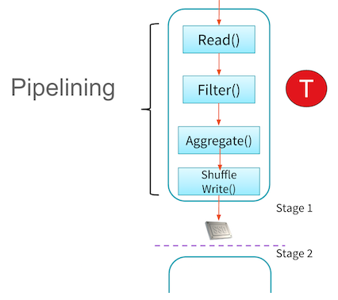
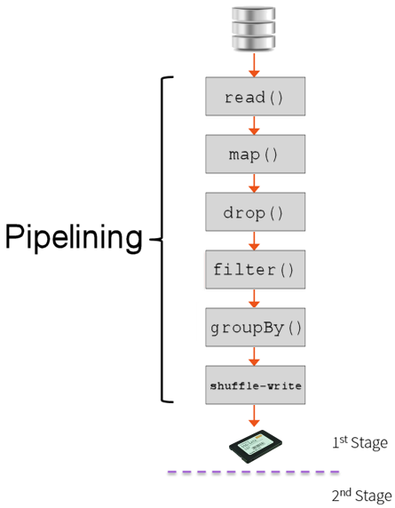

import { Callout } from "../../src/components/atoms.js"
import { ExtLink, InlinePageLink } from "../../src/components/atoms.js"

<Callout>

🥇 This is `Part 1` of the Study guide, focusing on the Core Concepts of Apache Spark.

🥈 For `Part 2` (Applications) - click <InlinePageLink to="/spark-certification-study-guide-part-2">here</InlinePageLink>

</Callout>

While studying for the [Apache Spark 2.4 Certified Developer exam](https://academy.databricks.com/exams) and going through various resources available online, I thought it'd be worthwhile to put together a comprehensive knowledge base that covers the entire syllabus end-to-end, serving as a Study Guide for myself and hopefully others.

Note that I used inspiration from the [Spark Code Review guide](https://databricks-prod-cloudfront.cloud.databricks.com/public/4027ec902e239c93eaaa8714f173bcfc/3249544772526824/521888783067570/7123846766950497/latest.html) - but whereas that covers a subset of the coding aspects only, I aimed for this to be more of a _**comprehensive, one stop resource geared towards passing the exam**_.

<Callout>

🚩 While this study guide is geared towards the Spark `2.4` [version](https://academy.databricks.com/exam/INT-ADAS-v2-CT) of the exam, a vast majority of the material carries over into Spark `3.0` [version](https://academy.databricks.com/exam/databricks-certified-associate-developer) (or any Spark version in general).

💡 A Databricks notebook version of this Study Guide is available [here](https://rakirahman.blob.core.windows.net/public/notebooks/Spark-Developer-Certification-Study-Guide.html) to import into your own [Databricks Workspace](https://docs.microsoft.com/en-us/azure/databricks/workspace/).

</Callout>

## Awesome Resources/References used throughout this guide

### References

- [Spark Code Review used for inspiration](https://bit.ly/34KQGHL)
- [Data Scientists Guide to Apache Spark](https://drive.google.com/open?id=17KMSllwgMvQ8cuvTbcwznnLB6-4Oen9T)
- [JVM Overview](https://www.javaworld.com/article/3272244/what-is-the-jvm-introducing-the-java-virtual-machine.html)
- [Spark Runtime Architecture Overview](https://freecontent.manning.com/running-spark-an-overview-of-sparks-runtime-architecture)
- [Spark Application Overview](https://docs.cloudera.com/documentation/enterprise/5-6-x/topics/cdh_ig_spark_apps.html)
- [Spark Architecture Overview](http://queirozf.com/entries/spark-architecture-overview-clusters-jobs-stages-tasks-etc)
- [Mastering Apache Spark](https://jaceklaskowski.gitbooks.io/mastering-apache-spark/spark-scheduler-Stage.html)
- [Manually create DFs](https://medium.com/@mrpowers/manually-creating-spark-dataframes-b14dae906393)
- [PySpark SQL docs](https://spark.apache.org/docs/latest/api/python/pyspark.sql.html)
- [Introduction to DataFrames](https://docs.databricks.com/spark/latest/dataframes-datasets/introduction-to-dataframes-python.html)
- [PySpark UDFs](https://changhsinlee.com/pyspark-udf/)
- [ORC File](https://cwiki.apache.org/confluence/display/Hive/LanguageManual+ORC)
- [SQL Server Stored Procedures from Databricks](https://datathirst.net/blog/2018/10/12/executing-sql-server-stored-procedures-on-databricks-pyspark)
- [Repartition vs Coalesce](https://stackoverflow.com/questions/31610971/spark-repartition-vs-coalesce)
- [Partitioning by Columns](https://jaceklaskowski.gitbooks.io/mastering-spark-sql/spark-sql-dynamic-partition-inserts.html)
- [Bucketing](https://jaceklaskowski.gitbooks.io/mastering-spark-sql/spark-sql-bucketing.html)
- [PySpark GroupBy and Aggregate Functions](https://hendra-herviawan.github.io/pyspark-groupby-and-aggregate-functions.html)
- [Spark Quickstart](https://spark.apache.org/docs/latest/quick-start.html)
- [Spark Caching - 1](https://unraveldata.com/to-cache-or-not-to-cache/)
- [Spark Caching - 2](https://stackoverflow.com/questions/45558868/where-does-df-cache-is-stored)
- [Spark Caching - 3](https://changhsinlee.com/pyspark-dataframe-basics/)
- [Spark Caching - 4](http://spark.apache.org/docs/latest/rdd-programming-guide.html#rdd-persistence)
- [Spark Caching - 5](https://www.tutorialspoint.com/pyspark/pyspark_storagelevel.htm)
- [Spark Caching - 6](https://spark.apache.org/docs/2.1.2/api/python/_modules/pyspark/storagelevel.html)
- [Spark SQL functions examples](https://spark.apache.org/docs/2.3.0/api/sql/index.html)
- [Spark Built-in Higher Order Functions Examples](https://docs.databricks.com/_static/notebooks/apache-spark-2.4-functions.html)
- [Spark SQL Timestamp conversion](https://docs.databricks.com/_static/notebooks/timestamp-conversion.html)
- [RegEx Tutorial](https://medium.com/factory-mind/regex-tutorial-a-simple-cheatsheet-by-examples-649dc1c3f285)
- [Rank VS Dense Rank](https://stackoverflow.com/questions/44968912/difference-in-dense-rank-and-row-number-in-spark)
- [SparkSQL Windows](https://databricks.com/blog/2015/07/15/introducing-window-functions-in-spark-sql.html)
- [Spark Certification Study Guide from GitHub](https://github.com/vivek-bombatkar/Databricks-Apache-Spark-2X-Certified-Developer)

### Other Resources

## Spark Architecture Components

<Callout>
  🎓 Candidates are expected to be familiar with the following architectural
  components and their relationship to each other:
</Callout>

**Spark Basic Architecture**

A _cluster_, or group of machines, pools the resources of many machines together allowing us to use all the cumulative
resources as if they were one. Now a group of machines sitting somewhere alone is not powerful, you need a framework to coordinate
work across them. **Spark** is a tailor-made engine exactly for this, managing and coordinating the execution of tasks on data across a
cluster of computers.

The cluster of machines that Spark will leverage to execute tasks will be managed by a cluster manager like Spark’s
Standalone cluster manager, _**YARN**_ - **Y**et **A**nother **R**esource **N**egotiator, or [_**Mesos**_](http://mesos.apache.org/). We then submit Spark Applications to these cluster managers which will
grant resources to our application so that we can complete our work.

**Spark Applications**

Spark Applications consist of a **driver** process and a set of **executor** processes. In the illustration we see above, our driver is on the left and four executors on the right.

**What is a JVM?**

_The JVM manages system memory and provides a portable execution environment for Java-based applications_

**Technical definition:** The JVM is the specification for a software program that executes code and provides the runtime environment for that code.
**Everyday definition:** The JVM is how we run our Java programs. We configure the JVM's settings and then rely on it to manage program resources during execution.

The **Java Virtual Machine (JVM)** is a program whose purpose is to execute other programs.

The JVM has **two primary functions**:

1.  To allow Java programs to run on any device or operating system (known as the _"Write once, run anywhere"_ principle)
2.  To manage and optimize program memory

**JVM view of the Spark Cluster: _Drivers, Executors, Slots & Tasks_**

The Spark runtime architecture leverages JVMs:

And a slightly more detailed view:

_Elements of a Spark application are in blue boxes and an application’s tasks running inside task slots are labeled with a “T”. Unoccupied task slots are in white boxes._

**Responsibilities of the client process component**

The **client** process starts the **driver** program. For example, the client process can be a `spark-submit` script for running applications, a spark-shell script, or a custom application using Spark API (like this Databricks **GUI** - **G**raphics **U**ser **I**nterface). The client process prepares the classpath and all configuration options for the Spark application. It also passes application arguments, if any, to the application running inside the **driver**.

**Driver**

The **driver** orchestrates and monitors execution of a Spark application. There’s always **one driver per Spark application**. You can think of the driver as a wrapper around the application.

The **driver** process runs our `main()` function, sits on a node in the cluster, and is responsible for:

1. Maintaining information about the Spark Application
2. Responding to a user’s program or input
3. Requesting memory and CPU resources from cluster managers
4. Breaking application logic into stages and tasks
5. Sending tasks to executors
6. Collecting the results from the executors

The driver process is absolutely essential - it’s the heart of a Spark Application and
maintains all relevant information during the lifetime of the application.

- The **Driver** is the JVM in which our application runs.
- The secret to Spark's awesome performance is parallelism:
  - Scaling **vertically** (_i.e. making a single computer more powerful by adding physical hardware_) is limited to a finite amount of RAM, Threads and CPU speeds, due to the nature of motherboards having limited physical slots in Data Centers/Desktops.
  - Scaling **horizontally** (_i.e. throwing more identical machines into the Cluster_) means we can simply add new "nodes" to the cluster almost endlessly, because a Data Center can theoretically have an interconnected number of ~infinite machines
- We parallelize at two levels:
  - The first level of parallelization is the **Executor** - a JVM running on a node, typically, **one executor instance per node**.
  - The second level of parallelization is the **Slot** - the number of which is **determined by the number of cores and CPUs of each node/executor**.

**Executor**

The **executors** are responsible for actually executing the work that the **driver** assigns them. This means, each
executor is responsible for only two things:

1. Executing code assigned to it by the driver
2. Reporting the state of the computation, on that executor, back to the driver node

**Cores/Slots/Threads**

- Each **Executor** has a number of **Slots** to which parallelized **Tasks** can be assigned to it by the **Driver**.
  - So for example:
    - If we have **3** identical home desktops (_nodes_) hooked up together in a LAN (like through your home router), each with i7 processors (**8** cores), then that's a **3** node Cluster:
      - **1** Driver node
      - **2** Executor nodes
    - The **8 cores per Executor node** means **8 Slots**, meaning the driver can assign each executor up to **8 Tasks**
      - The idea is, an i7 CPU Core is manufactured by Intel such that it is capable of executing it's own Task independent of the other Cores, so **8 Cores = 8 Slots = 8 Tasks in parellel**

_For example: the diagram below is showing 2 Core Executor nodes:_

- The JVM is naturally multithreaded, but a single JVM, such as our **Driver**, has a finite upper limit.
- By creating **Tasks**, the **Driver** can assign units of work to **Slots** on each **Executor** for parallel execution.
- Additionally, the **Driver** must also decide how to partition the data so that it can be distributed for parallel processing (see below).

  - Consequently, the **Driver** is assigning a **Partition** of data to each task - in this way each **Task** knows which piece of data it is to process.
  - Once started, each **Task** will fetch from the original data source (e.g. An Azure Storage Account) the **Partition** of data assigned to it.

**Example relating to Tasks, Slots and Cores**

You can set the number of task slots to a value two or three times (**i.e. to a multiple of**) the number of CPU cores. Although these task slots are often referred to as CPU cores in Spark, they’re implemented as **threads** that work on a **physical core's thread** and don’t need to correspond to the number of physical CPU cores on the machine (since different CPU manufacturer's can architect multi-threaded chips differently).

In other words:

- All processors of today have multiple cores (e.g. 1 CPU = 8 Cores)
- Most processors of today are multi-threaded (e.g. 1 Core = 2 Threads, 8 cores = 16 Threads)
- A Spark **Task** runs on a **Slot**. **1 Thread** is capable of doing **1 Task** at a time. To make use of all our threads on the CPU, we cleverly assign the **number of Slots** to correspond to a **multiple of the number of Cores** (which translates to multiple Threads).
  - _By doing this_, after the Driver breaks down a given command (`DO STUFF FROM massive_table`) into **Tasks** and **Partitions**, which are tailor-made to fit our particular Cluster Configuration (say _4 nodes - 1 driver and 3 executors, 8 cores per node, 2 threads per core_). By using our Clusters at maximum efficiency like this (utilizing all available threads), we can get our massive command executed as fast as possible (given our Cluster in this case, _3\*8\*2 Threads --> **48** Tasks, **48** Partitions_ - i.e. **1** Partition per Task)
  - _Say we don't do this_, even with a 100 executor cluster, the entire burden would go to 1 executor, and the other 99 will be sitting idle - i.e. slow execution.
  - _Or say, we instead foolishly assign **49** Tasks and **49** Partitions_, the first pass would execute **48** Tasks in parallel across the executors cores (say in **10 minutes**), then that **1** remaining Task in the next pass will execute on **1** core for another **10 minutes**, while the rest of our **47** cores are sitting idle - meaning the whole job will take double the time at **20 minutes**. This is obviously an inefficient use of our available resources, and could rather be fixed by setting the number of tasks/partitions to a multiple of the number of cores we have (in this setup - 48, 96 etc).

**Partitions**

**_DataFrames_**

A DataFrame is the most common Structured API and simply represents a **table of data with _rows_ and _columns_**. The
list of columns and the types in those columns is called **the schema**.

A simple analogy would be a spreadsheet with named columns. The **fundamental difference** is that while a spreadsheet sits on **one computer** in one specific location (e.g. _C:\Users\raki.rahman\Documents\MyFile.csv_), a
Spark DataFrame can span **thousands of computers**.

<Callout>

💡 The reason for putting the data on more than one computer is intuitive

- Either _**the data is too large to fit on one machine**_
- Or it would simply _**take too long to perform that computation on one machine**_.

</Callout>

**_Data Partitions_**

In order to allow every executor to perform work in parallel, Spark breaks up the data into _chunks_, called **partitions**.

A **partition** is a collection of rows that sit on one physical machine in our cluster. A DataFrame’s partitions represent how
the data is physically distributed across your cluster of machines during execution:

- If you have _one_ partition, Spark will only have a parallelism of _one_, even if you have thousands of executors.
- If you have _many_ partitions, but only _one_ executor, Spark will still only have a parallelism of _one_ because there is only one computation resource.

An important thing to note is that with DataFrames, we do not (for the most part) manipulate partitions manually
(on an individual basis). We simply specify high level transformations of data in the physical partitions and Spark
determines how this work will actually execute on the cluster.

<Callout>

🚀 The key points to understand are that:

- Spark employs a **Cluster Manager** that is responsible for provisioning nodes in our cluster.
  - Databricks provides a robust, high-performing **Cluster Manager** as part of its overall offerings.
- In each of these scenarios, the **Driver** is running on one node, with each **Executors** running on N different nodes.
  - Databricks abstracts away the Cluster Management aspects for us (which is a massive pain)
- From a developer's and student's perspective the primary focus is on:
  - The number of **Partitions** the data is divided into
  - The number of **Slots** available for parallel execution
  - How many **Jobs** are being triggered?
  - And lastly the **Stages** those jobs are divided into

</Callout>

## Spark Execution

<Callout>
  🎓 Candidates are expected to be familiar with Spark’s execution model and the
  breakdown between the different elements:
</Callout>

In Spark, the highest-level unit of computation is an **application**. A Spark application can be used for a single batch job, an interactive session with multiple jobs, or a long-lived server continually satisfying requests.

Spark **application execution**, alongside **drivers** and **executors**, also involves runtime concepts such as **tasks**, **jobs**, and **stages**. Invoking an **action** inside a Spark application triggers the launch of a **job** to fulfill it. Spark examines the dataset on which that action depends and formulates an **execution plan**. The **execution plan** assembles the dataset transformations into **stages**. A **stage** is a collection of tasks that run the same code, each on a different subset of the data.

**Overview of DAGSchedular**

**DAGScheduler** is the scheduling layer of Apache Spark that implements stage-oriented scheduling. It transforms a _logical_ execution plan to a _physical_ execution plan (using stages).

After an **action** (see below) has been called, `SparkContext` hands over a logical plan to **DAGScheduler** that it in turn translates to a set of **stages** that are submitted as a set of **tasks** for execution.

The fundamental concepts of **DAGScheduler** are **jobs** and **stages** that it tracks through internal registries and counters.

### Jobs

A **Job** is a sequence of **stages**, triggered by an **action** such as `count()`, `collect()`, `read()` or `write()`.

- Each parallelized action is referred to as a **Job**.
- The results of each **Job** (parallelized/distributed action) is returned to the **Driver** from the **Executor**.
- Depending on the work required, multiple **Jobs** will be required.

### Stages

_Each **job** that gets divided into smaller **sets of tasks** is a **stage**._

A **Stage** is a sequence of **Tasks** that can all be run together - i.e. in parallel - without a **shuffle**. For example: using `.read` to read a file from disk, then runnning `.filter` can be done without a **shuffle**, so it can fit in a single **stage**. The number of **Tasks** in a **Stage** also depends upon the number of **Partitions** your datasets have.

- Each **Job** is broken down into **Stages**.
- This would be analogous to building _a house_ (the job) - attempting to do any of these steps out of order doesn't make sense:

  1. Lay the foundation
  2. Erect the walls
  3. Add the rooms

In other words:

- A **stage** is a step in a physical execution plan - a physical unit of the execution plan
- A **stage** is a set of parallel **tasks - one task per partition - the blue boxes on the right of the diagram above** (of an RDD that computes _partial_ results of a function executed as part of a Spark job).
- A Spark **job** is a computation with that computation sliced into **stages**
- A **stage** is uniquely identified by `id`. When a **stage** is created, **DAGScheduler** increments internal counter `nextStageId` to track the number of stage submissions.
- Each **stage** contains a sequence of **narrow transformations** (see below) that can be completed without **shuffling** the entire data set, separated at _shuffle boundaries_, i.e. where shuffle occurs. **Stages** are thus a result of breaking the RDD at shuffle boundaries.

**An inefficient example of Stages**

- When we shuffle data, it creates what is known as a _stage boundary_.
- Stage boundaries represent a **process bottleneck**.

Take for example the following transformations:

|           C1 | C2                     |
| -----------: | ---------------------- |
| **_`Step`_** | **_`Transformation`_** |
|            1 | `Read`                 |
|            2 | `Select`               |
|            3 | `Filter`               |
|            4 | `GroupBy`              |
|            5 | `Select`               |
|            6 | `Filter`               |
|            7 | `Write`                |

Spark will break this one job into two stages (steps _1-4b_ and steps _4c-8_):

**Stage #1**

|           C1 | C2                     |
| -----------: | ---------------------- |
| **_`Step`_** | **_`Transformation`_** |
|            1 | `Read`                 |
|            2 | `Select`               |
|            3 | `Filter`               |
|           4a | `GroupBy` _**1**/2_    |
|           4b | `shuffle write`        |

**Stage #2**

|           C1 | C2                     |
| -----------: | ---------------------- |
| **_`Step`_** | **_`Transformation`_** |
|           4c | `shuffle read`         |
|           4d | `GroupBy` _**2**/2_    |
|            5 | `Select`               |
|            6 | `Filter`               |
|            7 | `Write`                |

In **Stage #1**, Spark will create a **pipeline of transformations** in which the data is read into RAM (Step #1), and then perform steps #2, #3, #4a & #4b

All partitions must complete **Stage #1** before continuing to **Stage #2**

- It's not possible to `Group` all records across all partitions until every task is completed.
- This is the point at which all the tasks (across the executor slots) must synchronize.
- This creates our **bottleneck**.
- Besides the bottleneck, this is also a significant **performance hit**: _disk IO, network IO and more disk IO_.

Once the data is shuffled, we can resume execution.

For **Stage #2**, Spark will again create a pipeline of transformations in which the shuffle data is read into RAM (Step #4c) and then perform transformations #4d, #5, #6 and finally the write action, step #7.

### Tasks

A **task** is a unit of work that is sent to the executor. Each **stage** has some tasks, one **task per partition**. The same task is done over different partitions of the RDD.

In the _example of Stages_ above, each **Step** is a **Task**.

**An efficient example of Stages**

_Working Backwards\*_

From the developer's perspective, we start with a read and conclude (in this case) with a write

|           C1 | C2                     |
| -----------: | ---------------------- |
| **_`Step`_** | **_`Transformation`_** |
|            1 | `Read`                 |
|            2 | `Select`               |
|            3 | `Filter`               |
|            4 | `GroupBy`              |
|            5 | `Select`               |
|            6 | `Filter`               |
|            7 | `Write`                |

However, Spark starts backwards with the **action** (`write(..)` in this case).

Next, it asks the question, **what do I need to do first**?

It then proceeds to determine which transformation precedes this step until it identifies the first transformation.

|           C1 | C2                     | C3                   |
| -----------: | ---------------------- | -------------------- |
| **_`Step`_** | **_`Transformation`_** | **_`Dependencies`_** |
|            7 | `Write`                | Depends on #6        |
|            6 | `Filter`               | Depends on #5        |
|            5 | `Select`               | Depends on #4        |
|            4 | `GroupBy`              | Depends on #3        |
|            3 | `Filter`               | Depends on #2        |
|            2 | `Select`               | Depends on #1        |
|            1 | `Read`                 | First                |

This would be equivalent to understanding your own lineage.

- You don't ask if you are related to _Genghis Khan_ and then work through the ancestry of all his children (5% of all people in Asia).
- You start with your mother.
- Then your grandmother
- Then your great-grandmother
- ... and so on
- Until you discover you are actually related to _Catherine Parr, the last queen of Henry the VIII_.

**Why Work Backwards?**

<Callout>

🤔 **Question:** So what is the benefit of working backward through your action's
lineage?

🙋 **Answer:** It allows Spark to determine if it is necessary to
execute every transformation.

</Callout>

Take another look at our example:

- Say we've executed this once already
- On the first execution, **Step #4** resulted in a shuffle
- Those shuffle files are on the various **executors** already (src & dst)
- Because the **transformations** (or DataFrames) are **immutable**, no aspect of our lineage can change (meaning that DataFrame is sitting on a chunk of the executor's RAM from the last time it was calculated, ready to be referenced again).
- That means the results of our _previous_ **shuffle** (if still available) can be reused.

|           C1 | C2                     | C3                   |
| -----------: | ---------------------- | -------------------- |
| **_`Step`_** | **_`Transformation`_** | **_`Dependencies`_** |
|            7 | `Write`                | Depends on #6        |
|            6 | `Filter`               | Depends on #5        |
|            5 | `Select`               | Depends on #4        |
|            4 | `GroupBy`              | <<< shuffle          |
|            3 | `Filter`               | _don't care_         |
|            2 | `Select`               | _don't care_         |
|            1 | `Read`                 | _don't care_         |

In this case, what we end up executing is only the operations from **Stage #2**.

This saves us the initial network read and all the transformations in **Stage #1**

|           C1 | C2                     | C3                   |
| -----------: | ---------------------- | -------------------- |
| **_`Step`_** | **_`Transformation`_** | **_`Dependencies`_** |
|            1 | `Read`                 | _skipped_            |
|            2 | `Select`               | _skipped_            |
|            3 | `Filter`               | _skipped_            |
|           4a | `GroupBy` _**1**/2_    | _skipped_            |
|           4b | `shuffle write`        | _skipped_            |
|           4c | `shuffle read`         | -                    |
|           4d | `GroupBy` _**2**/2_    | -                    |
|            5 | `Select`               | -                    |
|            6 | `Filter`               | -                    |
|            7 | `Write`                | -                    |

<Callout>

🚀 The key points to understand are that:

`Jobs`

- Highest element of Spark’s execution hierarchy.
- Each Spark job corresponds to one **Action**

`Stages`

- As mentioned above, a job is defined by calling an action.
- The action may include several **transformations**, which breaks down **jobs** into **stages**.
- Several **transformations** with _narrow_ dependencies can be grouped into one stage
- It is possible to execute **stages** in _parallel_ if they are used to compute different RDDs
- _Wide_ **transformations** that are needed to compute one RDD have to be computed in sequence
- One **stage** can be computed without moving data across the partitions
- Within one **stage**, the **tasks** are the unit of work done for each partition of the data

`Tasks`

- A **stage** consists of **tasks**
- The **task** is the smallest unit in the execution hierarchy
- Each **task** can represent one local computation
- One **task** cannot be executed on more than one **executor**
- However, each **executor** has a dynamically allocated number of **slots** for running **tasks**
- The number of **tasks** per **stage** corresponds to the number of partitions in the output RDD of that **stage**

</Callout>

## Spark Concepts

<Callout>
  🎓 Candidates are expected to be familiar with the following concepts:
</Callout>

### Caching

The reuse of shuffle files (aka our temp files) is just one example of Spark optimizing queries anywhere it can.

We cannot assume this will be available to us.

**Shuffle files** are by _definition_ **temporary files** and will eventually be removed.

However, we can cache data to **explicitly** to accomplish the same thing that happens inadvertently (i.e. we get _lucky_) with shuffle files.

In this case, the lineage plays the same role. Take for example:

|           C1 | C2                     | C3                   |
| -----------: | ---------------------- | -------------------- |
| **_`Step`_** | **_`Transformation`_** | **_`Dependencies`_** |
|            7 | `Write`                | Depends on #6        |
|            6 | `Filter`               | Depends on #5        |
|            5 | `Select`               | <<< cache            |
|            4 | `GroupBy`              | <<< shuffle files    |
|            3 | `Filter`               | ?                    |
|            2 | `Select`               | ?                    |
|            1 | `Read`                 | ?                    |

In this case we **explicitly asked Spark to cache** the DataFrame resulting from the `select(..)` in Step 5 (after the shuffle across the network due to `GroupBy`.

As a result, we never even get to the part of the lineage that involves the shuffle, let alone **Stage #1** (i.e. we skip the whole thing, making our job execute faster).

Instead, we pick up with the cache and resume execution from there:

|           C1 | C2                     | C3                   |
| -----------: | ---------------------- | -------------------- |
| **_`Step`_** | **_`Transformation`_** | **_`Dependencies`_** |
|            1 | `Read`                 | _skipped_            |
|            2 | `Select`               | _skipped_            |
|            3 | `Filter`               | _skipped_            |
|           4a | `GroupBy` _**1**/2_    | _skipped_            |
|           4b | `shuffle write`        | _skipped_            |
|           4c | `shuffle read`         | _skipped_            |
|           4d | `GroupBy` _**2**/2_    | _skipped_            |
|           5a | `cache read`           | -                    |
|           5b | `Select`               | -                    |
|            6 | `Filter`               | -                    |
|            7 | `Write`                | -                    |

### Shuffling

A Shuffle refers to an operation where data is _re-partitioned_ across a **Cluster** - i.e. when data needs to move between executors.

`join` and any operation that ends with `ByKey` will trigger a **Shuffle**. It is a costly operation because a lot of data can be sent via the network.

For example, to group by color, it will serve us best if...

- All the reds are in one partitions
- All the blues are in a second partition
- All the greens are in a third

From there we can easily sum/count/average all of the reds, blues, and greens.

To carry out the shuffle operation Spark needs to

- Convert the data to the UnsafeRow (if it isn't already), commonly refered to as **Tungsten Binary Format**.
  - **Tungsten** is a new Spark SQL component that provides more efficient Spark operations by working directly at the byte level.
  - Includes specialized in-memory data structures tuned for the type of operations required by Spark
  - Improved code generation, and a specialized wire protocol.
- Write that data to disk on the **local node** - at this point the slot is free for the next task.
- Send that data across the **network** to another **executor**
  - **Driver** decides which **executor** gets which partition of the data.
  - Then the **executor** pulls the data it needs from the other executor's shuffle files.
- Copy the data back into **RAM** on the new executor
  - The concept, if not the action, is just like the initial read "every" `DataFrame` starts with.
  - The main difference being it's the 2nd+ stage.

This amounts to a free cache from what is effectively temp files.

<Callout>

💡 Some actions result in a shuffle.

Good examples would include the operations `count()` and `reduce(..)`.

</Callout>

### Partitioning

A **Partition** is a logical chunk of your **DataFrame**

Data is split into **Partitions** so that each **Executor** can operate on a single part, enabling **parallelization**.

It can be processed by a **single Executor core/thread**.

For example: If you have **4** data partitions and you have **4** executor cores/threads, you can process everything in parallel, in a single pass.

### DataFrame Transformations vs. Actions vs. Operations

Spark allows two distinct kinds of operations by the user: **transformations** and **actions**.

<Callout>

❗ Transformations are **LAZY**, Actions are **EAGER**

</Callout>

**Transformations - Overview**

**Transformations** are operations that will not be completed at the time you write and execute the code in a cell (they're **lazy**) - they will only get executed once you have called an **action**. An example of a transformation might be to convert an `integer` into a `float` or to `filter` a set of values: i.e. they can be procrastinated and don't have to be done _right now_ - but later after we have a full view of the task at hand.

Here's an analogy:

- Let's say you're cleaning your closet, and want to donate clothes that don't fit (there's a lot of these starting from childhood days), and sort out and store the rest by color before storing in your closet.
- If you're **inefficient**, you could sort out all the clothes by color (let's say that takes _60 minutes_), then from there pick the ones that fit (_5 minutes_), and then take the rest and put it into one big plastic bag for donation (where all that sorting effort you did went to waste because it's all jumbled up in the same plastic bag now anyway)
- If you're **efficient**, you'd first pick out clothes that fit very quickly (_5 minutes_), then sort those into colors (_10 minutes_), and then take the rest and put it into one big plastic bag for donation (where there's no wasted effort)

In other words, by evaluating the full view of the **job** at hand, and by being **lazy** (not in the traditional sense - but in the smart way by **not eagerly** sorting everything by color for no reason), you were able to achieve the same goal in _15 minutes_ vs _65 minutes_ (clothes that fit are sorted by color in the closet, clothes that don' fit are in plastic bag).

**Actions - Overview**

**Actions** are commands that are computed by Spark right at the time of their execution (they're **eager**). They consist of running all of the previous transformations in order to get back an actual result. An **action** is composed of one or more **jobs** which consists of **tasks** that will be executed by the **executor slots** in parallel - i.e. a **stage** - where possible.

Here are some simple examples of transformations and actions.

Spark `pipelines` a computation as we can see in the image below. This means that certain computations can all be performed at once (like a `map` and a `filter`) rather than having to do one operation for all pieces of data, and then the following operation.

**Why is Laziness So Important?**

It has a number of benefits:

- Not forced to load all data at step #1
  - Technically impossible with **REALLY** large datasets.
- Easier to parallelize operations
  - _N_ different transformations can be processed on a single data element, on a single thread, on a single machine.
- Most importantly, it allows the framework to automatically apply various optimizations

#### Actions

Transformations always return a `DataFrame`.

In contrast, Actions either return a _result_ or _write to disk_. For example:

- The number of records in the case of `count()`
- An array of objects in the case of `collect()` or `take(n)`

We've seen a good number of the actions - most of them are listed below.

For the complete list, one needs to review the API docs.

|                    C1 | C2             | C3                                                                        |
| --------------------: | -------------- | ------------------------------------------------------------------------- |
|        **_`Method`_** | **_`Return`_** | **_`Description`_**                                                       |
|           `collect()` | Collection     | Returns an array that contains all of Rows in this Dataset.               |
|             `count()` | Long           | Returns the number of rows in the Dataset.                                |
|             `first()` | Row            | Returns the first row.                                                    |
|          `foreach(f)` | -              | Applies a function f to all rows.                                         |
| `foreachPartition(f)` | -              | Applies a function f to each partition of this Dataset.                   |
|              `head()` | Row            | Returns the first row.                                                    |
|           `reduce(f)` | Row            | Reduces the elements of this Dataset using the specified binary function. |
|            `show(..)` | -              | Displays the top 20 rows of Dataset in a tabular form.                    |
|             `take(n)` | Collection     | Returns the first n rows in the Dataset.                                  |
|   `toLocalIterator()` | Iterator       | Return an iterator that contains all of Rows in this Dataset.             |

<Callout>

💡 The databricks command `display(..)` is not included here because it's not part of the Spark API, even though it ultimately calls an action.

</Callout>

#### Transformations

Transformations have the following key characteristics:

- They eventually return another `DataFrame`.
- DataFrames are **immutable** - that is each instance of a `DataFrame` cannot be altered once it's instantiated.
  - This means other optimizations are possible - such as the use of shuffle files (see below)
- Are classified as either a **Wide** or **Narrow** transformation

<Callout>

💡 The list of transformations varies significantly between each language - because Java & Scala are _strictly_ typed languages compared Python & R which are _loosely_ typed.

</Callout>

#### Pipelining Operations

- Pipelining is the idea of executing as many **operations** as possible on a single partition of data.
- Once a single partition of data is read into RAM, Spark will combine as many **narrow operations** as it can into a single **task**
- **Wide operations** force a shuffle, conclude, a stage and end a pipeline.
- Compare to MapReduce where: - Data is read from disk
  - A single transformation takes place
  - Data is written to disk
  - Repeat steps 1-3 until all transformations are completed
- By avoiding all the extra network and disk IO, Spark can easily out perform traditional MapReduce applications.

### Wide vs. Narrow Transformations

Regardless of language, transformations break down into two broad categories: **wide** and **narrow**.

**Narrow Transformations**

The data required to compute the records in a single partition reside in at most one partition of the parent RDD.

Examples include:

- `filter(..)`
- `drop(..)`
- `coalesce()`

**Wide Transformations**

The data required to compute the records in a single partition may reside in many partitions of the parent RDD.

Examples include:

- `distinct()`
- `groupBy(..).sum()`
- `repartition(n)`

### High-level Cluster Configuration

Spark can run in:

- **local mode** (on your laptop)
- inside **Spark standalone**, **YARN**, and **Mesos** clusters.

Although Spark runs on all of them, one might be more applicable for your environment and use cases. In this section, you’ll find the pros and cons of each cluster type.

**Spark local modes**

Spark local mode and Spark local cluster mode are special cases of a Spark standalone cluster running on a single machine. Because these cluster types are easy to set up and use, they’re convenient for quick tests, but they shouldn’t be used in a production environment.

Furthermore, in these local modes, the workload isn’t distributed, and it creates the resource restrictions of a single machine and suboptimal performance. True high availability isn’t possible on a single machine, either.

**Spark standalone cluster**

A Spark standalone cluster is a Spark-specific cluster. Because a standalone cluster is built specifically for Spark applications, it doesn’t support communication with an HDFS secured with Kerberos authentication protocol. If you need that kind of security, use YARN for running Spark.

**YARN cluster**

**YARN** is Hadoop’s resource manager and execution system. It’s also known as _MapReduce 2_ because it superseded the _MapReduce_ engine in _Hadoop 1_ that supported only MapReduce jobs.

Running Spark on YARN has several advantages:

- Many organizations already have YARN clusters of a significant size, along with the technical know-how, tools, and procedures for managing and monitoring them.
- Furthermore, YARN lets you run different types of Java applications, not only Spark, and you can mix legacy Hadoop and Spark applications with ease.
- YARN also provides methods for isolating and prioritizing applications among users and organizations, a functionality the standalone cluster doesn’t have.
- It’s the only cluster type that supports **Kerberos-secured HDFS**.
- Another advantage of YARN over the standalone cluster is that you don’t have to install Spark on every node in the cluster.

**Mesos cluster**

**Mesos** is a scalable and fault-tolerant “distributed systems kernel” written in C++. Running Spark in a Mesos cluster also has its advantages. Unlike YARN, Mesos also supports C++ and Python applications, and unlike YARN and a standalone Spark cluster that only schedules memory, Mesos provides scheduling of other types of resources (for example, CPU, disk space and ports), although these additional resources aren’t used by Spark currently. Mesos has some additional options for job scheduling that other cluster types don’t have (for example, fine-grained mode).

And, Mesos is a “scheduler of scheduler frameworks” because of its two-level scheduling architecture. The jury’s still out on which is better: YARN or Mesos; but now, with the [Myriad project](http://myriad.incubator.apache.org/), you can run YARN on top of Mesos to solve the dilemma.

---

<Callout>

🎉 That's it for `Part 1`! We have now gone through the **Core Concepts** of the Apache Spark engine.

👉 For `Part 2` (**Applications**) - click <InlinePageLink to="/spark-certification-study-guide-part-2">here</InlinePageLink>

</Callout>
