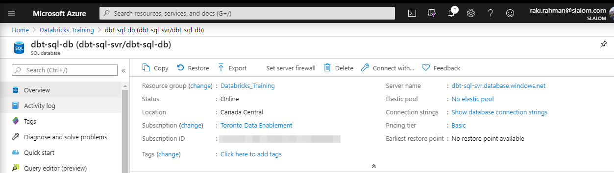
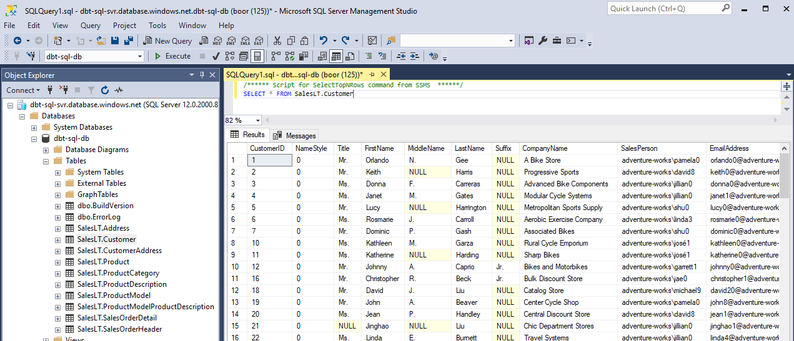
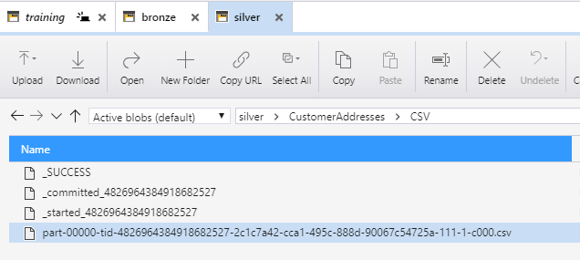
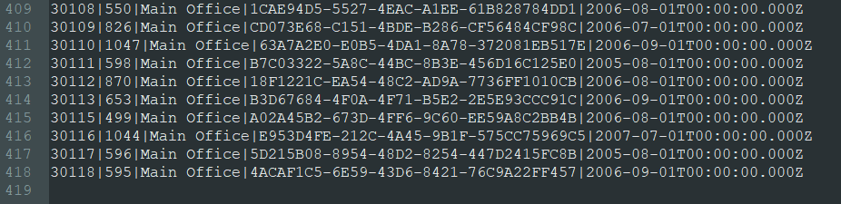
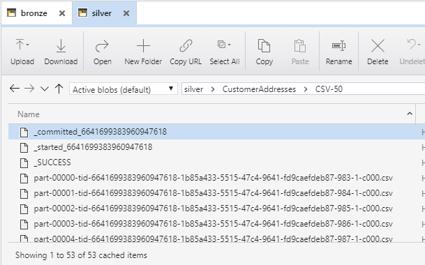
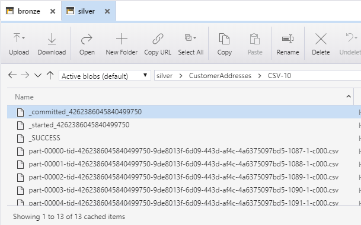
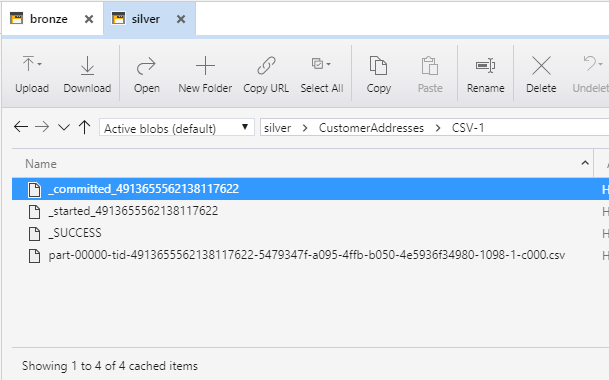
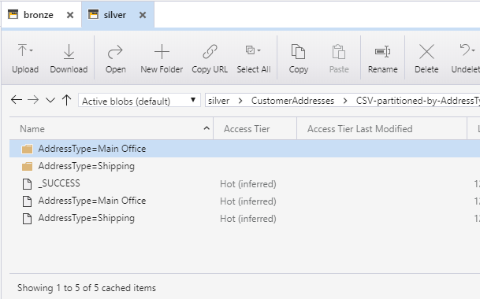

import { Callout } from "../../src/components/atoms.js"
import { ExtLink, InlinePageLink } from "../../src/components/atoms.js"

<Callout>

🥈 This is `Part 2` of the Study guide, focusing on Code and Specific Applications.

🥇 For `Part 1` (Core) - click <InlinePageLink to="/spark-certification-study-guide-part-1">here</InlinePageLink>

</Callout>

We now start diving deeper into code, and looking at specific applications of Spark to illustrate some fundamental use cases.

<Callout>

💡 A Databricks notebook version of this Study Guide is available [here](https://rakirahman.blob.core.windows.net/public/notebooks/Spark-Developer-Certification-Study-Guide.html) to import into your own [Databricks Workspace](https://docs.microsoft.com/en-us/azure/databricks/workspace/).

</Callout>

## SparkContext

<Callout>
  🎓 Candidates are expected to have a command of the following APIs:
</Callout>

**Overview**

Once the **driver** is started, it configures an instance of `SparkContext`. Your Spark context is already preconfigured and available as the variable `sc`. When running a standalone Spark application by submitting a jar file, or by using Spark API from another program, your Spark application starts and configures the Spark context (i.e. Databricks).

<Callout>
  💡 A Spark context comes with many useful methods for creating DataFrames,
  loading data (e.g. `spark.read.format("csv")`), and is the main interface for
  accessing Spark runtime.
</Callout>

There is usually one Spark context per JVM. Although the configuration
option `spark.driver.allowMultipleContexts` exists, it’s misleading because
usage of multiple Spark contexts is discouraged. This option is used only for
Spark internal tests and we recommend you don’t use that option in your user
programs. If you do, you may get unexpected results while running more than
one Spark context in a single JVM.

**`SparkContext` to control basic configuration settings such as `spark.sql.shuffle.partitions`**

- `spark.sql.shuffle.partitions`: Configures the number of partitions to use when shuffling data for joins or aggregations.
- `spark.executor.memory`: Amount of memory to use per executor process, in the same format as JVM memory strings with a size unit suffix ("k", "m", "g" or "t") (e.g. 512m, 2g).
- `spark.default.parallelism`: Default number of partitions in RDDs returned by transformations like `join`, `reduceByKey`, and `parallelize` when not set by user. Note that this is **ignored for DataFrames**, and we can use `df.repartition(numOfPartitions)` instead.

Let's explore how to set the value of `spark.sql.shuffle.partitions` and `spark.executor.memory` using PySpark and SQL syntax.

```python
# Print the default values of shuffle partition and the executor memory
print(spark.conf.get("spark.sql.shuffle.partitions"), ",", spark.conf.get("spark.executor.memory"))
```

```python
# Set the number of shuffle partitions to 6
spark.conf.set("spark.sql.shuffle.partitions", 6)
# Set the memory of executors to 2 GB
spark.conf.set("spark.executor.memory", "2g")
# Print the values of the shuffle partition and the executor memory
print(spark.conf.get("spark.sql.shuffle.partitions"), ",", spark.conf.get("spark.executor.memory"))
```

```sql
SET spark.sql.shuffle.partitions = 200;
SET spark.executor.memory = 7284m;
```

## SparkSession

<Callout>🎓 Candidates are expected to know how to:</Callout>

**Create a *DataFrame/Dataset* from a collection (e.g. `list` or `set`)**

```python
# import relevant modules
from pyspark.sql import *
from pyspark.sql.types import *
from pyspark.sql.functions import *
from pyspark import *
from pyspark import StorageLevel
import sys
```

**Example: Create DataFrame from list with DataType specified**

```python
list_df = spark.createDataFrame([1, 2, 3, 4], IntegerType())
display(list_df)
```

**Example: Create DataFrame from `Row`**

_class_ `pyspark.sql.Row`

A row in `DataFrame`. The fields in it can be accessed:

- like attributes (`row.key`)
- like dictionary values (`row[key]`)

In this scenario we have two tables to be joined `employee` and `department`. Both tables contains only a few records, but we need to join them to get to know the department of each employee. So, we join them using Spark DataFrames like this:

```python
# Create Example Data - Departments and Employees

# Create the Employees
Employee = Row("name") # Define the Row `Employee' with one column/key
employee1 = Employee('Bob') # Define against the Row 'Employee'
employee2 = Employee('Sam') # Define against the Row 'Employee'

# Create the Departments
Department = Row("name", "department") # Define the Row `Department' with two columns/keys
department1 = Department('Bob', 'Accounts') # Define against the Row 'Department'
department2 = Department('Alice', 'Sales') # Define against the Row 'Department'
department3 = Department('Sam', 'HR') # Define against the Row 'Department'

# Create DataFrames from rows
employeeDF = spark.createDataFrame([employee1, employee2])
departmentDF = spark.createDataFrame([department1, department2, department3])

# Join employeeDF to departmentDF on "name"
display(employeeDF.join(departmentDF, "name"))
```

**Example: Create DataFrame from `Row`, with Schema specified**

`createDataFrame`(_data, schema=None, samplingRatio=None, verifySchema=True_)

Creates a `DataFrame` from an `RDD`, a `list` or a `pandas.DataFrame`.
When `schema` is a list of column names, the type of each column will be inferred from `data`.
When `schema` is `None`, it will try to infer the schema (column names and types) from data, which should be an RDD of `Row`, or `namedtuple`, or `dict`.

```python
schema = StructType([
  StructField("letter", StringType(), True),
  StructField("position", IntegerType(), True)])

df = spark.createDataFrame([('A', 0),('B', 1),('C', 2)], schema)
display(df)
```

**Example: Create DataFrame from a list of `Rows`**

```python
# Create Example Data - Departments and Employees

# Create the Departments
Department = Row("id", "name")
department1 = Department('123456', 'Computer Science')
department2 = Department('789012', 'Mechanical Engineering')
department3 = Department('345678', 'Theater and Drama')
department4 = Department('901234', 'Indoor Recreation')
department5 = Department('000000', 'All Students')

# Create the Employees
Employee = Row("firstName", "lastName", "email", "salary")
employee1 = Employee('michael', 'armbrust', 'no-reply@berkeley.edu', 100000)
employee2 = Employee('xiangrui', 'meng', 'no-reply@stanford.edu', 120000)
employee3 = Employee('matei', None, 'no-reply@waterloo.edu', 140000)
employee4 = Employee(None, 'wendell', 'no-reply@berkeley.edu', 160000)
employee5 = Employee('michael', 'jackson', 'no-reply@neverla.nd', 80000)

# Create the DepartmentWithEmployees instances from Departments and Employees
DepartmentWithEmployees = Row("department", "employees")
departmentWithEmployees1 = DepartmentWithEmployees(department1, [employee1, employee2])
departmentWithEmployees2 = DepartmentWithEmployees(department2, [employee3, employee4])
departmentWithEmployees3 = DepartmentWithEmployees(department3, [employee5, employee4])
departmentWithEmployees4 = DepartmentWithEmployees(department4, [employee2, employee3])
departmentWithEmployees5 = DepartmentWithEmployees(department5, [employee1, employee2, employee3, employee4, employee5])

print(department1)
print(employee2)
print(departmentWithEmployees1.employees[0].email)
```

```python
departmentsWithEmployeesSeq1 = [departmentWithEmployees1, departmentWithEmployees2, departmentWithEmployees3, departmentWithEmployees4, departmentWithEmployees5]
df1 = spark.createDataFrame(departmentsWithEmployeesSeq1)

display(df1)
```

**Create a *DataFrame* for a range of numbers**

`range`(_start, end=None, step=1, numPartitions=None_)

Create a `DataFrame` with single `pyspark.sql.types.LongType` column named `id`, containing elements in a range from start to end (exclusive) with step value `step`.

**Parameters**

- **start** – the start value
- **end** – the end value (exclusive)
- **step** – the incremental step (default: 1)
- **numPartitions** – the number of partitions of the DataFrame

**Returns**:

- **`DataFrame`**

For example:

```python
df = spark.range(1,8,2).toDF("number")
display(df)
```

```python
df = spark.range(5).toDF("number")
display(df)
```

**Access the DataFrameReaders**

**_DataFrameReader — Loading Data From External Data Sources_**

class `pyspark.sql.DataFrameReader`(spark)

Interface used to load a `DataFrame` from external storage systems (e.g. file systems, key-value stores, etc). Use `spark.read()` to access this.

Before we start with using `DataFrameReaders`, let's mount a storage container that will contain different files for us to use.

```python
# Localize with Storage Account name and key
storageAccountName = "storage--acount--name"
storageAccountAccessKey = "storage--acount--key"

# Function to mount a storage container
def mountStorageContainer(storageAccount, storageAccountKey, storageContainer, blobMountPoint):
  print("Mounting {0} to {1}:".format(storageContainer, blobMountPoint))
  # Attempt mount only if the storage container is not already mounted at the mount point
  if not any(mount.mountPoint == blobMountPoint for mount in dbutils.fs.mounts()):
    print("....Container is not mounted; Attempting mounting now..")
    mountStatus = dbutils.fs.mount(
                  source = "wasbs://{0}@{1}.blob.core.windows.net/".format(storageContainer, storageAccount),
                  mount_point = blobMountPoint,
                  extra_configs = {"fs.azure.account.key.{0}.blob.core.windows.net".format(storageAccount): storageAccountKey})
    print("....Status of mount is: " + str(mountStatus))
  else:
    print("....Container is already mounted.")
    print() # Provide a blank line between mounts

# Mount "bronze" storage container
mountStorageContainer(storageAccountName,storageAccountAccessKey,"bronze","/mnt/GoFast/bronze")

# Display directory
display(dbutils.fs.ls("/mnt/GoFast/bronze"))
```

We read in the `auto-mpg.csv` with a simple `spark.read.csv` command.

**Note**: This particular csv doesn't have a header specified.

```python
df = spark.read.csv("/mnt/GoFast/bronze/auto-mpg.csv", header=False, inferSchema=True)
display(df)
```

**Register User Defined Functions (UDFs)**

If we have a `function` that can use values from a row in the `dataframe` as input, then we can map it to the entire dataframe. The only difference is that with PySpark UDFs we have to specify the `output` data type.

We first **define the udf** below:

```python
# Define UDF
def square(s):
  return s * s

# Register UDF to spark as 'squaredWithPython'
spark.udf.register("squaredWithPython", square, LongType())
```

Note that we can call `squaredWithPython` immediately from SparkSQL. We first register a `temp` table called 'table':

```python
# Register temptable with range of numbers
spark.range(0, 19, 3).toDF("num").createOrReplaceTempView("table")
```

```sql
SELECT num, squaredWithPython(num) as num_sq FROM table
```

But note that with `DataFrames`, this will not work until we define the UDF **explicitly** (on top of registering it above) with the respective return `DataType`. In other words, when we call `spark.udf.register` above, that registers it with spark SQL only, and for DataFrame it must be explicitly defined as an UDF.

```python
# Convert temp table to DataFrame
tabledf = spark.table("table")

# Define UDF
squaredWithPython = udf(square, LongType())

display(tabledf.select("num", squaredWithPython("num").alias("num_sq")))
```

## DataFrameReader

<Callout>

🎓 Candidates are expected to be familiar with the following architectural
components and their relationship to each other:

</Callout>

### Read data for the “core” data formats (CSV, JSON, JDBC, ORC, Parquet, text and tables)

**CSV**

Let's read `airbnb-sf-listings.csv` from our mount, with the header specified, and infer schema on read.

```python
csvdf = spark.read.csv("/mnt/GoFast/bronze/airbnb-sf-listings.csv", header=True, inferSchema=True)
display(csvdf)
```

**JSON**

Let's first view `zip.json` from our mount, and then load it into a DataFrame.

```bash
%fs head "dbfs:/mnt/GoFast/bronze/zips.json"
```

```python
jsondf = spark.read.json("/mnt/GoFast/bronze/zips.json")
display(jsondf)
```

**JDBC**

We are going to be reading a table from this Azure SQL Database for this activity.

**_Azure SQL DB_**


**_Reading table in SQL Server Management Studio_**


**_Set up JDBC connection:_**

```python
jdbcUsername = "your--SQL--username"
jdbcPassword = "your--SQL--password"
driverClass = "com.microsoft.sqlserver.jdbc.SQLServerDriver"
jdbcHostname = "your-sql-svr.database.windows.net"
jdbcPort = 1433
jdbcDatabase = "your-sql-db"

# Create the JDBC URL without passing in the user and password parameters.
jdbcUrl = "jdbc:sqlserver://{0}:{1};database={2}".format(jdbcHostname, jdbcPort, jdbcDatabase)

# Create a Properties() object to hold the parameters.
connectionProperties = {
  "user" : jdbcUsername,
  "password" : jdbcPassword,
  "driver" : driverClass
}
```

**_Run Query against JDBC connection:_**

```python
pushdown_query = "(SELECT * FROM SalesLT.Customer) Customers"
jdbcdf = spark.read.jdbc(url=jdbcUrl, table=pushdown_query, properties=connectionProperties)
display(jdbcdf)
```

**ORC**

The **Optimized Row Columnar (ORC)** file format provides a highly efficient way to store Hive data. It was designed to overcome limitations of the other Hive file formats. Using ORC files improves performance when Hive is reading, writing, and processing data.

Let's read `TestVectorOrcFile.testLzo.orc` from our mount.

```python
orcdf = spark.read.orc('/mnt/GoFast/bronze/TestVectorOrcFile.testLzo.orc')
display(orcdf)
```

**Parquet**

**Apache Parquet** is a free and open-source column-oriented data storage format of the Apache Hadoop ecosystem. It is similar to the other columnar-storage file formats available in Hadoop namely RCFile and ORC. It is compatible with most of the data processing frameworks in the Hadoop environment. It provides efficient data compression and encoding schemes with enhanced performance to handle complex data in bulk.

**Parquet** is a columnar format that is supported by many other data processing systems. Spark SQL provides support for both reading and writing Parquet files that automatically preserves the schema of the original data. When writing Parquet files, all columns are automatically converted to be nullable for compatibility reasons.

Let's read `wine.parquet` from our mount.

```python
parquetDF = spark.read.parquet("/mnt/GoFast/bronze/wine.parquet")
display(parquetDF)
```

**Text**

Let's read `tweets.txt` from our mount, then use a similar command as a `csv` earlier to load into DataFrame.

```bash
%fs head "dbfs:/mnt/GoFast/bronze/tweets.txt"
```

```python
# Delimit on '='
txtdf = (spark.read
         .option("header", "false")
         .option("delimiter", "=")
         .csv("/mnt/GoFast/bronze/tweets.txt")
        ).toDF("Text","Tweet")

# Display "Tweet" Column only
display(txtdf.select("Tweet"))
```

**Tables**

Let's read from one of our default Databricks Tables from the Hive Metastore:

```python
tabledf = spark.sql("""SELECT * FROM databricks.citydata""")
display(tabledf)
```

### How to configure options for specific formats

Let's read `searose-env.csv` from our mount, specify the schema, header and delimiter.

```python
# Schema
Schema = StructType([
    StructField("UTC_date_time", StringType(), True),
    StructField("Unix_UTC_timestamp", FloatType(), True),
    StructField("latitude", FloatType(), True),
    StructField("longitude", FloatType(), True),
    StructField("callsign", StringType(), True),
    StructField("wind_from", StringType(), True),
    StructField("knots", StringType(), True),
    StructField("gust", StringType(), True),
    StructField("barometer", StringType(), True),
    StructField("air_temp", StringType(), True),
    StructField("dew_point", StringType(), True),
    StructField("water_temp", StringType(), True)
])

WeatherDF = (spark.read                                     # The DataFrameReader
             .option("header", "true")                      # Use first line of file as header
             .schema(Schema)                                # Enforce Schema
             .option("delimiter", ",")                      # Set delimiter to ,
             .csv("/mnt/GoFast/bronze/searose-env.csv")     # Creates a DataFrame from CSV after reading in the file
            )

display(WeatherDF)
```

### How to read data from non-core formats using `format()` and `load()`

We can read the same file above `searose-env.csv` with `.format()` and `.load()` syntax - as well as other "non-core" files.

```python
Weather2DF = (spark.read
              .format("csv")
              .schema(Schema)
              .option("header","true")
              .option("delimiter", ",")
              .load("/mnt/GoFast/bronze/searose-env.csv")
             )
display(Weather2DF)
```

### How to specify a `DDL`-formatted schema

**Data Definition Language (DDL)** is a standard for commands that define the different structures in a database. DDL statements `create`, `modify`, and `remove` database objects such as `tables`, `indexes`, and `users`. Common DDL statements are `CREATE`, `ALTER`, and `DROP`.

We want to be able to specify our Schema in a DDL format prior to reading a file. Let's try this for our `searose-env.csv` above

```python
SchemaDDL = """UTC_date_time VARCHAR(255),
               Unix_UTC_timestamp float,
               latitude float,
               longitude float,
               callsign VARCHAR(255),
               wind_from VARCHAR(255),
               knots VARCHAR(255),
               gust VARCHAR(255),
               barometer VARCHAR(255),
               air_temp VARCHAR(255),
               dew_point VARCHAR(255),
               water_temp VARCHAR(255)"""

Weather3DF = spark.read.csv('/mnt/GoFast/bronze/searose-env.csv', header=True, schema=SchemaDDL)
display(Weather3DF)
```

### How to construct and specify a schema using the `StructType` classes

We've done this above.

## DataFrameWriter

<Callout>
  🎓 Candidates are expected to have a command of the following APIs:
</Callout>

### Write data to the “core” data formats (csv, json, jdbc, orc, parquet, text and tables)

Let's create a DataFrame `CustomerAddressDF` from the table `SalesLT.CustomerAddress` in our Azure SQL Database. We will then write this to various different formats to our Storage Account's `silver` Container.

```python
# Mount "silver" storage container
mountStorageContainer(storageAccountName,storageAccountAccessKey,"silver","/mnt/GoFast/silver")
```

```python
pushdown_query = "(SELECT * FROM SalesLT.CustomerAddress) CustomerAddresses"
CustomerAddressDF = spark.read.jdbc(url=jdbcUrl, table=pushdown_query, properties=connectionProperties)
display(CustomerAddressDF)
```

**CSV**

```python
# Clean up directory
dbfsDirPath = "/mnt/GoFast/silver/CustomerAddresses/CSV"
dbutils.fs.rm(dbfsDirPath, recurse=True)
dbutils.fs.mkdirs(dbfsDirPath)

# Write DataFrame to path with header
CustomerAddressDF.write.format("csv").option("header","true").mode("overwrite").save(dbfsDirPath)
```

We see this file in our Storage Account:


And the contents are equal to the length of the data received from Azure SQL:


**JSON**

```python
# Clean up directory
dbfsDirPath = "/mnt/GoFast/silver/CustomerAddresses/JSON"
dbutils.fs.rm(dbfsDirPath, recurse=True)
dbutils.fs.mkdirs(dbfsDirPath)

# Write DataFrame to path
CustomerAddressDF.write.format("json").mode("overwrite").save(dbfsDirPath)
```

**JDBC**

This time, we do an `overwrite` to our Azure SQL Database Table, by restoring `CustomerAddresses` to a DataFrame from our bucket.

```python
# Restore a backup of our DataFrame from Silver Zone
CustomerAddressBackupDF = spark.read.csv("/mnt/GoFast/silver/CustomerAddresses/CSV", header=True, inferSchema=True)

# Create temporary view
CustomerAddressBackupDF.createOrReplaceTempView("CustomerAddressView")

# Perform overwrite on SQL table
spark.sql("""SELECT * FROM CustomerAddressView""").write \
    .format("jdbc") \
    .mode("overwrite")  \
    .option("url", jdbcUrl) \
    .option("dbtable", "SalesLT.CustomerAddress") \
    .option("user", jdbcUsername) \
    .option("password", jdbcPassword) \
    .save()
```

**ORC**

```python
# Clean up directory
dbfsDirPath = "/mnt/GoFast/silver/CustomerAddresses/ORC"
dbutils.fs.rm(dbfsDirPath, recurse=True)
dbutils.fs.mkdirs(dbfsDirPath)

# Write DataFrame to path
CustomerAddressDF.write.format("orc").mode("overwrite").save(dbfsDirPath)
```

**Parquet**

```python
# Clean up directory
dbfsDirPath = "/mnt/GoFast/silver/CustomerAddresses/Parquet"
dbutils.fs.rm(dbfsDirPath, recurse=True)
dbutils.fs.mkdirs(dbfsDirPath)

# Write DataFrame to path
CustomerAddressDF.write.format("parquet").mode("overwrite").save(dbfsDirPath)
```

**Text**

```python
# Clean up directory
dbfsDirPath = "/mnt/GoFast/silver/CustomerAddresses/Text"
dbutils.fs.rm(dbfsDirPath, recurse=True)
dbutils.fs.mkdirs(dbfsDirPath)

# Note that text file does not support `int` data type, and also expects one column, so we must convert to one '|'' seperated string
CustomerAddressConcatDF = CustomerAddressDF \
                                     .withColumn("CustomerID", col("CustomerID").cast("string")) \
                                     .withColumn("AddressID", col("AddressID").cast("string")) \
                                     .withColumn("ModifiedDate", col("ModifiedDate").cast("string")) \
                                     .withColumn("Concatenated", concat(col("CustomerID"), lit('|'), \
                                                                        col("AddressID"), lit('|'), \
                                                                        col("AddressType"), lit('|'), \
                                                                        col("rowguid"), lit('|'), \
                                                                        col("ModifiedDate"))) \
                                     .drop(col("CustomerID")) \
                                     .drop(col("AddressID")) \
                                     .drop(col("AddressType")) \
                                     .drop(col("rowguid")) \
                                     .drop(col("ModifiedDate"))

# Write DataFrame to path
CustomerAddressConcatDF.write.format("text").mode("overwrite").save(dbfsDirPath)
```

**Tables**

Let's create a Hive table usign `Parquet` (location above).

```sql

USE databricks;

DROP TABLE IF EXISTS CustomerAddress;
CREATE TABLE IF NOT EXISTS CustomerAddress
USING parquet
OPTIONS  (path "/mnt/GoFast/silver/CustomerAddresses/Parquet");

SELECT COUNT(*) FROM databricks.CustomerAddress
```

### Overwriting existing files

We've already achieved this above when persisting a DataFrame to mount, by using `.mode("overwrite")` - we also do this below.

### How to configure options for specific formats

Previously, we wrote a CSV file with the `CustomerAddress` data that was `,` seperated. Let's overwrite that file with a `|` seperated version now.

**Output:**


```python
# Specify CSV directory
dbfsDirPath = "/mnt/GoFast/silver/CustomerAddresses/CSV"

# Write DataFrame to path with header and seperator
CustomerAddressDF.write.format("csv").option("header","true").option("delimiter", "|").mode("overwrite").save(dbfsDirPath)
```

### How to write a data source to 1 single file or N separate files

**Difference between `coalesce` and `repartition`**

`repartition()` literally reshuffles the data to form as many partitions as we specify, i.e. the number of partitions can be **increased/decreased**. Whereas with `coalesce()` we avoid data movement and use the existing partitions, meaning the number of partitions can only be **decreased**.

Note that `coalesce()` results in partitions with different amounts of data per partition, whereas `repartition()` is distributed evenly. As a result, the `coalesce()` operation may run faster than `repartition()`, but the partitions themselves may work slower further on because Spark is built to work with equal sized partitions across the task slots on the executors.

**50 partitions**:

**10 partitions**:

**1 partition**:


```python
# Clean up directory for 50 part CSV
dbfsDirPath = "/mnt/GoFast/silver/CustomerAddresses/CSV-50"
dbutils.fs.rm(dbfsDirPath, recurse=True)
dbutils.fs.mkdirs(dbfsDirPath)

# Redefine DataFrame with 50 partitions
CustomerAddressDF = CustomerAddressDF.repartition(50)

# Write DataFrame to path with header and repartition to 50 partitions
CustomerAddressDF.write.format("csv").option("header","true").mode("overwrite").save(dbfsDirPath)

# Clean up directory for 10 part CSV
dbfsDirPath = "/mnt/GoFast/silver/CustomerAddresses/CSV-10"
dbutils.fs.rm(dbfsDirPath, recurse=True)
dbutils.fs.mkdirs(dbfsDirPath)

# Write DataFrame to path with header and coalesce to 10 partitions
CustomerAddressDF.coalesce(10).write.format("csv").option("header","true").mode("overwrite").save(dbfsDirPath)

# Clean up directory for 1 part CSV
dbfsDirPath = "/mnt/GoFast/silver/CustomerAddresses/CSV-1"
dbutils.fs.rm(dbfsDirPath, recurse=True)
dbutils.fs.mkdirs(dbfsDirPath)

# Write DataFrame to path with header and coalesce to 1 partition
CustomerAddressDF.coalesce(1).write.format("csv").option("header","true").mode("overwrite").save(dbfsDirPath)
```

**How to write partitioned data**

**_Partitioning by Columns_**

**Partitioning** uses **partitioning columns** to divide a dataset into smaller chunks (based on the values of certain columns) that will be written into separate directories.

With a partitioned dataset, Spark SQL can load only the parts (partitions) that are really needed (and avoid doing filtering out unnecessary data on JVM). That leads to faster load time and more efficient memory consumption which gives a better performance overall.

With a partitioned dataset, Spark SQL can also be executed over different subsets (directories) in parallel at the same time.

Let's partition by AddressType and write to storage on our earlier `CustomerAddressDF` dataframe:

```python
# Clean up directory
dbfsDirPath = "/mnt/GoFast/silver/CustomerAddresses/CSV-partitioned-by-AddressType"
dbutils.fs.rm(dbfsDirPath, recurse=True)
dbutils.fs.mkdirs(dbfsDirPath)

# Write DataFrame to path with header and partition by AddressType
CustomerAddressDF.write.format("csv").option("header","true").mode("overwrite").partitionBy("AddressType").save(dbfsDirPath)
```

And we see:


**How to bucket data by a given set of columns**

**_What is Bucketing?_**

**Bucketing** is an optimization technique that uses **buckets** (and **bucketing columns**) to determine data partitioning and avoid data shuffle.

The motivation is to optimize performance of a join query by avoiding shuffles (aka _exchanges_) of tables participating in the join. Bucketing results in fewer exchanges (and so stages).

```python
# Note that this is only supported to a table (and not to a location)
CustomerAddressDF.write \
  .mode("overwrite") \
  .bucketBy(10, "ModifiedDate") \
  .saveAsTable("CustomerAddress_bucketed")

display(sql('''SELECT * FROM CustomerAddress_bucketed'''))
```

## DataFrame

### Have a working understanding of every action such as `take()`, `collect()`, and `foreach()`

Let's demo the following table of **Actions** on our DataFrame:

| C1                    | C2             | C3                                                                        |
| --------------------- | -------------- | ------------------------------------------------------------------------- |
| **_`Method`_**        | **_`Return`_** | **_`Description`_**                                                       |
| `collect()`           | Collection     | Returns an array that contains all of Rows in this Dataset.               |
| `count()`             | Long           | Returns the number of rows in the Dataset.                                |
| `first()`             | Row            | Returns the first row.                                                    |
| `foreach(f)`          | -              | Applies a function f to all rows.                                         |
| `foreachPartition(f)` | -              | Applies a function f to each partition of this Dataset.                   |
| `head()`              | Row            | Returns the first row.                                                    |
| `reduce(f)`           | Row            | Reduces the elements of this Dataset using the specified binary function. |
| `show(..)`            | -              | Displays the top 20 rows of Dataset in a tabular form.                    |
| `take(n)`             | Collection     | Returns the first n rows in the Dataset.                                  |
| `toLocalIterator()`   | Iterator       | Return an iterator that contains all of Rows in this Dataset.             |

Note once again that while **Transformations** always return a _DataFrame_, **Actions** either return a _result_ or _write to disk_.

**`collect()`**

Return a list that contains all of the elements in this RDD.

**Note**: This method should only be used if the resulting array is expected to be small, as all the data is loaded into the driver’s memory.

```python
Array = CustomerAddressDF.collect()
print(Array[0])
print("\n")
print(Array[0][0])
```

**`count()`**

Return the number of elements in this RDD.

```python
CustomerAddressDF.count()
```

**`first()`**

Return the first element in this RDD/DataFrame.

```python
CustomerAddressDF.first()
```

**`foreach(f)`**

Applies a function `f` to all elements of this RDD/DataFrame.

**Note**: `RDD.foreach` method runs on the cluster for each _worker_, and so we don't see the print output.

```python
def f(x): print(x)
CustomerAddressDF.foreach(f)
```

**`foreachPartition(f)`**

Applies a function to each partition of this RDD.

**Note**: `RDD.foreachPartition` method runs on the cluster for each _worker_, and so we don't see the print output.

```python
def f(x): print(x)
CustomerAddressDF.foreachPartition(f)
```

**`head()`**

Returns the first row.

At first glance, this looks identical to `first()` - let's look at the difference:

**Sorted Data**

If your data is **_sorted_** using either `sort()` or `ORDER BY`, these operations will be deterministic and return either the 1st element using first()/head() or the top-n using head(n)/take(n).

show()/show(n) return Unit (void) and will print up to the first 20 rows in a tabular form.

These operations may require a shuffle if there are any aggregations, joins, or sorts in the underlying query.

**Unsorted Data**

If the data is **_not sorted_**, these operations are not guaranteed to return the 1st or top-n elements - and a shuffle may not be required.

`show()`/`show(n)` return Unit (void) and will print up to 20 rows in a tabular form and in no particular order.

If no shuffle is required (no aggregations, joins, or sorts), these operations will be optimized to inspect enough partitions to satisfy the operation - likely a much smaller subset of the overall partitions of the dataset.

```python
CustomerAddressDF.head()
```

**`reduce(f)`**

Reduces the elements of this **RDD** (note that it doesn't work on DataFrames) using the specified commutative and associative binary operator. Currently reduces partitions locally.

```python
from operator import add
sc.parallelize([2, 4, 6]).reduce(add)
```

**`show(id)`**

Displays the top 20 (_default, can be overwritten_) rows of Dataset in a tabular form

```python
CustomerAddressDF.show()
```

**`take(n)`**

Take the first **n** elements of the RDD.

It works by first scanning one partition, and using the results from that partition to estimate the number of additional partitions needed to satisfy the limit.

**Note:** this method should only be used if the resulting array is expected to be small, as all the data is loaded into the driver’s memory.

```python
CustomerAddressDF.take(2)
```

**`toLocalIterator()`**

Return an iterator that contains all of the elements in this RDD/DataFrame. The iterator will consume as much memory as the largest partition in this RDD.

```python
[x for x in CustomerAddressDF.toLocalIterator()]
```

### Have a working understanding of the various transformations and how they work

Such as producing a `distinct` set, `filter`ing data, re`partition`ing and `coalesce`ing, performing `join`s and `union`s as well as producing `aggregates`.

**`select(*cols)`**

Projects a set of expressions and returns a new `DataFrame`.

**Parameters:**

- **cols** – list of column names (`string`) or expressions (`Column`). If one of the column names is `*`, that column is expanded to include all columns in the current DataFrame.

Using our `CustomerAddressDF` from above, let's `select` out a couple of the rows only.

```python
TruncatedDF = CustomerAddressDF.select("CustomerID", "rowguid")
display(TruncatedDF)
```

**`distinct()`**

Returns a new `DataFrame` containing the distinct rows in this `DataFrame`.

Let's create a DF with duplicates, and then run `distinct` on it.

```python
DuplicateDF = TruncatedDF.withColumn("CustomerID", lit(29772)).withColumn("rowguid", lit("BF40660E-40B6-495B-99D0-753CE987B1D1"))
display(DuplicateDF)
```

```python
display(DuplicateDF.distinct())
```

**`groupBy(*cols)`**

Groups the `DataFrame` using the specified columns, so we can run aggregation on them. See `GroupedData` for all the available aggregate functions.

`groupby()` is an alias for `groupBy()`.

**Parameters:**

- **cols** – list of columns to group by. Each element should be a column name (`string`) or an expression (`Column`).

**Note**: `groupBy` by itself doesn't return anything quantitative, we also have to `agg` by an aggregation function to get a tangible result back.

```python
CustomerAddressAggDF = CustomerAddressDF.groupBy("AddressType").agg({'AddressType':'count'})
display(CustomerAddressAggDF)
```

**`sum(*cols)`**

Compute the sum for each numeric columns for each group.

**Parameters:**

- **cols** – list of column names (`string`). Non-numeric columns are ignored.

```python
# Let's rename the column "count(AddressType)"
CustomerAddressAggDF2 = CustomerAddressAggDF.withColumn("AddressTypeCount", col("count(AddressType)")).drop(col("count(AddressType)"))

# We do a groupBy followed by a sum - to ultimately get back our number of rows in the original DataFrame
display(CustomerAddressAggDF2.groupBy().sum("AddressTypeCount"))
```

**`orderBy(*cols, *kwargs)`**

Returns a new `DataFrame` sorted by the specified column(s).

**Parameters:**

- **cols** – list of `Column` or column names to sort by.
- **ascending** – boolean or list of boolean (default True). Sort ascending vs. descending. Specify list for multiple sort orders. If a list is specified, length of the list must equal length of the cols.

```python
display(CustomerAddressDF.orderBy("ModifiedDate", ascending = 0))
```

**`filter()`**

Filters rows using the given condition.

**where()** is an alias for **filter()**.

**Parameters:**

- **condition** – a Column of types.BooleanType or a string of SQL expression.

```python
display(CustomerAddressDF.filter("AddressID = 484"))
```

**`limit()`**

Limits the result count to the number specified.

```python
display(CustomerAddressDF.limit(3))
```

**`partition()` and `coalesce`**

We already discussed this in detail earlier.

**`join(other, on=None, how=None)`**

Joins with another `DataFrame`, using the given join expression.

**Parameters**:

- **other** – Right side of the join
- **on** – a string for the join column name, a list of column names, a join expression (Column), or a list of Columns. If on is a string or a list of strings indicating the name of the join column(s), the column(s) must exist on both sides, and this performs an equi-join.
- **how** – str, default `inner`. Must be one of: `inner`, `cross`, `outer`, `full`, `full_outer`, `left`, `left_outer`, `right`, `right_outer`, `left_semi`, and `left_anti`.

```python
# Let's query Azure SQL directly DataFrame we want to recreate
pushdown_query = """(SELECT DISTINCT C.CompanyName, A.City
                    FROM [SalesLT].[Customer] C
                    INNER JOIN [SalesLT].[CustomerAddress] CA ON C.CustomerID = CA.CustomerID
                    INNER JOIN [SalesLT].[Address] A ON CA.AddressID = A.AddressID
                    WHERE CA.AddressID IS NOT NULL AND A.AddressLine1 IS NOT NULL) CompanyAndAddress"""

CompanyAndAddressDF = spark.read.jdbc(url=jdbcUrl, table=pushdown_query, properties=connectionProperties)
display(CompanyAndAddressDF.orderBy("CompanyName", ascending = 1))
```

```python
# Get the underlying Tables as DataFrames from Azure SQL
pushdown_query = "(SELECT CustomerID, CompanyName FROM SalesLT.Customer) Customer"
CustomerDF = spark.read.jdbc(url=jdbcUrl, table=pushdown_query, properties=connectionProperties)

pushdown_query = "(SELECT CustomerID, AddressID FROM SalesLT.CustomerAddress) CustomerAddress"
CustomerAddressDF = spark.read.jdbc(url=jdbcUrl, table=pushdown_query, properties=connectionProperties)

pushdown_query = "(SELECT AddressID,City FROM SalesLT.Address) Address"
AddressDF = spark.read.jdbc(url=jdbcUrl, table=pushdown_query, properties=connectionProperties)
```

```python
# Perform joins identical to goal DataFrame above
display(CustomerDF.join(CustomerAddressDF, CustomerDF.CustomerID == CustomerAddressDF.CustomerID, 'inner') \
                  .join(AddressDF, CustomerAddressDF.AddressID == AddressDF.AddressID, 'inner') \
                  .select(CustomerDF.CompanyName, AddressDF.City) \
                  .orderBy("CompanyName", ascending = 1) \
                  .distinct())
```

And we get back the same DataFrame as `CompanyAndAddressDF` from our above SQL query.

**`union()`**

Return a new `DataFrame` containing union of rows in this and another frame.

This is equivalent to _UNION ALL_ in SQL. To do a SQL-style set union (that does deduplication of elements), use this function followed by `distinct()`.

Also as standard in SQL, this function resolves columns by position (not by name).

```python

# Create two DataFrames with fruit lists, with some multiple occurences

df1 = spark.createDataFrame(["apple", "orange", "apple", "mango"], StringType())
df2 = spark.createDataFrame(["cherries", "orange", "blueberry", "apple"], StringType())

# Perform union and display data

df3 = df1.union(df2)
display(df3
```

**`agg(*exprs)`**

Compute aggregates and returns the result as a `DataFrame`.

The available aggregate functions can be:

1. built-in aggregation functions, such as _avg, max, min, sum, count_
2. group aggregate pandas UDFs, created with `pyspark.sql.functions.pandas_udf()`

**Note:** There is no partial aggregation with group aggregate UDFs, i.e., a full shuffle is required. Also, all the data of a group will be loaded into memory, so the user should be aware of the potential OOM risk if data is skewed and certain groups are too large to fit in memory.

```python
# Perform aggregation on `count` of the fruit names - i.e. the number of occurences in the union list per fruit.
display(df3.groupby("value").agg({'value':'count'}).orderBy("value", ascending = 1))
```

### Know how to `cache` data, specifically to `disk`, `memory` or both

**Caching in Spark**

As we discussed earlier, Spark supports pulling data sets into a cluster-wide in-memory `cache`. This is very useful when data is accessed repeatedly, such as when querying a small “hot” dataset (required in many operations) or when running an iterative algorithm.

Here are some relevant functions:

**`cache()`**

Persists the `DataFrame` with the default storage level (`MEMORY_AND_DISK`). `persist()` without an argument is equivalent with `cache()`.

**`unpersist()`**

Marks the `DataFrame` as non-persistent, and remove all blocks for it from memory and disk.

**`persist(storageLevel)`**

Sets the storage level to persist the contents of the `DataFrame` across operations after the first time it is computed. This can only be used to assign a new storage level if the `DataFrame` does not have a storage level set yet. If no storage level is specified defaults to (`MEMORY_AND_DISK`).

As we see below, there are 4 caching levels that can be fine-tuned with `persist()`. Let's look into the options available in more detail.

| C1                    | C2                                           | C3                                                                                                                                                                                                              |
| --------------------- | -------------------------------------------- | --------------------------------------------------------------------------------------------------------------------------------------------------------------------------------------------------------------- |
| **_`Storage Level`_** | **_`Equivalent`_**                           | **_`Description`_**                                                                                                                                                                                             |
| `MEMORY_ONLY`         | `StorageLevel(False, True, False, False, 1)` | Store RDD as deserialized Java objects in the JVM. If the RDD does not fit in memory, some partitions will not be cached and will be recomputed on the fly each time they're needed. This is the default level. |
| `MEMORY_AND_DISK`     | `StorageLevel(True, True, False, False, 1)`  | Store RDD as deserialized Java objects in the JVM. If the RDD does not fit in memory, store the partitions that don't fit on disk, and read them from there when they're needed.                                |
| `DISK_ONLY`           | `StorageLevel(True, False, False, False, 1)` | Store the RDD partitions only on disk.                                                                                                                                                                          |
| `MEMORY_ONLY_2`       | `StorageLevel(False, True, False, False, 2)` | Same as the levels above, but replicate each partition on two cluster nodes.                                                                                                                                    |
| `MEMORY_AND_DISK_2`   | `StorageLevel(True, True, False, False, 2)`  | Same as the levels above, but replicate each partition on two cluster nodes.                                                                                                                                    |
| `OFF_HEAP`            | `StorageLevel(True, True, True, False, 1)`   | Similar to MEMORY_ONLY_SER, but store the data in off-heap memory. This requires off-heap memory to be enabled.                                                                                                 |

As a simple example, let’s mark our `CompanyAndAddressDF` dataset to be cached. While it may seem silly to use Spark to explore and cache a small `DataFrame`, the interesting part is that these same functions can be used on very large data sets, even when they are striped across tens or hundreds of nodes.

```python
# Check the cache level before we do anything
CompanyAndAddressDF.storageLevel

# Let's cache the DataFrame with default - MEMORY_AND_DISK, and check the cache level
CompanyAndAddressDF.cache().storageLevel

# Unpersist and proceed to Memory Only Cache
CompanyAndAddressDF.unpersist()
CompanyAndAddressDF.persist(storageLevel = StorageLevel.MEMORY_ONLY).storageLevel

# Unpersist and proceed to Memory Only Cache
CompanyAndAddressDF.unpersist()
CompanyAndAddressDF.persist(storageLevel = StorageLevel.MEMORY_ONLY).storageLevel
```

And so on.

### Know how to `uncache` previously cached data

```python
# Let's uncache the DataFrame
CompanyAndAddressDF.unpersist()

# Check the Cache level
CompanyAndAddressDF.storageLevel
```

### Converting a *DataFrame* to a global or temp view.

**Global Temporary View vs. Temporary View**
Temporary views in Spark SQL are session-scoped and will disappear if the session that creates it terminates. If you want to have a temporary view that is shared among all sessions and keep alive until the Spark application terminates, you can create a global temporary view. Global temporary view is tied to a system preserved database `global_temp`, and we must use the qualified name to refer it, e.g. `SELECT * FROM global_temp.view1`. We use these two commands:

- **Global Temp View**: `df.createOrReplaceGlobalTempView("tempViewName")` creates a global temporary view with this dataframe df. Lifetime of this view is dependent to spark application itself, if you want to drop this view: `spark.catalog.dropGlobalTempView("tempViewName")`
- **Temp View**: `df.createOrReplaceTempView("tempViewName")` creates or replaces a local temporary view with this dataframe df. Lifetime of this view is dependent to SparkSession class, if you want to drop this view: `spark.catalog.dropTempView("tempViewName")`

```python
# Create Global Temporary View
CompanyAndAddressDF.createOrReplaceGlobalTempView("CompanyAndAddressGlobal")
display(spark.sql("SELECT * FROM global_temp.CompanyAndAddressGlobal"))

# Create SQL Temporary View
CompanyAndAddressDF.createOrReplaceTempView("CompanyAndAddressTemp")
display(spark.sql("SELECT * FROM CompanyAndAddressTemp"))

# Drop Temporary Views
spark.catalog.dropGlobalTempView("CompanyAndAddressGlobal")
spark.catalog.dropTempView("CompanyAndAddressTemp")
```

### Applying hints

Structured queries can be optimized using **Hint Framework** that allows for specifying query hints.

**Query hints** allow for annotating a query and give a hint to the query optimizer how to optimize logical plans. This can be very useful when the query optimizer cannot make optimal decision, e.g. with respect to join methods due to conservativeness or the lack of proper statistics.

Spark SQL supports COALESCE and REPARTITION and BROADCAST hints. All remaining unresolved hints are silently removed from a query plan at analysis.

```python
display(CustomerDF.join(CustomerAddressDF.hint("broadcast"), "CustomerID"))
```

## Row & Column

<Callout>
  🎓 Candidates are expected to know how to work with row and columns to
  successfully extract data from a DataFrame
</Callout>

We can easily get back a single Column or Row and perform manipulations in Spark. For example, with our DataFrame `CustomerDF`:

```python
# Extract First Row
display(CustomerDF.filter("CompanyName == 'A Bike Store' and CustomerID == 1"))

# Extract Distinct Second Column 'CompanyName', Not like "A **** ****", Order By descending, Pick Top 5
display(CustomerDF.select("CompanyName").filter("CompanyName not like 'A%'").distinct().orderBy("CompanyName", ascending = 1).take(5))
```

## Spark SQL Functions

<Callout>
  🎓 When instructed what to do, candidates are expected to be able to employ
  the multitude of Spark SQL functions. Examples include, but are not limited
  to:
</Callout>

Let's use this Databricks table `databricks.citydata` for this section wherever applicable:

```sql
SELECT * FROM databricks.citydata
```

**Aggregate functions: getting the `first` or `last` item from an array or computing the `min` and `max` values of a column.**

**`first(expr[, isIgnoreNull])`**

Returns the first value of expr for a group of rows. If `isIgnoreNull` is true, returns only non-null values.

```sql
SELECT first(state), last(state) FROM
  (SELECT state FROM  databricks.citydata
  ORDER BY state ASC)
```

**`min(col)`**

Aggregate function: returns the minimum value of the expression in a group.

```sql
SELECT min(estPopulation2016), max(estPopulation2016) FROM
  (SELECT estPopulation2016 FROM  databricks.citydata)
```

**Collection functions: testing if an array `contains` a value, `explode`ing or `flatten`ing data**

```sql
SELECT array_contains(array('a','b','c','d'), 'a') AS contains_a;
```

```sql
SELECT explode(array('a','b','c','d'));
```

```sql
SELECT flatten(array(array(1, 2), array(3, 4)));
```

**Date time functions: parsing `string`s into `timestamp`s or formatting `timestamp`s into `string`s**

**`to_date(date_str[, fmt])`**

Parses the `date_str` expression with the `fmt` expression to a date. Returns `null` with invalid input. By default, it follows casting rules to a date if the `fmt` is omitted.

```sql
SELECT to_date('2009-07-30 04:17:52') AS date, to_date('2016-12-31', 'yyyy-MM-dd') AS date_formatted
```

**`to_timestamp(timestamp[, fmt])`**

Parses the `timestamp` expression with the `fmt` expression to a `timestamp`. Returns `null` with invalid input. By default, it follows casting rules to a `timestamp` if the fmt is omitted.

```sql
SELECT to_timestamp('2016-12-31 00:12:00') AS timestamp, to_timestamp('2016-12-31', 'yyyy-MM-dd') AS timestamp_formatted;
```

**`date_format(timestamp, fmt)`**

Converts `timestamp` to a value of `string` in the format specified by the date format `fmt`.

```sql
SELECT date_format('2016-12-31T00:12:00.000+0000', 'y') AS year_only
```

**Math functions: computing the cosign, floor or log of a number**

**`cos(expr)`**

Returns the cosine of `expr`.

```sql
SELECT cos(0) AS cos
```

**`floor(expr)`**

Returns the largest integer not greater than `expr`.

```sql
SELECT floor(5.9) AS floored
```

**`log(base, expr)`**

Returns the logarithm of `expr` with base.

```sql
SELECT log(2, 8) AS log_2
```

**Misc functions: converting a value to crc32, md5, sha1 or sha2**

**`crc32(expr)`**

Returns a cyclic redundancy check value of the `expr` as a `bigint`.

```sql
SELECT crc32('hello')
```

**`md5(expr)`**

Returns an MD5 128-bit checksum as a hex string of `expr`.

```sql
SELECT md5('hello')
```

**`sha1(expr)`**

Returns a sha1 hash value as a hex string of the `expr`.

```sql
SELECT sha1('hello')
```

**`sha2(expr, bitLength)`**

Returns a checksum of SHA-2 family as a hex string of expr. SHA-224, SHA-256, SHA-384, and SHA-512 are supported. Bit length of 0 is equivalent to 256.

```sql
SELECT sha2('hello', 256)
```

**Non-aggregate functions: creating an array, testing if a column is null, not-null, nan, etc**

**`array(expr, ...)`**

Returns an array with the given elements.

```sql
SELECT array(1, 2, 3) AS array
```

**`isnull(expr)`**

Returns `true` if expr is `null`, or `false` otherwise.

```sql
SELECT isnull(population2010) FROM databricks.citydata
limit 5
```

**`isnotnull(expr)`**

Returns `true` if `expr` is _not_ `null`, or `false` otherwise.

```sql
SELECT isnotnull(population2010) FROM databricks.citydata
limit 5
```

**Difference between `null` and `NaN`**

`null` values represents "no value" or "nothing", it's not even an empty string or zero. It can be used to represent that nothing useful exists.

`NaN` stands for "Not a Number", it's usually the result of a mathematical operation that doesn't make sense, e.g. 0.0/0.0.

**`isnan(expr)`**

Returns `true` if expr is `NaN`, or `false` otherwise.

```sql
SELECT cast('NaN' as double), isnan(cast('NaN' as double)), cast('hello' as double), isnan(cast('hello' as double))
```

**Sorting functions: sorting data in descending order, ascending order, and sorting with proper null handling**

Let's use our `WeatherDF` for this section:

```python
# We replace the `NULL` in column `gust` and `air_temp` above with `null`, and typecast to float
WeatherDFtemp = WeatherDF.withColumn("gust",when((ltrim(col("gust")) == "NULL"),lit(None)).otherwise(col("gust").cast("float"))) \
                     .withColumn("air_temp",when((ltrim(col("air_temp")) == "NULL"),lit(None)).otherwise(col("air_temp").cast("float")))

# Create temp SQL view
WeatherDFtemp.createOrReplaceTempView('Weather')
```

We demonstrate:

- Filter for values where **gust** is not `null` and **air_temp** is not `null`
- Order by **gust** `ascending`
- Order by **air_temp** `descending`

```sql
SELECT gust, air_temp
FROM Weather
WHERE isnotnull(gust) AND isnotnull(air_temp)
ORDER BY gust ASC, air_temp DESC
```

**String functions: applying a provided regular expression, trimming string and extracting substrings**

**`regexp_extract(str, regexp[, idx])`**

Extracts a group that matches `regexp`.

```sql
SELECT regexp_extract('Verified by Stacy', '( by)')
```

**`regexp_replace(str, regexp, rep)`**

Replaces all substrings of `str` that match regexp with `rep`.

```sql
SELECT regexp_replace('Verified by Stacy', '( by)', ':')
```

**`trim(str)`**

Removes the leading and trailing space characters from str.

**`trim(BOTH trimStr FROM str)`**

Remove the leading and trailing trimStr characters from str

**`trim(LEADING trimStr FROM str)`**

Remove the leading trimStr characters from str

**`trim(TRAILING trimStr FROM str)`**

Remove the trailing trimStr characters from str

**Arguments:**

- `str` - a string expression
- `trimStr` - the trim string characters to trim, the default value is a single space
- `BOTH`, `FROM` - these are keywords to specify trimming string characters from both ends of the string
- `LEADING`, `FROM` - these are keywords to specify trimming string characters from the left end of the string
- `TRAILING`, `FROM` - these are keywords to specify trimming string characters from the right end of the string

```sql
SELECT trim('    SparkSQL   '),
       trim('SL', 'SSparkSQLS'),
       trim(BOTH 'SL' FROM 'SSparkSQLS'),
       trim(LEADING 'SL' FROM 'SSparkSQLS'),
       trim(TRAILING 'SL' FROM 'SSparkSQLS')
```

**UDF functions: employing a UDF function**

We call the `squaredWithPython` UDF we defined earlier.

```sql
SELECT gust, squaredWithPython(floor(gust))
FROM Weather
WHERE isnotnull(gust)
ORDER BY gust ASC
```

**Window functions: computing the rank or dense rank.**

Let's create a `DataFrame` to demo these functions, and create a `Window`.

**What are `Window` Functions?**

A window function calculates a return value for every input row of a table based on a group of rows, called the **Frame**. Every input row can have a unique frame associated with it. This characteristic of window functions makes them more powerful than other functions and allows users to express various data processing tasks that are hard (if not impossible) to be expressed without window functions in a concise way.

```python
schema = StructType([
  StructField("letter", StringType(), True),
  StructField("position", IntegerType(), True)])

df = spark.createDataFrame([("a", 10), ("a", 10), ("a", 20)], schema)
windowSpec = Window.partitionBy("letter").orderBy("position")
display(df)
```

**`rank()`**

Computes the rank of a value in a group of values. The result is one plus the number of rows preceding or equal to the current row in the ordering of the partition. The values will produce gaps in the sequence.

**`dense_rank()`**

Computes the rank of a value in a group of values. The result is one plus the previously assigned rank value. Unlike the function `rank`, `dense_rank` will not produce gaps in the ranking sequence.

**`row_number()`**

Returns a sequential number starting at 1 within a window partition.

```python
display(df.withColumn("rank", rank().over(windowSpec))
  .withColumn("dense_rank", dense_rank().over(windowSpec))
  .withColumn("row_number", row_number().over(windowSpec)))
```

Note that the value "10" exists twice in **position** within the same window (**letter** = "a"). That's when you see a difference between the three functions `rank`, `dense_rank`, `row`.

**Another example**

We create a _productRevenue_ table as seen below.

**We want to answer two questions:**

1. What are the best-selling and the second best-selling products in every category?
2. What is the difference between the revenue of each product and the revenue of the best-selling product in the same category of that product?

```python
# Create the Products
Product = Row("product", "category", "revenue")


# Create DataFrames from rows
ProductDF = spark.createDataFrame([
                                   Product('Thin', 'Cell phone', 6000),
                                   Product('Normal', 'Tablet', 1500),
                                   Product('Mini', 'Tablet', 5500),
                                   Product('Ultra thin', 'Cell phone', 5500),
                                   Product('Very thin', 'Cell phone', 6000),
                                   Product('Big', 'Tablet', 2500),
                                   Product('Bendable', 'Cell phone', 3000),
                                   Product('Foldable', 'Cell phone', 3000),
                                   Product('Pro', 'Tablet', 4500),
                                   Product('Pro2', 'Tablet', 6500)
                                  ])
ProductDF.createOrReplaceTempView("productRevenue")
display(ProductDF)
```

To answer the first question “**What are the best-selling and the second best-selling products in every category?**”, we need to rank _products_ in a _category_ based on their _revenue_, and to pick the best selling and the second best-selling products based the ranking.

Below is the SQL query used to answer this question by using window function `dense_rank`.

```sql
SELECT
  product,
  category,
  revenue
FROM (
  SELECT
    product,
    category,
    revenue,
    dense_rank() OVER (PARTITION BY category ORDER BY revenue DESC) as rank
  FROM productRevenue) tmp
WHERE
  rank <= 2
ORDER BY category DESC
```

For the second question “**What is the difference between the revenue of each product and the revenue of the best selling product in the same category as that product?**”, to calculate the revenue difference for a _product_, we need to find the highest revenue value from _products_ in the same _category_ for each product.

Below is a Python DataFrame program used to answer this question.

```python
windowSpec = Window.partitionBy(col("category")).orderBy(col("revenue").desc()).rangeBetween(-sys.maxsize, sys.maxsize)
revenue_difference = (max(col("revenue")).over(windowSpec) - col("revenue"))
dataFrame = sqlContext.table("productRevenue")
display(dataFrame.select("product", "category", "revenue", revenue_difference.alias("revenue_difference")).orderBy("category", ascending = 0))

```

---

<Callout>

🎉 That's it! For next steps, I'd recommend practicing each of the sections on a dataset of your choice.

🆓 If you don't already have a Databricks environment and want to play around, you can sign up for Community edition for free [here](https://databricks.com/try-databricks), or sign up for Azure for free to use Databricks [here](https://azure.microsoft.com/en-ca/free/).

✌️ Best of luck on your exam!

</Callout>
