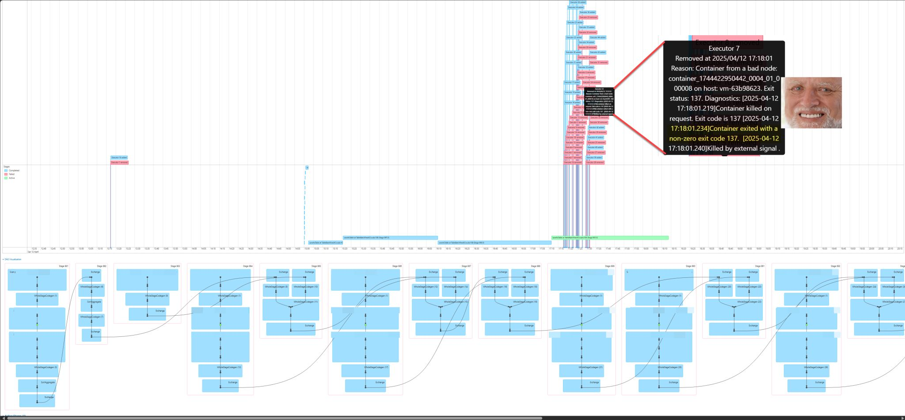
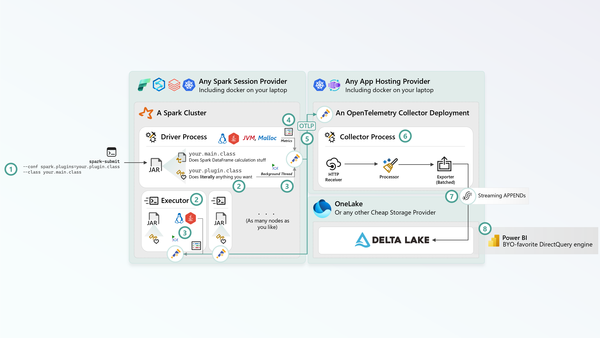
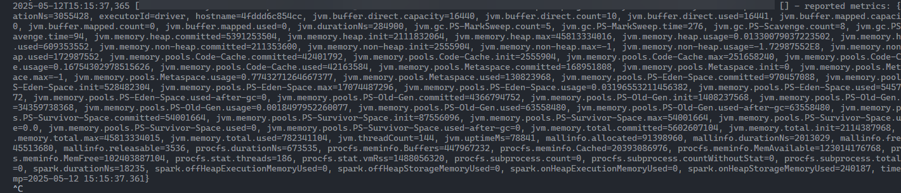
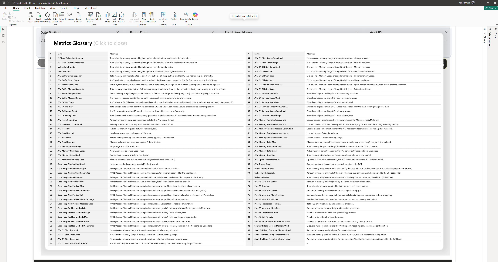
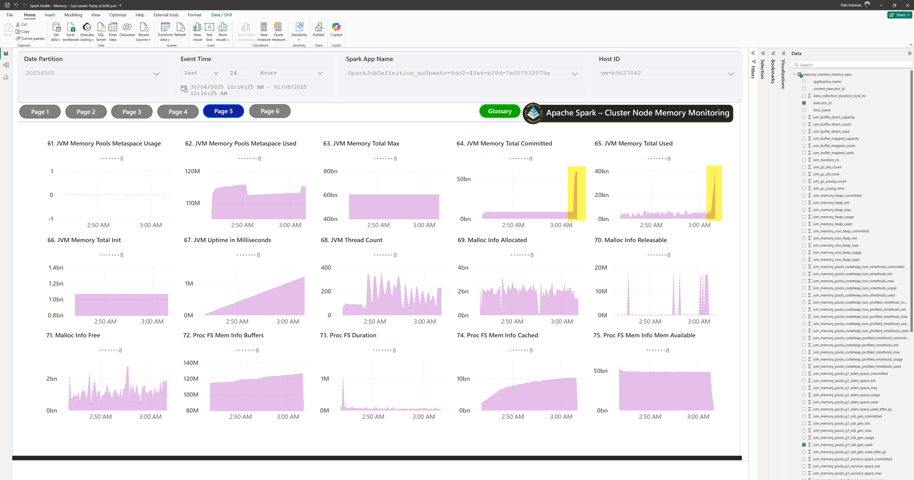
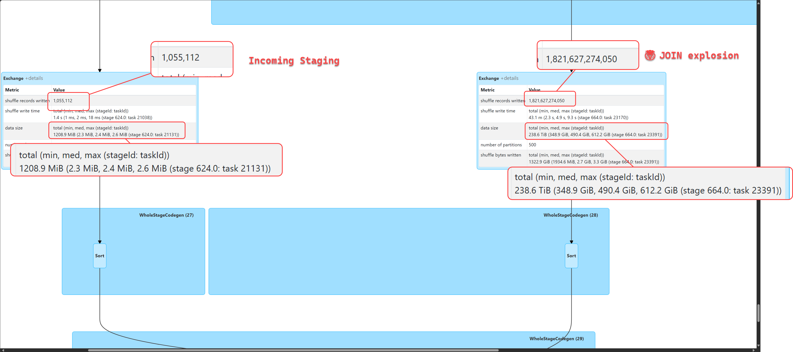
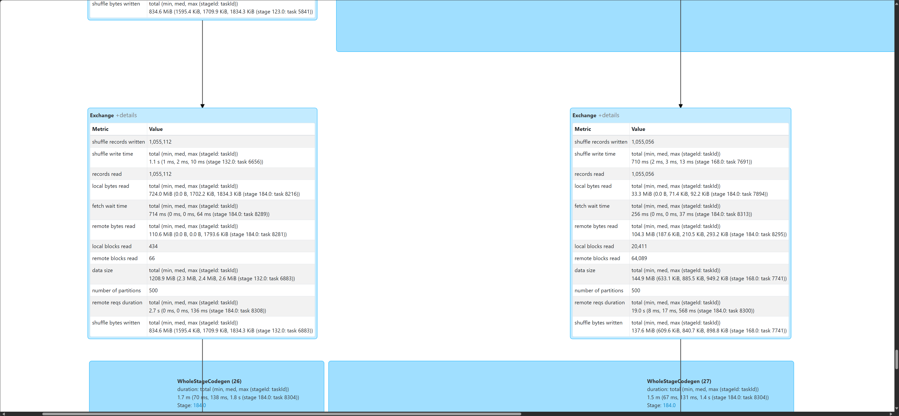

import { Callout } from "../../src/components/atoms.js"
import { ExtLink, InlinePageLink } from "../../src/components/atoms.js"

I've been using Spark since 2017, and [Spark Plugins](https://spark.apache.org/docs/latest/api/java/org/apache/spark/api/plugin/SparkPlugin.html) are hands down THE most flexible programmatic interface that I only very recently learnt about.

I went down this rabbit hole while looking into a "memory leak" in one of our heavy-duty production jobs that's been plaguing me for weeks in a `JOIN`-heavy job:



The problem with the Spark Web UI above is, it doesn't give you a time-series view of the memory usage of each of the nodes and granular time-series metrics. You only find out **when** a stage-crashed, but not **why**. Spark logs don't really help, all you see before the executor death is [MemoryManager.scala](https://github.com/apache/spark/blob/master/core/src/main/scala/org/apache/spark/memory/MemoryManager.scala) frantically spilling to disk, until the OS gets `OOMKILLED` by your Cloud Provider's Cluster Manager.

This means you need some sort of a profiling mechanism that lets you see exactly what's happening at the OS of each nodes in the cluster that's causing the agonizing death of your ETL pipelines.

The Rolls-Royce of observability is [OpenTelemetry](https://opentelemetry.io/), so I wanted to figure out how to instrument all nodes in Spark with it, just like I'd instrument any C#/Go/Java application. Since Spark is just a big old Scala application, it should be possible.

<Callout>

🧠 After studying my Power BI report below, I instantly learnt that Spark - in fact - does **not** have a memory leak bug, the problem here was actually [PEBCAK](https://en.wiktionary.org/wiki/PEBCAK): I had an `INNER JOIN` key explosion that was solved by switching to [`LEFT SEMI JOIN`](https://rockthejvm.com/articles/all-the-joins-in-spark-dataframes#join-type-3-semi-joins).

The point I'm trying to make though, is that Power BI report below allowed me to get crystal clear insights within 5 minutes because I could literally track whatever I want, something that I would never be able to do with Spark logs or Web UI.

</Callout>

## Architecture



1. Use `spark.plugins=your.plugin.class` config to pass a class you wrote that implements the [SparkPlugin.java](https://github.com/apache/spark/blob/master/core/src/main/java/org/apache/spark/api/plugin/SparkPlugin.java) `interface`. For example, [Spark Connect is a plugin](https://github.com/apache/spark/blob/37028fafc4f9fc873195a88f0840ab69edcf9d2b/sql/connect/server/src/main/scala/org/apache/spark/sql/connect/SparkConnectPlugin.scala), [here's](https://github.com/apache/spark/blob/37028fafc4f9fc873195a88f0840ab69edcf9d2b/bin/spark-connect-shell#L26) how it's initialized. You can initialize the same class on both the Driver and the Executors.
2. `your.plugin.class` will get a callback on the `init` method on [`DriverPlugin`](https://github.com/apache/spark/blob/37028fafc4f9fc873195a88f0840ab69edcf9d2b/core/src/main/java/org/apache/spark/api/plugin/DriverPlugin.java#L53) and [`ExecutorPlugin`](https://github.com/apache/spark/blob/37028fafc4f9fc873195a88f0840ab69edcf9d2b/core/src/main/java/org/apache/spark/api/plugin/ExecutorPlugin.java#L49). You will also have access to the Spark Conf via [`PluginContext.conf()`](https://github.com/apache/spark/blob/37028fafc4f9fc873195a88f0840ab69edcf9d2b/core/src/main/java/org/apache/spark/api/plugin/PluginContext.java#L51C13-L51C17).
  
  So that means, at this point, if you spinup a [background daemon thread](https://docs.oracle.com/javase/8/docs/api/java/lang/Thread.html) before you leave `init`, you can literally do whatever you want from now onwards 😁 - things like making outbound HTTP calls, probing memory, hosting a silly REST API or anything else - you have access to everything in Spark Conf Key:Value pairs, meaning you can authenticate with Azure resources etc with Entra ID.
    
3. Spin up a background daemon thread that probes various sources of memory from the JVM, Spark, Linux Operating System, and more.
4. Have the thread receive the `Metrics` into a nice giant class to send as a single time-series data point.
5. Send those `Metrics` as an [OpenTelemetry Metric](https://opentelemetry.io/docs/specs/otel/metrics/#programming-model) to an HTTP endpoint where you have your [OpenTelemetry Collector](https://opentelemetry.io/docs/collector/installation/) hosted (it could be locally on your laptop, or a Kubernetes Cluster for Production).
6. Use the OpenTelemetry Collector to do ["collector things"](https://opentelemetry.io/docs/collector/architecture/) - like pre-processing, enriching, obfuscating etc.
7. Use an [OpenTelemetry Exporter](https://github.com/open-telemetry/opentelemetry-collector-contrib/tree/main/exporter) to export to Delta Lake (there's nothing out there for Delta, but building your own Exporter is [trivial](https://github.com/mdrakiburrahman/go-playground/blob/main/opentelemetry-collector-raki/emptyexporter/exporter.go) - and you can use this [Go SDK for Delta Lake](https://github.com/rivian/delta-go)).
8. Throw Power BI on top of the ever-growing Delta Lake tables, potentially using Fabric SQL, [Eventhouse Query Acceleration](https://blog.fabric.microsoft.com/en-us/blog/announcing-query-acceleration-for-onelake-shortcuts-public-preview) or some non-Fabric query engine that's good at querying Delta (e.g. for local development, [DuckDB](https://duckdb.org/2025/03/21/maximizing-your-delta-scan-performance.html) works great).

That's pretty much it. Now all you have to do is code up whatever you feel like collecting in Step `3` and `4`, and represent it in the OpenTelemetry `Metric` format.

## A primer on Spark Plugins

The resource I studied to "grok" Spark Plugins was [this amazing blog](https://blog.madhukaraphatak.com/categories/spark-plugin/) that talks about everything you can do with a Spark Plugin. If you read through the 5 blogs in their website, you'll have a clear understanding of what Spark Plugins can do (including initiating [custom RPC communication between `Executor <> Driver`](https://blog.madhukaraphatak.com/spark-plugin-part-5)).

From there, you can fork and build these toy plugins locally as inspiration:

1. [Various examples from the blog](https://github.com/phatak-dev/spark-3.0-examples/tree/master/src/main/scala/com/madhukaraphatak/spark/core/plugins) - I'd recommend starting with the simple [`CustomDriverPlugin`](https://github.com/phatak-dev/spark-3.0-examples/blob/master/src/main/scala/com/madhukaraphatak/spark/core/plugins/driverplugin/CustomDriverPlugin.scala) that basically listens on a socket.
2. Next, check out some of the entertaining plugins a Spark Enthusiast at CERN - [Luca Canali](https://github.com/LucaCanali) - maintains [here](https://github.com/cerndb/SparkPlugins/tree/master/src/main/scala/ch/cern). The [`RunOsCommandPlugin.scala`](https://github.com/cerndb/SparkPlugins/blob/master/src/main/scala/ch/cern/RunOSCommandPlugin.scala) got my creative juices flowing, because I realized you can literally do whatever you want (including running `bash` scripts from Scala!)

<Callout>

😞 It's a shame Spark Plugins are not widely advertised in the web (probably because it's only available in Scala).

</Callout>

## Instrumenting Memory on a Linux JVM

In my case, what I decided to do was register with [Spark's `registerMetrics`](https://github.com/apache/spark/blob/37028fafc4f9fc873195a88f0840ab69edcf9d2b/core/src/main/java/org/apache/spark/api/plugin/DriverPlugin.java#L73C16-L73C31):

```java
  /**
   * Register metrics published by the plugin with Spark's metrics system.
   * <p>
   * This method is called later in the initialization of the Spark application, after most
   * subsystems are up and the application ID is known. If there are metrics registered in
   * the registry ({@link PluginContext#metricRegistry()}), then a metrics source with the
   * plugin name will be created.
   * <p>
   * Note that even though the metric registry is still accessible after this method is called,
   * registering new metrics after this method is called may result in the metrics not being
   * available.
   *
   * @param appId The application ID from the cluster manager.
   * @param pluginContext Additional plugin-specific about the Spark application where the plugin
   *                      is running.
   */
  default void registerMetrics(String appId, PluginContext pluginContext) {}
```

Like this:

```scala
import org.apache.spark.api.plugin.{PluginContext, SparkPlugin}

object OpenTelemetryPlugin extends SparkPlugin {

  def registerMetrics(ctx: PluginContext): Unit = ctx.metricRegistry.registerAll(new OpenTelemetryMetricSet)

}
```

In Spark documentation's [Advanced instrumentation](https://spark.apache.org/docs/latest/monitoring.html#advanced-instrumentation) it mentions Spark uses the [Dropwizard metrics library](https://metrics.dropwizard.io/4.2.0/) - this is also obvious when you look at [Spark source code](https://github.com/search?q=repo%3Aapache%2Fspark%20%22com.codahale.metrics%22&type=code).

Here, `OpenTelemetryMetricSet` is basically an implementation of [`MetricSet`](https://github.com/dropwizard/metrics/blob/release/4.2.x/metrics-core/src/main/java/com/codahale/metrics/MetricSet.java):

```scala
package your.plugin.opentelemetry.metrics

import java.util.HashMap

import com.codahale.metrics.{Metric, MetricSet}

/** Provides a complete set of metrics related to monitoring Spark via OpenTelemetry.
  */
class OpenTelemetryMetricSet extends MetricSet {

  /** Returns a map of metrics to be monitored.
    *
    * @return
    *   A map of metric names to their corresponding Metric objects.
    */
  override def getMetrics: HashMap[String, Metric] = {

    val metrics = new HashMap[String, Metric]

    // Use `metrics.put("your-key", new YourMetric)` to track anything as a Metric you want!

    metrics

  }
}
```

The final piece of the puzzle is specifying a [sink config](https://spark.apache.org/docs/latest/monitoring.html#metrics) as part of this [Sink trait](https://github.com/apache/spark/blob/master/core/src/main/scala/org/apache/spark/metrics/sink/Sink.scala), which is where Spark will call back your code periodically to Sink wherever you want (like an OpenTelemetry HTTP endpoint).

```scala
package your.plugin.opentelemetry.metrics

import java.util.Properties

import com.codahale.metrics.MetricRegistry
import your.plugin.opentelemetry.metrics.OpenTelemetryReporter

import org.apache.spark.metrics.sink.Sink

/** A custom implementation of the Spark Metrics [[Sink]] for OpenTelemetry usage.
  *
  * This class must be specified as part of in order to eagerly begin pushing
  * metrics.
  *
  *   - `spark.metrics.conf.*.sink.<sinkNameThatDoesNotHaveToExist>.class`
  *
  * @param property
  *   A [[Properties]] object containing configuration properties.
  * @param registry
  *   A [[MetricRegistry]] instance used to register and manage metrics.
  */
class OpenTelemetrySink(val property: Properties, val registry: MetricRegistry) extends Sink {

  private val reporter = new OpenTelemetryReporter(registry)
  override def start(): Unit = reporter.start()
  override def stop(): Unit = reporter.stop()
  override def report(): Unit = reporter.report()

}
```

## Sending to OpenTelemetry

This step is implementation specific, which is where we need to take those `Metrics` and send it to OpenTelemetry. I won't go into the details here since it's not relevant for this discussion (it's a whole wonderful world of OpenTelemetry SDKs and Protobuf bindings). 

<Callout>

😎 But if you're interested, [this reverted PR](https://github.com/apache/spark/pull/47763/files) in Spark source code has everything you need to convert `codehale` Metrics into OpenTelemetry.

</Callout>


## Examining Heap Dump Data as a time-series with hprof-slurp

Remember how I said you can literally do anything you want in a Spark Plugin?

That includes taking a heap dump when your Executor is close to dying at 95% heap memory with [`jmap -dump`](https://docs.oracle.com/en/java/javase/17/docs/specs/man/jmap.html) to generate an [`hprof` (heap allocation profile)](https://docs.oracle.com/javase/8/docs/technotes/samples/hprof.html) file.

You can use [`mssparkutils`](https://learn.microsoft.com/en-us/fabric/data-engineering/microsoft-spark-utilities) to copy the dump into OneLake/ADLS etc, download it on your laptop, then use this awesome Rust based heap dump analyzer called [`hprof-slurp`](https://github.com/agourlay/hprof-slurp) to analyze what's using up all your memory.

![This is what a JOIN explosion looks like, where you hold on to 31 GB of byte[] on the heap](images/hprof-slurp.png)

<Callout>

🤜🤛 The author [added JSON output support at my request](https://github.com/agourlay/hprof-slurp/issues/248).

</Callout>


## What the collected data looks like

Running the plugin locally and logging to console, we see a glob of JSON, like this:



And as far as observability goes, this contains pretty much everything you'll ever dream of to monitor memory usage of anything running on a JVM - including Spark 🙂

```json
{
   "durationNs":"3055428",
   "executorId":"driver",
   "hostname":"4fddd6c854cc",
   "jvm.buffer.direct.capacity":"16440",
   "jvm.buffer.direct.count":"10",
   "jvm.buffer.direct.used":"16441",
   "jvm.buffer.mapped.capacity":"0",
   "jvm.buffer.mapped.count":"0",
   "jvm.buffer.mapped.used":"0",
   "jvm.durationNs":"284900",
   "jvm.gc.PS-MarkSweep.count":"5",
   "jvm.gc.PS-MarkSweep.time":"276",
   "jvm.gc.PS-Scavenge.count":"8",
   "jvm.gc.PS-Scavenge.time":"94",
   "jvm.memory.heap.committed":"5391253504",
   "jvm.memory.heap.init":"2111832064",
   "jvm.memory.heap.max":"45813334016",
   "jvm.memory.heap.usage=0":"01330079037223502",
   "jvm.memory.heap.used":"609353552",
   "jvm.memory.non-heap.committed":"211353600",
   "jvm.memory.non-heap.init":"2555904",
   "jvm.memory.non-heap.max=":"1",
   "jvm.memory.non-heap.usage=-1":"72987552E8",
   "jvm.memory.non-heap.used":"172987552",
   "jvm.memory.pools.Code-Cache.committed":"42401792",
   "jvm.memory.pools.Code-Cache.init":"2555904",
   "jvm.memory.pools.Code-Cache.max":"251658240",
   "jvm.memory.pools.Code-Cache.usage=0":"16754302978515626",
   "jvm.memory.pools.Code-Cache.used":"42163584",
   "jvm.memory.pools.Metaspace.committed":"168951808",
   "jvm.memory.pools.Metaspace.init":"0",
   "jvm.memory.pools.Metaspace.max=":"1",
   "jvm.memory.pools.Metaspace.usage=0":"7743271264667377",
   "jvm.memory.pools.Metaspace.used":"130823968",
   "jvm.memory.pools.PS-Eden-Space.committed":"970457088",
   "jvm.memory.pools.PS-Eden-Space.init":"528482304",
   "jvm.memory.pools.PS-Eden-Space.max":"17074487296",
   "jvm.memory.pools.PS-Eden-Space.usage=0":"03196553211456382",
   "jvm.memory.pools.PS-Eden-Space.used":"545795072",
   "jvm.memory.pools.PS-Eden-Space.used-after-gc":"0",
   "jvm.memory.pools.PS-Old-Gen.committed":"4366794752",
   "jvm.memory.pools.PS-Old-Gen.init":"1408237568",
   "jvm.memory.pools.PS-Old-Gen.max":"34359738368",
   "jvm.memory.pools.PS-Old-Gen.usage=0":"0018497952260077",
   "jvm.memory.pools.PS-Old-Gen.used":"63558480",
   "jvm.memory.pools.PS-Old-Gen.used-after-gc":"63558480",
   "jvm.memory.pools.PS-Survivor-Space.committed":"54001664",
   "jvm.memory.pools.PS-Survivor-Space.init":"87556096",
   "jvm.memory.pools.PS-Survivor-Space.max":"54001664",
   "jvm.memory.pools.PS-Survivor-Space.usage=0":"0",
   "jvm.memory.pools.PS-Survivor-Space.used":"0",
   "jvm.memory.pools.PS-Survivor-Space.used-after-gc":"0",
   "jvm.memory.total.committed":"5602607104",
   "jvm.memory.total.init":"2114387968",
   "jvm.memory.total.max":"45813334015",
   "jvm.memory.total.used":"782341104",
   "jvm.threadCount":"144",
   "jvm.uptimeMs":"78841",
   "mallinfo.allocated":"91398960",
   "mallinfo.durationNs":"2013029",
   "mallinfo.free":"145513680",
   "mallinfo.releasable":"3536",
   "procfs.durationNs":"673535",
   "procfs.meminfo.Buffers":"447967232",
   "procfs.meminfo.Cached":"20393086976",
   "procfs.meminfo.MemAvailable":"123014176768",
   "procfs.meminfo.MemFree":"102403887104",
   "procfs.stat.threads":"186",
   "procfs.stat.vmRss":"1488056320",
   "procfs.subprocess.count":"0",
   "procfs.subprocess.countWithoutStat":"0",
   "procfs.subprocess.totalRss":"0",
   "spark.durationNs":"18235",
   "spark.offHeapExecutionMemoryUsed":"0",
   "spark.offHeapStorageMemoryUsed":"0",
   "spark.onHeapExecutionMemoryUsed":"0",
   "spark.onHeapStorageMemoryUsed":"240187",
   "timestamp=2025-05-12 15:15:37":"36"
}
```

## Power BI Real-time Report

And finally, for the crème de la crème, we have a little "Data Dictionary" for the `Metrics` above (there's so much being tracked, I forgot what I was tracking):



And the real-time report:


<Callout>

📝 If you partition your Delta tables against time grain, and also with the Spark Job definition as a partition column, the report can be quite fast with [`DirectQuery`](https://learn.microsoft.com/en-us/fabric/fundamentals/direct-lake-overview#considerations-and-limitations).

</Callout>

In particular, this is what the `JOIN` key explosion looks like:



The moment I saw that spike, I realized this cannot be a memory leak (leaks happen gradually when someone forgot to return the memory to [malloc](https://learn.microsoft.com/en-us/cpp/c-runtime-library/reference/malloc?view=msvc-170) - that's not what's happening here), but rather, something to do with my actual data sizes at a particular Stage of the Spark Job. 

## Conclusion

Looking at the query plan at around the time the memory exploded, I saw this craziness:



After finding the part of the code that corresponded to this Stage, I switched to `LEFT SEMI JOIN` in a tiny change, and all my problems went away:



---

I'll never have to be worried about `ERROR 137/143` in Spark again - which if you've used Spark in production, is the most (and probably only) painful error - thanks to this OpenTelemetry plugin.

Observability for the win!