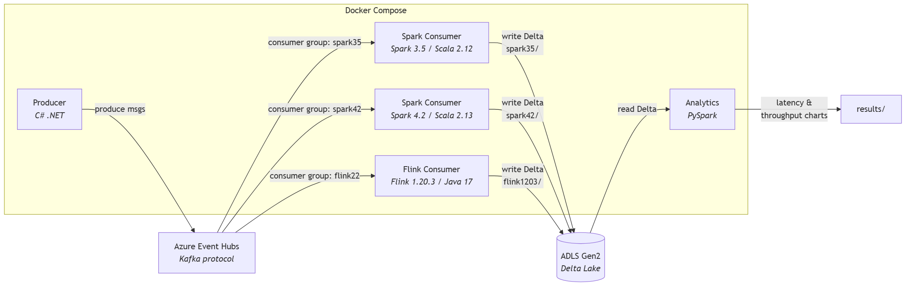
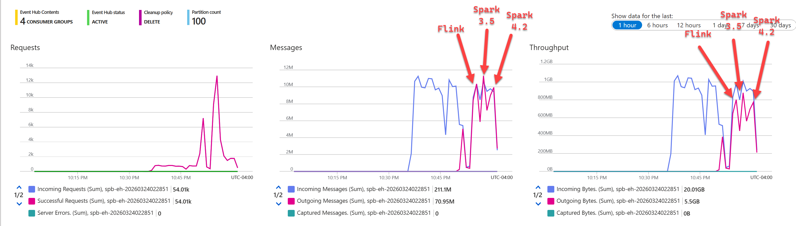

import { Callout } from "../../src/components/atoms.js"
import { ExtLink, InlinePageLink } from "../../src/components/atoms.js"

Apache Spark is out to get Apache Flink's lunch money:


(At least that's what the recent marketing buzz would have you believe).

With [Spark Real-Time Mode](https://issues.apache.org/jira/browse/SPARK-52330) building hype around the industry with [O(100) millisecond](https://www.databricks.com/blog/breaking-microbatch-barrier-architecture-apache-spark-real-time-mode) latency, I wanted to see if streaming into Delta Lake got any faster with Real-Time mode compared to Spark 3.5 Structured Streaming's Microbatch.

It turns out RTM didn't make writing Delta Lake any faster (yet), because:

1. Spark 4.2 RTM has a [hardcoded list of sinks](https://github.com/apache/spark/blob/master/sql/core/src/main/scala/org/apache/spark/sql/execution/streaming/runtime/RealTimeModeAllowlist.scala#L27C8-L27C30) it supports currently, Delta Lake isn't part of that list.
2. OSS Delta Lake implements still only implements [`addBatch`](https://github.com/delta-io/delta/blob/887ca8431b6ac76541ad8f04a48e54e3a0fbe9c8/spark/src/main/scala/org/apache/spark/sql/delta/sources/DeltaSink.scala#L108), which doesn't work with RTM.

The `O(100)` millisecond number being thrown around is from records read from Kafka and written back to Kafka. End-to-end latency is measured per row as the difference between the WAL append time at the sink and the WAL append time at the source - see [source](https://www.linkedin.com/feed/update/urn:li:activity:7440500399029145600?commentUrn=urn%3Ali%3Acomment%3A%28activity%3A7440500399029145600%2C7440519075396599808%29&replyUrn=urn%3Ali%3Acomment%3A%28activity%3A7440500399029145600%2C7440529184168321025%29&dashCommentUrn=urn%3Ali%3Afsd_comment%3A%287440519075396599808%2Curn%3Ali%3Aactivity%3A7440500399029145600%29&dashReplyUrn=urn%3Ali%3Afsd_comment%3A%287440529184168321025%2Curn%3Ali%3Aactivity%3A7440500399029145600%29).

With some mileage under my belt these days on [high-throughput 27 GB/min Kafka to Delta Lake streaming](https://www.rakirahman.me/delta-dotnet/) running in Production, I wanted to throw together a well-tuned and rapidly reproducible benchmark to see how hard I could push these JVM-based engines:



<Callout>

🤖 I used a [Ralph loop](https://awesomeclaude.ai/ralph-wiggum) to tune the JVM across all engines - see [here](https://github.com/mdrakiburrahman/stream-processing-benchmark/blob/main/.github/skills/README.md). 

Even with AI, it was really hard getting Flink to work with a Delta Lake sink, Spark, as usual, was easy. 

But when Flink starts ripping, it rips hard!

</Callout>

For producers - we have a C# app [here](https://github.com/mdrakiburrahman/stream-processing-benchmark/blob/d5954f06e575737e2167c2eb91e38df5d035d5f3/src/containers/producer-csharp/Program.cs#L79) that aggressively sends JSON messages across all threads:

```text
producer-csharp-1  | Starting producer with 4 cores targeting 'benchmark'
producer-csharp-1  | [Stats] Total sent: 1,482,127 | Last 10s: 147,118 msg/s | Overall: 147,118 msg/s
producer-csharp-1  | [Stats] Total sent: 3,303,331 | Last 10s: 181,871 msg/s | Overall: 164,442 msg/s
producer-csharp-1  | [Stats] Total sent: 5,109,863 | Last 10s: 180,304 msg/s | Overall: 169,720 msg/s
producer-csharp-1  | [Stats] Total sent: 7,002,626 | Last 10s: 189,034 msg/s | Overall: 174,541 msg/s
producer-csharp-1  | [Stats] Total sent: 8,854,538 | Last 10s: 184,889 msg/s | Overall: 176,608 msg/s
producer-csharp-1  | [Stats] Total sent: 10,733,684 | Last 10s: 185,496 msg/s | Overall: 178,102 msg/s
producer-csharp-1  | [Stats] Total sent: 12,531,128 | Last 10s: 179,279 msg/s | Overall: 178,270 msg/s
producer-csharp-1  | [Stats] Total sent: 14,301,338 | Last 10s: 177,057 msg/s | Overall: 178,119 msg/s
producer-csharp-1  | [Stats] Total sent: 16,112,399 | Last 10s: 181,034 msg/s | Overall: 178,442 msg/s
producer-csharp-1  | [Stats] Total sent: 17,991,545 | Last 10s: 186,934 msg/s | Overall: 179,292 msg/s
producer-csharp-1  | [Stats] Total sent: 19,611,968 | Last 10s: 161,880 msg/s | Overall: 177,713 msg/s
producer-csharp-1  | [Stats] Total sent: 21,164,306 | Last 10s: 155,233 msg/s | Overall: 175,845 msg/s
```

For consumers, since Spark flushes to Delta Lake after each Microbatch, the best case latency you get is about 2 seconds (end of Microbatch), with worst case getting around 15 seconds (start of Microbatch) - in a saw-toothed pattern. 
Flink is significantly more stable at ~1 second latency:


And here's Event Hub's point of View:



Latecy average:

* Spark 4.2: 7.15 seconds
* Spark 3.5: 6.59 seconds
* Flink 1.16: 0.81 seconds

With all 3 engines not breaking a sweat with the consumer throughput of roughly 180K messages/s - I'm pretty sure we can push a lot higher.

---

The benchmark is fully automated and takes 3 minutes to setup from scratch. All you need is Docker Desktop for the Stream Porcessing engines and an Azure Subscription for Event Hub and Storage Account - see [here](https://github.com/mdrakiburrahman/stream-processing-benchmark).

Feel free to try it and raise any issues/PRs if you happen to know something about Spark Microbatch Streaming on how to make it rip into Delta Lake any faster with the same throughput.

I look forward to repeating this as soon as RTM is available for Delta Lake in Spark 4.2+!