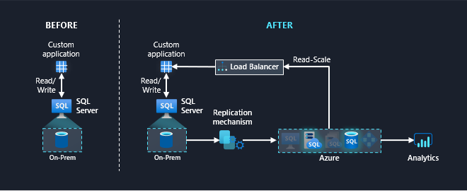
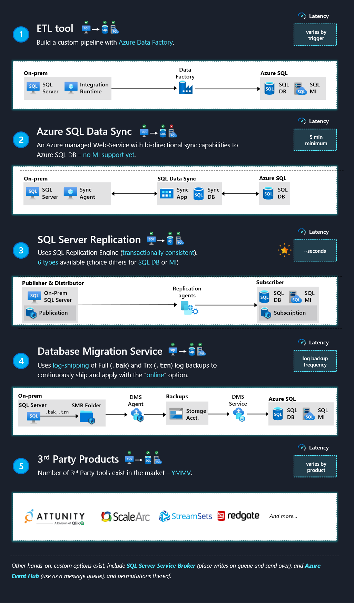
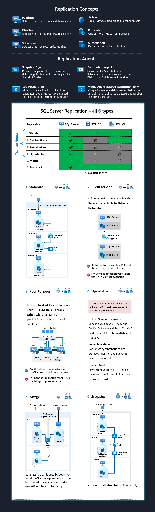
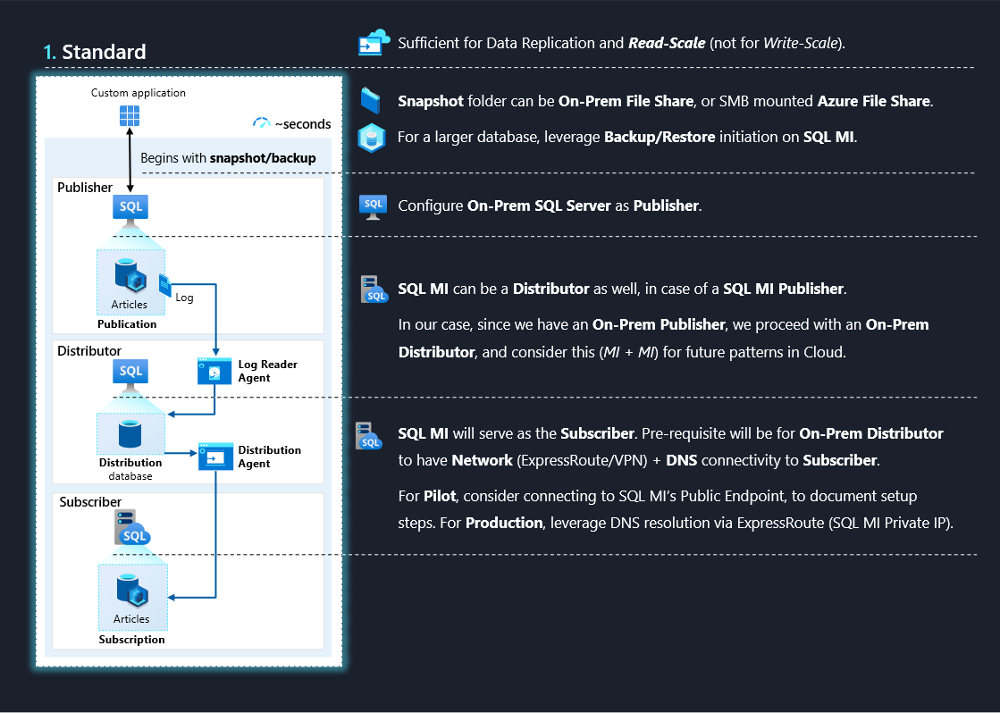

import { Callout } from "../../src/components/atoms.js"
import { ExtLink, InlinePageLink } from "../../src/components/atoms.js"

A standard use case for enabling read-scale and [real-time analytics](https://youtu.be/ua10DE4TVcw?t=36) without further taxing the infrastructure of an On-Premises SQL Server involves data replication to [Azure's SQL offerings](https://docs.microsoft.com/en-us/azure/azure-sql/azure-sql-iaas-vs-paas-what-is-overview).

Some standard requirements for this setup might include:

1. Support **older On-Prem SQL Server** versions as the data source (say SQL Server 2012 SP3)
2. Minimize replication **latency** as much as possible
3. Leverage a **managed service** for the secondary replica

Considering these requirements, we could leverage [Azure SQL DB](https://docs.microsoft.com/en-us/azure/azure-sql/database/sql-database-paas-overview) or [Azure SQL MI](https://docs.microsoft.com/en-us/azure/azure-sql/managed-instance/sql-managed-instance-paas-overview) as managed services to host our secondary replica.

The setup would look something like this:

### Replication mechanism: overview of available options

The next step is to align on the **replication mechanism** - where we have several routes to achieving the same end goal of populating our secondary replica.

<Callout>

🐱‍💻 The diagram below is a visual summary of a subset of the options presented in this [excellent article](https://www.jamesserra.com/archive/2021/01/syncing-sql-databases/) by James Serra.

</Callout>

<Callout>

💡 For more information on each of these options, check out the tutorials below:

1. [Copy data to and from SQL Server by using **Azure Data Factory**
   ](https://docs.microsoft.com/en-us/azure/data-factory/connector-sql-server)
2. [Set up **SQL Data Sync** between databases in Azure SQL Database and SQL Server](https://docs.microsoft.com/en-us/azure/azure-sql/database/sql-data-sync-sql-server-configure)
3. [**SQL Server Replication**](https://docs.microsoft.com/en-us/sql/relational-databases/replication/sql-server-replication?view=sql-server-ver15)
4. [Migrate SQL Server to an Azure SQL Managed Instance online using **Database Migration Service**](https://docs.microsoft.com/en-us/azure/dms/tutorial-sql-server-managed-instance-online)

</Callout>

### SQL Server Replication

**SQL Server Replication** is a robust feature offered natively as part of the core SQL Server Engine - generally offering the least replication latency from our options above.

There are **6** flavors to choose from when configuring SQL Server replication, each slightly catering to different use cases. The diagram below provides a bird's eye view of each:

<Callout>

💡 While **Standard** - as the name suggests - is the most straightforward option (specially for POCs), for more nuanced use-cases there's a bit of a learning curve to align on the most suitable option.

A great place to start is the detailed documentation on each of these 6 options:

1. [Standard - Transactional](https://docs.microsoft.com/en-us/sql/relational-databases/replication/transactional/transactional-replication?view=sql-server-ver15)
2. [Bidirectional - Transactional](https://docs.microsoft.com/en-us/sql/relational-databases/replication/transactional/bidirectional-transactional-replication?view=sql-server-ver15)
3. [Peer-to-Peer - Transactional](https://docs.microsoft.com/en-us/sql/relational-databases/replication/transactional/peer-to-peer-transactional-replication?view=sql-server-ver15)
4. [Updatable Subscriptions - Transactional](https://docs.microsoft.com/en-us/sql/relational-databases/replication/transactional/updatable-subscriptions-for-transactional-replication?view=sql-server-ver15)
5. [Merge](https://docs.microsoft.com/en-us/sql/relational-databases/replication/merge/merge-replication?view=sql-server-ver15)
6. [Snapshot](https://docs.microsoft.com/en-us/sql/relational-databases/replication/snapshot-replication?view=sql-server-ver15)

</Callout>

### Sample implementation: Standard Replication with SQL MI

A sample implementation could choose to proceed with say, SQL MI for a 1:1 replication from SQL Server, while leveraging **Standard Transactional Replication**:

From a security perspective, we'd want to restrict replication traffic to our private network - specially for **Production**. For this we'd need to implement:

- [**ExpressRoute/VPN**](https://docs.microsoft.com/en-us/azure/azure-sql/managed-instance/connectivity-architecture-overview#high-level-connectivity-architecture) - so the replication traffic flows from our On-Prem SQL Server into SQL MI's Virtual Network through private channels
- We'd also need to configure [**DNS resolution**](https://docs.microsoft.com/en-us/azure/azure-sql/managed-instance/replication-two-instances-and-sql-server-configure-tutorial#create-a-private-dns-zone), so that the SQL Instance FQDN resolves to the Private IP (i.e. via the routes we enabled through ExpressRoute/VPN)

For **Development/POC** purposes, we can choose to leverage the [SQL MI's Public Endpoint](https://docs.microsoft.com/en-us/azure/azure-sql/managed-instance/public-endpoint-configure#enabling-public-endpoint-for-a-managed-instance-in-the-azure-portal), using the [NSG available as part of SQL MI](https://docs.microsoft.com/en-us/azure/azure-sql/managed-instance/connectivity-architecture-overview#mandatory-inbound-security-rules-with-service-aided-subnet-configuration) to only accept traffic from our On-Prem SQL Server's [Public IP](https://www.whatismyip.com/).

The idea here is to document the specific steps/configurations required up front, and generating [Replication Scripts](https://docs.microsoft.com/en-us/sql/relational-databases/replication/scripting-replication?view=sql-server-ver15#script-replication-objects) in Development that we can localize and apply to Production.

For larger databases, we might also want to kickstart the replication process using [Backup & Restore](https://docs.microsoft.com/en-us/sql/relational-databases/replication/initialize-a-transactional-subscription-without-a-snapshot?view=sql-server-ver15), which could be faster than initializing through the [Snapshot Agent](https://docs.microsoft.com/en-us/sql/relational-databases/replication/create-and-apply-the-initial-snapshot?view=sql-server-ver15) (which actually uses [`bcp`](https://docs.microsoft.com/en-us/sql/relational-databases/replication/agents/replication-snapshot-agent?view=sql-server-ver15) to generate snapshots). We can utilize the method outlined [here](https://docs.microsoft.com/en-us/azure/azure-sql/managed-instance/restore-sample-database-quickstart) to restore a SQL Server Backup File onto SQL MI.
