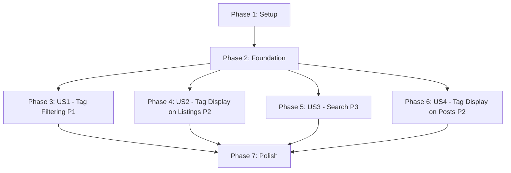

# Tasks: Blog Tag Filtering and Search

**Input**: Design documents from `/specs/001-tag-filter-search/`
**Prerequisites**: plan.md (required), spec.md (required for user stories)

**Tests**: No tests requested in specification - implementation only

**Organization**: Tasks are grouped by user story to enable independent implementation and testing of each story.

## Format: `[ID] [P?] [Story] Description`

- **[P]**: Can run in parallel (different files, no dependencies)
- **[Story]**: Which user story this task belongs to (e.g., US1, US2, US3, US4)
- Include exact file paths in descriptions

## Path Conventions

**Single project**: `src/`, at repository root (Gatsby static site)

---

## Phase 1: Setup (Shared Infrastructure)

**Purpose**: No special setup needed - using existing Gatsby project structure

- [X] T001 Verify Gatsby development environment with `gatsby develop` and ensure localhost:8000 loads

---

## Phase 2: Foundational (Blocking Prerequisites)

**Purpose**: Core reusable components that MUST be complete before ANY user story can be implemented

**⚠️ CRITICAL**: No user story work can begin until this phase is complete

- [X] T002 [P] Create TagBadge component in src/components/atoms.js with props: name, count (optional), selected (default false), clickable (default false), onClick (optional)
- [X] T003 [P] Add pill shape styling to TagBadge using Tailwind utilities with var(--color-bg-secondary), var(--color-text-secondary), var(--color-text-accent)
- [X] T004 [P] Implement TagBadge selected state with background (var(--color-bg-accent)) and border (var(--color-text-accent))
- [X] T005 [P] Add TagBadge non-clickable variant with no hover effects and muted appearance
- [X] T006 [P] Make TagBadge responsive with text-sm on mobile and text truncation for long names
- [X] T007 [P] Create src/assets/css/tags.css with .tag-filter-bar, .tag-badge, .tag-badge-selected, .tag-scroll-container classes
- [X] T008 [P] Add horizontal scroll styling to .tag-scroll-container with -webkit-overflow-scrolling: touch and custom scrollbar (4px height)
- [X] T009 [P] Import tags.css into src/assets/css/index.css or relevant component files

**Checkpoint**: Foundation ready - TagBadge component and styling available for all user stories

---

## Phase 3: User Story 1 - Tag-Based Content Filtering (Priority: P1) 🎯 MVP

**Goal**: Enable readers to filter blog posts by selecting one or multiple tags with OR logic

**Independent Test**: Visit homepage, click a tag to filter posts, click additional tags to add to filter (OR operation), click "Clear All" to reset

### Implementation for User Story 1

- [X] T010 [P] [US1] Create TagFilterBar component in src/components/tagFilterBar.js with props: tags (array), selectedTags (array), onTagToggle (function), onClearAll (function)
- [X] T011 [P] [US1] Implement TagFilterBar layout as horizontal flexbox with bg-secondary background, padding, and gap between tags
- [X] T012 [P] [US1] Render TagBadge for each tag in TagFilterBar showing "name (count)" format using clickable variant
- [X] T013 [P] [US1] Add "Clear All" button to TagFilterBar styled consistently, visible only when selectedTags.length > 0
- [X] T014 [P] [US1] Add horizontal overflow scroll to TagFilterBar with -webkit-overflow-scrolling: touch for many tags
- [X] T015 [US1] Add React.useState imports to src/components/postList.js for filter state management
- [X] T016 [US1] Add state to PostList: const [selectedTags, setSelectedTags] = React.useState([])
- [X] T017 [US1] Calculate unique tags from GraphQL data in PostList using reduce, count occurrences, sort by count descending
- [X] T018 [US1] Implement filter logic in PostList: filteredPosts = allPosts.filter with tag OR matching and de-duplication
- [X] T019 [US1] Import TagFilterBar component into PostList
- [X] T020 [US1] Render TagFilterBar in PostList after h2 "LATEST ARTICLES" and disclaimer, before ul of posts
- [X] T021 [US1] Pass props to TagFilterBar: unique tags sorted by count, selectedTags state, onTagToggle handler, onClearAll handler
- [X] T022 [US1] Implement onTagToggle handler in PostList to toggle tag in/out of selectedTags array
- [X] T023 [US1] Implement onClearAll handler in PostList to reset selectedTags to empty array
- [X] T024 [US1] Update PostList to render filteredPosts instead of all posts in the listings
- [X] T025 [US1] Add "No posts found. Try adjusting your filters." message when filteredPosts.length === 0 and filters active
- [X] T026 [US1] Handle edge case: posts with no tags use optional chaining tags?. and default to empty array
- [X] T027 [US1] Handle edge case: ensure tags with zero posts don't appear in tag bar (filter during tag calculation)
- [X] T028 [US1] Test tag bar displays correctly in both light and dark modes using appropriate color variables

**Checkpoint**: Tag filtering fully functional - readers can select multiple tags and filter posts with OR logic

---

## Phase 4: User Story 2 - Tag Display on Blog Listings (Priority: P2)

**Goal**: Show tags at bottom of each blog post preview on homepage for visual context

**Independent Test**: View homepage blog listings and verify tags appear at bottom of each post card with horizontal scroll for overflow

### Implementation for User Story 2

- [X] T029 [P] [US2] Modify Post component render in src/components/postList.js to extract tags from node.frontmatter
- [X] T030 [P] [US2] Add horizontal flex container at bottom of each Post component (after date) for tag display
- [X] T031 [P] [US2] Map over tags array and render TagBadge for each tag using non-clickable variant (no count)
- [X] T032 [P] [US2] Apply horizontal scroll CSS to tag container: overflow-x: auto with -webkit-overflow-scrolling: touch
- [X] T033 [P] [US2] Use subtle color for blog listing tags: var(--color-text-tertiary), smaller size than filter bar tags
- [X] T034 [P] [US2] Handle posts with no tags gracefully: don't render tag container at all (no empty placeholder)
- [X] T035 [P] [US2] Verify horizontal scroll works smoothly on mobile/touch devices for posts with many tags

**Checkpoint**: Tags visible on all blog listings providing visual context for post topics

---

## Phase 5: User Story 3 - Text Search for Content Discovery (Priority: P3)

**Goal**: Enable readers to search blog posts by keywords with real-time filtering

**Independent Test**: Type keywords in search bar and verify posts filter in real-time matchingon title/description/tags

### Implementation for User Story 3

- [X] T036 [P] [US3] Create SearchBar component in src/components/searchBar.js with props: value, onChange, placeholder
- [X] T037 [P] [US3] Style SearchBar with full-width input, subtle border, var(--color-bg-secondary) background, var(--color-text-primary) text
- [X] T038 [P] [US3] Add clear "X" button to SearchBar visible when value is not empty
- [X] T039 [P] [US3] Add accessibility attributes to SearchBar: proper label, aria attributes, keyboard navigation support
- [X] T040 [P] [US3] Make SearchBar responsive with appropriate padding for mobile/desktop viewports
- [X] T041 [US3] Add state to PostList: const [searchQuery, setSearchQuery] = React.useState('')
- [X] T042 [US3] Update filter logic in PostList to include search matching: case-insensitive search in title, description, excerpt, and tags array
- [X] T043 [US3] Implement combined filter logic: posts must match selectedTags (OR) AND searchQuery
- [X] T044 [US3] Handle special characters in search query safely using string.includes() (no regex to avoid escaping issues)
- [X] T045 [US3] Modify src/pages/index.js to import SearchBar component
- [X] T046 [US3] Render SearchBar in index.js at very top of page before Layout component
- [X] T047 [US3] Pass searchQuery state and setSearchQuery callback from PostList to SearchBar (lift state or pass callback)
- [X] T048 [US3] Position SearchBar with appropriate margin/padding for visual separation from header
- [X] T049 [US3] Update "No posts found" message to: "No posts found. Try adjusting your filters or search query."
- [X] T050 [US3] Verify search filters posts in real-time as user types (< 200ms response)

**Checkpoint**: Search functionality complete - readers can find posts by keywords combined with tag filters

---

## Phase 6: User Story 4 - Tag Display on Individual Blog Posts (Priority: P2)

**Goal**: Display tags in individual blog post headers after publication date for topic context

**Independent Test**: Open any blog post and verify tags appear in header after date with horizontal scroll for overflow

### Implementation for User Story 4

- [X] T051 [P] [US4] Add tags field to GraphQL query in src/components/postLayout.js frontmatter block: frontmatter { ... tags }
- [X] T052 [P] [US4] Extract tags from query result in postLayout component
- [X] T053 [P] [US4] Render tag container after BlogTitleInfo component (which shows date) in post header
- [X] T054 [P] [US4] Map over tags array and render TagBadge for each tag using non-clickable variant (no count)
- [X] T055 [P] [US4] Apply horizontal scroll CSS to tag container: single-line flexbox with overflow-x: auto
- [X] T056 [P] [US4] Use consistent styling with homepage tag displays (same TagBadge component and color variables)
- [X] T057 [P] [US4] Handle posts with no tags gracefully: don't render tag container (no empty placeholder)
- [X] T058 [P] [US4] Verify horizontal scroll works smoothly on mobile for posts with many tags

**Checkpoint**: Individual blog posts display tags in header providing immediate topic context

---

## Phase 7: Polish & Cross-Cutting Concerns

**Purpose**: Final validation, edge cases, performance, and browser compatibility

- [X] T059 [P] Verify all color schemes use CSS custom properties (no hardcoded colors) per constitution Principle II
- [X] T060 [P] Test tag selection responds within 100ms using browser DevTools Performance tab or console.time() to measure onClick to render time
- [X] T061 [P] Test search filtering responds within 200ms of keystroke using console.time() between input onChange and filteredPosts render
- [X] T062 [P] Verify horizontal scroll performance is smooth (60fps) on mobile devices
- [X] T063 [P] Test tag bar displays correctly on desktop viewport (1920px)
- [X] T064 [P] Test tag bar displays correctly on mobile viewport (375px)
- [X] T065 [P] Test all functionality in Chrome browser
- [X] T066 [P] Test all functionality in Firefox browser
- [X] T067 [P] Test all functionality in Safari browser
- [X] T068 [P] Test all functionality in Edge browser
- [X] T069 [P] Toggle dark/light mode and verify tag bar and tags use appropriate theme colors
- [X] T070 [P] Test selecting all available tags shows all posts with at least one tag
- [X] T071 [P] Test combining tag filter + search shows posts matching tags (OR) AND search (AND)
- [X] T072 [P] Search with special characters (!, @, #, $, %, etc.) and verify no JavaScript errors
- [X] T073 [P] Filter to zero results and verify "No posts found" message displays correctly
- [X] T074 [P] Verify post matching multiple selected tags appears only once (no duplication)
- [X] T075 [P] Test very long tag names display with text truncation and no layout breakage
- [X] T076 [P] Verify SearchBar has proper label and aria attributes for accessibility
- [X] T077 [P] Verify tag buttons have appropriate role and aria-pressed for selected state
- [X] T078 [P] Test keyboard navigation works (Tab, Enter, Escape)
- [X] T079 [P] Verify color contrast ratios meet WCAG AA standards
- [X] T080 [P] Run `gatsby build` and verify production build completes without errors
- [X] T081 [P] Run `gatsby serve` and test production site at localhost:9000
- [X] T082 [P] Verify no console errors or warnings in browser developer tools
- [X] T083 [P] Confirm no new npm dependencies added (constitutional constraint - Principle I)
- [X] T084 [P] Verify client-side filtering only, no server requirements (constitutional constraint - Principle III)

**Final Checkpoint**: Feature complete, tested, and ready for deployment

---

## Dependencies & Parallel Execution

### User Story Completion Order

### Parallel Execution Opportunities

**After Phase 2 (Foundation) is complete:**
- **Parallel Track 1**: US1 (Tag Filtering) - T010-T028
- **Parallel Track 2**: US2 (Tag Display on Listings) - T029-T035
- **Parallel Track 3**: US3 (Search) - T036-T050
- **Parallel Track 4**: US4 (Tag Display on Posts) - T051-T058

All foundational tasks (T002-T009) can run in parallel as they touch different files and have no interdependencies.

Most polish tasks (T059-T084) can run in parallel as they are verification and testing activities.

---

## Implementation Strategy

### MVP Scope (Recommended First Iteration)

Implement **Phase 1-3 only** (Setup + Foundation + US1):
- Tasks T001-T028
- Delivers core tag filtering with multi-select functionality
- Provides immediate value for content discovery
- Independently testable and deployable

### Incremental Delivery Plan

1. **Iteration 1 (MVP)**: Phases 1-3 (Setup + Foundation + US1)
2. **Iteration 2**: Add US2 and US4 together (both are tag displays - similar implementation)
3. **Iteration 3**: Add US3 (Search functionality)
4. **Iteration 4**: Phase 7 (Polish and comprehensive testing)

### Task Count Summary

- **Total Tasks**: 84
- **Setup**: 1 task
- **Foundation**: 8 tasks (blocking)
- **US1 (P1)**: 19 tasks
- **US2 (P2)**: 7 tasks
- **US3 (P3)**: 15 tasks
- **US4 (P2)**: 8 tasks
- **Polish**: 26 tasks

### Estimated Parallelization

- **Foundation Phase**: 8 tasks can run in parallel after T001
- **User Story Phase**: 4 tracks can run in parallel after Phase 2
- **Polish Phase**: ~26 tasks can run mostly in parallel

**Sequential Critical Path**: T001 → T002 → T010 → T015 → T020 → T024 (core filtering)
**Estimated Time Savings**: ~60% reduction if using parallel execution vs sequential
